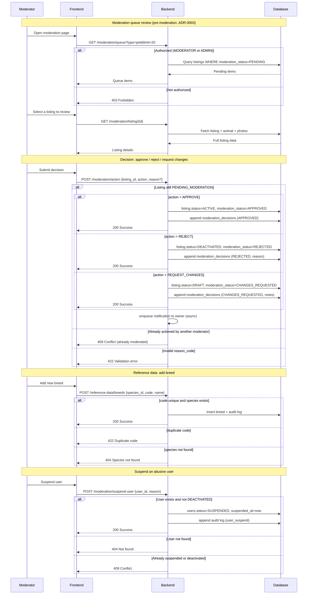

# Admin Domain: ZooLink

## Purpose
Manages system configuration, reference data, moderation workflows, and user roles. This domain ensures data consistency, supports content quality control, and provides operational tools for platform maintenance.

## Core Concepts
- **Reference Data**: Standardized lists used across domains (species, breeds, cities, traits, health certifications, etc.)
- **Moderation Queue**: Listings awaiting review, with tools for approving/rejecting and providing feedback
- **User Roles & Permissions**: Defines what users can do in the system. Platform role canon (`users.role`, 7 roles): USER, MODERATOR, ADMIN, BREEDER, FARMER, VETERINARIAN, GROOMER (additive — see §3)
- **System Settings**: Configuration flags and parameters that affect platform behavior
- **Audit Trail**: Logs of moderation actions, role changes, and system events for accountability

## Business Rules
### 1. Reference Data Management
- Reference data is curated and maintained by admins/moderators (not user-editable on MVP).
- Common reference datasets include:
  - **Species**: Taxonomic classifications (Canis lupus familiaris, Felis catus, Bos taurus, etc.)
  - **Breeds**: Within-species varieties (Labrador Retriever, Holstein Friesian, Siamese, etc.)
  - **Cities/Regions**: Geographic hierarchy for geo-search (Country → Region → City → District)
  - **Traits & Descriptors**: Standardized temperament, health, and production descriptors
  - **Health Certifications**: Recognized test/vaccination types (TB-free, Brucellosis-negative, etc.)
  - **Genetic Markers**: Known DNA test results (coat color, polled/horned, disease resistance)
  - **Listing Types**: sale, breeding, show, adoption, stud_service (extensible)
  - **Animal Statuses**: ACTIVE, ARCHIVED, DECEASED (for future)
- Reference data can be:
  - **Activated/Deactivated**: Without deletion (for historical data integrity)
  - **Versioned**: Changes tracked via audit log (who changed what and when)
  - **Localized**: Support for multiple languages in Фаза 2+ (RU primary on MVP)
- Validation: Reference data entries must have unique codes/names within their dataset.

### 2. Moderation Workflow
- **Queue Types**: Separate queues for PET and LIVESTOCK listings (can be combined view)
- **Queue Ordering**: 
  - Default: FIFO (first in, first out)
  - Priority options: 
    - Newest first
    - By species (to batch similar reviews)
    - By reporter/user reputation (future)
- **Moderator Actions per Listing**:
  - **APPROVE**: 
    - Changes listing status to ACTIVE
    - Requires no additional input (though comment optional)
    - Listing becomes immediately visible in search
  - **REJECT**:
    - Returns listing to DRAFT state
    - **Requires mandatory rejection reason** (selected from predefined list + optional custom text)
    - User notified with reason and can edit/resubmit
  - **CHANGES_REQUESTED** (request changes — the fixable path):
    - Returns the listing to DRAFT so the seller can amend and re-submit (a recoverable outcome, as opposed to the terminal REJECT)
    - Records the requested changes as notes; the seller is notified and can edit/resubmit
    - Recorded as a `moderation_decisions.decision` value and the `listings.moderation_status` enum (decision set `{APPROVED, REJECTED, CHANGES_REQUESTED}`, ADR-0003 / spec 12)
  - **BAN USER** (from moderation view):
    - Available if moderator detects pattern of abuse/spam
    - Requires specifying reason and duration (temporary/permanent)
- **Rejection Reasons** (configurable by admin):
  - Spam / Low-effort content
  - Inappropriate photos (not matching animal, offensive)
  - Misleading information (false breed claims, unrealistic prices)
  - Policy violation (promoting illegal activities)
  - Incomplete information (missing key details)
  - Duplicate listing
  - Welfare concern (underage animals, obvious neglect)
  - Other (with explanation)
- **Moderation Time Limits**:
  - Target: <4 hours for pet listings, <6 hours for livestock listings during business hours (9AM-9PM)
  - Escalation: If queue >50 items, notify senior moderators
  - Aging: Listings >24h in queue highlighted in moderator view

### 3. User Roles & Permissions
- **USER** (default role after registration):
  - Can create/edit own profile and animals
  - Can create/listings (goes to moderation)
  - Can search and view public listings
  - Can show contacts on ACTIVE listings
  - Can deactivate/reactivate own animals/listings
  - Cannot moderate content or manage reference data
- **MODERATOR**:
  - All USER permissions
  - Can moderate listings (approve/reject with required comments for reject)
  - Can view moderation queue and analytics
  - Can manage reference data (activate/deactivate, suggest edits)
  - Can ban users temporarily (up to 30 days) with reason
  - Can view basic user analytics (registration dates, listing counts)
  - Cannot change user roles to/from MODERATOR/ADMIN
  - Cannot access system settings
- **ADMIN**:
  - All MODERATOR permissions
  - Can manage user roles (promote to MODERATOR, demote from MODERATOR/ADMIN)
  - Can ban users permanently or for extended periods
  - Can manage system settings and feature toggles
  - Can view full system analytics and logs
  - Can manage API keys and third-party integrations
  - Can initiate data exports/GDPR requests
  - Cannot modify core platform code (requires deployment)
- **Break-glass / super-admin** (out-of-system devops capability, **NOT** a `users.role` value):
  - Full system access for emergency/maintenance, held by platform owners/devops
  - Modelled outside the `users.role` enum (ADR-0011 §7); the platform role canon is the 7-role set only and never includes SUPER_ADMIN
- **Additive (capability) roles — BREEDER / FARMER / VETERINARIAN / GROOMER**:
  - Each is **USER + extra capabilities** (e.g. breeding visibility, livestock listings); they inherit all USER permissions (additive model — see `docs/specs/security/rbac-matrix.md`)
  - They are not operator roles; MODERATOR and ADMIN are the operator roles above
  - `principal_type` (HUMAN\|AGENT) is orthogonal to `role` (ADR-0006): an operator role may be held by an AI agent

> **(role-canon sync + moderation-action sync, normative) — admin-BR aligned to the role and decision canon.**
> **WHAT:** (a) Removed `SUPER_ADMIN` from the `users.role` model — it is now described as an out-of-system
> break-glass/devops capability outside the enum (ADR-0011 §7); (b) stated the additive 7-role model
> (BREEDER/FARMER/VETERINARIAN/GROOMER = USER + extras) and expanded the role enums to the 7-role canon;
> (c) replaced the moderator action `FLAG` / "FLAG FOR REVIEW" with `CHANGES_REQUESTED` and aligned the decision set
> to `{APPROVED, REJECTED, CHANGES_REQUESTED}` (`database_schema.sql` `moderation_decisions.decision` / spec 12).
> **WHY:** GAP-TRACE-004 (three de-synced role sets + phantom SUPER_ADMIN) and GAP-TRACE-006 (FLAG describes a moderator
> action that does not exist while omitting the real one). The BR contradicted the validated schema and ADR-0011.
> **WHY BETTER for the whole project:** one role canon (validated on PG) anchors RBAC, guards and migrations;
> dropping SUPER_ADMIN from `users.role` keeps a clean "system operation vs application role" split; `CHANGES_REQUESTED`
> gives the seller a fixable path without a separate FLAG state machine, matching the moderation model and decision enum.

### 4. Role Assignment & Management
- New users register as USER by default.
- Role promotion:
  - USER → MODERATOR: Requires ADMIN approval + basic training
  - MODERATOR → ADMIN: Requires ADMIN approval + trust assessment
  - Reverse demotion possible at any time
- Moderator onboarding includes:
  - Review of platform policies and guidelines
  - Training on spotting common violations
  - Shadowing period with experienced moderator
- Admins can see moderation statistics (reviews/hour, accuracy via appeal rate)
- Role changes are logged in audit trail with reason.

### 5. System Settings & Feature Toggles
- Settings controllable by ADMIN role:
  - **Feature Flags**: Enable/disable upcoming functionality (chat, video, forums)
  - **Rate Limits**: Adjust thresholds for actions (listing creation, contact shows, etc.)
  - **Moderation Parameters**: Queue thresholds, auto-expiration times
  - **Search Defaults**: Default radius, sort order, items per page
  - **Integration Settings**: API keys for SMS, OAuth providers, maps, email
  - **Maintenance Mode**: Read-only mode for updates/backups
  - **Limits & Thresholds**: Max photos per listing, max description length, etc.
- Settings stored in database with change audit.
- Some settings require restart/redeploy to take effect (documented).
- **Feature Toggles specifically**:
  - `CHAT_ENABLED`: Controls real-time messaging (off on MVP)
  - `VIDEO_ENABLED`: Controls video uploads/playback (off on MVP)
  - `FORUM_ENABLED`: Controls discussion boards (off on MVP)
  - `CALENDAR_ENABLED`: Controls reproductive calendars (off on MVP)
  - `AI_MODERATION`: Controls ML-assisted pre-screening (off on MVP)
  - `NEGOTIABLE_PRICE`: Controls if "negotiable" allowed in price field (on for MVP)
  - `CUSTOM_BREED_TEXT`: Controls if users can enter custom breed text (on for MVP)

### 6. Audit Trail & Compliance
- Critical actions logged for accountability and debugging:
  - Moderation actions (who approved/rejected what listing and why)
  - Reference data changes (who added/removed/modified what)
  - Role changes (who promoted/demoted whom and why)
  - User bans (who banned whom, reason, duration)
  - Settings changes (what changed, from/to, who)
  - Data exports/GDPR requests
- Audit logs include:
  - Timestamp (UTC)
  - Actor user ID and role at time of action
  - Action type and target entity ID
  - Before/after values (for changes)
  - Reason/comment (if applicable)
  - IP address and user agent (for security monitoring)
- Logs retained per data retention policy (minimum 1 year for moderation/logs).
- Access to audit logs restricted to ADMIN role.
- Does NOT log sensitive personal data (passwords, tokens, full PII).

## Non-Functional Requirements (Specific to Admin)
- **Performance**:
  - Moderation queue load: <2s for 100 items
  - Reference data lookup: <100ms for any dataset
  - Action logging: <50ms overhead per audited action
- **Scalability**:
  - Support 100+ active moderators
  - Handle 1000+ moderation actions per day during peak
  - Reference datasets up to 10k entries each (species, breeds, etc.)
- **Consistency**:
  - Reference data changes visible globally within 1s (cache invalidation)
  - Moderation actions atomic (either fully applied or not)
  - Role changes take effect immediately for new sessions
- **Extensibility**:
  - New reference datasets can be added via admin interface
  - New moderation actions/reasons can be configured
  - New feature toggles follow standard pattern
- **Security**:
  - Strong password requirements for MODERATOR/ADMIN roles (min 12 chars)
  - MFA encouraged for ADMIN role (planned for Фаза 2+)
  - Session timeout: 15 minutes of inactivity for sensitive actions
  - Audit logging itself is tamper-evident (append-only, signed entries)
  - Principle of least privilege: MODERATOR cannot promote users to ADMIN

## Data Model (Conceptual)
### Reference Data Entity (Generic Pattern)
| Attribute | Type | Required | Description |
|-----------|------|----------|-------------|
| `id` | UUID | Yes | Primary key |
| `dataset` | VARCHAR(50) | Yes | Name of reference dataset (species, breeds, cities, etc.) |
| `code` | VARCHAR(50) | Yes | Unique code within dataset (e.g., "LAB", "HOL") |
| `name_localized` | JSONB | Yes | Multilingual names (RU primary on MVP: {"ru": "Лabrador Retriever"}) |
| `description` | TEXT | No | Extended description |
| `is_active` | BOOLEAN | Yes | Whether available for selection |
| `sort_order` | INT | No | For custom ordering in lists |
| `metadata` | JSONB | No | Dataset-specific attributes (e.g., for species: taxonomic class) |
| `created_at` | TIMESTAMP | Yes |  |
| `updated_at` | TIMESTAMP | Yes |  |
| `created_by` | UUID (FK to Users.id) | Yes | Who created the entry |
| `updated_by` | UUID (FK to Users.id) | Yes | Who last updated it |

### Moderation Log Entity
| Attribute | Type | Required | Description |
|-----------|------|----------|-------------|
| `id` | UUID | Yes | Primary key |
| `listing_id` | UUID (FK to Listings.id) | Yes | The listing being moderated |
| `moderator_id` | UUID (FK to Users.id) | Yes | Who performed the action |
| `action` | ENUM('APPROVED', 'REJECTED', 'CHANGES_REQUESTED') | Yes | What was done (decision set per `database_schema.sql` `moderation_decisions.decision` / spec 12) |
| `reason_code` | VARCHAR(50) | No | Standardized rejection reason (if REJECT) |
| `reason_text` | TEXT | No | Custom explanation (required for REJECT) |
| `created_at` | TIMESTAMP | Yes | When action occurred |
| `metadata` | JSONB | No | Additional context (e.g., IP, user agent) |

### User Role Assignment (Simplified View)
| Attribute | Type | Required | Description |
|-----------|------|----------|-------------|
| `user_id` | UUID (FK to Users.id) | Yes | The user |
| `role` | ENUM('USER', 'MODERATOR', 'ADMIN', 'BREEDER', 'FARMER', 'VETERINARIAN', 'GROOMER') | Yes | Assigned role (7-role canon per `database_schema.sql` / `rbac-matrix.md`; additive model) |
| `assigned_at` | TIMESTAMP | Yes | When role was granted |
| `assigned_by` | UUID (FK to Users.id) | Yes | Who made the change (ADMIN) |
| `expires_at` | TIMESTAMP | No | For temporary roles (not used on MVP) |
| `reason` | TEXT | No | Why role was granted/changed |

## User Journey: Moderating a Listing

## GAP Registry
| ID | Description | Criticality (High/Med/Low) | Owner | Expected Resolution | Status | Related Decisions |
|----|-------------|----------------------------|-------|---------------------|--------|-------------------|
| GAP-ADM-001 | Initial reference data seeded from open sources (AKC, FCI, FAO breed lists); refinement over time | Low | Data Team | Фаза 1 (validation) | Open | Reference data sourcing approach |
| GAP-ADM-002 | Moderator workload manageable by 1-2 part-time moderators (<50 listings/day total) | Low | Ops Team | Фаза 1 (validation) | Open | Moderator capacity planning |
| GAP-ADM-003 | Reputation/trust scoring for users to prioritize moderation queue | Medium | Product Owner | Фаза 2+ | Closed | Decision: No for MVP; rely on chronological queue + manual flagging |
| GAP-ADM-004 | Moderators receive basic policy training but not formal certification on MVP | Low | HR Team | Фаза 1 (training) | Open | Moderator training approach |
| GAP-ADM-005 | System will not use automated content filtering (AI/ML) for moderation on MVP to avoid false positives/negatives | Low | ML Team | Фаза 1 (decision) | Closed | Decision: Manual moderation on MVP |
| GAP-ADM-006 | Appeal process for rejected listings: user can resubmit after edits; formal appeal process reserved for Фаза 2+ | Low | Support Team | Фаза 2+ | Open | Appeals process design |
| GAP-ADM-007 | Geographic reference data (cities) simplified hierarchy; detailed street-level addresses never stored/shown | Low | Geo Team | Фаза 1 (validation) | Open | Geographic data approach |

## Related Domains
- **Identity Domain**: Provides user base; roles extend user permissions; authentication required for admin access.
- **Animal Domain**: Manages species and breed directories; Admin Domain provides the curation interface.
- **Pet Marketplace & Livestock Marketplace**: Relies on Admin Domain for reference data (species, breeds, cities) and moderation workflow.
- **Matching Domain**: May use reference data for breeding goals, trait libraries, or species-specific compatibility factors.
- **Future Domains**: 
  - **Regulatory Compliance**: Will extend Admin Domain for managing regulatory reference data (e.g., certified labs, approved medications).
  - **Content Management**: For managing static pages, FAQs, and help center content.

## API Contract References (see 03-architecture/api-contracts/admin-api.yaml)
- `GET /reference-data/{dataset}` (get all active entries in dataset)
- `GET /reference-data/{dataset}/new` (get form for creating new entry)
- `POST /reference-data/{dataset}` (create new reference entry)
- `PATCH /reference-data/{dataset}/{id}` (update reference entry)
- `PATCH /reference-data/{dataset}/{id}/toggle-active` (activate/deactivate)
- `GET /reference-data/{dataset}/{id}` (get specific entry)
- `GET /moderation/queue` (get pending listings with filters: type, species, limit, offset)
- `GET /moderation/listing/{id}` (get listing details for moderation)
- `POST /moderation/action` (approve/reject/request-changes listing)
- `GET /moderation/log/{listing_id}` (get moderation history for listing)
- `POST /moderation/ban-user` (ban user with reason/duration)
- `GET /system/settings` (get current settings - ADMIN only)
- `PATCH /system/settings/{key}` (update setting - ADMIN only)
- `GET /audit/log` (get audit trail entries with filters - ADMIN only)
- `GET /users/roles` (get users with their roles - ADMIN only)
- `PATCH /users/{id}/role` (change user role - ADMIN only)