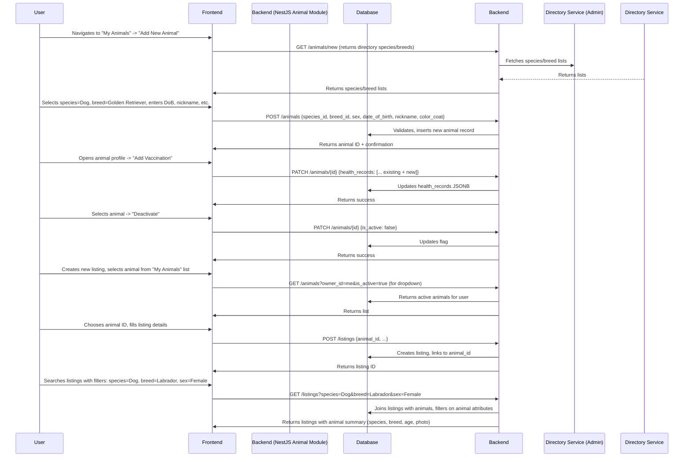

# Animal Domain: ZooLink

## Purpose
Manages the core entity "Animal" as an aggregate root. An animal can have multiple listings (for sale, mating, events) and is owned by either a user or an organization. This domain ensures data integrity for animal profiles, supports search by characteristics, and provides foundation for future features like pedigree, health records, and reproductive calendars.

## Core Concepts
- **Animal**: A living being (pet or livestock) registered in the system. Has intrinsic attributes (species, breed, sex, age) and optional attributes (health tests, vaccinations, microchip). Additional attributes include ownership timestamp, parent references for pedigree tracking, and deactivation timestamp.
- **Owner**: The user who registered the animal in the system (may differ from legal owner; system tracks custodianship for listing purposes). An animal may also be owned by an organization (see Organization Domain).
- **Breed/Species Directory**: Reference data managed by Admin Domain (see admin-domain.md).
- **Health Status**: Structured data about vaccinations, tests, treatments (extensible for future).
- **Reproductive Data**: For mating-related use cases (heat cycles, last mating, due dates) – only relevant for certain species. Includes references to mother and father for pedigree tracking.

## Business Rules
### 1. Animal Creation
- Only authenticated users can create an animal profile.
- Required fields at creation:
  - Species (from directory, e.g., cat, dog, cattle, horse, sheep, goat, pig, chicken, rabbit, etc.)
  - Breed (from directory for the selected species; allows "Mixed/Unknown" or custom text if breed not listed)
  - Sex (Male/Female)
  - Date of birth or approximate age (user can enter years/months; system stores as date or ISO week)
  - Nickname (display name, optional but recommended)
  - Either a personal owner (`owner_id`) **or** an owning organization (`organization_id`) must be specified.
- Optional fields at creation:
  - Color/coat pattern (free text)
  - Microchip ID (if provided, must be unique per species? Not enforced globally but warned if duplicate)
  - Tattoo/Brand ID (for livestock)
  - Initial health records (vaccinations, deworming) – can be added later
- Upon creation, the animal is linked to the creating user via `owner_id` **or** to an organization via `organization_id`.
- A user can create multiple animal profiles (no limit on MVP).
- Same animal cannot be registered by two different users (to prevent disputes). If duplicate suspected (same microchip + similar attributes), moderator must investigate.
- An animal cannot be owned by both a user and an organization simultaneously (application-level validation ensures exactly one of `owner_id` or `organization_id` is set.)

### 1.5 Organization Ownership
- An animal can be owned either by an individual user or by an organization, but not both simultaneously.
- The `organization_id` field is optional and nullable; when set, it indicates the animal is owned by an organization rather than a personal user.
- When `organization_id` is set, the `owner_id` field must be null, and vice versa.
- Validation rule: Exactly one of `owner_id` or `organization_id` must be NOT NULL for a valid animal record.
- Organization ownership enables:
  - Multiple users within the organization to manage the animal's listings (through organization-user links)
  - Centralized ownership of animals for breeding farms, shelters, or businesses
  - Clear attribution of animals to organizational entities rather than individuals
- An organization user acting on behalf of their organization can create listings for animals owned by that organization.

### 2. Animal Updates
- Owner (user or organization representative) can update most fields at any time:
  - Nickname
  - Color/coat
  - Microchip/tattoo (if adding or correcting)
  - Health records (add new)
  - Reproductive data (update heat dates, mating dates)
- Fields that cannot be changed after creation (to preserve integrity):
  - Species
  - Breed (if selected from directory; custom text can be edited)
  - Sex
  - Date of birth (can be refined but not changed arbitrarily; e.g., updating from "approx 2 years" to "2023-05-12" is allowed if consistent)
- Changing ownership is not allowed on MVP (to avoid misuse). If needed, the current owner must deactivate the animal and the new owner creates a new profile (data not transferred automatically). This limitation will be revisited in Фаза 2+ with formal transfer workflow.

### 3. Animal Deactivation/Archival
- Owner can deactivate an animal (soft delete):
  - Animal disappears from search and owner's list.
  - All existing listings referencing this animal remain visible but are marked as referencing a deactivated animal (UI shows warning).
  - Cannot create new listings for a deactivated animal.
- Deactivation does not delete data; retained for historical and legal reasons.
- Reactivation restores animal to active state and re-enables creation of new listings.
- Hard delete is not permitted on MVP (to preserve audit trail). May be added later via GDPR request workflow.

### 4. Listing Association
- An animal can be linked to zero, one, or many listings.
- When creating a listing, the user must select an existing animal from their owned animals (for personal owners) or from animals owned by their organization (if acting on behalf of an organization).
- A listing cannot be created without specifying an animal (animal is mandatory).
- If an animal is deactivated, its existing listings stay active (to not disrupt ongoing deals) but owner cannot edit them (except to close/complete).
- If a listing is deleted/completed, the animal remains unaffected.

### 5. Health and Reproductive Data (Extensible)
- Health records are stored as a list of events with date, type, and details (e.g., vaccination: rabies, date: 2024-03-01, vet clinic: "Zoovet").
- Relevant for mating: female animals can have heat cycle dates recorded.
- This domain does not enforce validity of health data (e.g., vaccination dates) – relies on user honesty and moderator spot-checks.
- Future extensions: integration with vet clinics, digital health passports.

### 6. Search and Discovery
- Animals are searchable via their attributes when linked to a public listing.
- Search fields (via Listing Domain):
  - Species
  - Breed
  - Sex
  - Age range (derived from date of birth)
  - Color/coat (free text search)
  - Has microchip? (boolean)
  - Health/test flags (e.g., "vaccinated", "DNA tested")
- The Animal Domain itself does not expose a public search API on MVP (to reduce surface area). Animal data is only exposed through listings.
- In Фаза 2+, a separate "Animal Directory" or "Pet Profiles" search may be added (e.g., for browsing animals not currently for sale).

### 7. Data Integrity and Validation
- Species and breed must exist in the reference directory (managed by Admin) OR user can select "Other" and enter custom text (flagged for moderator review).
- Date of birth must be in the past and not more than 30 years ago (configurable per species).
- Microchip/tattoo fields, if filled, must follow format hints (length, characters) but no global uniqueness check.
- All text fields have reasonable limits (nickname: 50 chars, color: 100 chars, health note: 500 chars per entry).

## Non-Functional Requirements (Specific to Animal)
- **Performance**: Retrieving an animal by ID (with basic info) must be <100ms.
- **Scalability**: Must support up to 100k animal profiles without degradation in create/update/search.
- **Consistency**: Strong consistency within a transaction (e.g., creating an animal and linking it to a user happens in one DB transaction).
- **Extensibility**: Use of JSONB columns for health/reproductive data to allow adding new fields without schema changes.
- **Privacy**:
  - Animal data (except what is shown in public listings) is considered personal data linked to the owner (under ФЗ-152).
  - Only minimum needed for listings is exposed publicly (species, breed, sex, age, color, photos, basic health flags).
  - Owner contact info is not exposed via animal profile; only through listing contact reveal.
- **Backup/Recovery**: Animal data is part of regular DB backups; point-in-time recovery supported.

## Data Model (Conceptual)
| Attribute | Type | Required | Description |
|-----------|------|----------|-------------|
| `id` | UUID | Yes | Primary key |
| `owner_id` | UUID (FK to Users.id) | No | User who created the profile (nullable if `organization_id` set) |
| `organization_id` | UUID (FK to Organizations.id) | No | Organization that owns the animal (nullable if `owner_id` set) |
| `species_id` | INT (FK to species directory) | Yes | From reference data |
| `breed_id` | INT (FK to breed directory) | No (nullable if "Other/custom") | From reference data; can be null if breed_text provided |
| `breed_text` | VARCHAR(100) | No | Custom breed text if breed_id is null (for moderator review) |
| `sex` | ENUM('Male', 'Female') | Yes |  |
| `date_of_birth` | DATE | Yes | Estimated or actual DoB |
| `nickname` | VARCHAR(50) | No | Display name |
| `color_coat` | VARCHAR(100) | No | Free text description |
| `microchip_id` | VARCHAR(50) | No | If provided |
| `tattoo_brand_id` | VARCHAR(50) | No | For livestock |
| `is_active` | BOOLEAN | Yes | True = visible for new listings; False = deactivated |
| `owned_since` | DATE | No | Date when current owner acquired the animal |
| `mother_id` | UUID (FK to Animals.id) | No | Reference to mother for pedigree tracking |
| `father_id` | UUID (FK to Animals.id) | No | Reference to father for pedigree tracking |
| `deactivated_at` | TIMESTAMP | No | Timestamp when animal was deactivated (soft delete) |
| `created_at` | TIMESTAMP | Yes |  |
| `updated_at` | TIMESTAMP | Yes |  |
| `health_records` | JSONB | No | Array of objects: [{type: 'vaccination', detail: 'Rabies', date: '2024-03-01', provider: 'VetClinic'}] |
| `reproductive_data` | JSONB | No | For females: [{event: 'heat_start', date: '2024-05-10'}, {event: 'mating', date: '2024-05-12', partner_id: null}] |

## Validation Rules (Examples)
- Species must exist in `species` directory.
- If `breed_id` is null, `breed_text` must be provided (and vice versa, ideally).
- Date of birth ≤ today and ≥ today - 30 years (adjustable per species in future).
- Nickname, if provided, cannot be empty string.
- Microchip ID, if provided, must be at least 8 characters.
- Health records JSONB must conform to schema (validated at application level).
- Exactly one of `owner_id` or `organization_id` must be NOT NULL (application-level validation).

## User Journey: Managing an Animal

## Open Questions & Assumptions
- **Assumption**: Breed directory is comprehensive enough for MVP; custom text fallback handles edge cases.
- **Assumption**: Health and reproductive data are entered manually by owners; no automated validation with vet records on MVP.
- **Open Question**: Should we enforce uniqueness of microchip + species at DB level? (Could cause false positives if chip reused; decided to warn only on MVP.)
- **Assumption**: Date of birth can be approximate; system stores as date (if user enters "approx 2 years", we convert to date assuming today minus 2 years). Owner can later correct to exact date.

## Related Domains
- **Admin Domain**: Provides species and breed directories; manages moderation of custom breed entries.
- **Listing Domain**: Links to animals via `animal_id`; displays animal summary in listings.
- **Identity Domain**: `owner_id` links to user; authentication required to create/modify animal.
- **Organization Domain**: `organization_id` links to organizations; an animal can belong to an organization instead of a personal user.
- **Matching Domain**: May use animal attributes (species, breed, sex, age, health flags) to suggest mating partners.
- **Future Domains**: Health Passport, Reproductive Calendar, Pedigree Builder will extend this domain.

## API Contract References (see 03-architecture/api-contracts/animals-api.yaml)
- `GET /animals/new` (get directory for creation)
- `POST /animals` (create animal)
- `GET /animals/{id}` (get animal by ID – owner only or public if linked to active listing?)
- `PATCH /animals/{id}` (update animal)
- `GET /animals` (list user's animals with filters: active/inactive, species, breed)
- `PATCH /animals/{id}/deactivate`
- `PATCH /animals/{id}/reactivate`
- Note: No public search by animal attributes alone on MVP (to prevent scraping); animal data exposed only via listings.