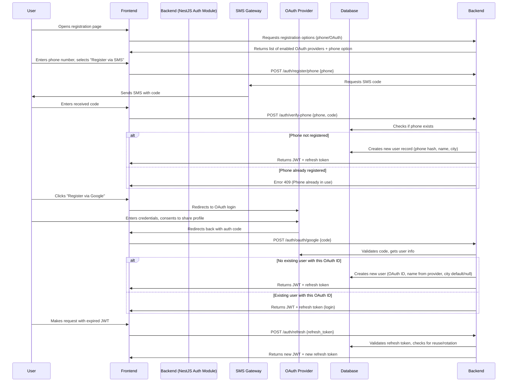

# Identity Domain: ZooLink

## Purpose
Manages user authentication, authorization, and profile information. This domain is the gateway to the system and ensures secure access while minimizing collection of personal data in compliance with ФЗ-152.

## Core Concepts
- **User**: A person who has registered in the system. Can be a private individual, breeder, farmer, or moderator.
- **Authentication Method**: How the user proves identity (phone SMS, OAuth providers).
- **User Role**: Defines permissions in the system (regular user, moderator, admin).
- **Profile**: Public and private information associated with the user.

## Business Rules
1. **Authentication**
   - Users must authenticate via one of the allowed methods:
     - Phone number verification (SMS code)
     - OAuth 2.0 with Google, Apple, Telegram, VK
   - Email verification is optional and does not block registration.
   - After successful authentication, a session token (JWT) is issued with expiration 24h.
   - Refresh tokens are stored securely and rotated on use.

2. **User Registration**
   - Minimum required fields for registration:
     - Phone number (unique) OR linked OAuth account
     - Full name (for display, not necessarily legal name)
     - City (selected from directory, used for geo-search)
     - Password (if using phone auth; not required for OAuth)
   - Optional fields at registration:
     - Email address (for notifications and recovery)
     - Avatar image (URL to external storage)
   - Upon registration, the user is assigned the role `USER` by default.
   - Users cannot register more than one account per phone number (prevents spam).

3. **User Roles and Permissions**
   - `USER`: Can create/edit own profile, create/listings, search, view public data, show contacts after moderation.
   - `MODERATOR`: All USER permissions + can moderate listings (approve/reject), manage reference data (breeds, species), ban users.
   - `ADMIN`: All MODERATOR permissions + can manage moderator/admin roles, view system analytics, change global settings.
   - Roles are additive (ADMIN includes MODERATOR and USER permissions).

4. **Profile Management**
   - Users can update their profile at any time:
     - Full name
     - City (change triggers re-indexing for geo-search)
     - Avatar
     - Phone number (requires re-verification via SMS)
     - Linked OAuth accounts (can add/remove)
     - Email
   - Users cannot delete their account on MVP ( to preserve data integrity for listings and moderation history). Instead, they can:
     - Deactivate (profile hidden, listings withdrawn, cannot log in)
     - Later reactivate (restores profile and listings)
   - Deactivation does not delete personal data immediately; it is retained for legal and operational reasons (e.g., dispute resolution) and purged after 30 days of inactivity per data retention policy.

5. **Security and Privacy**
   - No storage of passport data, INN, or other sensitive identifiers on MVP.
   - Phone numbers are hashed in the database (bcrypt) for lookup; only last 4 digits shown in UI for verification.
   - OAuth tokens are stored encrypted and refreshed via provider's API.
   - Passwords (if set) are hashed with bcrypt (cost factor 12).
   - All auth-related endpoints are rate-limited (max 5 attempts per 15 minutes per IP).
   - Session tokens are invalidated on password change or explicit logout.
   - The system logs authentication events (success/failure) for audit but does not log passwords or tokens.

## User Journey: Registration and Login

## Data Model (Conceptual)
| Attribute | Type | Required | Description |
|-----------|------|----------|-------------|
| `id` | UUID | Yes | Primary key |
| `phone_hash` | VARCHAR(60) | No (if OAuth) | Bcrypt hash of phone number (for lookup) |
| `oauth_google_id` | VARCHAR(255) | No | Unique ID from Google |
| `oauth_apple_id` | VARCHAR(255) | No | Unique ID from Apple |
| `oauth_telegram_id` | VARCHAR(255) | No | Unique ID from Telegram |
| `oauth_vk_id` | VARCHAR(255) | No | Unique ID from VK |
| `full_name` | VARCHAR(100) | Yes | Display name |
| `city_id` | INT (FK to city directory) | Yes | For geo-search and localization |
| `avatar_url` | TEXT | No | URL to avatar in object storage |
| `email` | VARCHAR(255) | No | For notifications (optional) |
| `email_verified` | BOOLEAN | No | True if email confirmed via link |
| `password_hash` | VARCHAR(60) | No (if OAuth only) | Bcrypt hash if using phone auth |
| `role` | ENUM('USER', 'MODERATOR', 'ADMIN') | Yes | Default: USER |
| `is_active` | BOOLEAN | Yes | True = can login; False = deactivated |
| `created_at` | TIMESTAMP | Yes | Registration timestamp |
| `updated_at` | TIMESTAMP | Yes | Last profile update |
| `last_login_at` | TIMESTAMP | No | For activity tracking |
| `deactivated_at` | TIMESTAMP | No | When user chose to deactivate |

## Non-Functional Requirements (Specific to Identity)
- **Performance**: Authentication (login/register) must complete within 2s under normal load.
- **Scalability**: Must support 1000 concurrent auth requests (sessions) without degradation.
- **Availability**: Auth service must be 99.9% uptime (critical path for all other functions).
- **Security**: 
  - OWASP ASVS Level 2 compliance for authentication.
  - Protection against brute force, credential stuffing, and session hijacking.
  - All passwords and tokens transmitted only over HTTPS.
- **Privacy**: 
  - Minimizes PII collection (only phone/OAuth ID, name, city).
  - Provides ability to export/delete personal data (GDPR/ФЗ-152) – to be implemented in Фаза 2+ via user request workflow.
- **Logging**: Auth events (login success/failure, token refresh, deactivation) are logged for security audit but exclude sensitive data.

## GAP Registry
| ID | Description | Criticality (High/Med/Low) | Owner | Expected Resolution | Status | Related Decisions |
|----|-------------|----------------------------|-------|---------------------|--------|-------------------|
| GAP-ID-001 | SMS gateway provider free tier sufficiency for MVP validation (<= 1000 SMS/month) | Medium | Infrastructure Team | Фаза 1 (validation) | Open | SMS gateway selection |
| GAP-ID-002 | OAuth providers API stability during MVP period | Low | Backend Team | Фаза 1 (monitoring) | Open | OAuth integration approach |
| GAP-ID-003 | Username as alternative login method | Medium | Product Owner | Фаза 2 | Open | Authentication methods decision |
| GAP-ID-004 | City directory static nature and admin domain management | Low | Admin Team | Фаза 1 (validation) | Open | City directory implementation |

## Related Domains
- **Admin Domain**: Manages user roles, moderation privileges, and reference data (cities, breeds).
- **Animal Domain**: Links to users via `owner_id` (the user who created the animal profile).
- **Listing Domain**: Links to users via `creator_id` (the user who posted the listing).
- **Matching Domain**: May use user preferences (stored in profile) for suggesting matches.

## API Contract References (see 03-architecture/api-contracts/auth-api.yaml)
- `POST /auth/register/phone`
- `POST /auth/verify-phone`
- `POST /auth/oauth/{provider}`
- `POST /auth/refresh`
- `POST /auth/logout`
- `GET /me` (get current user profile)
- `PATCH /me` (update profile)
- `POST /me/deactivate`
- `POST /me/reactivate`
