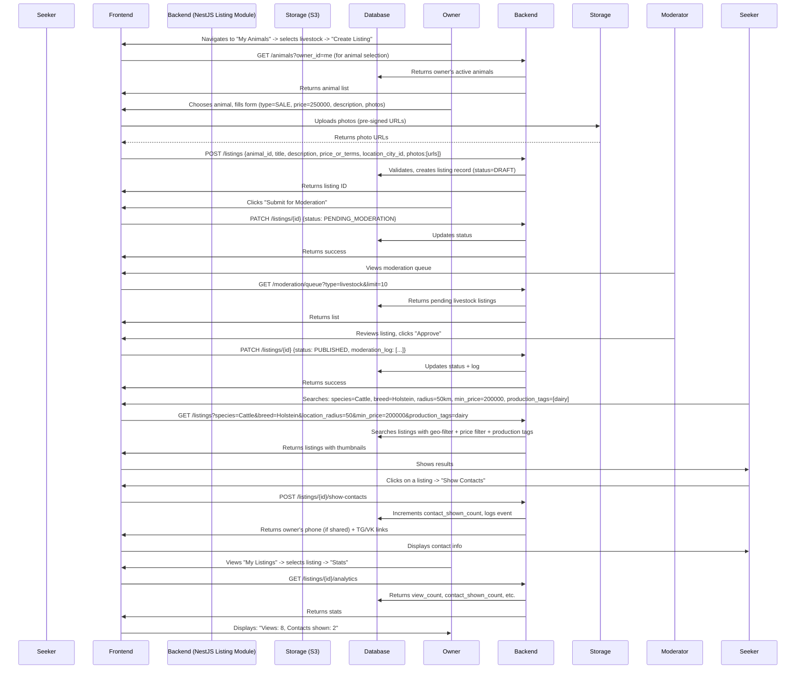

# Livestock Marketplace Domain: ZooLink

## Purpose
Handles listings for farm and ranch livestock (cattle, horses, sheep, goats, pigs, poultry, alpacas, etc.) focusing on productive traits, breeding value, lineage verification, and commercial transactions. Emphasizes genetics, health certifications, and productive capacity over companionship traits.

## Core Concepts
- **Livestock Listing**: An advertisement for livestock-related transactions. Types:
  - `SALE`: Transfer of ownership for compensation (breeding stock, feeder animals, slaughter animals)
  - `MATING`: Offering breeding services (stud animals, AI services) or seeking a mate
  - `AUCTION`: Listing for timed or live auction (not implemented on MVP, placeholder for Фаза 2+)
  - `LEASING`: Temporary transfer of use (e.g., dairy cow lease, stud lease)
  - `EMBRYO_TRANSFER`: Sale of embryos or oocytes (placeholder for Фаза 2+)
- **Livestock Attributes**: Characteristics relevant to productivity and breeding (conformation, production records, genetic tests, health certifications).
- **Listing Lifecycle**: Similar to pet marketplace but with longer transaction cycles and more documentation requirements.
- **Geographic Scope**: Search radius-based (1-100 km) remains important but national/international shipping is common for breeding stock.

## Business Rules
### 1. Listing Creation
- Only authenticated users can create listings.
- Each listing must be linked to **one** animal from the user's owned animals (see Animal Domain).
- Mandatory fields at creation:
  - `animal_id` (reference to Animal Domain)
  - `listing_type` (ENUM: sale, breeding, show, adoption, stud_service) - AUCTION and EMBRYO_TRANSFER reserved for future
  - `title` (short headline, max 100 chars)
  - `description` (detailed text, max 3000 chars - longer to accommodate production records)
  - `price_or_terms`:
    - For SALE: number (currency RUB) or "negotiable"
    - For MATING/LEASING: "negotiable", fee per service, or package deals
    - Examples: "200000", "50000 per straw", "negotiable", "package: 3 straws + synchronization"
  - `location` (city + optional address precision; required for moderation and geo-search)
  - `photos` (1-8 images; minimum 3 clear photos showing different angles/conformation)
  - `contact_method_visibility` (boolean: whether to show phone/socials after moderation)
- Optional but highly recommended fields for livestock:
  - Production records (milk yield, egg production, weight gain, etc. - structured or free text)
  - Genetic test results (parentage, coat color, disease resistance, polled/horned)
  - Health certifications (TB-free, Brucellosis-free, Johnes-test, vaccination records)
  - Pedigree info (registration numbers, lineage details)
  - Conformation scores (from shows or linear appraisal)
  - For MATING/LEASING:
    - Female's estrus cycle details (if applicable)
    - Male's proven fertility (number of offspring, conception rates)
    - Terms: natural service vs. AI, location, collection/shipping terms
    - Guarantees (pregnancy guarantee, live offspring guarantee)
- **Organization/Branch Attribution**:
  - When creating a listing, the user must specify either:
    - Their personal account (via `creator_id`) **OR**
    - An organization (via `organization_id`) and optionally a branch (via `branch_id`).
  - The `creator_id` (the individual who submitted the listing) is always recorded for audit purposes.
  - Listings linked to an organization show the organization’s name (and branch, if specified) in the public view.
  - **Important**: When listing on behalf of an organization, the animal must be owned by that organization (i.e., the animal's `organization_id` must match the listing's `organization_id`).

### 2. Listing Validation & Moderation
- All listings enter `PENDING_MODERATION` state upon submission.
- Moderator checks:
  - **Authenticity**: Photos match declared animal (species/breed/sex); shows conformation/views.
  - **Completeness**: All mandatory fields filled; description not spammy.
  - **Policy Compliance**: 
    - No promotion of illegal substances (e.g., unapproved hormones).
    - No misleading claims about production or genetics without evidence.
    - Health claims should reference tests/certifications (not verified on MVP but noted).
  - **Duplicate Detection**: Warns if nearly identical listing exists from same user recently.
  - **Regulatory Flags**: For certain species (cattle, pigs), moderator notes if listing appears to involve movement requiring documentation (for user awareness; actual Меркурий integration in Фаза 3).
- Moderator actions:
  - `APPROVE`: Listing becomes `PUBLISHED` and visible in search.
  - `REJECT`: Returns to `DRAFT` state with required edit comments; user can resubmit.
- Time to moderate: Target <6 hours during business hours (9AM-9PM local) due to potentially more complex review.

### 3. Listing Lifecycle States
- Same states as pet marketplace:
  - `DRAFT`: User-editable, not submitted.
  - `PENDING_MODERATION`: Awaiting review.
  - `PUBLISHED`: Active in search; can receive views/contact requests.
  - `CONTACTED`: System-tracked state when contacts are shown.
  - `COMPLETED`: User marks as successful transaction.
  - `ARCHIVED`: User hides listing (retains history; can be reactivated).
  - `EXPIRED`: Automatic after 90 days if not completed/archived (longer than pets due to longer sales cycles).
- State transitions enforced by backend; UI reflects current state.

### 4. Search and Discovery
- Search filters for Livestock Marketplace:
  - `listing_type` (sale/breeding/show/adoption/stud_service)
  - `species` (cattle/horse/sheep/goat/pig/poultry/alpaca/etc.)
  - `breed` (from directory; supports mixed/unknown/grade)
  - `sex` (male/female)
  - `age_range` (derived from animal's date of birth)
  - `price_range` (min/max in RUB; "negotiable" treated as unspecified)
  - `location_radius` (from user's city; 1-100 km)
  - `production_tags` (multiple select: dairy, beef, dual-purpose, wool, meat, egg, breeding)
  - `genetic_flags` (polled, horned, specific coat color genes, disease resistance markers)
  - `health_certifications` (TB-free, Brucellosis-free, Johnes-negative, VQ-status)
  - `has_pedigree_papers` (boolean)
  - `production_record_available` (boolean: whether yield/gain records provided)
- Sorting options:
  - `newest_first` (default)
  - `price_low_to_high`
  - `price_high_to_low`
  - `distance_closest`
  - `price_per_unit` (if applicable, e.g., price per straw of semen)
- Search results show:
  - Thumbnail photo (prioritize conformation shot)
  - Title, species/breed, sex, age indicator
  - Price/terms
  - Distance from user
  - Badges for key attributes (e.g., "Polled", "TB-Free", "Registered")
- Clicking listing shows:
  - Full description
  - All photos (carousel, prioritize conformation, udder/testes, side views)
  - Animal details (from linked Animal profile)
  - Production records (if provided)
  - Genetic test results summary
  - Health certifications
  - Pedigree information
  - Owner's city (exact address hidden until contact shown)
  - "Show Contacts" button (visible only after moderation approval)

### 5. Post-Moderation Interaction
- When a user clicks "Show Contacts" on a PUBLISHED listing:
  - System logs the event (listing_id, viewer_user_id, timestamp).
  - Reveals:
    - Phone number (if owner provided during registration and opted to share)
    - Links to connected social profiles (Telegram, VK) if available and consented.
  - Does NOT reveal exact address; users arrange meetup via revealed contacts.
  - Owner can see in analytics: "Your listing was viewed X times, contacts shown Y times."

### 6. Special Rules by Listing Type & Species
- **SALE**:
  - Price must be ≥0 if numeric; "negotiable" allowed.
  - For breeding stock: expected to include production/genetic info.
  - For feeder/slaughter: weight, age, condition score more important.
  - Encouraged to mention withdrawal periods if any medications recently used.
- **MATING**:
  - Both parties must specify what they offer (natural service, AI straws, embryo transfer).
  - Strongly recommended to discuss health testing (brucellosis, TB, etc.) and vaccination status.
  - Transaction considered complete upon service unless guarantees offered.
- **LEASING**:
  - Common for dairy cows, bulls, or specialized animals.
  - Terms must specify duration, compensation, care responsibilities, insurance.
  - Often includes option to purchase at end of lease.
- **Species-Specific Notes**:
  - **Cattle**: Distinguish dairy vs. beef vs. dual-purpose; production records critical for dairy.
  - **Horses**: Discipline (racing, jumping, dressage) more relevant than general production.
  - **Sheep/Goats**: Distinguish meat, wool, dairy lines; flock vs. individual sales.
  - **Pigs**: Breeding stock vs. market hogs; vertical integration considerations.
  - **Poultry**: Distinguish layers, broilers, breeding flocks; biosecurity emphasis.

## Non-Functional Requirements (Specific to Livestock Marketplace)
- **Performance**: 
  - Listing creation: <3s (includes photo upload to storage; more photos than pets).
  - Search results: <2s for 95% of queries (<100km radius, moderate filters).
  - Photo loading: Optimized thumbnails; lazy loading in UI.
- **Scalability**: 
  - Support 5k active livestock listings without degradation (fewer listings but higher value/complexity).
  - Handle 100 new listing submissions per day during peak (lower volume than pets).
- **Data Consistency**:
  - Listing must always reference a valid, active animal.
  - If animal is deactivated, listing shows warning but remains active until user action.
- **Extensibility**:
  - JSONB `metadata` field for experimental attributes (e.g., video URL, auction links, document uploads).
  - New listing types can be added via ENUM extension (backward compatible).
- **Security/Privacy**:
  - Exact location never shown; only distance/search radius.
  - Contact info revealed only on user action (not hover/preview).
  - Rate limiting on "Show Contacts": max 5 reveals per hour per user to deter scraping (lower due to higher value).
- **Moderator Load**: 
  - Designed for <20 listings/day moderate rate on MVP.
  - Future: ML-assisted pre-screening for obvious spam/irrelevant content.

## Data Model (Conceptual)
| Attribute | Type | Required | Description |
|-----------|------|----------|-------------|
| `id` | UUID | Yes | Primary key |
| `animal_id` | UUID (FK to Animals.id) | Yes | The livestock being listed |
| `creator_id` | UUID (FK to Users.id) | Yes | User who posted |
| `listing_type` | ENUM('sale', 'breeding', 'show', 'adoption', 'stud_service') | Yes |  |
| `title` | VARCHAR(100) | Yes | Short headline |
| `description` | TEXT | Yes | Max 3000 chars |
| `price_or_terms` | VARCHAR(150) | Yes | E.g., "250000", "negotiable", "8000 per straw" |
| `location_city_id` | INT (FK to cities) | Yes | For geo-search |
| `location_precision` | ENUM('city', 'district', 'exact') | No | Default: city |
| `created_at` | TIMESTAMP | Yes |  |
| `updated_at` | TIMESTAMP | Yes |  |
| `status` | ENUM('DRAFT', 'PENDING_MODERATION', 'PUBLISHED', 'CONTACTED', 'COMPLETED', 'ARCHIVED', 'EXPIRED') | Yes | Default: DRAFT |
| `moderation_log` | JSONB | No | [{action: 'APPROVE'/REJECT, moderator_id: UUID, timestamp, comment}] |
| `contact_shown_count` | INT | No | How many times contacts were revealed |
| `view_count` | INT | No | Times listing appeared in search results |
| `expires_at` | TIMESTAMP | No | Auto-set (default 90 days) |
| `metadata` | JSONB | No | For future extensibility (e.g., video_url, social_links, auction_id) |

## Validation Rules
- `animal_id` must reference an active animal owned by `creator_id`.
- `photos` array must have 1-8 items; each item is a URL to storage (min 3 recommended).
- `price_or_terms`:
  - If numeric string, must be parseable as positive integer.
  - Free text terms limited to 150 chars.
- `location_city_id` must exist in reference directory.
- `description` cannot be empty or solely whitespace.
- For MATING/LEASING: if `price_or_terms` suggests fee, it should be numeric or "negotiable".
- Minimum 3 photos recommended for livestock to show conformation (not enforced but suggested in UI).

## User Journey: Creating and Receiving Interest in a Livestock Listing

## Open Questions & Assumptions
- **Assumption**: Production and health records rely on user honesty; moderator does random spot-checks for blatant misreports (e.g., claiming 10,000 kg lactation from a heifer).
- **Assumption**: Photos are moderated for relevance (must show the animal from useful angles); no AI-based conformation scoring on MVP.
- **Open Question**: Should we require minimum photo count (e.g., 3) for livestock listings? (Decided: strongly recommended in UI guidance but not enforced on MVP to avoid friction.)
- **Assumption**: Users understand that livestock transactions often involve transport, quarantine, and regulatory documentation (handled off-platform on MVP).
- **Assumption**: "Negotiable" price is common; system does not force numeric pricing.
- **Assumption**: Users are aware of species-specific regulations (e.g., cattle movement permits) and handle them independently on MVP.

## Related Domains
- **Animal Domain**: Provides the core livestock profile; listing links to it.
- **Identity Domain**: `creator_id` links to user; authentication required.
- **Admin Domain**: Manages reference data (breeds, cities), moderation queue, rejection reasons.
- **Matching Domain**: Uses livestock listing data to suggest compatible mates (filters by production, genetics, health).
- **Future Domains**: Regulatory Compliance (for Меркурий integration), Production Records (extends animal data), Genetics Portal.

## API Contract References (see 03-architecture/api-contracts/listings-api.yaml)
- `GET /listings/new` (get creation form data: species, breeds, cities)
- `POST /listings` (create listing)
- `GET /listings/{id}` (get listing by ID – public if PUBLISHED, owner otherwise)
- `PATCH /listings/{id}` (update listing; only in DRAFT/PENDING_MODERATION)
- `POST /listings/{id}/submit-moderation` (change to PENDING_MODERATION)
- `GET /listings` (search listings with filters: type, species, breed, price, location_radius, production_tags, etc.)
- `POST /listings/{id}/show-contacts` (log and reveal contacts)
- `PATCH /listings/{id}/complete` (mark as COMPLETED)
- `PATCH /listings/{id}/archive` (hide listing)
- Note: No delete endpoint; archive instead.