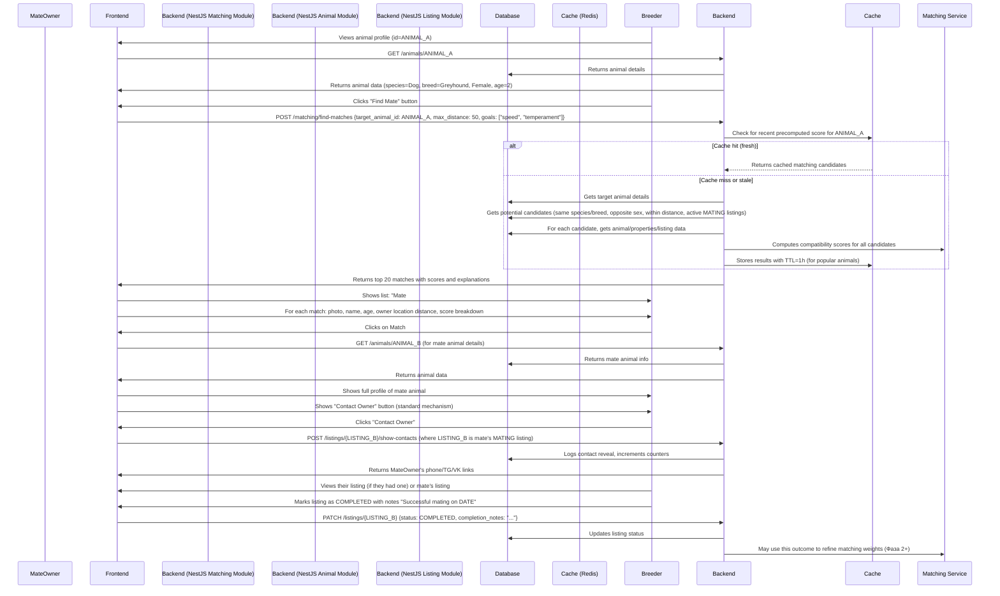

# Matching Domain: ZooLink

## Purpose
Handles specialized logic for finding compatible mates for breeding purposes. This domain powers search and recommendation features specific to mating arrangements, considering factors like genetics, healthCertifications, reproductive timing, and breeding goals that go beyond simple marketplace filtering.

## Core Concepts
- **Match**: A suggested pairing between two animals for breeding purposes, generated based on compatibility algorithms.
- **Breeding Goal**: What the user aims to achieve through mating (e.g., improve milk production, specific coat color, temperament).
- **Compatibility Score**: Numerical value (0-100) indicating how well two animals match based on weighted factors.
- **Reproductive Timing**: Alignment of fertile periods (estrus/heat cycles) between potential mates.
- **Genetic Compatibility**: Analysis of genetic markers to avoid inbreeding and promote desirable traits.
- **Health Compatibility**: Matching animals with complementary health profiles to minimize inherited disease risk.

## Business Rules
### 1. Matching Eligibility
- Only animals of opposite sexes can be matched (for natural breeding; AI/ET may have different rules in future).
- Both animals must be:
  - Active (not deactivated/archived)
  - Of mating age (species-specific minimums apply)
  - Owned by different users (self-matching not allowed)
  - Have listings of type MATING or STUD_SERVICE (or user has indicated breeding interest)
- Animals must be of the same species and breed (cross-breed matching reserved for Фаза 2+ with explicit user consent).

### 2. Matching Factors & Weighting
The matching algorithm considers these factors with configurable weights (weights may vary by species/breed):

#### Genetic Factors (30% weight)
- **Inbreeding Coefficient**: Penalty for high relatedness (aim <5% for most breeds)
- **Desirable Traits**: Bonus for complementary positive traits (e.g., one animal strong in trait A, other in trait B)
- **Undesirable Traits**: Penalty for carrying same recessive disorder
- **Color/Pattern Genes**: Bonus for desired coat color combinations
- **Polled/Horned Status**: Bonus for matching breeding goals (e.g., two polled animals for polled herd)

#### Health & Certification Factors (25% weight)
- **Disease Status**: Bonus for both animals being negative for key diseases (TB, Brucellosis, Johnes, etc.)
- **Vaccination Compatibility**: Bonus for complementary vaccination profiles
- **Genetic Health**: Penalty if both carriers of same recessive condition
- **Structural Soundness**: Bonus for animals with good conformation scores

#### Reproductive Timing Factors (20% weight)
- **Estrus Synchronization**: Highest bonus when female is in heat and male has proven fertility
- **Seasonal Bonuses**: Some breeds have preferred breeding seasons
- **Recovery Time**: Penalty if female recently gave birth or had mating attempt
- **Male Availability**: Bonus for males with proven fertility and available collection times

#### Production & Conformation Factors (15% weight)
- **Production Complementarity**: Bonus if animals strengthen each other's weaknesses (e.g., high volume + high component)
- **Conformation Scores**: Bonus for animals with complementary structural traits
- **Size/Frame Compatibility**: Bonus for appropriate size matching (especially important in horses/dogs)

#### Location & Logistics Factors (10% weight)
- **Geographic Proximity**: Bonus for animals within feasible transport distance
- **Service Type Compatibility**: Bonus for matching natural service vs. AI preferences
- **Facility Compatibility**: Bonus if both parties have appropriate breeding facilities

### 3. Matching Process
- **Trigger**: Matching can be initiated by:
  - User viewing a MATING/STUD_SERVICE listing and requesting "Find Similar" or "Find Matches"
  - System-generated suggestions shown in user dashboard (based on saved searches or followed animals)
  - Explicit search via matching interface (filters for breeding goals)
- **Input**: 
  - Target animal (the one user wants to mate)
  - User preferences (breeding goals, maximum distance, preferred service type)
  - Optional: Specific criteria to prioritize (e.g., "prioritize genetic diversity")
- **Output**:
  - List of potential matches sorted by compatibility score
  - For each match: 
    - Animal summary (photo, species/breed/sex/age)
    - Compatibility score breakdown (by factor category)
    - Key highlights (e.g., "Excellent hip scores", "TB-free", "Proven sire")
    - Contact initiation path (leads to showing contacts on the target animal's listing)
- **Filtering**: 
  - Minimum compatibility score threshold (configurable, default 60)
  - Maximum results returned (default 20)
  - Exclude animals user has previously matched with/rejected
  - Exclude animals from same ownership (prevents accidental self-matching)

### 4. User Interaction with Matches
- When viewing a match suggestion:
  - User can see detailed compatibility breakdown
  - User can view full profiles of both animals (via links to their Animal Domain profiles)
  - User can initiate contact through the standard "Show Contacts" mechanism on the target animal's listing
  - User can save match for later, dismiss (with optional feedback on why not interested), or request more like this
- System tracks:
  - Match views (when matching results are shown)
  - Match engagements (when user clicks to see full details)
  - Contact initiations stemming from match suggestions
  - Successful matings reported back via listing completion (for feedback loop)

### 5. Special Cases & Assisted Reproduction
- **Artificial Insemination (AI)**:
  - Matching considers straw availability, shipping logistics, and timing synchronization
  - Male animal may have multiple simultaneous matches (limited by straw inventory)
  - Female must be in detectable estrus or scheduled for timed AI
- **Embryo Transfer (ET)**:
  - Reserved for Фаза 2+; matching would consider donor/recipient synchronization
  - Requires specialized facility indicators on both parties
- **Natural Service**:
  - Requires geographic proximity or ability to transport animals
  - Considers facility safety and mating history
- **Species-Specific Adjustments**:
  - **Cattle/Buffalo**: Heavy emphasis on production records, genetic indexes (PTA, GPTA), fertility traits
  - **Horses**: Performance records (racing, show jumping, etc.), conformation, bloodline popularity
  - **Sheep/Goats**: Fecal egg count resistance, growth rates, maternal traits, wool/fiber characteristics
  - **Dogs**: Temperament tests, health clearances (hips, eyes, heart), working ability, breed standard conformity
  - **Cats**: Pedigree depth, show/breed awards, genetic diversity, temperament matches

## Non-Functional Requirements (Specific to Matching)
- **Performance**: 
  - Matching computation: <3s for typical queries (<100 candidates) 
  - Pre-computed scores for popular animals: <500ms retrieval
  - Batch processing: Ability to refresh scores for 1000 animals in <5m
- **Scalability**: 
  - Support matching for 50k active animals of breeding age
  - Handle 100 matching requests per second during peak (with caching)
- **Accuracy**: 
  - Matching algorithm should be transparent and explainable (users can see why score is what it is)
  - Regular backtesting against known successful matings to improve weights
- **Extensibility**: 
  - New factors can be added without breaking existing scores (additive with default weight 0)
  - Species-specific weighting profiles can be configured
  - Machine learning model can replace heuristic scoring in Фаза 2+ without changing interface
- **Privacy**:
  - Matching does not reveal full animal details unless user initiates contact through standard channels
  - Genetic data used in matching is never exposed directly (only interpreted as risk/trait classifications)
  - Location used for matching is never shown in match suggestions (only distance category)

## Data Model (Conceptual)
| Attribute | Type | Required | Description |
|-----------|------|----------|-------------|
| `id` | UUID | Yes | Primary key (match instance) |
| `target_animal_id` | UUID (FK to Animals.id) | Yes | The animal for which matches are sought |
| `candidate_animal_id` | UUID (FK to Animals.id) | Yes | The potential mate animal |
| `compatibility_score` | DECIMAL(5,2) | Yes | Overall score 0-100 |
| `genetic_score` | DECIMAL(5,2) | No | Sub-score 0-100 |
| `health_score` | DECIMAL(5,2) | No | Sub-score 0-100 |
| `reproductive_score` | DECIMAL(5,2) | No | Sub-score 0-100 |
| `production_score` | DECIMAL(5,2) | No | Sub-score 0-100 |
| `logistics_score` | DECIMAL(5,2) | No | Sub-score 0-100 |
| `match_reasons` | JSONB | No | Array of strings explaining top positive factors |
| `match_concerns` | JSONB | No | Array of strings explaining potential issues |
| `created_at` | TIMESTAMP | Yes | When match was generated/computed |
| `expires_at` | TIMESTAMP | No | When match becomes stale (default 7 days) |
| `metadata` | JSONB | No | For species-specific data or experimental factors |

## Validation Rules
- `target_animal_id` and `candidate_animal_id` must reference different animals
- Both animals must be active, of mating age, and opposite sex
- `compatibility_score` must be between 0 and 100
- Sub-scores (if present) must be between 0 and 100
- At least one of target or candidate must have an active MATING/STUD_SERVICE listing or user breeding intent flag
- Match expires no earlier than 24 hours after creation (to prevent excessive computation)

## User Journey: Using Matching Features

## Open Questions & Assumptions
- **Assumption**: Initial matching weights are based on expert knowledge and can be refined over time with user feedback.
- **Assumption**: Most users will initiate matching from an animal they own (rather than anonymous search).
- **Open Question**: Should we allow same-species cross-breed matching on MVP with explicit opt-in? (Decided: No, reserve for Фаза 2+ to avoid complexity and potential misuse.)
- **Assumption**: Users understand that matching is a suggestion tool; final breeding decisions involve veterinary consultation and direct negotiation.
- **Assumption**: System does not guarantee fertility or pregnancy; matching only assesses based on available data.
- **Assumption**: Genetic data used is limited to what owners voluntarily provide (tests, pedigrees).

## Related Domains
- **Animal Domain**: Provides core animal data (genetic flags, health certifications, production records) used in matching calculations.
- **Pet Marketplace & Livestock Marketplace**: Listings of type MATING/STUD_SERVICE indicate user's breeding interest and provide contact mechanism.
- **Identity Domain**: Links animals to owners; authentication required to initiate matching or view full details.
- **Admin Domain**: May manage reference data for breeding goals, trait libraries, or species-specific weighting profiles.
- **Future Domains**: Genetic Testing Portal (could provide more detailed genetic data), Breeding Analytics (feedback loop from outcomes).

## API Contract References (see 03-architecture/api-contracts/matching-api.yaml)
- `GET /matching/new-target/{animal_id}` (get targeting animal verification)
- `POST /matching/find-matches` (find matches for target animal with preferences)
- `GET /matching/{id}` (get specific match details by ID - useful for sharing/saving)
- `GET /matching/history` (get user's past match views/engagements)
- `POST /matching/{id}/feedback` (user feedback on match quality: useful/not useful, why)
- Note: No direct CRUD on matches as they are mostly computed/view-only entities; history stored for analytics.
