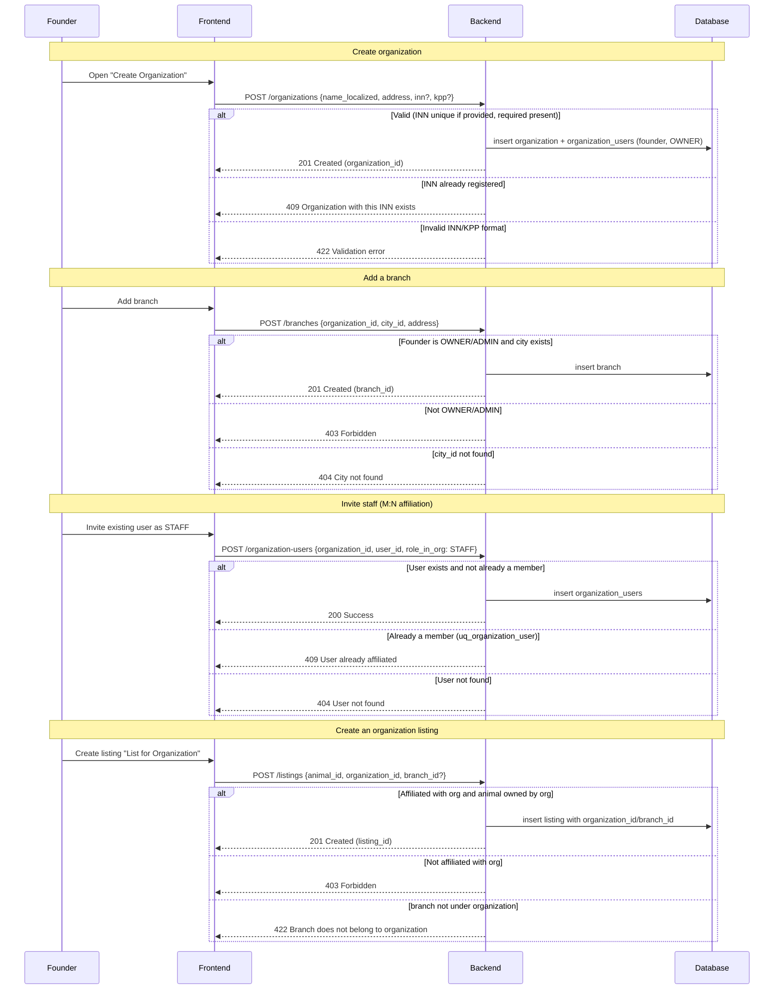

# Organization Domain: ZooLink

## Purpose
Handles the modeling of legal entities (organizations) and their physical locations (branches) that operate within the ZooLink platform. This domain enables businesses such as veterinary clinics, kennels, shelters, breeding farms, and service providers to maintain a unified presence, manage multiple locations, and allow multiple staff members to act on behalf of the organization.

## Core Concepts
- **Organization**: A legal entity (e.g., a veterinary clinic, a kennel, a shelter) that can own animals, create listings, and have multiple users associated with it.
- **Branch**: A physical location or facility belonging to an organization (e.g., a specific clinic address, a breeding farm site). Branches are tied to a city for geo-search.
- **Organization User**: A user (platform account) that is affiliated with one or more organizations, with a defined role (e.g., OWNER, ADMIN, STAFF, VET, MODERATOR).
- **Headquarters**: A special branch flagged as the primary or main office of the organization.

## Business Rules
### 1. Organization Creation
- Only authenticated users can create an organization (the creator becomes the initial OWNER).
- Required fields at creation:
  - `address` (headquarters address)
- Optional fields:
  - `name_localized` (localized names, e.g., {"en": "Name", "ru": "Название"})
  - `description_localized` (localized description, e.g., {"en": "Description", "ru": "Описание"})
  - `inn` (Taxpayer Identification Number, optional but recommended for legal entities)
  - `kpp` (Tax Registration Reason Code, optional)
  - `phone` (contact phone)
  - `email` (contact email)
  - `logo_url` (URL to organization logo)
  - `metadata` (JSONB field for extensibility)
  - `is_active` (default true)

### 2. Branch Creation
- Branches are created under an existing organization.
- Required fields:
  - `organization_id` (FK to the parent organization)
  - `city_id` (FK to the city where the branch is located)
  - `address` (detailed address of the branch)
- Optional fields:
  - `phone`, `email` (branch-specific contacts)
  - `is_headquarters` (boolean, default false)
  - `is_active` (default true)

### 3. Organization-User Affiliation
- Users can be affiliated with multiple organizations (e.g., a veterinarian working at two clinics).
- Each affiliation record stores:
  - `organization_id`
  - `user_id`
  - `role_in_org` (ENUM: 'OWNER', 'ADMIN', 'STAFF', 'VET', 'MODERATOR')
  - `is_primary` (flag indicating the user’s primary organization for notifications, default false)
  - `joined_at` (date when the user started with the organization)

### 4. Listing Attribution
- When creating a listing, the user must specify either:
  - Their personal account (via `creator_id`) **OR**
  - An organization (via `organization_id`) and optionally a branch (via `branch_id`).
- The `creator_id` (the individual who submitted the listing) is always recorded for audit purposes.
- Listings linked to an organization show the organization’s name (and branch, if specified) in the public view.

### 5. Animal Ownership by Organization
- Animals can be owned either by a personal user (`owner_id`) or by an organization (`organization_id`).
- Exactly one of `owner_id` or `organization_id` must be set — not both, not neither (enforced by DB CHECK `chk_animal_ownership`, XOR). A contact person for an organization-owned animal is a separate role (see `organization_users`), not `owner_id`.
- This allows animals owned by breeding farms, shelters, or clinics to be represented accurately.

### 6. Search and Discovery
- Users can filter search results by:
  - Organization name
  - Branch city
  - Organization type (if a type/classification is added in the future)
- Search results display the organization name (and branch) for listings that are organization-linked.

### 7. Matching Eligibility (when organizations are involved)
- For the Matching domain, an "owner" is defined as either a user or an organization.
- Two animals can be matched if they belong to different owners (i.e., different users and/or different organizations).
- Matching logic may be configured to allow or disallow matches between animals owned by the same organization (via a feature flag or organization setting).

### 8. Moderation
- Moderators see the organization name (and branch) alongside the submitting user when reviewing listings.
- Organization-level policies (e.g., prohibited breeds) can be enforced in the future via organization settings.

### 9. Analytics and Reporting
- Organizations can view aggregated statistics for all their listings (views, contacts shown, etc.) across all branches.
- Branch-specific analytics are also available.

## Non-Functional Requirements
- **Performance**: Retrieving an organization with its branches and affiliated users should be <300ms.
- **Scalability**: Must support up to 10k organizations and 100k branches without degradation.
- **Extensibility**: JSONB `metadata` fields can be used for experimental attributes (e.g., subscription tier, branding preferences).
- **Security**:
  - Only users with appropriate role (OWNER, ADMIN) can modify organization/branch details.
  - Users can only create listings for organizations they are affiliated with (validated via `organization_users`).
- **Privacy**:
  - Organization contact details (phone, email) are shown only if the organization has opted to share them.
  - Personal user data is protected; organization listings do not expose the individual creator’s contact info unless the organization chooses to reveal it.

## Data Model (Conceptual)
### Organizations Table
| Attribute | Type | Required | Description |
|-----------|------|----------|-------------|
| `id` | UUID | Yes | Primary key |
| `name_localized` | JSONB | Yes | Localized names (e.g., {"en": "Name", "ru": "Название"}) |
| `description_localized` | JSONB | No | Localized description (e.g., {"en": "Description", "ru": "Описание"}) |
| `inn` | VARCHAR(20) | No | Taxpayer ID |
| `kpp` | VARCHAR(20) | No | Tax registration reason |
| `address` | TEXT | Yes | Headquarters address |
| `phone` | VARCHAR(30) | No | Contact phone |
| `email` | VARCHAR(255) | No | Contact email |
| `logo_url` | TEXT | No | Logo image URL |
| `metadata` | JSONB | No | JSONB field for extensibility (subscription tier, branding preferences, etc.) |
| `is_active` | BOOLEAN | Yes | Active status |
| `created_at` | TIMESTAMP | Yes | Record creation time |
| `updated_at` | TIMESTAMP | Yes | Last update time |

### Branches Table
| Attribute | Type | Required | Description |
|-----------|------|----------|-------------|
| `id` | UUID | Yes | Primary key |
| `organization_id` | UUID | Yes | FK to organizations.id |
| `city_id` | INTEGER | Yes | FK to cities.id |
| `address` | TEXT | Yes | Detailed address |
| `phone` | VARCHAR(30) | No | Branch phone |
| `email` | VARCHAR(255) | No | Branch email |
| `is_headquarters` | BOOLEAN | No | Default false |
| `is_active` | BOOLEAN | Yes | Active status |
| `created_at` | TIMESTAMP | Yes | Record creation time |
| `updated_at` | TIMESTAMP | Yes | Last update time |

### Organization_Users Table (M2M)
| Attribute | Type | Required | Description |
|-----------|------|----------|-------------|
| `id` | UUID | Yes | Primary key |
| `organization_id` | UUID | Yes | FK to organizations.id |
| `user_id` | UUID | Yes | FK to users.id |
| `role_in_org` | VARCHAR(20) | Yes | Role: OWNER, ADMIN, STAFF, VET, MODERATOR |
| `is_primary` | BOOLEAN | No | Default false |
| `joined_at` | DATE | Yes | Date user joined organization |
| `created_at` | TIMESTAMP | Yes | Record creation time |

### Extensions to Existing Tables
#### Listings
| Attribute | Type | Required | Description |
|-----------|------|----------|-------------|
| `organization_id` | UUID | No | FK to organizations.id (nullable) |
| `branch_id` | UUID | No | FK to branches.id (nullable) |

#### Animals
| Attribute | Type | Required | Description |
|-----------|------|----------|-------------|
| `organization_id` | UUID | No | FK to organizations.id (nullable) |

## Validation Rules (Examples)
- Organization name must be unique (case-insensitive) within the platform to avoid duplicates.
- INN, if provided, must be unique (nullable allowed).
- A user must have an active affiliation (`organization_users`) with an organization to create a listing on its behalf.
- For animal ownership: exactly one of `owner_id` (FK to users) or `organization_id` must be NOT NULL (XOR; `chk_animal_ownership`).

## User Journey: Managing an Organization

## GAP Registry
| ID | Description | Criticality (High/Med/Low) | Owner | Expected Resolution | Status | Related Decisions |
|----|-------------|----------------------------|-------|---------------------|--------|-------------------|
| GAP-ORG-001 | Most organizations will have a single headquarters and possibly multiple branches; the model supports any number of branches | Medium | Infrastructure Team | Фаза 1 (validation) | Open | Organization/branch modeling approach |
| GAP-ORG-002 | Role-based access control (RBAC) will be implemented at the application layer to enforce permissions on organization/branch management | High | Security Team | Фаза 1 (implementation) | Open | RBAC implementation strategy |
| GAP-ORG-003 | Organization verification badge after manual confirmation | Medium | Product Owner | Фаза 2+ | Open | Organization verification system |
| GAP-ORG-004 | INN and KPP fields specificity to Russian legislation; for international expansion, these may become optional or replaced by a generic tax ID field | Low | Backend Team | Фаза 2 (internationalization) | Open | Internationalization approach for tax IDs |
| GAP-ORG-005 | Storing geographical coordinates (latitude/longitude) for branches to enable more precise geo-search | Low | Geo Team | Фаза 2 (enhancement) | Open | Branch geo-search implementation |

## Related Domains
- **Identity Domain**: `users` table provides the individual accounts that affiliate with organizations.
- **Animal Domain**: Animals can be linked to organizations via `organization_id`.
- **Listing Domain**: Listings can be attributed to organizations/branches.
- **Admin Domain**: Manages reference data (species, breeds, cities) and moderation queue; may also manage organization verification status in the future.
- **Matching Domain**: Treats organizations as owners for eligibility checks.

## API Contract References (see 03-architecture/api-contracts/)
- `GET /organizations/new` (get empty form for creation)
- `POST /organizations` (create organization)
- `GET /organizations/{id}` (get organization by ID)
- `PATCH /organizations/{id}` (update organization)
- `GET /organizations` (list organizations with filters: name, is_active)
- `POST /branches` (create branch under organization)
- `GET /branches/{id}` (get branch by ID)
- `PATCH /branches/{id}` (update branch)
- `GET /branches` (list branches with filters: organization_id, city_id, is_headquarters)
- `POST /organization-users` (affiliate user with organization)
- `GET /organization-users` (list affiliations with filters: organization_id, user_id, role)
- `PATCH /organization-users/{id}` (update role, primary flag)
- `DELETE /organization-users/{id}` (remove affiliation)

---
*This document covers the Organization domain as of the MVP extension for supporting multi-location entities. Future features (verified badges, subscription tiers, organization-level settings) are documented in `future-features.md`.*