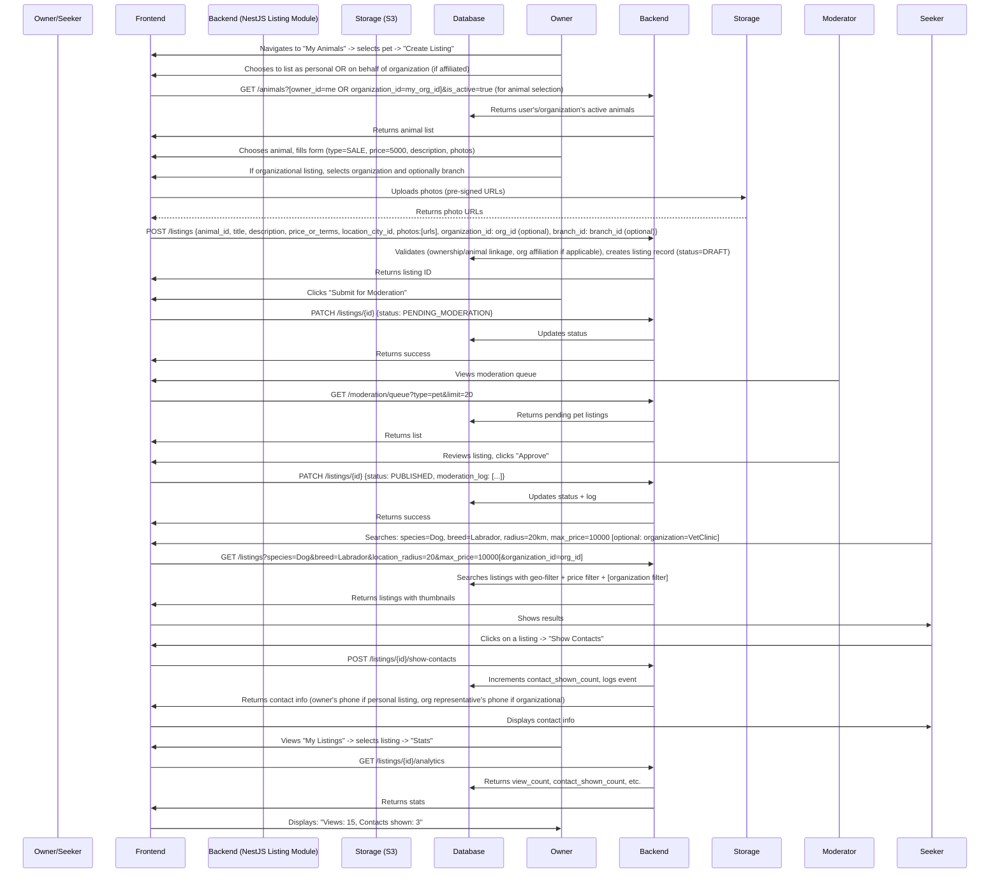

# Pet Marketplace Domain: ZooLink

## Purpose
Handles listings for companion animals (pets) such as cats, dogs, birds, rabbits, reptiles, and small mammals. Focuses on non-commercial transactions: sale, adoption, mating services, and rehoming. Emphasizes temperament, health, and suitability for home environment over productive traits.

## Core Concepts
- **Pet Listing**: An advertisement for a pet-related transaction. Types:
  - `SALE`: Transfer of ownership for compensation or free
  - `MATING`: Offering stud services or seeking a mate for breeding
  - `ADOPTION`: Free rehoming (often rescue/shelter context)
  - `STUD_SERVICE`: Paid mating service (male animal available for breeding)
- **Pet Attributes**: Characteristics relevant to companionship and breeding (temperament, health, lineage basics).
- **Listing Lifecycle**: From draft to publication via premoderation, then to active/completed/archived.
- **Geographic Scope**: Search radius-based (1-100 km) critical for pet transactions due to transport stress and owner preference for local pickup.

## Business Rules
### 1. Listing Creation
- Only authenticated users can create listings.
- Each listing must be linked to **one** animal from the user's owned animals (see Animal Domain).
- Mandatory fields at creation:
  - `animal_id` (reference to Animal Domain)
  - `listing_type` (ENUM: SALE, MATING, ADOPTION, STUD_SERVICE)
  - `title` (short headline, max 100 chars)
  - `description` (detailed text, max 2000 chars)
  - `price_or_terms`:
    - For SALE: number (currency RUB) or "free"/"negotiable"
    - For MATING/STUD_SERVICE: "free", "pick of litter", fixed fee (RUB), or "negotiable"
    - For ADOPTION: usually "free" or "donation welcome"
  - `location` (city + optional address precision; required for moderation and geo-search)
  - `photos` (1-5 images; minimum 1 clear photo of the animal)
  - `contact_method_visibility` (boolean: whether to show phone/socials after moderation)
- **Organization/Branch Attribution**:
  - When creating a listing, the user must specify either:
    - Their personal account (via `creator_id`) **OR**
    - An organization (via `organization_id`) and optionally a branch (via `branch_id`).
  - The `creator_id` (the individual who submitted the listing) is always recorded for audit purposes.
  - Listings linked to an organization show the organization’s name (and branch, if specified) in the public view.
  - **Important**: When listing on behalf of an organization, the animal must be owned by that organization (i.e., the animal's `organization_id` must match the listing's `organization_id`).
- Optional but recommended fields:
  - Vaccination status (dropdown: up to date, partial, none + dates if known)
  - Temperament descriptors (checklist: friendly with kids, friendly with dogs, friendly with cats, energetic, calm, anxious, protective)
  - Health notes (free text: spayed/neutered, known allergies, chronic conditions)
  - Pedigree info (text: registered with club? registration number if available)
  - For MATING/STUD_SERVICE:
    - Female's heat cycle dates (if applicable)
    - Male's proven stud status (number of litters, health certifications)
    - Terms: natural mating vs. AI, location of mating, stud fee terms

### 2. Listing Validation & Moderation
- All listings enter `PENDING_MODERATION` state upon submission.
- Moderator checks:
  - **Authenticity**: Photos match declared animal (species/breed/sex); no stock images.
  - **Completeness**: All mandatory fields filled; description not spammy.
  - **Policy Compliance**:
    - No promotion of illegal activities (e.g., dog fighting breeds in contexts suggesting violence).
    - No misleading claims (e.g., "purebred" without papers when claiming championship lines).
    - Vaccination claims moderate trust but not verified on MVP (user honesty).
  - **Duplicate Detection**: Warns if nearly identical listing exists from same user recently (possible error).
- Moderator actions:
  - `APPROVE`: Listing becomes `PUBLISHED` and visible in search.
  - `REJECT`: Returns to `DRAFT` state with required edit comments; user can resubmit.
- Time to moderate: Target <4 hours during business hours (9AM-9PM local).

### 3. Listing Lifecycle States
- `DRAFT`: User-editable, not submitted.
- `PENDING_MODERATION`: Awaiting review.
- `PUBLISHED`: Active in search; can receive views/contact requests.
- `CONTACTED`: System-tracked state when contacts are shown (does not affect visibility).
- `COMPLETED`: User marks as successful transaction (sale/mating occurred).
- `ARCHIVED`: User hides listing (retains history; can be reactivated).
- `EXPIRED`: Automatic after 60 days if not completed/archived (configurable per type).
- State transitions enforced by backend; UI reflects current state.

### 4. Search and Discovery
- Search filters for Pet Marketplace:
  - `listing_type` (SALE/MATING/ADOPTION/STUD_SERVICE)
  - `species` (cat/dog/bird/rabbit/reptile/rodent/etc.)
  - `breed` (from directory; supports mixed/unknown)
  - `sex` (male/female)
  - `age_range` (derived from animal's date of birth)
  - `price_range` (min/max in RUB; "free" treated as 0)
  - `location_radius` (from user's city; 1-100 km)
  - `organization_name` (filter by organization name)
  - `branch_city` (filter by branch city)
  - `temperament_tags` (multiple select: kid-friendly, dog-cat-friendly, etc.)
  - `health_flags` (vaccinated, spayed/neutered, dewormed)
  - `has_pedigree_papers` (boolean)
- Sorting options:
  - `newest_first` (default)
  - `price_low_to_high`
  - `price_high_to_low`
  - `distance_closest`
- Search results show:
  - Thumbnail photo
  - Title, species/breed, sex, age indicator
  - Price/terms
  - Distance from user
  - Organization/Branch badge (if listing is organization-linked)
  - Badge for verified stud (if applicable) or vaccination status
- Clicking listing shows:
  - Full description
  - All photos (carousel)
  - Animal details (from linked Animal profile)
  - Health/temperament notes
  - Owner's city (exact address hidden until contact shown)
  - "Show Contacts" button (visible only after moderation approval)

### 5. Post-Moderation Interaction
- When a user clicks "Show Contacts" on a PUBLISHED listing:
  - System logs the event (listing_id, viewer_user_id, timestamp).
  - Reveals:
    - Phone number (if owner/organization provided during registration and opted to share)
    - Links to connected social profiles (Telegram, VK) if available and consented.
  - Does NOT reveal exact address; users arrange meetup via revealed contacts.
  - Owner/representative can see in analytics: "Your listing was viewed X times, contacts shown Y times."
  - **Note**: For organization-linked listings, the contacts shown may belong to an organization representative rather than the individual creator.

### 6. Special Rules by Listing Type
- **SALE**:
  - Price must be ≥0 if numeric; "free" or "negotiable" allowed.
  - No restriction on selling puppies/kittens below age limit on MVP (reliant on user ethics and moderator spot-checks for obvious welfare issues).
  - Encouraged to mention spay/neuter status if applicable.
- **MATING**:
  - Both parties must specify what they offer (stud service, pick of litter, etc.).
  - Recommended to discuss health testing (brucellosis, brucella, etc.) off-platform; system does not enforce.
  - No guarantee of successful pregnancy; transaction considered complete upon mating attempt unless otherwise agreed.
- **ADOPTION**:
  - Price field defaulted to "free"; can suggest donation to shelter.
  - Often includes background: rescued, surrendered, etc.
- **STUD_SERVICE**:
  - Explicitly for male animals available for breeding.
  - Fee structure must be clear (per attempt, per pregnancy, pick of litter).
  - Owner responsible for verifying female's health before accepting.

## Non-Functional Requirements (Specific to Pet Marketplace)
- **Performance**:
  - Listing creation: <2s (includes photo upload to storage).
  - Search results: <1.5s for 95% of queries (<100km radius, moderate filters).
  - Photo loading: Optimized thumbnails; lazy loading in UI.
- **Scalability**:
  - Support 10k active pet listings without degradation.
  - Handle 500 new listing submissions per day during peak.
- **Data Consistency**:
  - Listing must always reference a valid, active animal.
  - If animal is deactivated, listing shows warning but remains active until user action.
- **Extensibility**:
  - JSONB `metadata` field for experimental attributes (e.g., social media links, video URL placeholder).
  - New listing types can be added via ENUM extension (backward compatible).
- **Security/Privacy**:
  - Exact location never shown; only distance/search radius.
  - Contact info revealed only on user action (not hover/preview).
  - Rate limiting on "Show Contacts": max 10 reveals per hour per user to deter scraping.
- **Moderator Load**:
  - Designed for <50 listings/day moderate rate on MVP.
  - Future: ML-assisted pre-screening for obvious spam/irrelevant content.

## Data Model (Conceptual)
| Attribute | Type | Required | Description |
|-----------|------|----------|-------------|
| `id` | UUID | Yes | Primary key |
| `animal_id` | UUID (FK to Animals.id) | Yes | The pet being listed |
| `creator_id` | UUID (FK to Users.id) | Yes | User who posted (always present for audit) |
| `organization_id` | UUID (FK to Organizations.id) | No | Organization posting the listing (nullable if personal listing) |
| `branch_id` | UUID (FK to Branches.id) | No | Specific branch posting the listing (nullable) |
| `listing_type` | ENUM('SALE', 'MATING', 'ADOPTION', 'STUD_SERVICE') | Yes |  |
| `title` | VARCHAR(100) | Yes | Short headline |
| `description` | TEXT | Yes | Max 2000 chars |
| `price_or_terms` | VARCHAR(100) | Yes | E.g., "15000", "free", "negotiable", "pick of litter" |
| `location_city_id` | INT (FK to cities) | Yes | For geo-search |
| `location_precision` | ENUM('city', 'district', 'exact') | No | Default: city (exact not shown/displayed) |
| `created_at` | TIMESTAMP | Yes |  |
| `updated_at` | TIMESTAMP | Yes |  |
| `status` | ENUM('DRAFT', 'PENDING_MODERATION', 'PUBLISHED', 'CONTACTED', 'COMPLETED', 'ARCHIVED', 'EXPIRED') | Yes | Default: DRAFT |
| `moderation_log` | JSONB | No | [{action: 'APPROVE'/REJECT, moderator_id: UUID, timestamp, comment}] |
| `contact_shown_count` | INT | No | How many times contacts were revealed |
| `view_count` | INT | No | Times listing appeared in search results |
| `expires_at` | TIMESTAMP | No | Auto-set based on listing_type + creation date |
| `metadata` | JSONB | No | For future extensibility (e.g., video_url, social_links) |

## Validation Rules
- `animal_id` must reference an active animal owned by the creator (either via `creator_id` -> `owner_id` or via `organization_id`).
- For organization-linked listings: the `creator_id` must have an active affiliation with the specified `organization_id` (via organization_users table).
- If `organization_id` is specified, `branch_id` (if provided) must belong to that organization.
- `photos` array must have 1-5 items; each item is a URL to storage.
- `price_or_terms`:
  - If numeric string, must be parseable as positive integer.
  - Free text terms limited to 100 chars.
- `location_city_id` must exist in reference directory.
- `description` cannot be empty or solely whitespace.
- For MATING/STUD_SERVICE: if `price_or_terms` suggests fee, it should be numeric or "negotiable".
- **Ownership Rule**: Exactly one of the following must be true:
  - Listing is personal: `organization_id` IS NULL and `creator_id` references the animal's `owner_id`
  - Listing is organizational: `organization_id` IS NOT NULL and `creator_id` is affiliated with that organization

## User Journey: Creating and Receiving Interest in a Pet Listing

## Open Questions & Assumptions
- **Assumption**: Temperament and health fields rely on user honesty; moderator does random spot-checks for blatant misreports (e.g., claiming vaccinated puppy is 2 weeks old).
- **Assumption**: Photos are moderated for relevance (must show the animal); no AI-based breed verification on MVP.
- **Open Question**: Should we restrict listing puppies/kittens under 8 weeks? (Decided: rely on user ethics + moderator intervention for obvious welfare violations on MVP; may add rule in Фаза 2.)
- **Assumption**: "Free" listings are common; system does not differentiate between true free and symbolic fees (e.g., 1 RUB).
- **Assumption**: Users understand that meeting pets in person carries risk; platform facilitates introduction only.
- **Assumption**: Organization listings show organizational branding rather than individual identity in public view.

## Related Domains
- **Animal Domain**: Provides the core pet profile; listing links to it.
- **Identity Domain**: `creator_id` links to user; authentication required.
- **Organization Domain**: `organization_id` and `branch_id` link to organizations and their physical locations.
- **Admin Domain**: Manages reference data (breeds, cities), moderation queue, rejection reasons.
- **Matching Domain**: Uses pet listing data to suggest compatible mates (filters by heat cycle, temperament, pedigree).
- **Future Domains**: Health Passport (extends animal data), Reproductive Calendar (uses mating listings).

## API Contract References (see 03-architecture/api-contracts/listings-api.yaml)
- `GET /listings/new` (get creation form data: species, breeds, cities, organizations [if user affiliated])
- `POST /listings` (create listing with optional organization_id/branch_id)
- `GET /listings/{id}` (get listing by ID – public if PUBLISHED, owner otherwise)
- `PATCH /listings/{id}` (update listing; only in DRAFT/PENDING_MODERATION)
- `POST /listings/{id}/submit-moderation` (change to PENDING_MODERATION)
- `GET /listings` (search listings with filters: type, species, breed, price, location_radius, organization_id, branch_id, etc.)
- `POST /listings/{id}/show-contacts` (log and reveal contacts)
- `PATCH /listings/{id}/complete` (mark as COMPLETED)
- `PATCH /listings/{id}/archive` (hide listing)
- Note: No delete endpoint; archive instead.