# Container Diagram (C4 Level 2): ZooLink Platform

## Purpose
Expands the ZooLink System container to show the internal components and their interactions.

## Diagram Description

```mermaid
graph TD
    %% External Systems (from Level 1)
    subgraph External_Systems
        direction TB
        SMS["SMS Gateway<br/>(SMS.RU / SMSC / MTS Exolve)"]
        Email["Email Service<br/>(Unisender / Mailopost)"]
        Maps["Geocoding & Maps<br/>(Yandex.Maps API)"]
        Storage["Object Storage<br/>(S3-compatible)"]
        OAuth["OAuth Providers<br/>(Google, Apple, Telegram, VK)"]
    end

    %% ZooLink System Boundary
    subgraph ZooLink_System[ZooLink Platform]
        direction TB
        %% Web Application
        subgraph WebApp["Web Application<br/>(SPA/PWA)"]
            direction TB
            SPA["Single Page Application<br/>(React + TypeScript)"]
            PWA_ServiceWorker["PWA Service Worker<br/>(Offline caching)"]
        end

        %% API Layer
        subgraph API["RESTful API<br/>(NestJS Backend)"]
            direction TB
            API_Gateway["API Gateway<br/>(Rate limiting, auth)"]
            Identity_Module["Identity Module<br/>(Auth, profiles, OAuth)"]
            Animal_Module["Animal Module<br/>(Animal CRUD, ownership)"]
            Listing_Module["Listing Module<br/>(Listing CRUD, search)"]
            Moderation_Module["Moderation Module<br/>(Queue, decisions)"]
            Matching_Module["Matching Module<br/>(Breeding suggestions)"]
            Organization_Module["Organization Module<br/>(Orgs, branches)"]
            Admin_Module["Admin Module<br/>(Reference data, config)"]
            Notification_Module["Notification Module<br/>(Email, SMS)"]
            GeoSearch_Module["GeoSearch Module<br/>(Spatial queries)"]
            Payment_Module["Payment Module<br/>(Future: transactions)"]
        end

        %% Data Stores
        subgraph Data_Stores
            direction TB
            DB[(PostgreSQL<br/>Primary Database)]
            Cache[(Redis Cache<br/>Sessions, reference data)]
            Search_Index[(Elasticsearch<br/>Full-text search — Фаза 2+)]
            Object_Storage[(S3-compatible<br/>File storage)]
        end
    end

    %% Users
    User["Users<br/>(Pet Owners, Breeders, Farmers, Moderators, Admins)"]

    %% Relationships
    User -- Uses --> SPA
    SPA <--> API_Gateway
    API_Gateway --> Identity_Module
    API_Gateway --> Animal_Module
    API_Gateway --> Listing_Module
    API_Gateway --> Moderation_Module
    API_Gateway --> Matching_Module
    API_Gateway --> Organization_Module
    API_Gateway --> Admin_Module
    API_Gateway --> Notification_Module
    API_Gateway --> GeoSearch_Module
    API_Gateway --> Payment_Module

    %% Data Access
    Identity_Module <--> DB
    Animal_Module <--> DB
    Listing_Module <--> DB
    Moderation_Module <--> DB
    Matching_Module <--> DB
    Organization_Module <--> DB
    Admin_Module <--> DB
    Notification_Module <--> DB
    GeoSearch_Module <--> DB
    GeoSearch_Module <--> Search_Index

    %% External Integrations
    Notification_Module --> SMS
    Notification_Module --> Email
    GeoSearch_Module --> Maps
    Listing_Module --> Storage
    Identity_Module --> OAuth

    %% Caching
    Identity_Module -.-> Cache
    Animal_Module -.-> Cache
    Listing_Module -.-> Cache
    Admin_Module -.-> Cache

    %% Search
    Listing_Module -.-> Search_Index
```

## Element Descriptions

### Web Application
- **Single Page Application**: Client-side application handling UI rendering and user interactions
- **PWA Service Worker**: Enables offline capabilities and installability

### API Layer (NestJS Modules)
- **API Gateway**: Entry point handling rate limiting, authentication, routing
- **Identity Module**: Manages user authentication, profiles, OAuth integrations
- **Animal Module**: Core animal entity management (CRUD, ownership, pedigree)
- **Listing Module**: Listing lifecycle, search, moderation submission
- **Moderation Module**: Queue management, decision workflow, audit trails
- **Matching Module**: Breeding match suggestions based on genetics, location, preferences
- **Organization Module**: Organization and branch management for business accounts
- **Admin Module**: Reference data management (breeds, species, cities), system configuration
- **Notification Module**: Handles email and SMS delivery via external providers
- **GeoSearch Module**: Spatial queries and distance calculations
- **Payment Module**: Placeholder for future payment processing

### Data Stores
- **PostgreSQL Database**: Primary relational database for all domain data
- **Redis Cache**: Session storage, reference data caching, temporary data
- **Elasticsearch**: Full-text search for listings and animal profiles (**Фаза 2+, not in MVP**). MVP search runs on PostgreSQL FTS (`russian` config + `pg_trgm`).
- **Object Storage**: Scalable storage for user-uploaded media files

### External Systems
(Same as Level 1 descriptions)

## Interfaces
- **User ↔ WebApp**: HTTPS via desktop/mobile browser
- **WebApp ↔ API Gateway**: REST/JSON over HTTPS with JWT auth
- **API Gateway ↔ Modules**: Internal NestJS module communication
- **Modules ↔ Database**: Prisma ORM (primary); Kysely / parameterized raw SQL for geo and complex JSONB queries (see `04-decisions/0007-orm-strategy.md`)
- **Modules ↔ Cache**: Redis protocol for caching layers
- **Modules ↔ Search Index**: Elasticsearch DSL for search operations
- **Modules ↔ Object Storage**: S3-compatible API for file operations
- **Modules ↔ External Services**: HTTPS APIs for SMS, email, maps, OAuth

## Deployment Considerations
- Can be deployed as monolith or microservices (modules independently deployable)
- Database per service pattern possible for future scaling
- API Gateway can be replaced with service mesh (Istio/Linkerd) in future