# Deployment Diagram: ZooLink Platform Infrastructure

## Purpose
Shows the physical deployment of artifacts on infrastructure nodes.

> ⚠️ **MVP vs Target State.** This diagram depicts the **Target deployment (Фаза 2+)**: a multi-zone
> Kubernetes cluster with HPA/VPA/Cluster Autoscaler. Per [ADR-0001](../04-decisions/0001-tech-stack.md)
> and [ADR-0009](../04-decisions/0009-mvp-vs-target-architecture.md), the **MVP does NOT use Kubernetes**.
>
> **MVP deployment topology (Фаза 1):**
> - 1–2 VMs (or one managed host) running **Docker Compose**: `api` (NestJS monolith, 1–N replicas),
>   `postgres`, `redis`, `minio` (S3-compatible), a background `worker` (outbox drain, jobs, cron).
> - A **reverse proxy** (Nginx / Caddy / Traefik) terminating TLS and serving the static SPA build + CDN.
> - **Network isolation via Docker networks:** only the reverse proxy is public; PostgreSQL/Redis/MinIO ports
>   are **never** published to the internet (internal network only).
> - **Providers are RF-appropriate** (see [ADR-0008](../04-decisions/0008-rf-provider-matrix.md)): object storage
>   = Yandex Object Storage / VK Cloud / Selectel / self-hosted MinIO; CDN = Yandex/VK/Selectel; monitoring =
>   Prometheus + Grafana.
>
> Kubernetes, HPA/VPA, multi-zone DR and read replicas below are **Фаза 2+ only**.

## Diagram Description

```mermaid
graph TD
    %% User Devices
    subgraph User_Devices
        direction TB
        Desktop["Desktop Browser<br/>(Chrome, Firefox, Safari)"]
        Mobile["Mobile Browser<br/>(iOS/Android)"]
        Tablet["Tablet Browser<br/>(iPad/Android)"]
    end

    %% CDN Layer
    subgraph CDN_Layer[Content Delivery Network]
        direction TB
        CDN_Edge["CDN Edge Nodes<br/>(Yandex/VK/Selectel CDN — ADR-0008)"]
    end

    %% Load Balancing
    subgraph Load_Balancers
        direction TB
        ALB["Application Load Balancer<br/>(HTTPS termination)"]
        ILB["Internal Load Balancer<br/>(Service-to-service)"]
    end

    %% Compute Layer (Kubernetes)
    subgraph Kubernetes_Cluster["Kubernetes Cluster<br/>(Managed or Self-managed)"]
        direction TB
        %% Control Plane
        subgraph Control_Plane
            direction TB
            K8s_API[Kubernetes API Server]
            K8s_Scheduler[Scheduler]
            K8s_Controller[Controller Manager]
            K8s_Etcd[(etcd cluster)]
        end

        %% Worker Nodes
        subgraph Worker_Nodes
            direction TB
            subgraph Node_1[Worker Node 1]
                direction TB
                Kubelet[Kubelet]
                Kube_Proxy[kube-proxy]
                Container_Runtime["Container Runtime<br/>(containerd/cri-o)"]
                %% Pods on Node 1
                subgraph Pods_Node1
                    direction TB
                    Web_Pod["Web Application Pod<br/>(SPA assets)"]
                    API_Pod["API Pod<br/>(NestJS Backend)"]
                    Worker_Pod["Background Worker Pod<br/>(Jobs, queues)"]
            end
            end

            subgraph Node_2[Worker Node 2]
                direction TB
                Kubelet[Kubelet]
                Kube_Proxy[kube-proxy]
                Container_Runtime["Container Runtime<br/>(containerd/cri-o)"]
                %% Pods on Node 2
                subgraph Pods_Node2
                    direction TB
                    API_Pod["API Pod<br/>(NestJS Backend)"]
                    Cron_Pod["Cron Job Pod<br/>(Scheduled tasks)"]
                    Monitoring_Pod["Monitoring Pod<br/>(Prometheus, Grafana)"]
            end
            end

            subgraph Node_3[Worker Node 3]
                direction TB
                Kubelet[Kubelet]
                Kube_Proxy[kube-proxy]
                Container_Runtime["Container Runtime<br/>(containerd/cri-o)"]
                %% Pods on Node 3
                subgraph Pods_Node3
                    direction TB
                    DB_Postgres["PostgreSQL Pod<br/>(Primary instance)"]
                    DB_Postgres_Replica["PostgreSQL Pod<br/>(Replica instance)"]
                    Redis_Pod["Redis Pod<br/>(Cache cluster)"]
            end
            end
        end
    end

    %% Data Stores
    subgraph Data_Stores
        direction TB
        PV_Postgres["Persistent Volume<br/>(PostgreSQL data)"]
        PV_Redis["Persistent Volume<br/>(Redis data)"]
        PV_Backups["Persistent Volume<br/>(Backup storage)"]
        Object_Storage["Object Storage Bucket<br/>(S3-compatible)"]
        Search_Index["Search Index<br/>(Elasticsearch/OpenSearch)"]
    end

    %% External Services
    subgraph External_Services
        direction TB
        SMS_Gateway["SMS Provider<br/>(SMS.RU — ADR-0008)"]
        Email_Service["Email Provider<br/>(Unisender — ADR-0008)"]
        Maps_Service["Maps Provider<br/>(Yandex.Maps API)"]
        OAuth_Providers["OAuth Providers<br/>(Google, Apple, Telegram, VK)"]
        Monitoring_Service["Monitoring<br/>(Prometheus+Grafana / Sentry — ADR-0008)"]
    end

    %% Relationships
    %% User to CDN/LB
    Desktop --> CDN_Edge
    Mobile --> CDN_Edge
    Tablet --> CDN_Edge
    CDN_Edge --> ALB

    %% Load Balancing
    ALB --> ILB
    ILB --> K8s_API

    %% Kubernetes Internal
    K8s_API --> K8s_Scheduler
    K8s_API --> K8s_Controller
    K8s_API --> K8s_Etcd

    %% Pod to Node mapping (implicit in subgraph structure)
    %% Services communication
    Web_Pod --> API_Pod
    API_Pod --> DB_Postgres
    API_Pod --> DB_Postgres_Replica
    API_Pod --> Redis_Pod
    API_Pod --> Object_Storage
    API_Pod --> Search_Index
    Worker_Pod --> DB_Postgres
    Worker_Pod --> Redis_Pod
    Cron_Pod --> DB_Postgres
    Cron_Pod --> Object_Storage
    Monitoring_Pod --> PV_Backups
    Monitoring_Pod --> Object_Storage

    %% Persistent Volumes
    DB_Postgres --> PV_Postgres
    DB_Postgres_Replica --> PV_Postgres
    Redis_Pod --> PV_Redis
    %% Monitoring_Pod --> PV_Backups (shown above)

    %% Object Storage relationship
    Object_Storage --> PV_Backups

    %% External Integrations
    API_Pod --> SMS_Gateway
    API_Pod --> Email_Service
    API_Pod --> Maps_Service
    API_Pod --> OAuth_Providers
    Monitoring_Pod --> Monitoring_Service

    %% Database Replication
    DB_Postgres -->|Replication| DB_Postgres_Replica

    %% Styling
    classDef user fill:#E3F2FD,stroke:#1565C0,stroke-width:1px;
    classDef cdn fill:#FFF3E0,stroke:#EF6C00,stroke-width:1px;
    classDef lb fill:#F3E5F5,stroke:#6A1B9A,stroke-width:1px;
    classDef k8s fill:#E8F5E8,stroke:#2E7D32,stroke-width:1px;
    classDef data fill:#FFEBEE,stroke:#C62828,stroke-width:1px;
    classDef external fill:#F5F5F5,stroke:#616161,stroke-width:1px;
    classDef pv fill:#FFF8E1,stroke:#FFB300,stroke-width:1px;

    class Desktop,Mobile,Tablet user;
    class CDN_Edge cdn;
    class ALB,ILB lb;
    class K8s_API,K8s_Scheduler,K8s_Controller,K8s_Etcd,Kubelet,Kube_Proxy,Container_Runtime k8s;
    class Web_Pod,API_Pod,Worker_Pod,Cron_Pod,Monitoring_Pod,DB_Postgres,DB_Postgres_Replica,Redis_Pod k8s;
    class PV_Postgres,PV_Redis,PV_Backups,Object_Storage,Search_Index data;
    class SMS_Gateway,Email_Service,Maps_Service,OAuth_Providers,Monitoring_Service external;
```

## Node Descriptions

### User Devices
- **Desktop Browser**: Primary access method for users (power users, administrators)
- **Mobile Browser**: Access for users on-the-go (majority of users)
- **Tablet Browser**: Alternative browsing experience

### CDN Layer
- **CDN Edge Nodes**: Distributed nodes serving static assets (JS, CSS, images) with low latency

### Load Balancing
- **Application Load Balancer**: Terminates SSL/TLS, performs health checks, routes to Kubernetes
- **Internal Load Balancer**: Internal service-to-service communication within cluster

### Kubernetes Cluster
- **Control Plane**: Manages cluster state and orchestrates workloads
- **Worker Nodes**: Execute containerized workloads (pods)

#### Pod Distribution Strategy
- **Node 1**: Web serving and API tier (user-facing components)
- **Node 2**: API processing and background jobs (compute-intensive tasks)
- **Node 3**: Data storage tier (database, cache, search)

### Data Stores
- **Persistent Volumes**: Provide durable storage for stateful workloads
- **Object Storage**: Scalable blob storage for user-uploaded media
- **Search Index**: Full-text search capability for listings and profiles

### External Services
- Third-party APIs for communication (SMS, email), mapping, identity, and monitoring

## Communication Patterns

### North-South Traffic
- **User ↔ CDN ↔ ALB**: Static asset delivery and initial request handling
- **ALB ↔ ILB ↔ API Pods**: External API access through load balancers

### East-West Traffic
- **API Pods ↔ Database**: Primary data access patterns
- **API Pods ↔ Cache**: Session storage and reference data caching
- **API Pods ↔ Object Storage**: Media upload/download operations
- **API Pods ↔ Search Index**: Full-text search queries
- **Background Pods ↔ Database/Storage**: Batch processing and maintenance tasks
- **Monitoring Pods → All Services**: Scraping metrics and collecting logs

### External Integrations
- **API Pods ↔ SMS/Email Providers**: Notification delivery
- **API Pods ↔ Maps Provider**: Geocoding and distance calculations
- **API Pods ↔ OAuth Providers**: Social login flows
- **Monitoring Pods ↔ External Monitoring**: Metrics export and alerting

## Scaling Characteristics

### Horizontal Pod Autoscaler (HPA)
- CPU/memory based scaling for stateless services (Web, API, Workers)
- Custom metrics scaling for queue length (background workers)
- Minimum/maximum replica limits per deployment

### Vertical Pod Autoscaler (VPA)
- Resource recommendation for optimal container sizing
- Applied to database and cache pods for resource optimization

### Cluster Autoscaler
- Node group scaling based on pod scheduling requirements
- Different node pools for different workloads (compute-optimized, memory-optimized, storage-optimized)

## Disaster Recovery Considerations

### Multi-Zone Deployment
- Control plane distributed across availability zones
- Worker nodes spread across zones for fault tolerance
- Persistent volumes with zone-aware provisioning

### Backup Strategy
- Regular snapshots of persistent volumes
- Object storage versioning and cross-region replication
- Database logical backups and WAL archiving
- Search index snapshots

### Failover Procedures
- Database promotion: replica → primary
- Traffic rerouting via load balancer health checks
- Cache warm-up procedures after failover
- Search index replication lag monitoring

## Security Considerations

### Network Policies
- Restrict pod-to-pod communication to required paths
- Database accessible only from API and worker pods
- External services accessible only through monitored egress

### Secrets Management
- Kubernetes Secrets for database credentials, API keys
- External secret managers (HashiCorp Vault, AWS Secrets Manager) for rotation
- Pod identity for least-privilege access to cloud resources

### Image Security
- Base image scanning for vulnerabilities
- Non-root user execution in containers
- Read-only root filesystem where possible
- Signature verification for trusted images