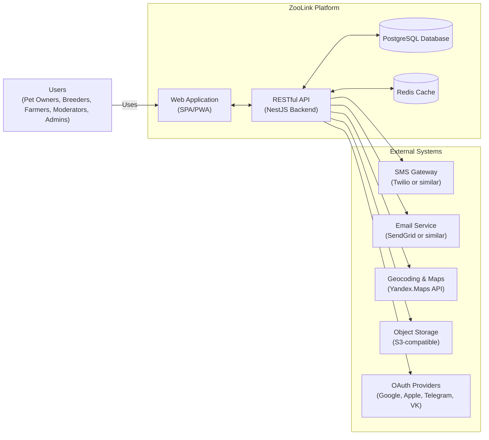

# System Context Diagram (C4 Level 1): ZooLink

## Purpose
Shows the ZooLink system as a single box, with its users and the external systems it directly interacts with.

## Diagram Description

## Element Descriptions

### Users
- **Pet Owners**: Individuals looking to buy, sell, or breed companion animals (cats, dogs, birds, etc.).
- **Breeders**: Professional or hobbyist breeders seeking mating partners or selling offspring.
- **Farmers/Ranchers**: Owners of agricultural livestock (cattle, horses, sheep, goats, pigs, poultry) for sale, breeding, or leasing.
- **Moderators**: Trusted users responsible for reviewing listings before publication.
- **Admins**: Platform administrators managing system configuration, roles, and integrations.

### ZooLink System
- **Web Application**: Single Page Application accessible via browsers, with PWA capabilities for offline caching and installability.
- **RESTful API**: Backend service built with NestJS, providing endpoints for all functionality.
- **PostgreSQL Database**: Primary data store for user profiles, animals, listings, moderation logs, and reference data.
- **Redis Cache**: Used for session storage, reference data caching, and temporary data.

### External Systems
- **SMS Gateway**: Service for sending verification codes during phone-based authentication.
- **Email Service**: Service for sending transactional emails (verification, moderation results, notifications).
- **Geocoding & Maps**: Service for converting addresses to coordinates and calculating distances for geo-search.
- **Object Storage**: Scalable storage for user-uploaded images (animal photos, listing photos, avatars).
- **OAuth Providers**: Third-party identity providers enabling social login options.

## Interfaces
- **User ↔ WebApp**: HTTPS accessed via desktop or mobile browser.
- **WebApp ↔ API**: REST/JSON over HTTPS.
- **API ↔ Database**: SQL queries via Prisma ORM (PostgreSQL protocol).
- **API ↔ Cache**: Redis protocol (TCP).
- **API ↔ SMS Gateway**: HTTPS API (Twilio REST or similar).
- **API ↔ Email Service**: HTTPS API (SendGrid v3 or similar).
- **API ↔ Geocoding/Maps**: HTTPS API (Yandex.Maps Geocoder and Search).
- **API ↔ Object Storage**: S3-compatible REST API (via pre-signed URLs or direct SDK).
- **API ↔ OAuth Providers**: OAuth 2.0 flows (authorization code grant with PKCE where applicable).

## Assumptions
- The WebApp is responsible for all UI rendering; the API is purely data/services.
- Authentication tokens (JWT) are managed by the WebApp and sent with API requests.
- File uploads go directly from WebApp to Object Storage using pre-signed URLs (API does not proxy file data).
- All communication is encrypted (HTTPS/TLS 1.2+).
- The system does not directly integrate with hardware devices (e.g., microchip readers) on MVP.

## Related Documents
- `container-diagram.md` (C4 Level 2: breaks down the ZooLink System into internal components)
- `domains-and-bc.md` (maps bounded contexts to technical modules)
- `data-model.md` (logical data structure)
- `storage.md` (file storage organization)
- `api-contracts/` (detailed API specifications)
