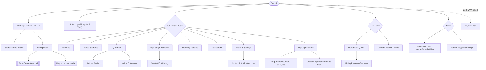

# ZooLink — UI/UX Concept

> Foundation for Figma. Grounded strictly in the existing spec (no invented features). Where a documented flow costs more clicks than necessary, a **💡 UX improvement** is proposed.
>
> Platform targets (all first-class): **Desktop web**, **Mobile web**, **Mobile app**. Design is **mobile-first** — the user must complete every key task comfortably on a small screen.
>
> Key spec constraints driving the design:
> - **Two hard-split markets** (ADR-0002): Pet vs Livestock — a top-level context, not a buried filter.
> - **No in-app chat** (ADR-0005): contact is exchanged via a **"Show Contacts"** action on ACTIVE listings.
> - **Pre-moderation** (ADR-0003): listings are `DRAFT → PENDING_MODERATION → ACTIVE`; sellers need clear status visibility.
> - **Geo-search** (1–100 km), localized UI (5 languages), roles: User / Moderator / Admin (+ AI-agent operators, ADR-0006).

---

## 0. Screen Inventory (how many, which)

**MVP: ~24 unique screens** (+ a few modals/sheets). Payments and AI-agent ops are post-MVP. Counts exclude reusable modals (Show Contacts, Report, confirm dialogs) which are not full screens.

| # | Screen | Primary purpose | Role | Phase |
|---|--------|-----------------|------|-------|
| 1 | Marketplace Home / Feed | Browse + search + geo results (Pet/Livestock) | Guest+ | MVP |
| 2 | Login | Phone/SMS + OAuth entry | Guest | MVP |
| 3 | Register | Create account | Guest | MVP |
| 4 | Verify (code) | SMS/OAuth verification | Guest | MVP |
| 5 | Listing Detail | Evaluate animal; Show Contacts | Guest+ | MVP |
| 6 | Favorites | Saved listings | User | MVP |
| 7 | Saved Searches | Saved filters/locations | User | MVP |
| 8 | My Animals (list) | Manage owned animals | User | MVP |
| 9 | Animal Profile | View one animal + health/repro records | User | MVP |
| 10 | Add / Edit Animal | Animal form | User | MVP |
| 11 | My Listings (by status) | Seller control center | User | MVP |
| 12 | Create / Edit Listing | Listing wizard | User | MVP |
| 13 | Breeding Matches | Matching suggestions | User (breeder) | MVP |
| 14 | Notifications | Activity center | User | MVP |
| 15 | Profile | View/edit own profile | User | MVP |
| 16 | Settings (contact + notification prefs) | Privacy & prefs | User | MVP |
| 17 | My Organizations | Org list | Org member | MVP |
| 18 | Organization Detail | Branches / staff / analytics | Org OWNER/ADMIN | MVP |
| 19 | Create Org / Branch / Invite Staff | Org forms | Org OWNER/ADMIN | MVP |
| 20 | Moderation Queue | Pending listings | Moderator | MVP |
| 21 | Listing Review & Decision | Approve/Reject/Changes | Moderator | MVP |
| 22 | Content Reports Queue | Triage user reports | Moderator | MVP |
| 23 | Admin: Reference Data | species/breeds/cities CRUD | Admin | MVP |
| 24 | Admin: Feature Toggles / Settings | System flags | Admin | MVP |
| — | Payment flow (intent → confirm → result) | Promote/pay | User | Post-MVP (gated) |
| — | Agent audit / ops dashboard | AI-agent oversight | Admin | Post-MVP |

**Reusable overlays (not counted as screens):** Show Contacts sheet, Report modal, Confirm dialogs (delete/deactivate), Filters bottom-sheet, Photo uploader.

---

## 1. Information Architecture

### 1.1 Sitemap

### 1.2 Global Navigation

**Header (top bar)** — persistent:
- Left: **Logo** → home; **Market toggle** `Pet | Livestock` (the hard split, ADR-0002).
- Center: **Search field** + **Location chip** (current city/radius; tap to change).
- Right (guest): **Log in / Register**.
- Right (authed): **＋ Create** (animal/listing quick action), **🔔 Notifications** (badge), **Avatar menu** (Profile, My Animals, My Listings, Organizations, Settings, Logout).

**Primary navigation** (role-aware):
- Desktop: **left sidebar** with sections (Search, Favorites, My Animals, My Listings, Matching, Organizations).
- Mobile: **bottom tab bar** (max 5): `Search · Favorites · ＋Create · Activity(notifications) · Profile`. Everything else lives under Profile.

**Role-based additions:**
| Role | Extra nav |
|---|---|
| User | (base set above) |
| Moderator | **Moderation** section → Queue, Content Reports |
| Admin | **Admin** section → Reference Data, Feature Toggles |
| Org member | **Organizations** with branch/staff/analytics; "List for Organization" option in Create |
| AI agent (ADR-0006) | No UI — agents act via API; their actions surface in moderation audit/admin dashboards |

**Footer (desktop only):** About, Terms, **Privacy (152-ФЗ)**, Support, **Language switcher** (5 langs), market links. On mobile the footer collapses into the Profile/Settings list.

---

## 2. Responsive Strategy (Desktop vs Mobile)

Guiding rule: **the key task funnel — find a listing → see contacts, or create an animal → create a listing → pass moderation — must never lose a step on mobile.** Mobile reorganizes, it does not amputate.

| Pattern | Desktop (wide) | Mobile (web & app) |
|---|---|---|
| **Marketplace** | 3 zones: filter sidebar (left) · results grid 2–3 cols (center) · map (right, sticky) | Single column of cards; filters → **bottom-sheet "Filters"**; map → toggle button **List/Map** |
| **Listing detail** | 2 cols: gallery + key facts (left) · sticky action panel "Show Contacts/Favorite/Report" (right) | Stacked: gallery → facts → **sticky bottom action bar** ("Show Contacts" always reachable) |
| **Create listing / forms** | Multi-column form, live preview pane on the right | **Step-by-step wizard** (progress dots), one section per screen, big touch targets, sticky "Next/Submit" |
| **My Listings / Moderation queue (tables)** | Full **data table** (columns: title, status, market, views, contacts-shown, date) | Table → **stacked cards** (title + status chip + 2 key metrics + overflow menu) |
| **Org analytics** | Charts + table side by side | Charts stack; table → cards; horizontal scroll only as last resort |
| **Navigation** | Left sidebar + header | Bottom tab bar + header with burger for secondary items |
| **Filters** | Always visible | Collapsed into a **"Filter (N)"** button showing active-filter count |

**Mobile-specific care:**
- **Location & radius**: request geolocation with a clear prompt; remember last choice; radius via a slider in the filter sheet.
- **Photos on create**: allow camera capture directly; show upload progress; 1–5 photos (pet) per spec.
- **"Show Contacts"** must be a one-tap, thumb-reachable action in the bottom bar — it is the conversion moment (no chat, ADR-0005).
- **Bottom-sheets over modals** for filters/contact reveal — native, dismissible, one-handed.

---

## 3. Textual Wireframes — Key Screens

The spec's highest-traffic tasks. Core trio first: **(A) Marketplace Search Feed** (primary buyer task), **(B) Create Listing** (primary seller task), **(C) Listing Detail + Show Contacts** (the conversion screen, unique due to no-chat). Then the seller/operator screens: **(D) My Listings**, **(E) Moderation Queue & Review**, **(F) Add / Edit Animal**.

### A. Marketplace Search Feed
*User goal: find relevant animals nearby, fast, with trustworthy info.*

**Layout (Desktop):**
- **[Top Bar]** Left: Logo, `Pet | Livestock` toggle. Center: Search input + Location chip "Москва · 25 км ▾". Right: ＋Create, 🔔, Avatar.
- **[Left Sidebar – Filters]** H3 "Filters". Controls: Species (dropdown), Breed (autocomplete), Sex, Age range, Price range (RUB; "free"=0), Listing type (sale/breeding/show/adoption/stud_service), Radius slider (1–100 km), Health flags (vaccinated, sterilized), Has pedigree (toggle). Buttons: **Apply** · **Reset**. Below: **★ Save this search**.
- **[Content – Center]** H1 "Listings · Pet". Sort dropdown (Newest / Price ↑ / Price ↓ / Distance). **Result grid (2–3 cols)** of cards: photo, title, species·breed·sex·age, price/terms, **distance badge**, org badge (if org listing), favorite ♥ toggle.
- **[Content – Right]** Sticky **map** with clustered pins; hovering a card highlights its pin.
- Infinite scroll / "Load more".

**Layout (Mobile):**
- **[Top Bar]** Burger · Logo · `Pet|Livestock` segmented · 🔔.
- **[Sub Bar]** Location chip + **"Filter (3)"** button + **List/Map** toggle.
- **[Content]** Single-column cards (same data, larger photo). Tapping "Filter" opens a **bottom sheet**; "Save search" lives at the sheet's bottom.
- 💡 **UX improvement:** auto-detect location on first open (with permission) and default radius to 25 km, so the user sees relevant nearby results immediately instead of an empty/global list.

### B. Create Listing
*User goal: publish an accurate listing with minimum effort and know it's "in review".*

**Layout (Desktop):**
- **[Top Bar]** standard.
- **[Content – Left, form]** H1 "New Listing". Step 1 **Animal**: pick from **My Animals** (cards) — this **pre-fills** species/breed/sex/DoB/photos. Step 2 **Type & details**: listing_type, title, description, price/terms (fields adapt to type, e.g. stud_service shows fee/terms). Step 3 **Location**: city + map pin / address (geocoded). Step 4 **Photos**: 1–5, drag-reorder. Step 5 **Org** (optional): "List for organization" → org + branch.
- **[Content – Right]** Live **preview card** (how it will look in the feed).
- Sticky footer: **Save draft** · **Submit for review**.
- On submit → status becomes `PENDING_MODERATION`; show confirmation (see §4).

**Layout (Mobile):**
- **Wizard**: one step per screen with progress dots (1/5). Sticky bottom **Next / Submit**. Preview available via a "Preview" link.
- 💡 **UX improvement:** because every listing must link to an existing animal (spec), **starting Create from an animal's profile** (button "List this animal") skips Step 1 entirely — 2 taps instead of 5. Offer both entry points.
- 💡 **UX improvement:** keep the listing in `DRAFT` autosaved; never lose input if moderation is slow or the app closes.

### C. Listing Detail + Show Contacts
*User goal: evaluate the animal and contact the seller safely.*

**Layout (Desktop):**
- **[Top Bar]** standard.
- **[Content – Left]** Photo gallery (carousel). H1 title. Key facts row (species·breed·sex·age, price/terms, **distance**, posted date). Sections: Description, Health/temperament, Pedigree, Animal profile link, Owner/Org card (name, city — **exact address hidden**).
- **[Content – Right, sticky panel]** Price/terms · **Show Contacts** (primary) · ♥ Favorite · ⚑ Report · Share. Note "Address is never shared".
- **Show Contacts** → modal revealing phone + Telegram/VK links (only those the owner opted to share); the reveal is **logged** (analytics). Requires login → if guest, prompt to log in **at this point only**.

**Layout (Mobile):**
- Stacked: gallery → title → key facts → sections.
- **Sticky bottom action bar**: `♥` · **Show Contacts** (primary, wide) · `⋯` (Report/Share). The conversion action is always one thumb-tap away.
- 💡 **UX improvement:** let users **browse and view details without an account**; gate login only at "Show Contacts"/"Favorite"/"Create" — lowers friction and matches the value moment.

### D. My Listings (Seller Control Center)
*User goal: see all my listings by status and take the right next action.*

**Layout (Desktop):**
- **[Top Bar]** standard.
- **[Status tabs]** `All · Draft · In review · Active · Sold · Expired · Deactivated` (counts per tab).
- **[Content – Table]** columns: photo+title, market, **status chip** + **moderation badge**, price, views, contacts-shown, updated. Row actions adapt to status: Draft → *Edit / Submit*; In review → *(read-only)*; Active → *Mark sold / Deactivate / Promote(gated)*; **Changes requested → *Edit & resubmit*** (highlighted); Expired → *Renew*.
- Bulk select for deactivate.

**Layout (Mobile):**
- Status tabs become a horizontally scrollable chip row; rows become **cards** (photo, title, status chip, 2 metrics, `⋯` action menu).
- 💡 **UX improvement:** surface `CHANGES_REQUESTED` items at the top with the moderator's note inline, so the fix-and-resubmit loop is obvious and fast.

### E. Moderation Queue & Review (Moderator)
*Moderator goal: clear the queue quickly and consistently, with an audit trail.*

**Layout (Desktop):**
- **[Top Bar]** standard + **market filter** `Pet | Livestock`.
- **[Left – Queue list]** rows: thumbnail, title, species, **waiting time** (SLA), submitter/org. Sorted oldest-first.
- **[Right – Review panel]** the selected listing in full (photos, all fields, linked animal); decision controls: **Approve** (primary) · **Reject** (reason required, from list) · **Request changes** (reason + note). Below: this entity's **append-only decision history** (read-only).
- After a decision the item leaves the queue; the next item auto-focuses.

**Layout (Mobile):**
- Single column: queue cards → tap → full review screen → sticky bottom decision bar (Approve / Reject / Changes). Reason picker is a bottom-sheet.
- 💡 **UX improvement:** keyboard shortcuts on desktop (A/R/C) and a "next" auto-advance keep high-volume moderation fast; the SLA timer color-shifts as it nears the limit.

### F. Add / Edit Animal
*User goal: register an animal accurately; it later powers listings and matching.*

**Layout (Desktop):**
- **[Content – Form]** H1 "New Animal". Fields: species (dropdown), breed (autocomplete) **or** custom breed text (exactly one — XOR), sex, date of birth, nickname, color/coat, microchip/tattoo (optional), description. Sub-sections (collapsible): **Health Records** (add events: type/detail/date/provider), **Reproductive Data** (for females). Org ownership toggle (if acting for an org).
- Sticky footer: **Save**. Immutable fields (species, sex, DoB, breed) are clearly marked as locked after creation (per ADR-0004 / DB trigger).

**Layout (Mobile):**
- Single-column form; Health/Reproductive records as expandable lists with an "＋ Add record" row.
- 💡 **UX improvement:** the breed XOR (`breed_id` vs custom text) is a common error source — use a single control "Breed" with an autocomplete that offers *"Can't find it? Enter custom"*, so the user never faces two competing fields.

---

## 4. UX Edge Cases (Closed Questions)

**Empty States** (illustration + message + primary CTA):
- Feed, no results → "No listings match your filters" + **Reset filters** / **Expand radius**.
- My Animals empty → "No animals yet" + **Add your first animal**.
- My Listings empty → "You haven't posted anything" + **Create listing**.
- Favorites / Saved searches empty → friendly hint + link to Search.
- Moderation queue empty → "Queue is clear ✅" (positive reinforcement).

**Loading States:**
- Lists/feed/tables → **skeleton cards/rows** (shape of the content), not spinners.
- Detail screen → skeleton gallery + text lines.
- Buttons performing an action → inline spinner + disabled state ("Submitting…").
- Map → light shimmer over the map area until pins load.

**Error States:**
- **Form validation** → inline, **under the field**, red text + red border; summary toast only if multiple errors; submit stays disabled until valid. Field-level messages mirror the API 422 contract.
- **Server/network error** → top **toast** "Something went wrong, try again" + **Retry**; keep user's input.
- **Permission/403** (e.g., non-moderator hits a mod URL) → friendly "You don't have access" screen, not a raw error.
- **Geolocation denied** → fall back to manual city entry; never block the feed.

**Success:**
- Quick actions (favorite, save search) → subtle **green toast** + state change; no interruption.
- Create/Submit listing → **success screen/modal**: "Sent for review 🕒 — typically approved within 4h (pet) / 6h" + buttons **View my listings** / **Create another**. Status chip on the listing reads `PENDING_MODERATION`.
- Moderation decision → toast + queue item removed; owner gets a notification.

---

## 5. Design Handoff Brief

> **Внимание дизайнеру: при проектировании учитывай…**

1. **Mobile-first, three targets.** Design mobile (app + web) first, then scale up to desktop. Every key task must complete on a phone with one hand; use bottom-sheets and a bottom action bar, not desktop modals.
2. **The market split is a top-level toggle**, not a filter — `Pet | Livestock` lives in the header and reframes the whole feed (ADR-0002).
3. **No chat — "Show Contacts" is the conversion.** Make it the single most prominent action on a listing; reveal phone/Telegram/VK in a sheet, never the exact address; the action is logged and login-gated (ADR-0005).
4. **Listing status must always be visible to sellers** as a chip: `DRAFT · PENDING_MODERATION · ACTIVE · EXPIRED · SOLD · DEACTIVATED`. Moderation outcome is a **separate** badge (`APPROVED/REJECTED/CHANGES_REQUESTED`). Design the "in review" and "changes requested" states explicitly.
5. **Every listing is tied to an existing animal** — design Create as animal-first (pick from My Animals → pre-filled), with an entry point from the animal profile to cut steps.
6. **Destructive & irreversible actions need confirmation popups** (delete animal/listing, deactivate account, moderator reject/ban). Reject/Changes-requested requires a reason (from a predefined list) + optional note.
7. **Localization & roles change the chrome.** Support 5 languages (text expansion, RTL not required); the nav and available actions differ per role (User / Moderator / Admin / Org member). Empty/loading/error states are required for every list and form.

---

## UX/UI Advice (my recommendation)

- **Reduce friction before the value moment.** Let people browse, search, and view details **without an account**; ask to authenticate only when they act (Show Contacts / Favorite / Create). This matches the spec's "contact after publish" model and maximizes funnel reach.
- **Collapse the create funnel.** The spec implies a 5-step create; because a listing must reference an existing animal, an **"List this animal"** button on the animal profile turns it into ~2 steps. Keep both entry points; autosave drafts.
- **Make geo do the work.** Auto-locate (with consent), remember the last radius, and combine geo + filters in one panel — discovery is the core task and should feel instant and local.
- **Trust by design.** For a marketplace dealing with living animals, surface trust signals on cards/detail (verified phone, org badge, vaccination/pedigree flags) and keep moderation status honest and visible. Never expose exact addresses.
- **Sellers need a control center.** "My Listings" grouped by status with clear next actions (resubmit after CHANGES_REQUESTED, renew EXPIRED) prevents confusion created by the pre-moderation lifecycle.
- **Forward-compatible, gated.** Payments and AI-agent moderation exist in the spec but are gated/post-MVP — leave space in the IA (e.g., a "Promote" affordance, an agent-audit view) without building them now.

> Net: ZooLink's UX hinges on **fast local discovery → trustworthy listing → one-tap contact**, plus a **calm seller lifecycle** around pre-moderation. Get those two loops effortless on mobile and the product feels great.

> _RU mirror: `docsRU/05-ui-ux/ui_ux_concept.md`._
