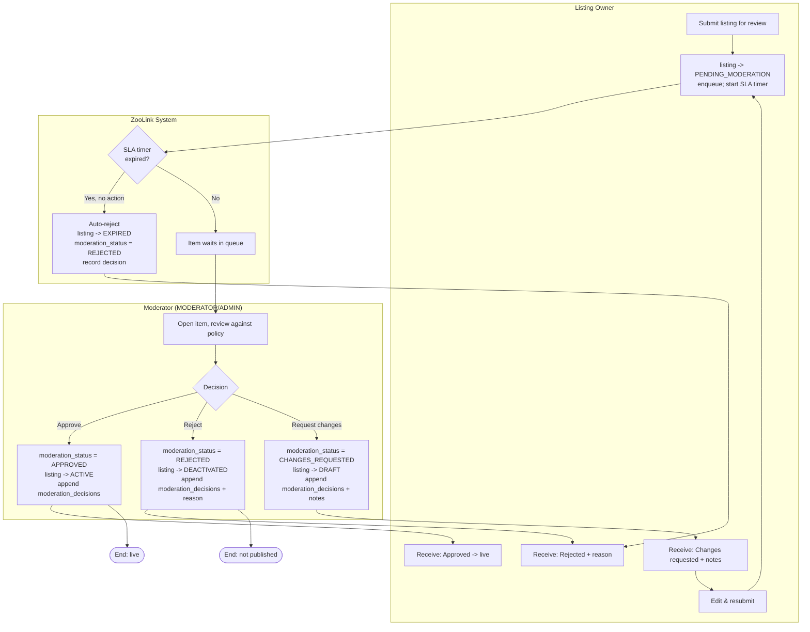
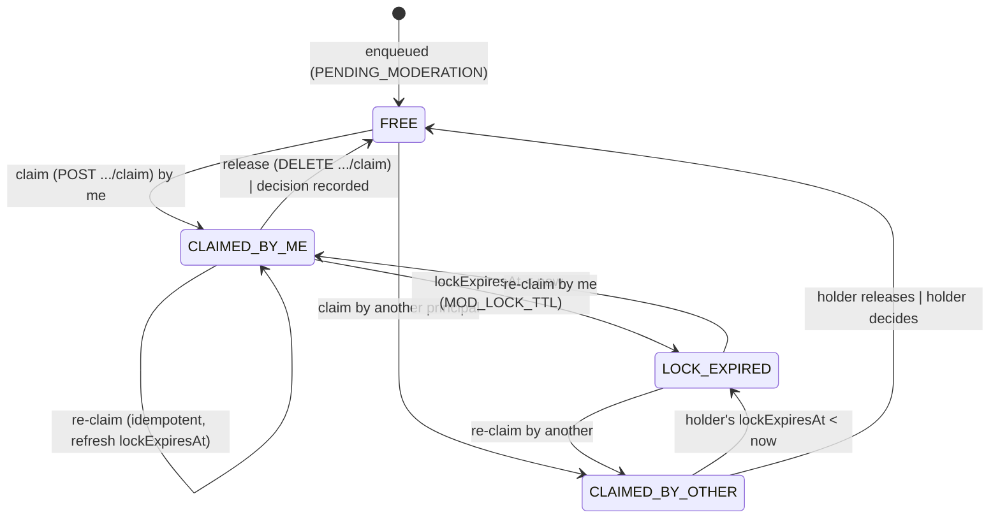

# Spec: Moderation Domain

## Outcome
Provide a reliable moderation workflow for user-generated content (listings, animal profiles, etc.) to ensure compliance with platform policies, legal requirements, and community standards. Enable moderators to review submissions, make decisions (approve, reject, request changes), and maintain an audit trail of all moderation actions.

## Scope & Boundaries
**In Scope:**
- Moderation queue for listings awaiting review
- Moderation queue for animal profiles awaiting review (if applicable)
- Moderator interface for viewing queue items, accessing item details, and making decisions
- Decision types: Approve, Reject, Request Changes (with specific reasons)
- Automated moderation triggers (e.g., profanity detection, duplicate detection) - deferring to phase 2
- Appeal process for rejected items - deferring to phase 2
- Audit trail recording: moderator ID, timestamp, decision, reason, and any notes
- Notifications to users upon moderation decision (via Notification Domain)
- Role-based access control: only users with MODERATOR or ADMIN role can access moderation features
- Integration with Listing Domain (for listing moderation) and Animal Domain (for animal profile moderation)
- Bulk moderation actions (approve/reject multiple items) - deferring to phase 2

**Out of Scope:**
- Automated content moderation (AI-based image/text analysis) - deferred to phase 2
- User reputation system based on moderation history - deferred to phase 2
- Legal review workflow for high-risk items - deferred to phase 2
- Public moderation logs (transparency reports) - deferred to phase 2
- Integration with external moderation services (e.g., third-party content filters) - deferred to phase 2

## Constraints
- **Legal:** Must comply with Russian Federal Law 152-ФЗ (Personal Data) when handling user-generated content that may contain personal data. Must adhere to Russian laws regarding prohibited content (extremism, etc.).
- **Performance:** Moderation queue retrieval < 2s under normal load; individual moderation decision processing < 1s.
- **Usability:** Moderator interface must be simple and efficient for high-volume moderation (target: <30 seconds per item review).
- **Scalability:** System must support 10k+ moderation decisions per day.
- **Technology:** Must align with selected stack (NestJS, TypeScript, PostgreSQL, Redis).
- **Data:** Moderation decisions and audit logs must be stored immutably (append-only) to prevent tampering.
- **Reliability:** Moderation decisions must be persisted reliably; no loss of decisions or audit trail.

## Prior Decisions
- Moderation is implemented as a dedicated NestJS module with its own service and controller.
- Moderation queue is stored in PostgreSQL with a status field (PENDING, APPROVED, REJECTED, CHANGES_REQUESTED).
- Each moderatable entity (listing, animal profile) has a moderation status and a reference to the moderation decision record.
- Moderators access the queue via a paginated API endpoint with filtering options (by entity type, date submitted, etc.).
- Decision reasons are selected from a predefined list (configurable via Admin Domain) with optional free-text notes.
- Notifications are sent asynchronously via the Notification Domain after a moderation decision is made.
- Audit trail is stored in a separate table to ensure immutability and enable forensic analysis.
- Moderation interface is part of the admin panel (Admin Domain) but accessible to users with MODERATOR role.

## NFR Traceability
This specification addresses the following Non-Functional Requirements:
- **Performance (NFR-PERF)**: Moderation API latency < 800ms for 95% of requests under load test (50 RPS) (see docs/02-requirements/nfr/performance.md)
- **Security (NFR-SEC)**: Moderation actions require authentication and authorization; audit logs are tamper-evident (see docs/02-requirements/nfr/security.md)
- **Accessibility (NFR-ACC)**: Moderator interface follows WCAG 2.1 AA guidelines (see docs/02-requirements/nfr/accessibility.md)

## Process Flow (BPMN-style)

Pre-moderation workflow (ADR-0003): a listing is not publicly visible until approved. Couples to [`statemachines/listing_state_machine.md`](statemachines/listing_state_machine.md). All decisions are written append-only to `moderation_decisions`.

### Key rules
- **Actors:** Owner (submits/edits), Moderator (decides), System (queue, SLA, persistence, notifications).
- **Branches covered:** Approve / Reject / Changes-requested / **SLA-timeout auto-reject** — each maps to a `listings.status` + `moderation_status` transition.
- **Audit:** every decision is an append-only `moderation_decisions` row (immutable; UPDATE/DELETE blocked by trigger).
- **Notifications** are dispatched via the Notification domain on every terminal decision.

## Task Breakdown
1. **Backend (NestJS)**
   - [ ] Create `moderation` module with NestJS CLI
   - [ ] Define ModerationDecision model (Prisma) with fields: id, moderatorId (User reference), entityType (Listing/Animal), entityId, decision (APPROVED/REJECTED/CHANGES_REQUESTED), reason (enum), notes (optional), createdAt
   - [ ] Add moderationStatus field to Listing and Animal entities (or create association table)
   - [ ] Implement ModerationController (get queue, get item details, submit decision)
   - [ ] Implement ModerationService (business logic for queue retrieval, decision processing, notification triggering)
   - [ ] Create moderation reason enum and configuration mechanism (via Admin Domain)
   - [ ] Set up rate limiting for moderation endpoints
   - [ ] Write unit and integration tests for moderation flows
   - [ ] Create OpenAPI (Swagger) docs for moderation endpoints

2. **Frontend (React)**
   - [ ] Create moderation queue page (part of admin panel)
   - [ ] Implement item detail view (show listing/animal details with moderation controls)
   - [ ] Implement decision submission form (reason selection, notes)
   - [ ] Create moderator role-based route protection
   - [ ] Implement real-time queue updates (via WebSocket or polling)
   - [ ] Write unit and e2e tests for moderation flows

3. **Infrastructure**
   - [ ] Configure PostgreSQL indexes for moderation queue queries (by status, entityType, createdAt)
   - [ ] Set up Redis caching for moderation queue (optional, for performance)
   - [ ] Add security headers and CORS configuration
   - [ ] Implement logging for moderation events (decision made, queue accessed)

## Verification Criteria
- [ ] Unit tests achieve >90% coverage for moderation module (backend)
- [ ] Integration tests cover: queue retrieval, decision submission (all decision types), notification triggering, audit log creation
- [ ] E2E tests (Cypress/Playwright) cover full moderator flow: login -> view queue -> review item -> submit decision -> verify notification sent
- [ ] Manual testing: verify moderation decision persists correctly, audit log is immutable, notifications are sent
- [ ] Performance: moderation API latency < 800ms for 95% of requests under load test (50 RPS)
- [ ] Security: verify that only MODERATOR and ADMIN roles can access moderation endpoints
- [ ] Documentation: OpenAPI spec generated and available at /api/docs
- [ ] NFR Traceability: Verify that performance, security, and accessibility requirements are properly addressed and documented

---

## Queue operations (round-5, normative)

- **Queue & FIFO:** the queue = listings in `PENDING_MODERATION` ordered by `moderation_enqueued_at ASC` (set on
  submit), index `idx_listings_modqueue`. Target <2 s / 100 items.
- **Assignment / lock (no double moderation):** a moderator **claims** an item — `assigned_to`, `locked_at`,
  `lock_expires_at` (migration 0009). A claim is exclusive for `MOD_LOCK_TTL` (default 15 min, auto-released on
  expiry). Two moderators (or an AI agent + human) cannot act on the same item; second claim → `409`.
- **Reason taxonomy:** `moderation_reasons` is seeded (migration 0010): `prohibited_species, incomplete_info,
  poor_photos, suspected_fraud, price_violation, wrong_category, duplicate, animal_welfare, policy_violation`.
  A **reason is mandatory** on REJECT and CHANGES_REQUESTED; its `description_localized` feeds the
  `listing_rejected`/`listing_changes_requested` notification (`reason` variable).
- **Re-moderation on edit:** editing an ACTIVE listing's **material fields** (title, description, photos, price,
  species/breed, listing_type) returns it to `PENDING_MODERATION` (`moderation_status='PENDING'`); trivial edits
  (e.g. toggling a saved flag) do not. Enforced at the service layer.
- **SLA & escalation:** SLA clock starts at `moderation_enqueued_at`; on timeout the item is **escalated to ADMIN**
  (event `Moderation.Escalated`) and stays `PENDING_MODERATION` — never auto-approved/rejected.
- **Animal moderation:** in MVP animals are **not** independently pre-moderated; an animal is reviewed via its
  listing. `entity_type='ANIMAL'` in `moderation_decisions`/`content_reports` is used only for **report-driven**
  decisions (e.g. acting on a reported animal), not a standalone animal queue.
- **Appeals:** **no appeal flow in MVP** — a hard REJECT is terminal (the seller may create a new corrected listing);
  CHANGES_REQUESTED is the fixable path. (Appeals are Фаза 2; appeal-rate is not an MVP metric.)
- **Audit:** every decision writes `moderation_decisions` (append-only) **and** an `audit_log` row.
- **AI moderator (ADR-0006):** an AGENT uses the same claim/lock contract; gated by a feature toggle, off in MVP.

## Claim/lock state machine & contract-shape (B10, round-5 normative)

Contract-shape laid now in `moderation-api.yaml` (FORM now, behavior with the Moderation domain). Aligns the
contract to the round-5 queue operations above.

### Claim/lock state machine (per queue item, relative to the calling principal)

- **Trigger/guard table**

| From | Action | Guard | To | Else |
|---|---|---|---|---|
| FREE / LOCK_EXPIRED | claim | item is PENDING_MODERATION | CLAIMED_BY_ME | 404 if not in queue |
| CLAIMED_BY_OTHER (live lock) | claim | — | (no transition) | **409 `ALREADY_CLAIMED`** (carries current holder Actor + lockExpiresAt) |
| CLAIMED_BY_ME | claim (re-claim) | caller == holder | CLAIMED_BY_ME (refresh TTL) | — |
| CLAIMED_BY_ME | release (DELETE) | caller == holder OR ADMIN | FREE | **409 `NOT_LOCK_HOLDER`** |
| CLAIMED_BY_ME | submit decision | caller holds live lock | FREE (+ decision) | **409 `NOT_LOCK_HOLDER`** / **409 `ITEM_NOT_CLAIMED`** if no live lock |

- **Lock TTL:** `MOD_LOCK_TTL` (default 15 min). Expiry auto-releases (no background job required — expiry is
  computed from `lock_expires_at < now()`); a background sweep MAY null stale columns but is not required for correctness.
- **AGENT parity:** an AGENT principal uses the identical claim/lock contract (ADR-0006, gated).

### SLA / escalation
- `slaState ∈ {ON_TRACK, BREACHED, ESCALATED}` derived from `waitingSeconds` vs target (ADR-0003: pet <4h,
  livestock <6h business hours — exact thresholds owned by config). **ESCALATED** = SLA-timeout fired →
  `Moderation.Escalated` event to ADMIN; item **stays PENDING_MODERATION**, never auto-approved/rejected.
- Queue filters: `market`, `slaState`, `escalated=true` (≡ `slaState=ESCALATED`), `lockState`.
- `meta.counts` (byMarket, bySlaState) gives operator-tab badge totals over the full filtered queue.

### Agent-transparency (Owner-decision #5, locked 2026-06-24 — show "decided by AI" to EVERYONE)
- Operator decision records (`ModerationDecision`) already carry the `Actor` agent-badge (B0.6/ADR-0011 §6).
- **Owner-facing:** `GET /listings/{id}/moderation-result` → `OwnerModerationResult` carries
  `decidedBy.principalType` + `decidedByAgent` so the **seller** sees whether an AI or a human decided, plus
  the resolved reason/notes and the human-override chain (`isHumanOverride`/`supersedesDecisionId`). The owner
  read in `listings-api` SHOULD embed the same projection as an additive `lastModerationResult` field
  (flagged for backend + doc-keeper).

### Decision-templates = controlled dictionary (TABLE, not enum) — phasing decision §5
**ЧТО:** Canned decision notes for REJECT/CHANGES_REQUESTED are modeled as reference-data — a NEW
`decision_templates` table (controlled, Admin-extensible dictionary; `code` PK, `body_localized` JSONB,
`applies_to_decision`, `market`, `related_reason_code`, `sort_order`, `is_active`, provenance) — surfaced by
`GET /moderation/decision-templates` and selected via `ModerationActionRequest.templateCode`. **NOT an enum.**

**ПОЧЕМУ:** Templates are business-editable content that grows over time and that an AI agent must select by a
stable key. They are notes (free prose), distinct from the mandatory `moderation_reasons` taxonomy (why-rejected).

**ПОЧЕМУ ТАК ЛУЧШЕ для проекта:** By §5 cost-of-change — an enum would force a **contract + schema rewrite**
every time an operator adds/edits a template (rewrite-test = yes); a table makes a new template a single data
row with **zero schema/contract change**. It mirrors the proven `moderation_reasons` reference-data shape and the
A2 reference-data convention (`sort_order`/provenance/JSONB localization), keeps both locales for the operator
editor (B0.4), and gives the AGENT a stable `code` to pick — agent-first, forward-compatible. → **schema
migration flagged for `zoolink-backend-engineer`** (NOT implemented in this contract round).

### B10 error codes (extend API_CONVENTIONS §4 domain-specific set)
| code | HTTP | When |
|---|---|---|
| `ALREADY_CLAIMED` | 409 | claim on an item with another principal's live lock |
| `NOT_LOCK_HOLDER` | 409 | release/decide by a non-holder |
| `ITEM_NOT_CLAIMED` | 409 | decide on an item with no live lock |

## Related Documents

- [Glossary](glossary.md)
- [Listing State Machine](statemachines/listing_state_machine.md)
- [Admin API](../03-architecture/api-contracts/admin-api.yaml)
- [Admin Domain](06-admin-domain.md)
- [Notification Domain](13-notification-domain.md)
- 🌐 RU mirror: [docsRU/specs/12-moderation-domain.md](../../docsRU/specs/12-moderation-domain.md)
