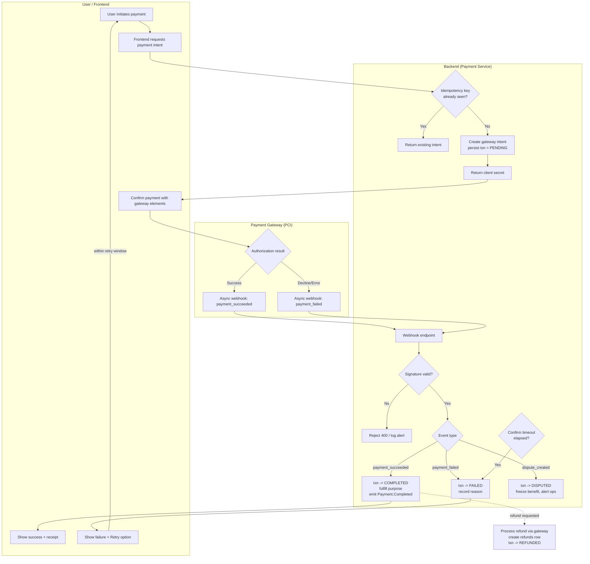

# Spec: Payment Domain

## Outcome
Provide a secure and reliable payment processing service for handling financial transactions on the ZooLink platform. Enable users to make payments for services (listing promotions, premium features, etc.) and receive payouts (for sales, breeding fees, etc.) while ensuring compliance with financial regulations, protecting sensitive financial data, and providing clear transaction records.

## Scope & Boundaries
**In Scope:**
- Payment processing for platform services (listing promotions, featured placements, premium subscriptions)
- Payout processing for users (sale proceeds, breeding fees, service payments)
- Integration with **RF-available** payment gateways (ЮKassa + СБП; alternatives Т-Касса/CloudPayments) via the `PaymentProvider` abstraction — see [ADR-0008](../04-decisions/0008-rf-provider-matrix.md). Stripe/PayPal are **not usable in RF**.
- Secure storage of payment metadata (transaction IDs, amounts, statuses) - NOT storing full card details
- Payment status tracking (pending, completed, failed, refunded, disputed)
- Refund processing for cancelled or failed transactions
- Payment receipts and invoices generation
- Webhook handling for payment gateway notifications (payment success, failure, dispute)
- Integration with Account/Billing system (to be implemented in future phases)
- Support for one-time payments and recurring payments (subscriptions)
- Localization of payment interface and receipts (English/Russian)
- PCI DSS scope minimized: card data handled entirely by the RF provider (ЮKassa) via hosted payment elements/tokenization; raw card data never touches our systems
- **54-ФЗ fiscalization:** issuing online fiscal receipts (чеки) via the provider's fiscalization capability (ЮKassa supports this)
- Audit trail for all payment-related actions

**Out of Scope:**
- Direct handling of raw credit card numbers or sensitive authentication data (delegated to PCI-compliant gateways)
- Cryptocurrency payments - deferred to phase 2
- Escrow services for high-value transactions - deferred to phase 2
- Complex subscription management (proration, plan changes) - deferred to phase 2
- Multi-currency support (initially RUB only) - deferred to phase 2
- Tax calculation and reporting - deferred to phase 2
- Integration with accounting software (QuickBooks, etc.) - deferred to phase 2
- In-platform wallet/store credit system - deferred to phase 2

## Constraints
- **Legal:** Must comply with Russian Federal Law 161-ФЗ "On the National Payment System", **54-ФЗ (ККТ / online fiscal receipts)**, and data protection law 152-ФЗ for any personal data associated with payments.
- **Security:** PCI DSS obligations are met on the **provider side** (ЮKassa); we never store, process, or transmit raw card data. We persist only tokenized payment metadata.
- **Performance:** Payment API call latency < 1s for initiating payment; actual processing time depends on gateway but should complete within reasonable time (<30s for most transactions).
- **Reliability:** System must handle payment gateway downtime gracefully (queueing, user notifications). Must ensure no financial loss due to system failures.
- **Usability:** Payment process must be simple and clear for users; error messages must be actionable.
- **Scalability:** System must support 1k+ payment transactions per day initially, scaling to 10k+.
- **Technology:** Must align with selected stack (NestJS, TypeScript, PostgreSQL, **Prisma** ORM per [ADR-0007](../04-decisions/0007-orm-strategy.md), Redis).
- **Data:** Payment metadata must be stored securely; sensitive data must be tokenized/gateway-only.
- **Financial Integrity:** All transactions must be reconciled; system must prevent double-charging or missing payments.

## Prior Decisions
- Payment service is implemented as a dedicated NestJS module.
- Uses RF-available payment gateways (**ЮKassa + СБП** default; alternatives Т-Касса/CloudPayments) via their APIs behind the `PaymentProvider` port — see [ADR-0008](../04-decisions/0008-rf-provider-matrix.md).
- No raw card data touches our servers; all payment information is handled directly by the gateway or via secure payment elements.
- We store only payment metadata: gateway transaction ID, amount, currency, status, user reference, purpose reference (listing ID, etc.), and timestamps.
- Payment intents are created via gateway API and confirmed client-side with user authentication.
- Webhooks from payment gateways are used to update transaction status asynchronously.
- Failed payments are retryable with clear user feedback.
- Refunds are processed via gateway API and recorded in our system.
- Payment metadata is linked to relevant entities (Listings, Users, etc.) via foreign keys.
- Payment service communicates with other domains via events or direct service calls (e.g., activating a promoted listing after successful payment).
- Payouts to users (for sales) will be handled separately and may involve manual processing initially.

## NFR Traceability
This specification addresses the following Non-Functional Requirements:
- **Performance (NFR-PERF)**: Payment API latency < 1s for 95% of requests under load test (20 RPS) (see docs/02-requirements/nfr/performance.md)
- **Security (NFR-SEC)**: Payment service achieves PCI DSS compliance via tokenization; sensitive data never touches our servers (see docs/02-requirements/nfr/security.md)
- **Availability (NFR-AVAIL)**: Payment service handles gateway downtime gracefully with queuing and user notifications (see docs/02-requirements/nfr/availability.md)

## Process Flow (BPMN-style)

Status transitions are formalized in [`statemachines/payment_state_machine.md`](statemachines/payment_state_machine.md). The end-to-end flow with actors and error branches:

### Key rules
- **Idempotency:** every create/confirm/webhook carries an idempotency key; replays must not double-charge or double-transition.
- **Async truth:** the gateway webhook (not the client redirect) is the source of truth for COMPLETED/FAILED/DISPUTED.
- **Timeout branch:** a PENDING transaction with no webhook within `PAYMENT_CONFIRM_TIMEOUT` auto-fails.
- **Retry:** a FAILED payment may be retried within `PAYMENT_RETRY_WINDOW`, creating a **new** transaction (same `purpose_id`).
- **Gating:** entire flow is behind `feature_toggles.payments` (off until post-MVP).

## Task Breakdown
1. **Backend (NestJS)**
   - [ ] Create `payment` module with NestJS CLI
   - [ ] Define PaymentTransaction model (Prisma) with fields: id, userId, gatewayTransactionId, amount_minor (BIGINT), currency, status (PENDING/COMPLETED/FAILED/REFUNDED/DISPUTED), purposeType (ListingPromotion/PremiumSubscription/etc.), purposeId, idempotencyKey, createdAt, updatedAt
   - [ ] Define Refund model (Prisma) for tracking refunds (id, paymentTransactionId, gatewayRefundId, amount_minor, reason, status, createdAt)
   - [ ] Implement PaymentController (create payment intent, confirm payment, get transaction status, process refund, webhook handler)
   - [ ] Implement PaymentService (business logic for payment creation, status checking, refund processing)
   - [ ] Create `PaymentProvider` gateway abstraction with RF adapters (ЮKassa/Т-Касса/CloudPayments)
   - [ ] Implement secure webhook endpoint for payment gateway notifications
   - [ ] Implement idempotency keys for payment requests to prevent double-charging
   - [ ] Set up logging for payment events (created, completed, failed, refunded)
   - [ ] Write unit and integration tests for payment flows (using gateway test modes)
   - [ ] Create OpenAPI (Swagger) docs for payment endpoints

2. **Frontend (React)**
   - [ ] Create payment UI components (secure payment form using gateway elements)
   - [ ] Implement payment flow: initiate payment -> confirm with gateway -> show result
   - [ ] Create payment history page for users
   - [ ] Implement refund initiation UI (where applicable)
   - [ ] Create invoice/receipt viewing and download functionality
   - [ ] Write unit and e2e tests for payment flows

3. **Infrastructure**
   - [ ] Configure environment variables for payment gateway API keys (test and live)
   - [ ] Set up logging for payment events and webhook deliveries
   - [ ] Add security headers and CORS configuration (with strict origins for webhooks)
   - [ ] Implement monitoring for payment success rates, failure reasons, and gateway latency
   - [ ] Confirm provider-side PCI DSS posture (ЮKassa) and configure 54-ФЗ fiscal receipt issuance

4. **Verification Criteria**
   - [ ] Unit tests achieve >90% coverage for payment module (backend)
   - [ ] Integration tests cover: payment intent creation, confirmation (success/failure), webhook handling, refund processing, idempotency
   - [ ] Manual testing: verify payment flows work in test mode with gateways, check webhooks, verify transaction records
   - [ ] Performance: payment API latency < 1s for 95% of requests under load test (20 RPS)
   - [ ] Security: verify that no raw card data is stored in logs, database, or responses
   - [ ] Reliability: verify graceful handling of gateway downtime (queueing, user notifications)
   - [ ] Documentation: OpenAPI spec generated and available at /api/docs
   - [ ] NFR Traceability: Verify that performance, security, and availability requirements are properly addressed and documented

---

## Related Documents

- [Glossary](glossary.md)
- [Pet Marketplace](03-pet-marketplace-domain.md)
- [Livestock Marketplace](04-livestock-marketplace-domain.md)
- [Notification Domain](13-notification-domain.md)
- 🌐 RU mirror: [docsRU/specs/14-payment-domain.md](../../docsRU/specs/14-payment-domain.md)
