# Spec: Reputation & Confirmed-Sale Primitive (FORM-first)

> **Doc-change triple (doc↔code protocol).**
> **WHAT:** Introduce the design contract for a two-sided **confirmed-sale** record and the
> **reputation/review** primitive that hangs off it — as a *specification only*, with DDL kept as
> **sketch inside this spec** (no `database_schema.sql` edit, no migration, no ERD change).
> **WHY:** AUDIT4 P3-1 (`⇊converged` across active-user / psychologist / growth) found the built
> marketplace is a **one-way contact-reveal that leaks the whole relationship to Telegram**: no
> confirmed-sale signal, no reputation. The platform therefore **captures none of the value it
> creates** — the single deepest strategic gap.
> **WHY-BETTER for the whole project:** it is the enabler for **both apex goals at once** — the
> **win-win** loop (demand gets a way to judge and trust a stranger before a live-animal deal; supply
> gets a portable reputation) and the **North-Star agent-run future** (agents can only moderate,
> price, insure or improve a transaction they can *see*). It is deliberately **FORM-first** so the
> irreversibly-lost confirmed-sale signal is captured now while reputation *behaviour* stays gated —
> the same cost-of-change discipline that reserved `user_roles` dormant (mig 0034) and `view_count`
> signal-first (mig 0031, D1).

---

## Outcome
Define, unambiguously, how ZooLink **records that a real deal happened** and how **two-sided,
proof-of-transaction reputation** is built on that record — so that (a) the transaction signal stops
leaking off-platform, (b) buyers can judge a stranger before a high-anxiety live-animal purchase, and
(c) the data exists for an AI operator to eventually run trust & safety. Reputation is a **trust
public-good, never a paid surface** (win-win); the two markets' reputations **never mix** (ADR-0002).

## Scope & Boundaries
**In scope (this spec — the contract):**
- The **`confirmed_sales`** record of truth: a two-sided-acknowledged sale, its state machine, and how
  it is *anchored* to the strongest existing signals — a **COMPLETED `ownership_transfers`** (ADR-0013,
  the strongest signal for animals) or a seller **`markSold` + buyer confirmation** on a listing.
- The **`reviews`** entity: append-only, one per (sale, direction), gated on proof-of-transaction.
- The **`reputation_aggregates`** derived rating cache: **per-subject × per-market**, recomputed
  (never hand-written).
- Sale-confirmation state machine (who confirms, mutual vs one-side, dispute, timeout).
- Decision tables / Gherkin for the core rules; error handling; NFR; anti-abuse hooks (fake reviews,
  review-bombing, Sybil) **routed to moderation**; ФЗ-152 treatment; the explicit **FORM-now vs
  behaviour-later** phase boundary; the trust-and-ethics guardrail.

**Out of scope (deferred, and why):**
- **In-app chat / inquiry** before the reveal (ADR-0005 keeps chat out of MVP) — reputation does not
  depend on it; noted as a sibling demand-loop gap (AUDIT4 WW-4 / P3-2).
- **Monetizing the reveal or the reputation** — owner-deferred soft-start; reputation must *never* be
  a paywalled surface (see Trust & Ethics).
- **Service / goods / expertise reviews** — the entity is designed as a **polymorphic subject** so the
  same primitive later serves the Offering seam (ADR-0014), but only animal-listing sales are in the
  first behaviour phase.
- **Physical DDL, migration, ERD, event-catalog edits** — deferred to a migration + ADR after the
  owner's forks below are answered (this doc is design-only; architect and backend-engineer edit those
  files in parallel).

## Constraints
- **Two markets never mix (ADR-0002):** a reputation aggregate is scoped by `market ('pet'|'livestock')`;
  a pet score and a livestock score are computed and displayed **separately** — no cross-market leak.
- **Proof-of-transaction (hard invariant):** a review MUST reference a **CONFIRMED** `confirmed_sales`
  row. No confirmed sale ⇒ no review. This is the primary anti-fake defence (psychologist TP-7).
- **Append-only + actor-snapshot discipline** (mirrors `consents`/`moderation_decisions`/`audit_log`):
  reviews and confirmed-sale state rows are **append-only**, each carries
  `actor_id` + `actor_principal_type ('HUMAN'|'AGENT')` (ADR-0006), and are protected by the reused
  `trg_block_modify_append_only` trigger.
- **ФЗ-152:** a review is simultaneously the **reviewer's personal data** (authorship) and **data about
  the subject** (a natural person being rated) — both are in scope; see the dedicated section.
- **Derived, never asserted:** `reputation_aggregates` is a recomputed cache of `reviews`; it is
  **never** hand-written and **never** purchasable (psychologist TP-8 — a paid "trust cue" is a dark
  pattern).
- **Technology / house rules:** SQL-canonical schema (ADR-0007), RFC7807 errors, `Idempotency-Key` on
  the unsafe POSTs, EN↔RU mirror, agent-as-principal from the first row.

## Prior Decisions this builds ON (do not duplicate)
- **`ownership_transfers`** (ADR-0013): a COMPLETED transfer is already **two-sided-consented** and
  atomically re-attributes the animal — it is the **strongest sale signal** and the natural
  auto-confirm source for `confirmed_sales`.
- **`contact_reveals`** (mig 0029, `UNIQUE(viewer,listing)`): the demand-intent signal; a reveal is the
  *lead*, a confirmed_sale is the *outcome* — reputation hangs off the outcome, not the lead.
- **listing `markSold`** (`listing.service.ts`) — seller-self-reported today; this spec adds the
  **buyer counter-confirmation** that turns it into proof.
- **moderation `decision_templates` / `moderation_reasons`** (mig 0022): dispute & abuse routing reuses
  moderation, it does not invent a parallel review-court.
- **`feature_toggles`** gating pattern (form-now/behaviour-later) and the **dormant `user_roles`**
  precedent (mig 0034) — the phase model for this whole spec.

---

## 1. Business Objective & Context

**[BUSINESS CONTEXT]** ZooLink's one asset is *the connection it creates*. Today it gives that
connection away for a one-time reveal-quota unit and retains nothing — the deal moves to Telegram,
invisible forever. Two apex consequences (AUDIT4 §4):

- **Win-win is tilted to sellers.** A buyer bears 100 % of scam risk on the highest-anxiety purchase in
  the catalogue (a *living creature*) with **nothing to judge a stranger by** — the single biggest
  reason a user still picks Avito (which at least shows profile age). An honest breeder cannot
  differentiate from a fraudster.
- **The North-Star cannot close.** An AI operator can only moderate, price, insure or improve a
  transaction it can *see*; a leaked, unconfirmed deal is invisible to any agent.

**Metric it moves:** on-platform **completion signal** (confirmed sales / reveals), **demand retention /
would-I-return** (active-user CRITICAL WW-3), and the **trust prior** that gates every future vertical
(`service_marketplace`, `premium_profiles` are only win-win *after* reviews exist — psychologist PERSP-4).

---

## 2. Glossary additions
> Proposed for `docs/specs/glossary.md` (doc-keeper to merge; identifiers verbatim EN/RU).

**Confirmed Sale** (`confirmed_sales`)
A record that a real deal closed between two identified parties, acknowledged by **both** sides (or
auto-acknowledged when anchored to a COMPLETED `ownership_transfers`). The proof-of-transaction root
that every review must reference.

**Sale Anchor**
The upstream event a confirmed sale is derived from: `TRANSFER` (a COMPLETED `ownership_transfers`,
strongest — animals) or `LISTING_MARK_SOLD` (seller `markSold` + buyer counter-confirmation).

**Review** (`reviews`)
An append-only, one-per-(sale,direction) rating + optional text authored by one party of a confirmed
sale about the other. Requires a CONFIRMED sale (proof-of-transaction).

**Review Direction**
`BUYER_ON_SELLER` or `SELLER_ON_BUYER` — reputation is **two-sided**; both parties can rate each other.

**Reputation Aggregate** (`reputation_aggregates`)
A **derived, recomputed** per-subject × per-market rating summary (count, mean, distribution). Never
hand-written, never purchasable.

**Double-blind release**
Neither party's review is visible until **both** have submitted **or** the review window closes —
reduces retaliation/reciprocity bias (recommended visibility policy; owner fork Q2).

**Unconfirmed / weak sale**
A `markSold` never counter-confirmed (EXPIRED confirmation). The *signal* is captured but it **does not
unlock reviews**.

---

## 3. Data Contract (proposed entities — DDL **SKETCH**, not canonical)

> ⚠️ **Sketch only.** These blocks illustrate shape for architect/backend; the authoritative DDL lands
> in `database_schema.sql` + a migration **after** the owner forks (§10) and an ADR (§11). Column
> choices marked *(fork)* depend on an owner answer. All entities are **append-only** and carry the
> actor-snapshot pair per ADR-0006.

### 3.1 `confirmed_sales` — record of truth (FORM-now candidate)
```sql
-- SKETCH — not canonical. Append-only sale record; the signal we currently lose irreversibly.
CREATE TABLE confirmed_sales (
    id                    UUID PRIMARY KEY DEFAULT uuid_generate_v4(),
    -- What was sold (polymorphic subject so the same primitive later serves services/goods)
    offering_type         VARCHAR(30) NOT NULL DEFAULT 'ANIMAL_LISTING'
                            CHECK (offering_type IN ('ANIMAL_LISTING')),   -- widened additively (ADR-0014 seam)
    listing_id            UUID REFERENCES listings(id) ON DELETE SET NULL, -- the offering instance
    animal_id             UUID REFERENCES animals(id)  ON DELETE SET NULL, -- when anchored to a transfer
    market                VARCHAR(9)  NOT NULL CHECK (market IN ('pet','livestock')), -- derived, ADR-0002 scope
    -- Parties (identified; org side reserved like ownership_transfers)
    seller_user_id        UUID REFERENCES users(id) ON DELETE SET NULL,
    buyer_user_id         UUID REFERENCES users(id) ON DELETE SET NULL,
    seller_organization_id UUID REFERENCES organizations(id) ON DELETE SET NULL,
    buyer_organization_id  UUID REFERENCES organizations(id) ON DELETE SET NULL,
    -- Anchor + lifecycle
    anchor_type           VARCHAR(20) NOT NULL CHECK (anchor_type IN ('TRANSFER','LISTING_MARK_SOLD')),
    ownership_transfer_id UUID REFERENCES ownership_transfers(id) ON DELETE SET NULL, -- when anchor=TRANSFER
    status                VARCHAR(24) NOT NULL DEFAULT 'PENDING_CONFIRMATION'
        CHECK (status IN ('PENDING_CONFIRMATION','CONFIRMED','DISPUTED','EXPIRED','CANCELLED')),
    seller_confirmed_at   TIMESTAMPTZ,   -- markSold time (or transfer initiate) — the asserting side
    buyer_confirmed_at    TIMESTAMPTZ,   -- counter-confirmation (or auto-set when anchor=TRANSFER)
    confirmed_at          TIMESTAMPTZ,   -- set once status→CONFIRMED (both acked)
    confirm_expires_at    TIMESTAMPTZ,   -- PENDING_CONFIRMATION timeout horizon (fork Q3)
    -- optional captured deal facts (blind for negotiable livestock, GAP-BA-001)
    amount_minor          BIGINT,        -- integer minor units, NULL when off-record/negotiable
    currency              VARCHAR(3) DEFAULT 'RUB',
    -- actor snapshot (ADR-0006)
    initiated_by_user_id  UUID REFERENCES users(id) ON DELETE SET NULL,
    initiated_by_principal_type VARCHAR(10) NOT NULL DEFAULT 'HUMAN' CHECK (initiated_by_principal_type IN ('HUMAN','AGENT')),
    created_at            TIMESTAMPTZ NOT NULL DEFAULT NOW(),
    -- one live confirmed-sale per anchored transfer (mirror of ownership_transfers INV-4 shape)
    CONSTRAINT uq_confirmed_sales_transfer UNIQUE (ownership_transfer_id)
);
CREATE INDEX idx_confirmed_sales_subject ON confirmed_sales (offering_type, listing_id);
CREATE INDEX idx_confirmed_sales_parties ON confirmed_sales (seller_user_id, buyer_user_id);
CREATE INDEX idx_confirmed_sales_confirm_scan
    ON confirmed_sales (confirm_expires_at) WHERE status = 'PENDING_CONFIRMATION';
```

### 3.2 `reviews` — append-only, proof-of-transaction-gated (behaviour behind toggle)
```sql
-- SKETCH — not canonical. One review per (sale, direction). Append-only (edits = new superseding row).
CREATE TABLE reviews (
    id                UUID PRIMARY KEY DEFAULT uuid_generate_v4(),
    confirmed_sale_id UUID NOT NULL REFERENCES confirmed_sales(id) ON DELETE CASCADE, -- proof-of-txn
    direction         VARCHAR(16) NOT NULL CHECK (direction IN ('BUYER_ON_SELLER','SELLER_ON_BUYER')),
    reviewer_user_id  UUID NOT NULL REFERENCES users(id) ON DELETE SET NULL,
    subject_user_id   UUID NOT NULL REFERENCES users(id) ON DELETE SET NULL,
    market            VARCHAR(9) NOT NULL CHECK (market IN ('pet','livestock')), -- copied from the sale (ADR-0002)
    rating            SMALLINT NOT NULL CHECK (rating BETWEEN 1 AND 5),
    body              TEXT,               -- optional free text; moderated like listing content
    moderation_status VARCHAR(20) NOT NULL DEFAULT 'PENDING'
        CHECK (moderation_status IN ('PENDING','APPROVED','REJECTED','CHANGES_REQUESTED')),
    is_visible        BOOLEAN NOT NULL DEFAULT FALSE, -- double-blind gate (fork Q2); flips on release
    superseded_by_id  UUID REFERENCES reviews(id) ON DELETE SET NULL, -- edit-within-grace = new row (fork Q3)
    -- actor snapshot (ADR-0006 — an AGENT reviewer is a future/gated case)
    actor_principal_type VARCHAR(10) NOT NULL DEFAULT 'HUMAN' CHECK (actor_principal_type IN ('HUMAN','AGENT')),
    created_at        TIMESTAMPTZ NOT NULL DEFAULT NOW(),
    -- one CURRENT review per (sale, direction); an edit supersedes rather than mutates
    CONSTRAINT uq_reviews_sale_direction UNIQUE (confirmed_sale_id, direction, superseded_by_id)
);
CREATE INDEX idx_reviews_subject_market ON reviews (subject_user_id, market)
    WHERE moderation_status = 'APPROVED' AND is_visible = TRUE AND superseded_by_id IS NULL;
```

### 3.3 `reputation_aggregates` — derived cache (behaviour behind toggle)
```sql
-- SKETCH — not canonical. Recomputed from visible+approved reviews; never hand-written.
CREATE TABLE reputation_aggregates (
    subject_user_id  UUID NOT NULL REFERENCES users(id) ON DELETE CASCADE,
    market           VARCHAR(9) NOT NULL CHECK (market IN ('pet','livestock')), -- per-market, ADR-0002
    review_count     INTEGER NOT NULL DEFAULT 0 CHECK (review_count >= 0),
    rating_sum       INTEGER NOT NULL DEFAULT 0 CHECK (rating_sum >= 0),
    rating_avg       NUMERIC(3,2),          -- derived = rating_sum / NULLIF(review_count,0)
    dist_1..dist_5   INTEGER NOT NULL DEFAULT 0, -- star histogram (illustrative)
    recomputed_at    TIMESTAMPTZ NOT NULL DEFAULT NOW(),
    PRIMARY KEY (subject_user_id, market)      -- one row per subject per market
);
```

### 3.4 Endpoint contract (behaviour behind toggle; shape reserved now)
| Method / Path | Purpose | Auth / role | Idempotency | Notes |
|---|---|---|---|---|
| `POST /v1/listings/{id}/mark-sold` | seller asserts sale + nominates buyer (creates `confirmed_sales` PENDING) | seller, owns listing | `Idempotency-Key` | extends existing markSold; anchor=`LISTING_MARK_SOLD` |
| `POST /v1/confirmed-sales/{id}/confirm` | buyer counter-confirms → CONFIRMED | nominated buyer only | `Idempotency-Key` | no-op/auto when anchor=`TRANSFER` |
| `POST /v1/confirmed-sales/{id}/dispute` | either party disputes → DISPUTED → moderation | party of the sale | `Idempotency-Key` | routes to moderation queue |
| `POST /v1/confirmed-sales/{id}/reviews` | author a review (rating+text) | party of a CONFIRMED sale | `Idempotency-Key`, `ETag` on edit | one per direction; edit-within-grace supersedes |
| `GET /v1/users/{id}/reputation?market=pet` | read a subject's derived aggregate | public read | — | `ETag`/`Cache-Control`; per-market only |
| `GET /v1/users/{id}/reviews?market=pet` | list visible+approved reviews | public read | — | paginated `{items,meta}`; double-blind respected |

---

## 4. State Machine — sale confirmation flow

**Entity:** a `confirmed_sales` row. **Triggers/guards** below. Terminal states: `CONFIRMED`,
`EXPIRED`, `CANCELLED` (and `DISPUTED` → resolves back to CONFIRMED or CANCELLED via moderation).

```mermaid
stateDiagram-v2
    [*] --> PENDING_CONFIRMATION: seller markSold + nominate buyer  (anchor=LISTING_MARK_SOLD)
    [*] --> CONFIRMED: ownership_transfers COMPLETED  (anchor=TRANSFER — already two-sided)
    PENDING_CONFIRMATION --> CONFIRMED: buyer counter-confirms (now <= confirm_expires_at)
    PENDING_CONFIRMATION --> DISPUTED: either party disputes ("this deal did not happen")
    PENDING_CONFIRMATION --> EXPIRED: now > confirm_expires_at (no counter-confirm) → weak/unconfirmed
    PENDING_CONFIRMATION --> CANCELLED: seller retracts before confirmation
    DISPUTED --> CONFIRMED: moderation upholds the sale
    DISPUTED --> CANCELLED: moderation voids the sale
    CONFIRMED --> [*]: review window opens (see review lifecycle)
    EXPIRED --> [*]: signal captured; NO reviews
    CANCELLED --> [*]: terminal (a new sale record may be created)
```



**Transition guards (normative):**
| From → To | Trigger | Guard (all must hold) |
|---|---|---|
| ∅ → CONFIRMED | `OwnershipTransfer.Completed` | anchor=`TRANSFER`; both parties are the transfer's from/to; auto-confirm (transfer already two-sided per ADR-0013) |
| ∅ → PENDING_CONFIRMATION | seller `markSold` | caller owns the listing; a buyer is nominated; listing was `ACTIVE`; no existing live sale for this listing |
| PENDING → CONFIRMED | buyer confirm | caller = nominated buyer; `now <= confirm_expires_at`; status still PENDING |
| PENDING → DISPUTED | dispute | caller is a party; status PENDING; reason supplied → moderation reason code |
| PENDING → EXPIRED | scheduler tick | `now > confirm_expires_at` (idempotent-emission marker, mirrors transfer-expiry sweeper H3) |
| PENDING → CANCELLED | seller retract | caller = seller; status PENDING |
| DISPUTED → CONFIRMED/CANCELLED | moderation decision | actor has moderation ability; decision recorded in `moderation_decisions` (actor-snapshot) |

**Review lifecycle (per direction, opens on CONFIRMED):**
`ELIGIBLE (window open) → SUBMITTED (pending moderation) → APPROVED+released (double-blind) →`
editable within grace (edit = new superseding row) → **immutable** after grace / window close.

---

## 5. Business Logic & Rules (decision tables / Gherkin)

### 5.1 Review eligibility — decision table
| Sale status | Caller is party? | Direction already reviewed (current)? | Within review window? | Result |
|---|---|---|---|---|
| CONFIRMED | yes | no | yes | **ALLOW** create review |
| CONFIRMED | yes | yes (current, in edit grace) | yes | **ALLOW** edit (supersede) |
| CONFIRMED | yes | yes (grace elapsed) | yes | **REJECT** `REVIEW_IMMUTABLE` |
| CONFIRMED | yes | no | no (window closed) | **REJECT** `REVIEW_WINDOW_CLOSED` |
| PENDING/EXPIRED/CANCELLED | any | — | — | **REJECT** `SALE_NOT_CONFIRMED` (proof-of-txn) |
| any | no | — | — | **REJECT (404-no-leak)** `NOT_A_PARTY` |

### 5.2 Sale confirmation — Gherkin
```gherkin
Feature: Two-sided confirmed sale

  Scenario: Auto-confirm from a completed animal transfer (strongest signal)
    Given an ownership_transfers row reaches COMPLETED for animal A between seller S and buyer B
    When the OwnershipTransfer.Completed event is handled
    Then a confirmed_sales row is created with anchor_type = 'TRANSFER'
    And status = 'CONFIRMED' with confirmed_at set
    And no separate buyer counter-confirmation is required
    And the review window opens for both BUYER_ON_SELLER and SELLER_ON_BUYER

  Scenario: Listing mark-sold requires buyer counter-confirmation
    Given seller S marks listing L SOLD and nominates buyer B
    Then a confirmed_sales row is created with status 'PENDING_CONFIRMATION'
    And confirm_expires_at is set to now + <confirm_window> days
    When buyer B confirms before confirm_expires_at
    Then status becomes 'CONFIRMED' and the review window opens
    When buyer B never confirms and now > confirm_expires_at
    Then a scheduler tick sets status 'EXPIRED'
    And the sale signal is captured but NO review may be created

  Scenario: Proof-of-transaction blocks a fake review
    Given a user U who is not a party to any confirmed sale with subject X
    When U attempts to POST a review about X
    Then the request is REJECTED with SALE_NOT_CONFIRMED (or NOT_A_PARTY, 404-no-leak)
    And no reputation_aggregate for X changes
```

### 5.3 Double-blind release (recommended — fork Q2)
```gherkin
  Scenario: Neither review is visible until both submitted or window closes
    Given a CONFIRMED sale between S and B
    When B submits a review of S
    Then B's review is stored is_visible = FALSE (awaiting counterpart or window close)
    When S submits a review of B (or the review window closes)
    Then both APPROVED reviews flip is_visible = TRUE together
    And each aggregate is recomputed once its review becomes visible+approved
```

### 5.4 Aggregate recompute (derived, never asserted)
```gherkin
  Scenario: Aggregate is a pure function of visible approved reviews, per market
    Given subject X has N visible+approved reviews in market 'pet'
    When any of those reviews changes visibility/moderation state
    Then reputation_aggregates(X,'pet') is recomputed: count, sum, avg, histogram
    And a 'livestock' review of X never affects the 'pet' aggregate (ADR-0002)
    And no code path writes rating_avg directly
```

---

## 6. Error Handling & Edge Cases
| Scenario | System response | Code (RFC7807 `code`) | HTTP | User-facing intent |
|---|---|---|---|---|
| Review on non-confirmed sale | reject | `SALE_NOT_CONFIRMED` | 409 | "You can review only after the sale is confirmed." |
| Reviewer not a party | reject, no existence leak | `NOT_A_PARTY` | 404 | generic not-found |
| Duplicate current review (same direction) | reject | `REVIEW_ALREADY_EXISTS` | 409 | "You already reviewed this deal." |
| Edit after grace | reject | `REVIEW_IMMUTABLE` | 409 | "This review can no longer be edited." |
| Review window closed | reject | `REVIEW_WINDOW_CLOSED` | 409 | "The review period has ended." |
| Buyer confirm after expiry | reject | `CONFIRMATION_EXPIRED` | 409 | "This sale confirmation has expired." |
| Confirm by non-nominated user | reject, 404-no-leak | `NOT_A_PARTY` | 404 | generic not-found |
| markSold with no reachable buyer / self as buyer | reject | `INVALID_COUNTERPARTY` | 422 | "Select a valid buyer." |
| Rating out of 1..5 | validation reject | `VALIDATION_ERROR` | 422 | field error |
| Dispute on already-terminal sale | reject | `SALE_NOT_DISPUTABLE` | 409 | "This sale can no longer be disputed." |
| Reveal-side reputation read across markets (`?market` omitted) | require explicit market | `MARKET_REQUIRED` | 422 | force per-market read (ADR-0002) |
| Toggle off (behaviour phase not live) | endpoints 404/`FEATURE_DISABLED` | `FEATURE_DISABLED` | 404 | feature not available |

---

## 7. Non-Functional Requirements
- **Performance:** `GET /users/{id}/reputation` is a single indexed read of `reputation_aggregates`
  (< 50 ms p95); it never aggregates `reviews` live. Recompute is incremental on the event path, not on
  the read.
- **Reliability:** confirmation-expiry and double-blind-window-close run on the **existing
  scheduler/sweeper pattern** (transfer-expiry sweeper, H3; SLA-tick advisory lock) — never lazy-on-read
  (avoids the F4 residual defect). Idempotent emission markers (`confirmed_at`/`confirm_expires_at`
  mirror `escalated_at`).
- **Consistency / concurrency:** confirmed-sale creation from a transfer is written **in the same tx**
  as the transfer completion (transactional-outbox), so the signal is never lost. `UNIQUE
  (ownership_transfer_id)` prevents a duplicate sale per transfer (mirror of transfer INV-4).
- **Auditability:** every state change and every review carries `actor_id` + `actor_principal_type`;
  dispute resolutions are `moderation_decisions` rows (append-only, human-override) — an AI operator
  path is auditable from day one (North-Star).
- **Security / authz:** object-level authorization on every mutation (`assertCan... OrNotFound` parity,
  the codebase's #1 risk class); confirm/dispute/review restricted to a party of the sale.
- **Scalability:** aggregate is a bounded per-(user,market) row; histogram + sum make recompute O(Δ),
  not O(all reviews).
- **i18n / EN↔RU:** all `code`s and user-facing copy mirrored; review body localisation is the author's
  own language (not translated).

---

## 8. Anti-abuse (routed to moderation, not a parallel court)
| Threat | Primary defence (structural) | Escalation hook |
|---|---|---|
| **Fake reviews** (no real deal) | **Proof-of-transaction** — review requires a CONFIRMED sale; `UNIQUE(ownership_transfer_id)` + nominated-buyer confirmation | n/a — blocked at the gate |
| **Review-bombing** (many negatives fast) | anomaly signal: rate/velocity per subject; body still passes content moderation (`moderation_status`) | emit an **abuse/anomaly event** (P3-6 family) → moderation queue + data-analyst |
| **Sybil** (many accounts → many fake sales/reviews) | reviews need a *confirmed* counterparty; couple weight to **verification tier** (ADR-0016) as a fork; per-user create quota (reuse listing-quota H2-B) | Sybil-cluster signal → moderation |
| **Retaliation / reciprocity bias** | **double-blind release** (fork Q2) | pattern flag → moderation |
| **Coerced / incentivised reviews** | ToS prohibition; no reward mechanic tied to leaving a review (Trust & Ethics) | report → moderation reason code |
| **Extortion** ("give me X or 1-star") | dispute path + report; body moderated | moderation reason code + audit |

New moderation **reason codes** and **decision_templates** (mig 0022 shape) are proposed for review
disputes/removals — added by moderation spec owners, not invented here.

---

## 9. ФЗ-152 (personal data) considerations
- **Dual data subject.** A review is the **reviewer's** PII (authorship, opinion) *and* **the subject's**
  personal data (a natural person being rated). Both are in scope. Legal basis for publishing the
  subject's rating and the reviewer's authored text must be established (consent at review-submit and/or
  legitimate-interest of a trust system — **route to legal**).
- **Consent-of-record.** Reuse the `consents` model (mig 0029): a `REVIEW_PUBLICATION` consent type is a
  candidate reserved row (append-only, versioned, actor-snapshot) — do not invent a second consent store.
- **Erasure (`erased_at`).** On `eraseUser`, the reviewer's authorship must be **pseudonymised** (author
  → "Deleted user") while the rating **may** persist to keep aggregates truthful — the exact policy is an
  owner+legal fork; the FK `ON DELETE SET NULL` already supports pseudonymisation.
- **Data minimisation.** `amount_minor` is optional/off-record; reputation reads expose only aggregate +
  visible reviews, never party identities beyond display name.
- **Right to object / correction.** A subject may dispute a review (→ moderation), aligning with ст.9
  and the AI-decision transparency posture (ADR-0011) if an agent ever moderates reviews.

---

## 10. FORM-now vs behaviour-later (cost-of-change boundary)

**Principle (doc-code-protocol §Phase boundaries):** pull the *form* forward when deferral forces a
rewrite **or** the signal is irreversibly lost; keep *behaviour* behind a real toggle. Precedents:
dormant `user_roles` (mig 0034), signal-first `view_count` (mig 0031, D1 reserved-first).

**FORM-now shortlist (ship dormant soonest — recommended order):**
1. **✅ SHIPPED-form (2026-07-10, migration 0039 / ADR-0038).** **`confirmed_sales` written passively at
   transfer completion** (anchor=`TRANSFER`, auto-CONFIRMED, in the same tx as the transfer accept).
   **This is the highest-value dormant seam** — the confirmed-sale *signal we lose irreversibly today*
   (same reserved-first logic as `view_count` D1). Reviews stay off; the *record of truth* accrues now.
   > **Implementation note (backend-engineer, 2026-07-10).** There is **no `OwnershipTransfer.Completed`
   > event** in the built system — the completion transition (`PENDING → COMPLETED`) lives in
   > `TransferService.accept()` and emits `OwnershipTransfer.Accepted`. The passive capture hooks that
   > accept transaction: the `confirmed_sales` INSERT + a `ConfirmedSale.Confirmed` outbox event are
   > written **in the same tx** as the completion, so the signal is atomic with the deal (a failed INSERT
   > rolls the whole accept back — the transfer never completes without the truth row). The transfer path
   > emits **only `ConfirmedSale.Confirmed`** (the row is born CONFIRMED with no PENDING phase per §4
   > `[*] --> CONFIRMED`), **not `ConfirmedSale.Created`** (which is reserved for the deferred markSold
   > PENDING path). Exactly-once under redelivery/parallel-accept = the accept status-guard (single-winner)
   > + `UNIQUE(ownership_transfer_id)` backstop. Derived `market` reuses the sanctioned intra-aggregate
   > value (ADR-0018; no new join). See event-catalog.md `ConfirmedSale.*` note.
   >
   > **Doc-change triple.** **ЧТО:** marked FORM-item 1 as SHIPPED-form and pinned the built emission
   > semantics (accept-tx hook, `Confirmed`-only, exactly-once). **ПОЧЕМУ:** the ADR/spec referenced a
   > non-existent `OwnershipTransfer.Completed` event and left the Created-vs-Confirmed choice open — a
   > reader/agent could not tell what is actually emitted. **ПОЧЕМУ ЛУЧШЕ для проекта:** the catalog/spec
   > now match the code exactly (no doc↔code inversion), the semantically-honest event (no phantom PENDING
   > phase) keeps the future review-window/analytics consumers correct, and the in-tx atomicity documents
   > the "signal never lost" guarantee the whole reputation loop depends on.
2. **`confirmed_sales` table + `reviews` + `reputation_aggregates`** created dormant, with the
   append-only trigger reused. No read/write endpoints wired for reviews.
3. **`feature_toggles`** rows seeded off/0 %: `reputation_reviews` (review authoring/read),
   `sale_buyer_confirmation` (the listing-markSold counter-confirm path). Same shape as
   `ownership_transfer_verification`.
4. **markSold buyer-nomination column** on the sale record reserved now so the listing path does not
   need a schema change when confirmation behaviour flips on.
5. **Polymorphic `offering_type`** on `confirmed_sales`/`reviews` (widen-additively CHECK) so the same
   primitive later serves services/goods (ADR-0014 seam) without a rewrite.

**Behaviour-later (gated, deferred — and why):**
- Review authoring/reading, double-blind release, aggregate display → behind `reputation_reviews`
  (needs the owner's visibility + window forks and a legal pass first).
- Buyer counter-confirmation UI/flow for listing-markSold → behind `sale_buyer_confirmation`.
- AI-agent-authored or AI-moderated reviews → behind agent scoped-ability (P1-6 ADR).
- Service/goods reputation → behind the respective offering toggles.
- Any monetisation of/around reputation → **never** (Trust & Ethics) unless owner overrides.

---

## 11. Trust & Ethics guardrail (psychologist lens — AUDIT4/psychologist.md)
Reviews around **living animals** are emotionally loaded; the primitive must be symmetric and free of
dark patterns.
- **No coerced or incentivised reviews.** No reward, discount, or unlock is ever tied to leaving a
  review (would corrupt the signal and pressure the user). ToS-level prohibition + report path.
- **Reputation is a public good, never purchasable.** A "trust cue" a buyer reads as credibility must be
  **derived/earned**, never bought (psychologist TP-8; guards the `premium_profiles` boundary). Do not
  let any paid toggle inject a fake trust badge.
- **Double-blind by default** to prevent retaliation/reciprocity manipulation (TP-7 spirit).
- **No manufactured urgency.** Aggregates and counts are informational; never render "N people reviewing
  now" style FOMO (sibling to the `view_count` F9 guard).
- **Emotional safety in disputes.** A disputed sale (a deal that hurt someone) routes to a *human-first*
  moderation path with warm copy; if an agent ever adjudicates, the ст.16 ФЗ-152 transparency +
  right-to-object surface applies (ADR-0011).
- **Symmetric exit.** A subject can always dispute/contest; erasure pseudonymises authorship. Trust must
  be as contestable as it is earnable.

---

## 12. ADR-needed list (deferred to architect — do NOT decide here)
1. **`confirmed_sales`: new aggregate vs derived view** over `ownership_transfers` + listing markSold
   (schema-shaping — is the sale its own entity or a projection?).
2. **Reputation aggregate storage/recompute strategy** — materialised table (this sketch) vs on-read vs
   event-sourced projection; scale & consistency choice.
3. **Cross-market reputation model** — one identity carrying per-market scores vs fully separate
   reputations (ADR-0002 boundary; affects `reputation_aggregates` PK and display).
4. **Verification-tier coupling** — does an ADR-0016 verified identity weight/gate reputation
   (Sybil-resistance) or stay orthogonal?
5. **Dispute → moderation integration** — new reason codes + `decision_templates`, and whether a review
   dispute is a first-class moderation `content_report` subtype.
6. **Agent-as-reviewer / agent-as-review-moderator** (ADR-0006) — scoped-ability for an AI operator to
   author or adjudicate reviews (ties to P1-6 scoped-ability ADR).
7. **Reputation over the Offering seam** (ADR-0014) — the polymorphic `offering_type` widening path for
   services/goods reputation.
8. **Erasure policy for reviews** — pseudonymise-author-keep-rating vs full removal (with legal).
9. **Event-catalog additions** — `ConfirmedSale.{Created,Confirmed,Disputed,Expired}` and
   `Review.{Submitted,Released}` (backend-engineer owns event-catalog; listed for coordination, not
   edited here).

---

## 13. Open Questions / Assumptions — RESOLVED by the owner (2026-07-09)
> Per the operating model I do **not** stop and wait; each carries my recommendation so the owner can
> confirm or redirect.
>
> **Owner decision (2026-07-09, section-by-section review): all 8 forks CONFIRMED exactly as
> recommended.** The *Recommendation* lines below are therefore **normative business decisions** for the
> reputation slices (fork 1 hybrid confirmation · 2 double-blind · 3 90-day/72-hour · 4 CONFIRMED-only ·
> 5 stars+text with facet columns form-now · 6 per-market display · 7 reputation never monetised ·
> 8 pseudonymise-keep-rating). Fork 8 stays subject to the legal confirmation noted in §9 before the
> behaviour toggle flips.

1. **One-sided vs mutual confirmation of a sale?**
   *Recommendation:* **Hybrid** — **auto-confirm** when anchored to a COMPLETED `ownership_transfers`
   (already two-sided per ADR-0013, zero friction for animals); **require buyer counter-confirmation**
   for the listing-`markSold` path (proof for livestock/goods/no-transfer cases). Best signal quality
   with least friction.

2. **Review visibility: double-blind vs immediate?**
   *Recommendation:* **Double-blind release** (both revealed when both submit or the window closes) —
   materially reduces retaliation/reciprocity bias on emotional live-animal deals (psychologist).

3. **Review window + edit grace?**
   *Recommendation:* **90-day** window to submit after CONFIRMED; **72-hour** edit grace (edit =
   superseding row), then immutable. Long enough to reflect, short enough to stay relevant.

4. **May an unconfirmed/EXPIRED sale ever be reviewed?**
   *Recommendation:* **No.** Capture the weak signal for analytics, but only a CONFIRMED sale unlocks
   reviews — this is the anti-fake keystone.

5. **Review shape: 1–5 stars + free text, or structured facets?**
   *Recommendation:* **MVP = 1–5 + optional text**; reserve *optional* facet columns (description
   accuracy, communication, animal-as-described) as form-now for a later phase — do not build facet UI
   yet.

6. **Single identity reputation vs per-market display?**
   *Recommendation:* **Per-market** aggregates and display (respects ADR-0002 mental separation), over a
   **single underlying identity** — a pet buyer never sees a livestock score bleed in.

7. **Is reputation ever monetised (e.g. "verified/premium" trust badge for pay)?**
   *Recommendation:* **Never gate reputation behind pay** — reputation is a trust public-good; a paid
   trust cue is a dark pattern (psychologist TP-8). Monetise seller *tooling/volume*, not trust.

8. **On `eraseUser`, keep the rating or remove the review?**
   *Recommendation:* **Pseudonymise authorship, keep the rating** in the aggregate (truthful history),
   subject to a legal confirmation — the FK `ON DELETE SET NULL` already supports it.

---

*Design-only. No `database_schema.sql`, migration, ERD, event-catalog, ADR, or code changed by this
spec. DDL blocks are sketches; structural decisions are routed to architect (§12); business forks to the
owner (§13). EN canon; RU mirror at `docsRU/specs/18-reputation.md`.*
