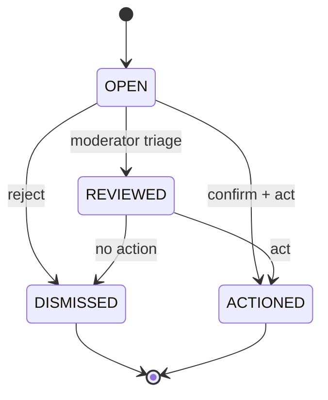

# State Machine: Content Report

Lifecycle of a `content_reports` row (user-submitted report about a listing/animal/user/message). Status values
match the `content_reports.status` CHECK in `database_schema.sql`.

## States
- **OPEN** — created by a reporter; awaiting moderator triage. (initial)
- **REVIEWED** — a moderator has examined it; intermediate (optional) state before a terminal decision.
- **DISMISSED** — no violation found; closed with no action. (terminal)
- **ACTIONED** — violation confirmed; moderation action taken on the target. (terminal)

## Transitions
| From | To | Trigger | Guard / Actor |
|---|---|---|---|
| (none) | OPEN | reporter submits report | authenticated user; not reporting own already-resolved duplicate |
| OPEN | REVIEWED | moderator opens/triages | actor = MODERATOR/ADMIN |
| OPEN | DISMISSED | moderator rejects report | actor = MODERATOR/ADMIN; sets `resolved_by` |
| OPEN | ACTIONED | moderator confirms + acts on target | actor = MODERATOR/ADMIN; sets `resolved_by`; entity action is a separate 4a step (see Rules) |
| REVIEWED | DISMISSED | moderator decides no action | actor = MODERATOR/ADMIN; sets `resolved_by` |
| REVIEWED | ACTIONED | moderator decides action | actor = MODERATOR/ADMIN; sets `resolved_by`; entity action is a separate 4a step (see Rules) |

## Rules
- Terminal states (DISMISSED, ACTIONED) are immutable; reopening requires a new report.
- `resolved_by` (FK users) is set on any terminal transition; `updated_at` bumped. The resolve writes an
  `audit_log` row in the same transaction (actor `{actorId, principalType}` snapshot, agent-ready).
- **ACTIONED records the report status only (MVP-loose, round-N).** `resolve(ACTIONED)` marks the report
  ACTIONED; the moderator **typically also** records a moderation decision on the target entity (deactivate a
  listing, etc.) as a **separate 4a moderation step** (which requires its own claim/lock). The two are NOT a
  single coupled transaction — a `moderation_decisions` row is **not** a precondition of ACTIONED.
- A reporter may not transition their own report; only MODERATOR/ADMIN (see `specs/security/rbac-matrix.md`).

> **(round-N, normative — DRIFT-3 reconciliation) WHAT:** the ACTIONED coupling changed from "ACTIONED **must**
> be accompanied by a `moderation_decisions` row on the target entity" to MVP-loose — `resolve(ACTIONED)` records
> the report status only; the entity action is a separate 4a moderator step (the transition-table "emits moderation
> decision" cells were softened to match).
> **WHY:** the 4a moderation flow requires a **claim/lock** on the target entity (M-2..M-5); coupling report-resolve
> to also emit a moderation decision would force the report-resolve path to acquire that lock and run the full
> decision transaction inside report resolution — entangling two independently-authorized flows (resolve = MOD/ADMIN
> on the report; decide = lock-holder on the entity). The contract `resolveContentReport` deliberately carries no
> entity-action fields.
> **WHY-BETTER-for-the-whole-project:** keeps the two append-only trails (`content_reports`, `moderation_decisions`)
> independently atomic and independently authorized; lets a moderator dismiss/triage a report without touching the
> entity; the entity action, when taken, still goes through the audited 4a path (no lost audit). Tight coupling is
> deferred (a future "resolve-and-act" convenience could compose the two behind one call, behind a lock) — not a
> requirement now. Reconciles the SM with `12-moderation-domain.md` Slice-4b scope.

## Related
- [Moderation Domain](../12-moderation-domain.md) · `database_schema.sql` (`content_reports`)
- 🌐 RU mirror: [docsRU/specs/statemachines/content_report_state_machine.md](../../../docsRU/specs/statemachines/content_report_state_machine.md)
