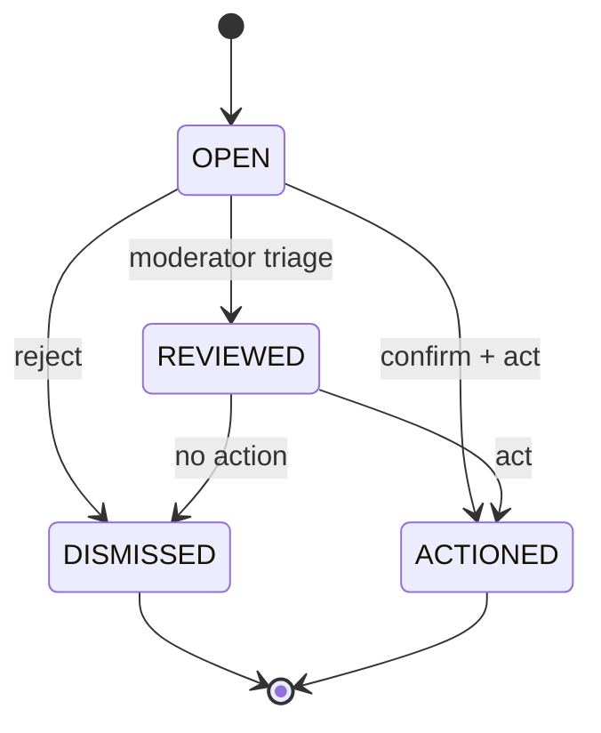

# State Machine: Content Report

Lifecycle of a `content_reports` row (user-submitted report about a listing/animal/user/message). Status values
match the `content_reports.status` CHECK in `database_schema.sql`.

## States
- **OPEN** — created by a reporter; awaiting moderator triage. (initial)
- **REVIEWED** — a moderator has examined it; intermediate (optional) state before a terminal decision.
- **DISMISSED** — no violation found; closed with no action. (terminal)
- **ACTIONED** — violation confirmed; moderation action taken on the target. (terminal)

## Transitions
| From | To | Trigger | Guard / Actor |
|---|---|---|---|
| (none) | OPEN | reporter submits report | authenticated user; not reporting own already-resolved duplicate |
| OPEN | REVIEWED | moderator opens/triages | actor = MODERATOR/ADMIN |
| OPEN | DISMISSED | moderator rejects report | actor = MODERATOR/ADMIN; sets `resolved_by` |
| OPEN | ACTIONED | moderator confirms + acts on target | actor = MODERATOR/ADMIN; emits moderation decision; sets `resolved_by` |
| REVIEWED | DISMISSED | moderator decides no action | actor = MODERATOR/ADMIN; sets `resolved_by` |
| REVIEWED | ACTIONED | moderator decides action | actor = MODERATOR/ADMIN; emits moderation decision; sets `resolved_by` |

## Rules
- Terminal states (DISMISSED, ACTIONED) are immutable; reopening requires a new report.
- `resolved_by` (FK users) is set on any terminal transition; `updated_at` bumped.
- ACTIONED must be accompanied by a `moderation_decisions` row (append-only audit) on the target entity.
- A reporter may not transition their own report; only MODERATOR/ADMIN (see `specs/security/rbac-matrix.md`).

## Related
- [Moderation Domain](../12-moderation-domain.md) · `database_schema.sql` (`content_reports`)
- 🌐 RU mirror: [docsRU/specs/statemachines/content_report_state_machine.md](../../../docsRU/specs/statemachines/content_report_state_machine.md)
