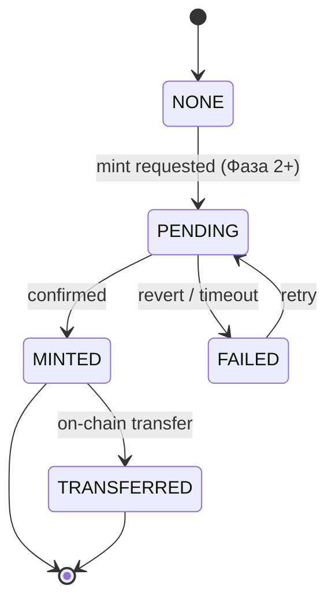

# State Machine: Digital Asset (NFT) — Фаза 2+

Lifecycle of a `digital_assets` row (tokenized pedigree/certificate/ownership). **MVP: schema hook only**, all rows
stay in `NONE`; minting/transfer is implemented in Фаза 2+ ([ADR-0010](../../04-decisions/0010-nft-digital-assets-hooks.md)),
gated by `feature_toggles('digital_assets')`. Status values match the `digital_assets.mint_status` CHECK.

## States
- **NONE** — row exists (or asset eligible) but no on-chain action requested. (initial; the only state in MVP)
- **PENDING** — mint/transfer submitted to chain; awaiting confirmation (indexer/listener watches the tx).
- **MINTED** — token confirmed on-chain (TON/Polygon); `token_id`, `tx_hash`, `ipfs_cid` populated. (stable)
- **TRANSFERRED** — token ownership changed on-chain (follows an animal ownership transfer). (stable)
- **FAILED** — chain tx failed/reverted or confirmation timed out. (terminal-retryable)

## Transitions
| From | To | Trigger | Guard |
|---|---|---|---|
| NONE | PENDING | mint requested (Фаза 2+) | toggle on; actor owns animal or is ADMIN; no live token for (animal, asset_type) |
| PENDING | MINTED | indexer confirms mint at required depth | webhook/poll signature verified |
| PENDING | FAILED | tx reverted / confirm timeout | — |
| MINTED | TRANSFERRED | on-chain transfer confirmed | tied to settled `ownership_transfers` |
| FAILED | PENDING | retry mint | new tx; idempotency preserved |

## Rules
- **MVP:** no transitions occur; rows remain `NONE`. Do not implement minting in Фаза 1.
- PostgreSQL is the source of truth; on-chain state is mirrored only after confirmation depth (never trust an
  unconfirmed tx). Chain→app sync goes through the outbox/inbox (`outbox_events`).
- On-chain metadata carries only public verifiable facts (origin, titles) — **never** owner PII (ФЗ-152).
- Unique partial index `uq_digital_asset_per_type` forbids two live tokens per (animal, asset_type).

## Related
- [ADR-0010](../../04-decisions/0010-nft-digital-assets-hooks.md) · [Ownership Transfer SM](ownership_transfer_state_machine.md) · `database_schema.sql` (`digital_assets`)
- 🌐 RU mirror: [docsRU/specs/statemachines/digital_asset_state_machine.md](../../../docsRU/specs/statemachines/digital_asset_state_machine.md)
