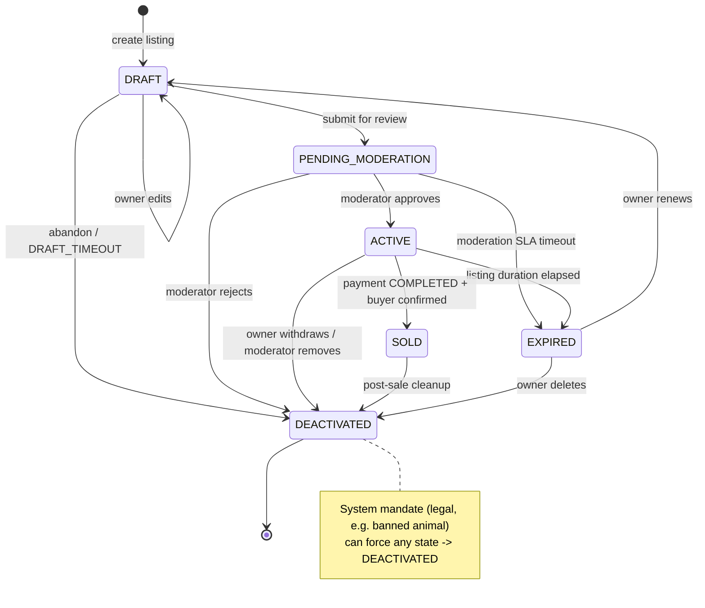

# Listing State Machine Specification

## Overview
Defines the lifecycle states and transitions for a listing (animal for sale/adoption) in the ZooLink system.

## State Diagram

## States

| State | Description | Entry Actions | Exit Actions |
|-------|-------------|---------------|--------------|
| **DRAFT** | Initial state after listing creation; visible only to owner; not searchable | - Assign temporary listing ID - Set creation timestamp - Validate minimum required fields (title, price, location, animal_id) | - Clear draft-specific temporary data |
| **PENDING_MODERATION** | Listing submitted for review; not visible in public search; awaiting moderator action | - Increment moderation queue counter - Notify moderation team - Start moderation SLA timer | - Stop SLA timer if exited quickly |
| **ACTIVE** | Listing approved and visible in public search; available for purchase/adoption | - Publish to search indexes - Activate geo-search visibility - Set publication timestamp - Enable purchase/inquiry buttons | - None |
| **EXPIRED** | Listing automatically deactivated after duration elapsed; retains history | - Remove from active search indexes - Set expiration timestamp - Notify owner of expiration | - None |
| **SOLD** | Listing marked as completed via successful transaction; retains history | - Record transaction ID - Set completion timestamp - Notify buyer and seller - Trigger ownership transfer process | - None |
| **DEACTIVATED** | Listing manually removed by owner or moderator; retains history | - Set deactivation timestamp - Record deactivation reason - Notify interested parties (if applicable) | - None |

## State Transitions

| From State | To State | Trigger | Guard Condition | Action |
|------------|----------|---------|-----------------|--------|
| DRAFT | PENDING_MODERATION | Owner submits for review | All required fields valid && media uploaded && price >= MIN_LISTING_PRICE | Increment submission counter |
| DRAFT | DRAFT | Owner edits listing | User is owner && listing not expired/sold | Update fields; reset validation |
| DRAFT | DEACTIVATED | Owner abandons draft | User explicitly deletes || auto-cleanup after DRAFT_TIMEOUT | Log abandonment; cleanup temp data |
| PENDING_MODERATION | ACTIVE | Moderator approves | Moderation decision = APPROVE && no policy violations | Publish listing; notify owner |
| PENDING_MODERATION | DEACTIVATED | Moderator rejects | Moderation decision = REJECT || policy violation found | Notify owner with reason; log rejection |
| PENDING_MODERATION | EXPIRED | Moderation timeout elapsed | No moderator action within MODERATION_SLA_HOURS | Auto-reject; notify owner |
| ACTIVE | EXPIRED | Listing duration elapsed | Time since publication > LISTING_DURATION_DAYS && not sold | Remove from search; notify owner |
| ACTIVE | SOLD | Transaction completed | `payment_transactions.status` = COMPLETED && buyer confirmed receipt | Record sale; initiate ownership transfer |
| ACTIVE | DEACTIVATED | Owner withdraws listing | User is owner && listing active && not in transaction | Notify interested parties; log withdrawal |
| ACTIVE | DEACTIVATED | Moderator removes | Moderation decision = REMOVE_ACTIVE || severe policy violation | Notify owner; log moderation action |
| SOLD | DEACTIVATED | Post-sale cleanup | Transaction fully completed && ownership transferred | Archive listing data; retain for history |
| EXPIRED | DEACTIVATED | Owner renews or removes | User initiates renewal OR explicit deletion | If renewal: reset to DRAFT; if deletion: archive |
| * | DEACTIVATED | System mandate | Legal requirement (e.g., banned animal) | Anonymize sensitive data; log compliance |

## Constants & Configuration
- `MIN_LISTING_PRICE`: 0 (free listings allowed) or 1 (minimum currency unit) - configurable per region
- `DRAFT_TIMEOUT`: 7 days (auto-cleanup of abandoned drafts)
- `MODERATION_SLA_HOURS`: 24 hours (moderation review window)
- `LISTING_DURATION_DAYS`: 30 days (standard listing duration; configurable per listing type)
- `MAX_MEDIA_ITEMS`: 10 (maximum photos/videos per listing)
- `MIN_TITLE_LENGTH`: 3 characters
- `MAX_TITLE_LENGTH`: 100 characters

## Notes
- All state transitions are logged with timestamp, listing ID, user ID (owner/moderator), and trigger context.
- Terminal states: ACTIVE, EXPIRED, SOLD, DEACTIVATED (DRAFT and PENDING_MODERATION are transient).
- From DEACTIVATED, transitions are limited: only to DEACTIVATED (self-loop for updates) or system-mandated archival.
- EXPIRED listings can be renewed by owner, effectively resetting to DRAFT state with existing data.
- SOLD state indicates successful transaction completion but does not automatically transfer ownership - that is a separate process triggered by the sale.