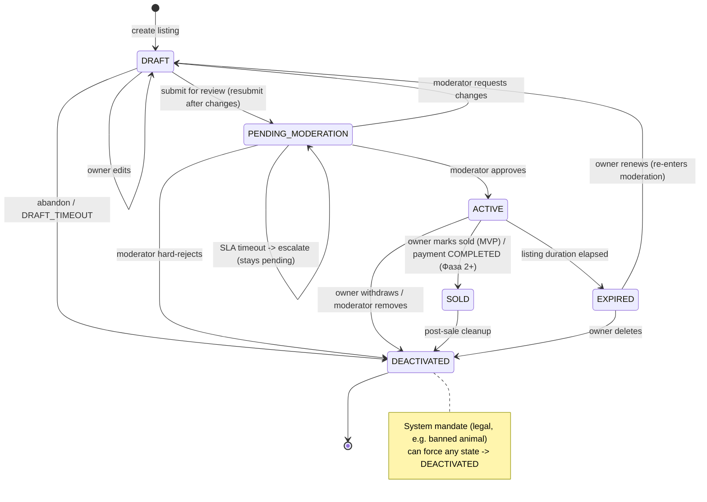

# Listing State Machine Specification

## Overview
Defines the lifecycle states and transitions for a listing (animal for sale/adoption) in the ZooLink system.

## Status fields & core invariant
A listing carries **two** columns (`database_schema.sql`): `status` (this state machine) and `moderation_status`
(`PENDING|APPROVED|REJECTED|CHANGES_REQUESTED`). **Invariant (P0):** `status = 'ACTIVE'` is permitted **only** when
`moderation_status = 'APPROVED'`. Enforced by DB trigger `trg_listing_active_requires_approval` (migration 0004) and
re-checked at the service layer. The two fields are not independent.

## State Diagram

## States

| State | Description | Entry Actions | Exit Actions |
|-------|-------------|---------------|--------------|
| **DRAFT** | Initial state after listing creation; visible only to owner; not searchable | - Assign temporary listing ID - Set creation timestamp - Validate minimum required fields (title, price, location, animal_id) | - Clear draft-specific temporary data |
| **PENDING_MODERATION** | Listing submitted for review; not visible in public search; awaiting moderator action | - Increment moderation queue counter - Notify moderation team - Start moderation SLA timer | - Stop SLA timer if exited quickly |
| **ACTIVE** | Listing approved and visible in public search; available for purchase/adoption | - Publish to search indexes - Activate geo-search visibility - Set publication timestamp - Enable purchase/inquiry buttons | - None |
| **EXPIRED** | Listing automatically deactivated after duration elapsed; retains history | - Remove from active search indexes - Set expiration timestamp - Notify owner of expiration | - None |
| **SOLD** | Listing marked as completed; retains history | **MVP:** - Set `sold_at` - Notify owner - (NO ownership transfer — animal ownership is locked in MVP). **Фаза 2+:** - Record `transaction_id` - Trigger ownership transfer process | - None |
| **DEACTIVATED** | Listing manually removed by owner or moderator; retains history | - Set deactivation timestamp - Record deactivation reason - Notify interested parties (if applicable) | - None |

## State Transitions

| From State | To State | Trigger | Guard Condition | Action |
|------------|----------|---------|-----------------|--------|
| DRAFT | PENDING_MODERATION | Owner submits / resubmits for review | All required fields valid && media uploaded && (price >= MIN_LISTING_PRICE **only if** listing_type='sale') | Set `moderation_status='PENDING'`; increment submission counter |
| DRAFT | DRAFT | Owner edits listing | User is owner && listing not expired/sold | Update fields; reset validation |
| DRAFT | DEACTIVATED | Owner abandons draft | User explicitly deletes \|\| auto-cleanup after DRAFT_TIMEOUT | Log abandonment; cleanup temp data |
| PENDING_MODERATION | ACTIVE | Moderator approves | Moderation decision = APPROVE && no policy violations | Set `moderation_status='APPROVED'`; publish; notify owner |
| PENDING_MODERATION | DEACTIVATED | Moderator hard-rejects | Moderation decision = REJECT (policy violation, not fixable) | Set `moderation_status='REJECTED'`; notify owner with reason (terminal) |
| PENDING_MODERATION | DRAFT | Moderator requests changes | Moderation decision = CHANGES_REQUESTED (fixable) | Set `moderation_status='CHANGES_REQUESTED'`; notify owner; owner edits and resubmits |
| PENDING_MODERATION | PENDING_MODERATION | Moderation SLA timeout | No moderator action within MODERATION_SLA_HOURS | **Escalate** (alert admin/lead); listing stays pending — never auto-published or auto-rejected |
| ACTIVE | EXPIRED | Listing duration elapsed | Time since publication > LISTING_DURATION_DAYS && not sold | Remove from search; notify owner |
| ACTIVE | SOLD | **MVP:** owner marks sold | User is owner && listing ACTIVE | Set `sold_at`; remove from search; notify owner (no transfer) |
| ACTIVE | SOLD | **Фаза 2+:** transaction completed | `payment_transactions.status` = COMPLETED && buyer confirmed | Record `transaction_id`; initiate ownership transfer |
| ACTIVE | DEACTIVATED | Owner withdraws listing | User is owner && listing active && not in transaction | Notify interested parties; log withdrawal |
| ACTIVE | DEACTIVATED | Moderator removes | Moderation decision = REMOVE_ACTIVE || severe policy violation | Notify owner; log moderation action |
| SOLD | DEACTIVATED | Post-sale cleanup | Transaction fully completed && ownership transferred | Archive listing data; retain for history |
| EXPIRED | DEACTIVATED | Owner renews or removes | User initiates renewal OR explicit deletion | If renewal: reset to DRAFT; if deletion: archive |
| * | DEACTIVATED | System mandate | Legal requirement (e.g., banned animal) | Anonymize sensitive data; log compliance |

## Constants & Configuration
- `MIN_LISTING_PRICE`: 0 (free listings allowed) or 1 (minimum currency unit) - configurable per region
- `DRAFT_TIMEOUT`: 7 days (auto-cleanup of abandoned drafts)
- `MODERATION_SLA_HOURS`: 24 hours (moderation review window)
- `LISTING_DURATION_DAYS`: 30 days (standard listing duration; configurable per listing type)
- `MAX_MEDIA_ITEMS`: 10 (maximum photos/videos per listing)
- `MIN_TITLE_LENGTH`: 3 characters
- `MAX_TITLE_LENGTH`: 100 characters

## Notes
- All state transitions are logged with timestamp, listing ID, user ID (owner/moderator), and trigger context.
- Terminal states: EXPIRED, SOLD, DEACTIVATED. DRAFT and PENDING_MODERATION are transient; ACTIVE is live.
- From DEACTIVATED, transitions are limited: only to DEACTIVATED (self-loop for updates) or system-mandated archival.
- **REJECT vs CHANGES_REQUESTED (P0 reconciliation):** a *hard* reject (policy violation) is terminal →
  DEACTIVATED with `moderation_status=REJECTED`; a *fixable* issue → DRAFT with `moderation_status=CHANGES_REQUESTED`,
  the owner edits and resubmits (DRAFT → PENDING_MODERATION). This supersedes any single-status wording in
  `0003-pre-moderation-workflow.md` / `12-moderation-domain.md`.
- **Moderation SLA timeout** never auto-approves or auto-rejects: it escalates and the listing stays in
  PENDING_MODERATION. (`EXPIRED` is reserved for an *ACTIVE* listing whose display duration elapsed.)
- EXPIRED listings renew by resetting to DRAFT and **re-entering moderation** (no bypass of re-review).
- **SOLD in MVP** = owner manually marks the listing sold; it does **NOT** transfer animal ownership (locked in MVP,
  see `ownership_transfer_state_machine.md`). The payment-driven SOLD path and ownership transfer are **Фаза 2+**
  (gated by `feature_toggles.payments`).
- **Cascades:** deactivating an animal forces its listings → DEACTIVATED; deactivating a user forces their ACTIVE
  listings → DEACTIVATED (see animal/user state machines).