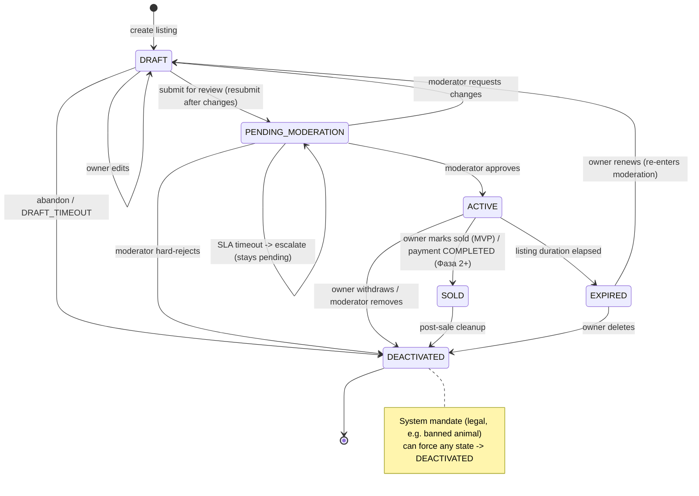

# Listing State Machine Specification

## Overview
Defines the lifecycle states and transitions for a listing (animal for sale/adoption) in the ZooLink system.

## Status fields & core invariant
A listing carries **two** columns (`database_schema.sql`): `status` (this state machine) and `moderation_status`
(`PENDING|APPROVED|REJECTED|CHANGES_REQUESTED`). **Invariant (P0):** `status = 'ACTIVE'` is permitted **only** when
`moderation_status = 'APPROVED'`. Enforced by DB trigger `trg_listing_active_requires_approval` (migration 0004) and
re-checked at the service layer. The two fields are not independent.

## State Diagram

## States

| State | Description | Entry Actions | Exit Actions |
|-------|-------------|---------------|--------------|
| **DRAFT** | Initial state after listing creation; visible only to owner; not searchable | - Assign temporary listing ID - Set creation timestamp - Validate minimum required fields (title, price, location, animal_id) | - Clear draft-specific temporary data |
| **PENDING_MODERATION** | Listing submitted for review; not visible in public search; awaiting moderator action | - Increment moderation queue counter - Notify moderation team - Start moderation SLA timer | - Stop SLA timer if exited quickly |
| **ACTIVE** | Listing approved and visible in public search; available for purchase/adoption | - Publish to search indexes - Activate geo-search visibility - Set publication timestamp - Enable purchase/inquiry buttons | - None |
| **EXPIRED** | Listing automatically deactivated after duration elapsed; retains history | - Remove from active search indexes - Set expiration timestamp - Notify owner of expiration | - None |
| **SOLD** | Listing marked as completed; retains history | **MVP:** - Set `sold_at` - Notify owner - (marking SOLD does NOT auto-initiate ownership transfer; transfer is in MVP as a separate explicit owner-initiated flow — [ADR-0013](../../04-decisions/0013-mvp-ownership-transfer.md); auto-transfer-on-SOLD is Phase 2). **Фаза 2+:** - Record `transaction_id` - Trigger ownership transfer process (auto-transfer-on-SOLD, payment-gated) | - None |
| **DEACTIVATED** | Listing manually removed by owner or moderator; retains history | - Set deactivation timestamp - Record deactivation reason - Notify interested parties (if applicable) | - None |

## State Transitions

| From State | To State | Trigger | Guard Condition | Action |
|------------|----------|---------|-----------------|--------|
| DRAFT | PENDING_MODERATION | Owner submits / resubmits for review | All required fields valid && media uploaded && (price >= MIN_LISTING_PRICE **only if** listing_type='sale') | Set `moderation_status='PENDING'`; increment submission counter |
| DRAFT | DRAFT | Owner edits listing | User is owner && listing not expired/sold | Update fields; reset validation |
| DRAFT | DEACTIVATED | Owner abandons draft | User explicitly deletes \|\| auto-cleanup after DRAFT_TIMEOUT | Log abandonment; cleanup temp data |
| PENDING_MODERATION | ACTIVE | Moderator approves | Moderation decision = APPROVE && no policy violations | Set `moderation_status='APPROVED'`; publish; notify owner |
| PENDING_MODERATION | DEACTIVATED | Moderator hard-rejects | Moderation decision = REJECT (policy violation, not fixable) | Set `moderation_status='REJECTED'`; notify owner with reason (terminal) |
| PENDING_MODERATION | DRAFT | Moderator requests changes | Moderation decision = CHANGES_REQUESTED (fixable) | Set `moderation_status='CHANGES_REQUESTED'`; notify owner; owner edits and resubmits |
| PENDING_MODERATION | PENDING_MODERATION | Moderation SLA timeout | No moderator action within MODERATION_SLA_HOURS | **Escalate** (alert admin/lead); listing stays pending — never auto-published or auto-rejected |
| ACTIVE | EXPIRED | Listing duration elapsed | Time since publication > LISTING_DURATION_DAYS && not sold | Remove from search; notify owner |
| ACTIVE | SOLD | **MVP:** owner marks sold | User is owner && listing ACTIVE | Set `sold_at`; remove from search; notify owner (no transfer) |
| ACTIVE | SOLD | **Фаза 2+:** transaction completed | `payment_transactions.status` = COMPLETED && buyer confirmed | Record `transaction_id`; initiate ownership transfer |
| ACTIVE | DEACTIVATED | Owner withdraws listing | User is owner && listing active && not in transaction | Notify interested parties; log withdrawal |
| ACTIVE | DEACTIVATED | Moderator removes | Moderation decision = REMOVE_ACTIVE || severe policy violation | Notify owner; log moderation action |
| SOLD | DEACTIVATED | Post-sale cleanup | Transaction fully completed && ownership transferred | Archive listing data; retain for history |
| EXPIRED | DEACTIVATED | Owner renews or removes | User initiates renewal OR explicit deletion | If renewal: reset to DRAFT; if deletion: archive |
| * | DEACTIVATED | System mandate | Legal requirement (e.g., banned animal) | Anonymize sensitive data; log compliance |

## Constants & Configuration
- `MIN_LISTING_PRICE`: 0 (free listings allowed) or 1 (minimum currency unit) - configurable per region
- `DRAFT_TIMEOUT`: 7 days (auto-cleanup of abandoned drafts)
- `MODERATION_SLA_HOURS`: 24 hours (moderation review window)
- `LISTING_DURATION_DAYS`: 30 days (standard listing duration; configurable per listing type)
- `MAX_MEDIA_ITEMS`: 10 (maximum photos/videos per listing)
- `MIN_TITLE_LENGTH`: 3 characters
- `MAX_TITLE_LENGTH`: 100 characters

## Notes
- All state transitions are logged with timestamp, listing ID, user ID (owner/moderator), and trigger context.
- Terminal states: EXPIRED, SOLD, DEACTIVATED. DRAFT and PENDING_MODERATION are transient; ACTIVE is live.
- From DEACTIVATED, transitions are limited: only to DEACTIVATED (self-loop for updates) or system-mandated archival.
- **REJECT vs CHANGES_REQUESTED (P0 reconciliation):** a *hard* reject (policy violation) is terminal →
  DEACTIVATED with `moderation_status=REJECTED`; a *fixable* issue → DRAFT with `moderation_status=CHANGES_REQUESTED`,
  the owner edits and resubmits (DRAFT → PENDING_MODERATION). This supersedes any single-status wording in
  `0003-pre-moderation-workflow.md` / `12-moderation-domain.md`.
- **Moderation SLA timeout** never auto-approves or auto-rejects: it escalates and the listing stays in
  PENDING_MODERATION. (`EXPIRED` is reserved for an *ACTIVE* listing whose display duration elapsed.)
- EXPIRED listings renew by resetting to DRAFT and **re-entering moderation** (no bypass of re-review).
- **SOLD in MVP** = owner manually marks the listing sold; marking SOLD does **NOT auto-initiate** ownership
  transfer. Ownership transfer **is in MVP** but is a **separate, explicit owner-initiated flow**
  ([ADR-0013](../../04-decisions/0013-mvp-ownership-transfer.md), `ownership_transfer_state_machine.md`) —
  not a side effect of the listing lifecycle. **Auto-transfer-on-SOLD** (initiating a transfer automatically
  when a sale completes, payment-gated) is **Фаза 2+** (gated by `feature_toggles.payments`).
- **Cascades:** deactivating an animal forces its listings → DEACTIVATED; deactivating a user forces their ACTIVE
  listings → DEACTIVATED (see animal/user state machines).

## Listings Slice 1 — invariants & negative cases (round-N, normative)

> **Source-of-truth note.** Build-ready contract: [listings-api.yaml](../../03-architecture/api-contracts/listings-api.yaml).
> This section is the shared invariant/negative-case list for **backend-engineer** and
> **reviewer-qa** for Slice 1 (DRAFT lifecycle: create / update / add+remove photo / submit /
> withdraw / read+list). Moderator-side transitions (approve/reject/changes), ACTIVE→SOLD/EXPIRED,
> payment, and geo-search are **out of Slice 1** (Admin Slice 4 / Фаза 2 / Slice 2).
>
> **WHAT:** formalize the Slice-1 invariants the reviewer-qa preflight surfaced + the contract
> deltas (submit transition, server-derived seller, leasing enum, lat/lng geo form, MODERATOR
> write-block).
> **WHY:** the contract had real build-blocking gaps (no submit transition; client-supplied
> `sellerId` = IDOR; `leasing`/geo drift from the validated schema; MODERATOR over-granted on
> writes) — a backend built against it would diverge from the schema (truth tier 3) and rbac.
> **WHY-BETTER-for-the-whole-project:** one normative list keys backend tests and QA coverage off
> the same invariants; lifecycle moves only via actions (consistent with the ADR-0013 transfer
> accept/decline pattern); the P0 ACTIVE-requires-APPROVED guard stays the single safety anchor;
> markets stay separated (ADR-0002, market derived not writable); leasing/geo ship as form-now,
> behaviour-later without a future contract break.

### Slice-1 endpoint set (IN scope)

`POST /listings` (create→DRAFT) · `GET /listings` (public, active only) · `GET /listings/{id}`
(public, active only) · `PATCH /listings/{id}` (owner edit) · `DELETE /listings/{id}`
(soft-withdraw→DEACTIVATED) · `POST /listings/{id}/submit` (DRAFT→PENDING_MODERATION) ·
`GET|POST /listings/{id}/photos` · `DELETE /listings/{id}/photos/{photoId}`.
**Deferred (kept in contract, NOT Slice-1 IN):** `GET /listings/{id}/analytics` (needs
view_count/contact_shown_count cols — GAP-TRACE-006), `/listings/{id}/conversations` (chat,
ADR-0005, deprecated), moderator transitions (Admin Slice 4), PostGIS geo-search (Slice 2).

### Invariants & negative cases

| # | Invariant (MUST hold) | Negative case (MUST be rejected) | Enforced by | Error → HTTP / code |
|---|---|---|---|---|
| L-P0 | **ACTIVE requires `moderation_status='APPROVED'`.** No Slice-1 path sets ACTIVE. | any attempt to set `status=ACTIVE` (incl. on submit). | DB `trg_listing_active_requires_approval` + service | 422 `VALIDATION_ERROR` (trigger raises) |
| L-1 | **Seller = authenticated actor** (`seller_id` server-derived). | a body `sellerId` (any value, incl. one differing from the actor — IDOR). | service unknown-field whitelist (rejects body sellerId) | 400 `VALIDATION_ERROR` (unknown field) — seller is derived, never client-set (D2) |
| L-2 | **Actor must own the animal** to create a listing for it. | create for another user's animal. | service (object-level authz) | 403 `FORBIDDEN` |
| L-3 | **Mutating ops are seller-or-org-admin only** (rbac-matrix §99); MODERATOR is R-only on listings. | a non-owner (incl. MODERATOR) PATCH/DELETE/submit/photo. | service object-level + `x-required-roles` (MODERATOR dropped from writes) | 403 `FORBIDDEN` |
| L-4 | **`chk_listing_ownership`:** personal = orgId+branchId both null; org = orgId set (branchId optional); branchId⇒orgId. | branchId set without orgId; mixed personal/org. | DB CHECK + service pre-validate | 422 `VALIDATION_ERROR` (not 500) |
| L-5 | **List/read owner-scoping:** non-active listings (DRAFT/PENDING/DEACTIVATED) are visible only to their owner (and operator scope). | another user reads/lists someone's DRAFT/PENDING. | service query scoping; public `GET` returns active only | 404 `NOT_FOUND` (don't leak existence) |
| L-6 | **Submit guard:** DRAFT→PENDING_MODERATION needs all required fields valid AND ≥1 photo AND (price ≥ MIN_LISTING_PRICE **only if** `listingType='sale'`). | submit with no photo / sale price below min / missing required field. | service | 422 `VALIDATION_ERROR` |
| L-7 | **Submit precondition:** only a DRAFT may be submitted. | submit on a non-DRAFT (PENDING/ACTIVE/etc.). | service (state precondition) | 409 `LISTING_NOT_DRAFT` |
| L-8 | **Withdraw is soft → DEACTIVATED** from owner-controllable states; terminal states reject. | DELETE on a SOLD/EXPIRED/already-DEACTIVATED listing. | service (state precondition) | 409 `CONFLICT` |
| L-9 | **Value CHECKs:** `price_cents ≥ 0`, `quantity ≥ 1`, `currency` ISO-4217 `^[A-Z]{3}$`, lat/lng both-null-or-both-set within range. | negative price / quantity 0 / bad currency / out-of-range or half-set lat-lng. | DB CHECKs (`chk_listings_currency_iso`, `chk_listings_latlng`) + service | 422 `VALIDATION_ERROR` |
| L-10 | **Market is derived** from the animal's species (ADR-0002), never client-set. | a body field attempting to set market/market-crossing. | service (derive, ignore client) | n/a (derived) / 422 if cross-market animal⇄org mismatch |
| L-11 | **`leasing` is accepted with no behaviour** (form-only, Фаза 2). | expecting leasing-specific rules in Slice 1. | service (store value, no special logic) | n/a (accepted) |
| L-12 | **`status`/`moderationStatus`/`sellerId` are not writable** via create/update — lifecycle moves only via actions. | a body setting `status`/`moderationStatus`/`sellerId`. | schema `readOnly`/omitted + service | ignored (or 422 on strict-reject mode) |
| L-13 | **Optimistic concurrency** on PATCH and on /submit (If-Match). | concurrent edit with a stale ETag; missing If-Match. | service ETag compare | 412 `STALE_RESOURCE` / 428 |
| L-14 | **`MAX_MEDIA_ITEMS=10`** photos per listing. | adding an 11th photo. | service | 422 `VALIDATION_ERROR` |
| L-15 | **Transitions are audit/principal-stamped** (`{actor_id, principal_type}` HUMAN/AGENT). | a transition stored without a principal snapshot. | service + audit | n/a (write-time invariant) |

**Domain error codes (extend API_CONVENTIONS §4):** `LISTING_NOT_DRAFT` (409); plus the standard
`CONFLICT` (409, terminal-state withdraw), `VALIDATION_ERROR` (422 for value/guard violations;
**400** for an unknown body field such as `sellerId` — unknown-field whitelist), `FORBIDDEN` (403),
`NOT_FOUND` (404), `STALE_RESOURCE` (412).

**RBAC (rbac-matrix.md §64/§99, MVP normative):** USER (and breeder/farmer/vet/groomer) =
C/R/U/D **own** (R any **active**); MODERATOR = **R any** (incl. pending) — **no C/U/D**;
ADMIN = R/U/D any. Mutating contract ops therefore exclude MODERATOR from `x-required-roles`
(D4), and object-level ownership (`seller_id==actor` or org-admin) is enforced at the service.

## Listings Slice 2 — search/filter invariants & negative cases (round-N, normative)

> **Source-of-truth note.** This extends `GET /v1/listings` (read-only; no migration — all
> indexes exist). Contract: [listings-api.yaml](../../03-architecture/api-contracts/listings-api.yaml)
> (`listListings`). Geo algorithm: [07-geo-search-service.md](../07-geo-search-service.md)
> (Haversine + bbox prefilter; radius **1–100 km**; `search_radius_m` is NOT the search radius).
> Market split: [ADR-0002](../../04-decisions/0002-hard-split-markets.md) (MVP = one endpoint +
> enforced `market` filter, per [ADR-0009](../../04-decisions/0009-mvp-vs-target-architecture.md);
> the target separate-per-market endpoints are ADR-0002 §97). This is the shared invariant list
> for **backend-engineer** and **reviewer-qa**.
>
> **WHAT:** add geo (`lat`/`lng`/`radius_km`), `market`, `species_id`/`breed_id`, and a
> whitelisted `sort` to the public listings search; add `distanceM` to the response.
> **WHY:** discovery is a core marketplace requirement; the schema/indexes (`idx_listings_latlng`,
> `idx_animals_species_breed`, `species.market`) and the geo algorithm already exist, but the
> contract exposed none of it — backend had nothing to build search against.
> **WHY-BETTER-for-the-whole-project:** keeps the hard market split (ADR-0002) enforced at the
> contract+service so no query can leak across markets; reuses the MVP Haversine path (no PostGIS
> until Фаза 2, ADR-0009); snake_case filter/sort (§12) and a sort whitelist keep the query
> surface safe and codegen-stable; `distanceM` is additive (null off the geo path).

### Slice-2 scope

**IN:** geo radius search, market filter, species/breed filters, sort whitelist, `distanceM`.
**Deferred (own later slices — tracked, not dropped):** **saved_searches** save/list/delete
(`saved_searches` table exists, geo-spec §86 — Slice 3) and **address→lat/lng geocoding**
(caller passes coords; Yandex provider for a later slice). **PostGIS** geo is Фаза 2 (ADR-0009).

### Invariants & negative cases

| # | Invariant (MUST hold) | Negative case (MUST be rejected/handled) | Enforced by | Error → HTTP / code |
|---|---|---|---|---|
| L2-1 | **MARKET NO-LEAK (ADR-0002, IDOR-class).** A `market=pet` search returns **zero** livestock rows (and vice-versa), even with a crafted `species_id`/`animal_id`/`organization_id`. The market filter joins `listings.animal_id → animals.species_id → species.market` and is **AND-intersected** — it can only narrow. | a request that tries to widen across markets via another filter. | service: mandatory `species.market` join clause, AND-composed; market derived not trusted from client beyond the enum | results never mix markets; n/a error (filter, not reject) |
| L2-2 | **`market` conditional-required.** Required on the public/discovery path (anonymous read OR any geo param present); optional only for an authenticated owner-scoped read (results pre-constrained by `listScope`). | a public/geo request with no `market`. | service (the OpenAPI param is non-required; this rule is service-enforced — see D2 note) | 422 `MARKET_REQUIRED` |
| L2-3 | **Geo set is all-or-none:** `lat`,`lng`,`radius_km` supplied together or not at all. | one or two of the three present. | service | 422 `GEO_PARAMS_INCOMPLETE` |
| L2-4 | **Radius bounds 1–100 km** (geo-spec §152). | `radius_km` < 1 or > 100. | service (param `minimum`/`maximum` + service) | 422 `RADIUS_OUT_OF_RANGE` |
| L2-5 | **lat/lng range** lat ∈ [−90,90], lng ∈ [−180,180]. | out-of-range coordinate. | param schema + service | 422 `VALIDATION_ERROR` |
| L2-6 | **ACTIVE-only visibility composes with geo.** The geo clause AND `status='ACTIVE'` (public reads never see non-ACTIVE) — geo never widens visibility. | a geo search surfacing a DRAFT/PENDING/DEACTIVATED listing. | service (status filter AND geo clause) | n/a (filter) |
| L2-7 | **Haversine boundary (±100 m tolerance, geo-spec §141):** a point just-inside the radius is included, just-outside excluded, exactly-at-radius included. | a true in-radius point dropped, or an out-of-radius point returned beyond tolerance. | service Haversine `d ≤ radius_m` with tolerance | n/a (correctness; QA boundary tests) |
| L2-8 | **Bbox prefilter is loss-less:** the bounding-box prefilter never drops a point that the exact Haversine would keep (prefilter ⊇ result set). | a true in-radius point excluded by a too-tight bbox. | service (Δlat/Δlng per geo-spec §139) | n/a (correctness) |
| L2-9 | **NULL coordinates excluded** from geo results — no city-centroid fallback (geo-spec §151). | a listing with NULL lat/lng appearing in a geo search. | service (geo query requires non-null lat/lng) | n/a (filter) |
| L2-10 | **Antimeridian (±180° lng):** when the bbox crosses ±180 (RF Chukotka/Kamchatka), it is split into two lng ranges (`lng ≥ min` OR `lng ≤ max`); near-pole `Δlng` clamped to 180°. | a search near ±180° missing valid points on the wrapped side. | service (geo-spec §148–150) | n/a (correctness) |
| L2-11 | **Sort whitelist:** only `created_at`,`price`,`distance` × `asc`/`desc`. | an unknown sort field or direction. | service (whitelist) | 400 `VALIDATION_ERROR` |
| L2-12 | **`sort=distance` requires coordinates.** | `sort=distance` without `lat`/`lng`. | service | 400 `VALIDATION_ERROR` |
| L2-13 | **Deterministic order:** geo → `distance_m ASC, created_at DESC, id ASC`; non-geo default `created_at DESC` (stable tie-break by `id`). | unstable pagination (rows shifting between pages). | service ORDER BY (geo-spec §143) | n/a (correctness) |
| L2-14 | **`distanceM` populated only on a geo search;** null otherwise; meters, rounded; computed not stored. | `distanceM` set without coords, or persisted. | service (compute per request) | n/a (response shape) |
| L2-15 | **Parameterized SQL only** (no string-built filters — ESLint-guarded, doc-code-protocol). | any geo/filter value concatenated into SQL. | service (Kysely/`$queryRaw` bindings) | n/a (security invariant) |
| L2-16 | **`search_radius_m` is never consulted** as the geo search radius (geo-spec §153) — `radius_km` is authoritative. | service reading `listings.search_radius_m` for the radius. | service (use request `radius_km`) | n/a (correctness) |

**Domain error codes (extend API_CONVENTIONS §4):** `MARKET_REQUIRED` (422),
`GEO_PARAMS_INCOMPLETE` (422), `RADIUS_OUT_OF_RANGE` (422); plus standard `VALIDATION_ERROR`
(400 for sort-whitelist / `distance`-without-coords; 422 for value violations).

### Reconciliations (round-N, normative)

**N1 — body `sellerId` is rejected (400), not ignored.**
- **WHAT:** L-1 and the `listings-api.yaml` `createListing`/`ListingCreate` descriptions changed from "a body
  `sellerId` is ignored" to "a body `sellerId` is **rejected (400, unknown field)** by the unknown-field
  whitelist; the seller is derived from the authenticated actor."
- **WHY:** the implementation correctly rejects unknown fields (whitelist), matching every other module;
  reviewer-qa adjudicated the **code is right, the docs were wrong**. A doc that promised "ignored" set a false
  contract expectation and diverged from the actual (and more defensive) behaviour.
- **WHY-BETTER-for-the-whole-project:** the contract now matches the validated behaviour and the platform-wide
  unknown-field convention; rejecting (not silently dropping) a client-supplied `sellerId` gives a louder,
  earlier IDOR signal and one consistent input-validation story across modules; seller stays server-derived (D2).

**N2 — SOLD does not auto-initiate transfer (ADR-0013 alignment).**
- **WHAT:** the SOLD-in-MVP bullet changed from "SOLD does NOT transfer animal ownership (locked in MVP)" to
  "marking SOLD does **NOT auto-initiate** ownership transfer; ownership transfer **is in MVP** as a separate,
  explicit owner-initiated flow ([ADR-0013](../../04-decisions/0013-mvp-ownership-transfer.md)); **auto-transfer-on-SOLD**
  (payment-gated) is Фаза 2+."
- **WHY:** the old wording said transfer was "locked in MVP", which became stale when
  [ADR-0013](../../04-decisions/0013-mvp-ownership-transfer.md) (Accepted) put a simplified ownership transfer
  **in** MVP. This is a correction **toward an Accepted ADR** (truth-hierarchy tier 2), not a new decision.
- **WHY-BETTER-for-the-whole-project:** removes a direct contradiction with ADR-0013; keeps the listing
  lifecycle and the transfer lifecycle as two independent flows (consistent with how
  `ownership_transfer_state_machine.md` frames MVP-vs-Phase-2), so a SOLD listing never silently mutates animal
  ownership and the only path to re-attribution stays the explicit, history-appending transfer flow.