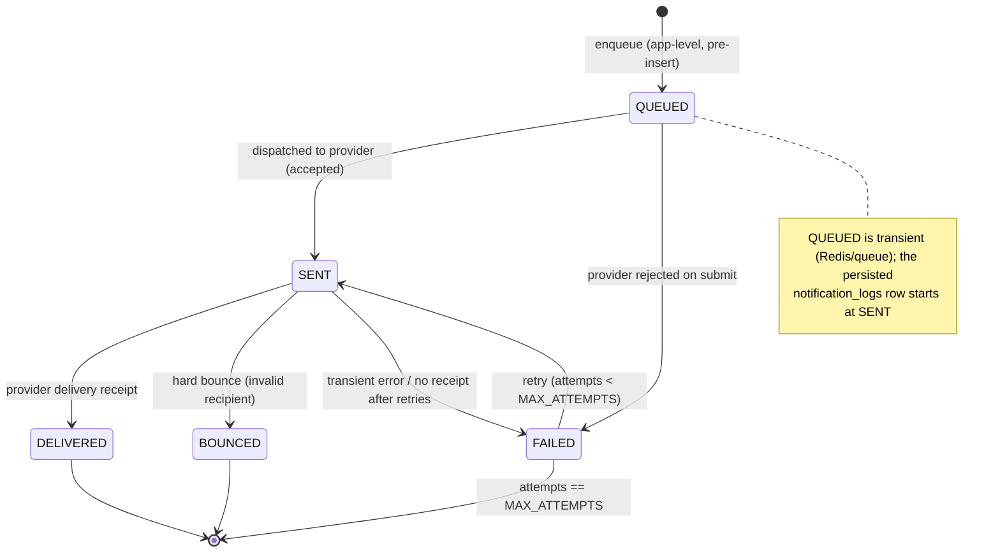

# Notification Delivery State Machine Specification

## Overview
Defines the lifecycle states and transitions for a `notification_logs` record (one outbound EMAIL/SMS) in the ZooLink system. Delivery outcomes are driven by **provider delivery webhooks** (see `docs/specs/13-notification-domain.md`). A transient `QUEUED` stage exists at the application level before the row is persisted with status `SENT`.

## State Diagram

## States

| State | Description | Entry Actions | Exit Actions |
|-------|-------------|---------------|--------------|
| **QUEUED** | App-level: message composed from template, awaiting dispatch (not yet persisted) | - Render `notification_templates` body for recipient language - Check `users.notification_prefs` opt-in | - Enqueue to provider |
| **SENT** | Handed to provider (email/SMS gateway accepted for delivery) | - Insert `notification_logs` row (status SENT) - Store provider message id - Increment `attempts` | - None |
| **DELIVERED** | Provider confirmed delivery to recipient | - Set delivered timestamp - Store provider receipt | - None |
| **FAILED** | Transient/permanent send error; may retry | - Record provider error in `provider_response` - Schedule retry if `attempts < MAX_ATTEMPTS` | - None |
| **BOUNCED** | Hard bounce — recipient invalid/unreachable | - Record bounce reason - Flag recipient as undeliverable (suppress future sends) | - None |

## State Transitions

| From State | To State | Trigger | Guard Condition | Action |
|------------|----------|---------|-----------------|--------|
| (initial) | QUEUED | Domain event needs notification | Recipient opted-in (`notification_prefs`) && template active | Render content |
| QUEUED | SENT | Provider accepts submission | Provider returned message id | Persist log; attempts=1 |
| QUEUED | FAILED | Provider rejects on submit | Submission error (bad config, auth) | Log failure |
| SENT | DELIVERED | Delivery-receipt webhook | Receipt matches message id | Mark delivered |
| SENT | BOUNCED | Bounce webhook | Hard bounce | Suppress recipient |
| SENT | FAILED | No receipt / transient error | Delivery not confirmed in window | Schedule retry |
| FAILED | SENT | Retry dispatch | `attempts < MAX_ATTEMPTS` && not BOUNCED | Re-send; increment attempts |

## Constants & Configuration
- `MAX_ATTEMPTS`: 3 (max send attempts before FAILED becomes terminal)
- `RETRY_BACKOFF`: exponential (e.g., 1m, 5m, 30m)
- `DELIVERY_RECEIPT_WINDOW`: 15 min (await provider receipt before treating as FAILED)

## Notes
- Terminal states: **DELIVERED**, **BOUNCED**, and **FAILED** once `attempts == MAX_ATTEMPTS`.
- A BOUNCED recipient should be suppressed from future sends (no retry).
- Transactional notifications (verification, moderation outcome) are MVP-active; promotional notifications respect `notification_prefs.promo`.
- Provider webhooks must be processed idempotently (duplicate receipts must not re-transition).
