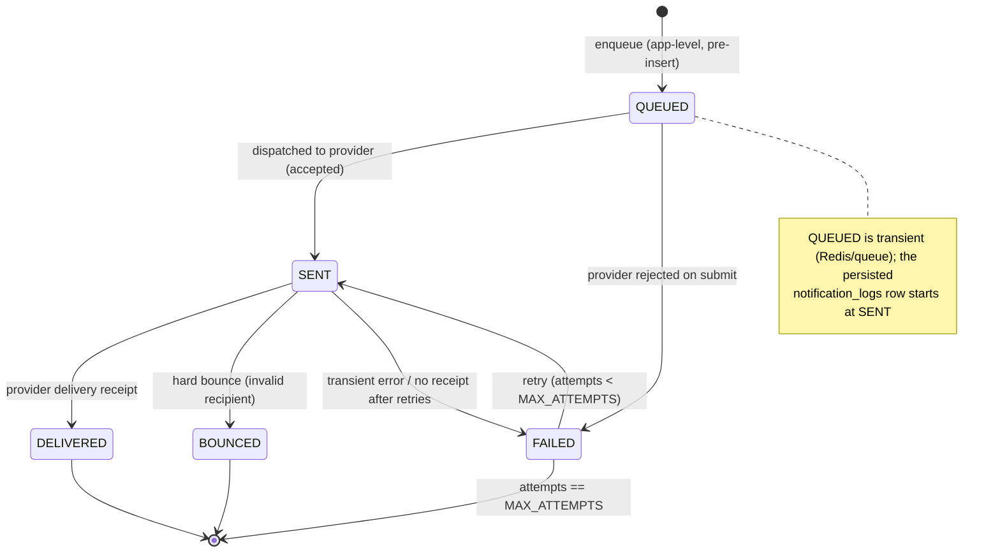
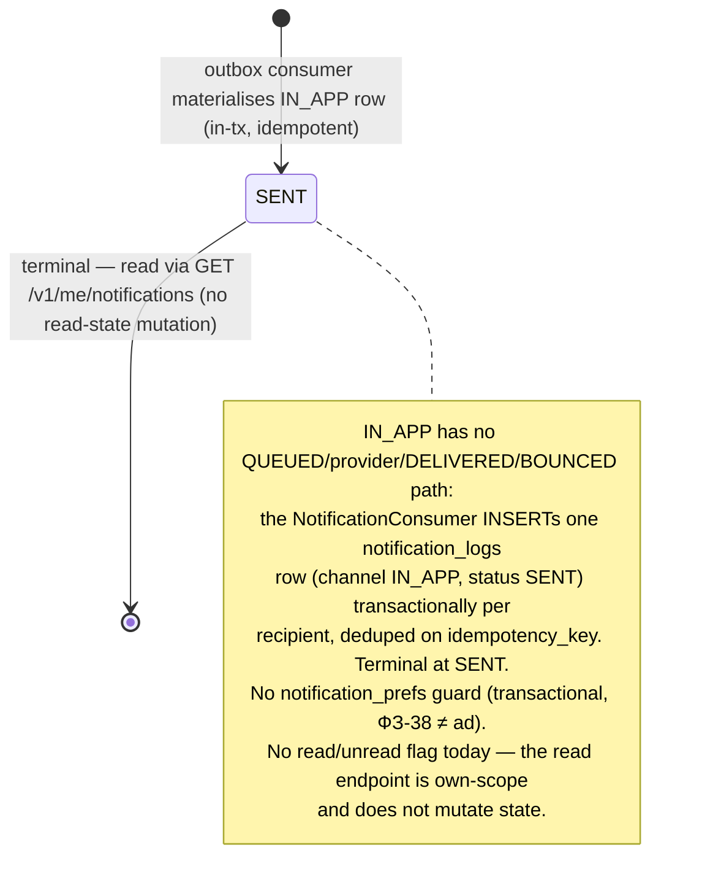

# Notification Delivery State Machine Specification

## Overview
Defines the lifecycle states and transitions for a `notification_logs` record (one outbound EMAIL/SMS/IN_APP) in the ZooLink system. Delivery outcomes for the provider channels (EMAIL/SMS) are driven by **provider delivery webhooks** (see `docs/specs/13-notification-domain.md`). A transient `QUEUED` stage exists at the application level before the row is persisted with status `SENT`. The **IN_APP** channel (ADR-0021, the built MVP channel) has no provider and no webhook — see the IN_APP lane below.

## State Diagram

```mermaid
stateDiagram-v2
    [*] --> QUEUED: enqueue (app-level, pre-insert)
    QUEUED --> SENT: dispatched to provider (accepted)
    QUEUED --> FAILED: provider rejected on submit
    SENT --> DELIVERED: provider delivery receipt
    SENT --> BOUNCED: hard bounce (invalid recipient)
    SENT --> FAILED: transient error / no receipt after retries
    FAILED --> SENT: retry (attempts < MAX_ATTEMPTS)
    DELIVERED --> [*]
    BOUNCED --> [*]
    FAILED --> [*]: attempts == MAX_ATTEMPTS
    note right of QUEUED
        QUEUED is transient (Redis/queue); the persisted
        notification_logs row starts at SENT
    end note
```

### IN_APP lane (ADR-0021 — no provider, no webhook)

```mermaid
stateDiagram-v2
    [*] --> SENT: outbox consumer materialises IN_APP row (in-tx, idempotent)
    SENT --> [*]: terminal — read via GET /v1/me/notifications (no read-state mutation)
    note right of SENT
        IN_APP has no QUEUED/provider/DELIVERED/BOUNCED path:
        the NotificationConsumer INSERTs one notification_logs
        row (channel IN_APP, status SENT) transactionally per
        recipient, deduped on idempotency_key. Terminal at SENT.
        No notification_prefs guard (transactional, ФЗ-38 ≠ ad).
        No read/unread flag today — the read endpoint is own-scope
        and does not mutate state.
    end note
```

> **(round-N, normative — IN_APP delivery lane, Slice H3 / ADR-0021 §Amendment 2026-07-08) WHAT:** documents the IN_APP channel's lifecycle, which differs from EMAIL/SMS: a single transition `[*] → SENT` (terminal). The first outbox consumer (`NotificationConsumer`) materialises one `notification_logs` row (channel `IN_APP`, status `SENT`) **in the same tx** as event processing, deduped on `idempotency_key` (event.id‖recipient‖template). There is **no** `QUEUED`, provider submit, `DELIVERED`/`BOUNCED`, or retry — no provider is involved. There is **no `notification_prefs` guard** (transactional, not advertising — ФЗ-38). The row is read own-scope via `GET /v1/me/notifications` and reading **does not mutate state** — there is deliberately **no read/unread flag** in MVP (none exists in the schema; do not invent one). **WHY:** the base state machine models only the provider (EMAIL/SMS) path, but ADR-0021 shipped IN_APP as the live MVP channel with a fundamentally different (provider-less, terminal-on-insert) lifecycle — a backend dev or agent reading this spec would otherwise wrongly expect a QUEUED→provider→webhook flow for IN_APP. **WHY-BETTER-for-the-whole-project:** it makes the spec match the built read path exactly (own-scope, no read-state), keeps the provider lane unchanged for the future EMAIL/SMS slice, and records the *absence* of a read/unread flag as a deliberate MVP choice so a later "mark read" feature is an explicit additive decision, not an accidental gap. RU mirror updated.

## States

| State | Description | Entry Actions | Exit Actions |
|-------|-------------|---------------|--------------|
| **QUEUED** | App-level: message composed from template, awaiting dispatch (not yet persisted) | - Render `notification_templates` body for recipient language - Check `users.notification_prefs` opt-in | - Enqueue to provider |
| **SENT** | Handed to provider (email/SMS gateway accepted for delivery) | - Insert `notification_logs` row (status SENT) - Store provider message id - Increment `attempts` | - None |
| **DELIVERED** | Provider confirmed delivery to recipient | - Set delivered timestamp - Store provider receipt | - None |
| **FAILED** | Transient/permanent send error; may retry | - Record provider error in `provider_response` - Schedule retry if `attempts < MAX_ATTEMPTS` | - None |
| **BOUNCED** | Hard bounce — recipient invalid/unreachable | - Record bounce reason - Flag recipient as undeliverable (suppress future sends) | - None |

## State Transitions

| From State | To State | Trigger | Guard Condition | Action |
|------------|----------|---------|-----------------|--------|
| (initial) | QUEUED | Domain event needs notification | Recipient opted-in (`notification_prefs`) && template active | Render content |
| QUEUED | SENT | Provider accepts submission | Provider returned message id | Persist log; attempts=1 |
| QUEUED | FAILED | Provider rejects on submit | Submission error (bad config, auth) | Log failure |
| SENT | DELIVERED | Delivery-receipt webhook | Receipt matches message id | Mark delivered |
| SENT | BOUNCED | Bounce webhook | Hard bounce | Suppress recipient |
| SENT | FAILED | No receipt / transient error | Delivery not confirmed in window | Schedule retry |
| FAILED | SENT | Retry dispatch | `attempts < MAX_ATTEMPTS` && not BOUNCED | Re-send; increment attempts |

## Constants & Configuration
- `MAX_ATTEMPTS`: 3 (max send attempts before FAILED becomes terminal)
- `RETRY_BACKOFF`: exponential (e.g., 1m, 5m, 30m)
- `DELIVERY_RECEIPT_WINDOW`: 15 min (await provider receipt before treating as FAILED)

## Notes
- Terminal states: **DELIVERED**, **BOUNCED**, and **FAILED** once `attempts == MAX_ATTEMPTS`.
- A BOUNCED recipient should be suppressed from future sends (no retry).
- Transactional notifications (verification, moderation outcome) are MVP-active; promotional notifications respect `notification_prefs.promo`.
- Provider webhooks must be processed idempotently (duplicate receipts must not re-transition).
