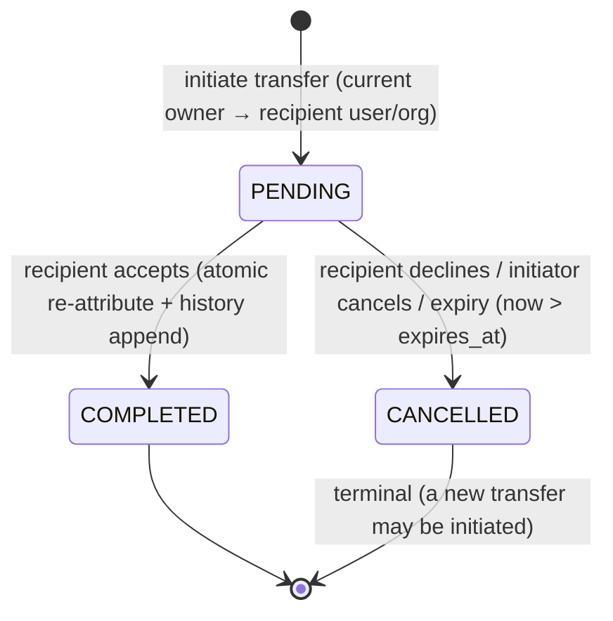
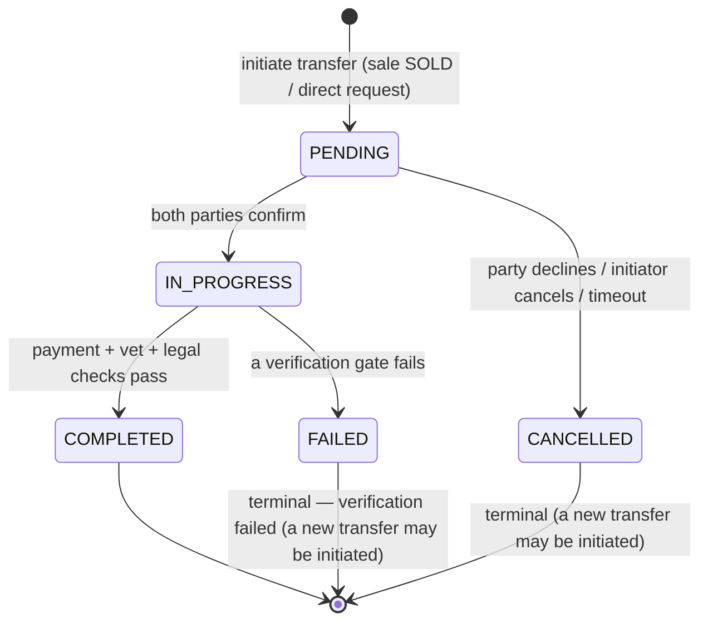
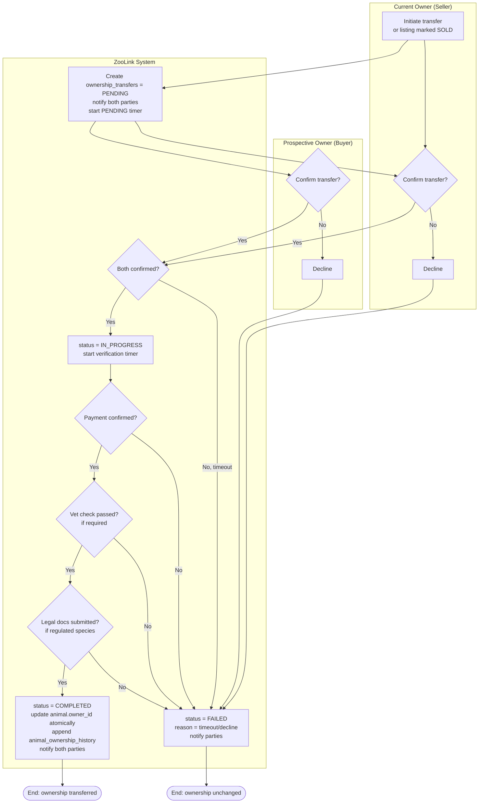

# Ownership Transfer State Machine Specification

## Overview
Defines the lifecycle states and transitions for transferring ownership of an animal between users/organizations in the ZooLink system. This process is triggered when a listing is marked as SOLD or via direct transfer request.

> **MVP note (ADR-0013):** ownership transfer **is in MVP** as a **simplified direct transfer**: `PENDING → COMPLETED` on the recipient's accept, `PENDING → CANCELLED` on decline / initiator-cancel / expiry. The owner-lock trigger `trg_animals_immutable_and_owner` no longer blocks every `owner_id`/`organization_id` change — it permits the change **only** through the controlled transfer path (transaction-local GUC `app.ownership_transfer = 'on'` set by the transfer service; see [ADR-0013](../../04-decisions/0013-mvp-ownership-transfer.md) §2). The **heavy verification superset** below — `IN_PROGRESS`, two-sided confirmation, `payment_confirmed`, vet-check, legal/CITES docs, escrow, `FAILED` — is the **deferred Phase-2 flow**, gated by `feature_toggles.ownership_transfer_verification` (default **off**); its table columns are kept as forward-compatible **form**. The MVP direct flow does **not** transition through `IN_PROGRESS` and does **not** consult `payment_confirmed`.
>
> **MVP-subset vs deferred at a glance:**
> - **MVP (toggle off):** states `PENDING`, `COMPLETED`, `CANCELLED`. `CANCELLED` is the single terminal for "the parties chose not to proceed" (decline / cancel / expire).
> - **Deferred / Phase-2 (toggle on):** states `IN_PROGRESS`, `FAILED`, plus the `payment_confirmed` / `vet` / `legal_docs` verification gates and two-sided `from_confirmed && to_confirmed`. `FAILED` is the Phase-2 terminal for "a verification gate failed" (distinct from MVP `CANCELLED`).
>
> The full state machine is documented below in its Phase-2 superset form; the MVP diagram immediately following shows the active subset.

## MVP State Diagram (active — toggle `ownership_transfer_verification` off)

## Phase-2 State Diagram (deferred superset — toggle on)

## States

| State | Description | Entry Actions | Exit Actions |
|-------|-------------|---------------|--------------|
| **PENDING** (MVP + Phase-2) | Initial state after transfer initiation; awaiting the recipient's accept/decline (MVP) or both-party confirmation (Phase-2) | - Generate transfer ID - Set initiation timestamp + `expires_at` - Notify the recipient (and initiator) - Create transfer record with animal ID and parties involved (actor snapshot per ADR-0011) | - Clear temporary transfer token if generated |
| **COMPLETED** (MVP + Phase-2) | Transfer successfully finalized; ownership re-attributed | - In one transaction (under GUC `app.ownership_transfer`): re-attribute `animals.owner_id`/`organization_id`, set `completed_at`, append `animal_ownership_history` (close old interval, open new) - Notify both parties of success | - None |
| **CANCELLED** (MVP terminal) | The parties chose not to proceed — recipient declined, initiator cancelled, or the transfer expired. Ownership unchanged. | - Set terminal timestamp - Record terminal reason (`failure_reason` ∈ declined / cancelled_by_initiator / expired) - Notify parties | - None |
| **IN_PROGRESS** (Phase-2, gated) | Both parties have acknowledged transfer; awaiting final verification steps (e.g., payment, vet check) | - Start verification timer - Enable secure communication channel between parties - Log transfer initiation | - None |
| **FAILED** (Phase-2, gated) | A **verification gate** (payment / vet / legal) failed; ownership remains with original owner. Distinct from MVP `CANCELLED`. | - Set failure timestamp - Record failure reason - Notify both parties of failure - Revert any provisional changes | - Release any held resources (e.g., escrow funds) |

## State Transitions

**MVP transitions (toggle off — active):**

| From State | To State | Trigger | Guard Condition | Action |
|------------|----------|---------|-----------------|--------|
| [*] | PENDING | initiate | initiator is current owner (or org-admin of owning org); recipient ≠ current owner; no other active PENDING for this animal | Create transfer record; set `expires_at`; notify recipient |
| PENDING | COMPLETED | recipient **accepts** | caller is the named recipient; `now() <= expires_at` | Atomic (under GUC `app.ownership_transfer`): re-attribute animal + set `completed_at` + append `animal_ownership_history` |
| PENDING | CANCELLED | recipient **declines** | caller is the named recipient | Record `failure_reason='declined'`; notify initiator |
| PENDING | CANCELLED | initiator **cancels** | caller is the initiator | Record `failure_reason='cancelled_by_initiator'`; notify recipient |
| PENDING | CANCELLED | **expiry** | `now() > expires_at` (lazy-on-read in MVP; worker later) | Record `failure_reason='expired'`; notify parties |
| COMPLETED | * | (No outgoing transitions) | - | Terminal state |
| CANCELLED | * | (No outgoing transitions) | - | Terminal state (can initiate new transfer) |

**Phase-2 transitions (toggle `ownership_transfer_verification` on — deferred):**

| From State | To State | Trigger | Guard Condition | Action |
|------------|----------|---------|-----------------|--------|
| PENDING | IN_PROGRESS | Both parties acknowledge transfer | current_owner_confirmed = TRUE && prospective_owner_confirmed = TRUE | Start verification process |
| PENDING | CANCELLED | One party declines or aborts | current_owner_confirmed = FALSE || prospective_owner_confirmed = FALSE || user_initiated_cancel | Record decline reason; notify other party |
| PENDING | CANCELLED | Transfer initiation expired | No acknowledgment within PENDING_TIMEOUT_HOURS | Auto-cancel; notify parties |
| IN_PROGRESS | COMPLETED | All verification steps passed | payment_confirmed = TRUE && vet_check_passed = TRUE (if required) && legal_docs_submitted = TRUE | Update ownership; complete transfer |
| IN_PROGRESS | FAILED | Verification step failed | payment_confirmed = FALSE || vet_check_passed = FALSE || legal_docs_submitted = FALSE || timeout_exceeded | Record specific failure reason; notify parties |
| IN_PROGRESS | CANCELLED | Transfer canceled by either party | user_initiated_cancel = TRUE | Notify other party; revert provisional state |
| * | FAILED | System error during verification | Unexpected exception || service unavailable | Log error; notify parties with generic message |
| COMPLETED | * | (No outgoing transitions) | - | Terminal state |
| FAILED | * | (No outgoing transitions) | - | Terminal state — verification failed (can initiate new transfer) |

## Process Flow (BPMN-style) — Phase-2 verified superset (deferred)

> This BPMN models the **Phase-2** two-sided verified flow (gated by `feature_toggles.ownership_transfer_verification`). The MVP flow is the simpler initiate → accept/decline path in the MVP State Diagram above.

### Key rules
- **MVP:** initiate → recipient **accepts** (`COMPLETED`) or **declines/cancel/expire** (`CANCELLED`); no two-sided confirmation, no `IN_PROGRESS`, no verification gates.
- **Phase-2 (gated):** **Two-sided confirmation** is required before IN_PROGRESS (both `from_confirmed` and `to_confirmed`); **verification gates** (payment / vet / legal) depend on animal type & jurisdiction; any failure → FAILED.
- **Atomicity (both phases):** on COMPLETED, the `animals.owner_id`/`organization_id` re-attribution, `completed_at`, and the `animal_ownership_history` append happen in one transaction, under the GUC `app.ownership_transfer` (ADR-0013 §2).
- **Recipient may be a user OR an organization** (MVP); the actor of each act is snapshotted as `{actor_id, principal_type}` (HUMAN/AGENT, ADR-0006/0011).
- **Timeouts:** `PENDING_TIMEOUT_HOURS` for the pending window; `VERIFICATION_TIMEOUT_HOURS` applies only to the Phase-2 verification phase.

## Constants & Configuration
- `PENDING_TIMEOUT_HOURS`: 72 hours (3 days) for the pending window (MVP: expiry is **lazy-on-read**, no worker; a scheduled expirer is Phase-2 / ties into GAP-TRACE-012)
- `VERIFICATION_TIMEOUT_HOURS` (Phase-2): 168 hours (7 days) for completing verification steps
- `MAX_RETRY_ATTEMPTS` (Phase-2): 3 (for failed verification steps before final failure)
- Required verification steps (Phase-2, gated) vary by animal type/jurisdiction:
  - Payment confirmation: Always required for sales
  - Vet check: Required for livestock, exotic animals, or per local regulations
  - Legal documentation: Required for regulated species (e.g., CITES animals)

## Notes
- All state transitions are logged with timestamp, transfer ID, parties, and trigger context for audit and dispute resolution.
- **MVP terminal states:** COMPLETED and CANCELLED. **Phase-2 adds** FAILED (verification failure). From any terminal state no further transitions occur within this transfer instance (a new transfer can be initiated).
- The transfer process is animal-specific; multiple simultaneous transfers for different animals are independent. At most **one active PENDING** transfer per animal (partial unique index, ADR-0013 §3).
- In COMPLETED state, the animal's `owner_id`/`organization_id` is updated atomically with the transfer completion to prevent race conditions.
- Cancelled/failed transfers retain the original owner; the animal's ownership record remains unchanged.
- Escrow or payment holding logic (Phase-2, if used) is outside this state machine but triggered by IN_PROGRESS → COMPLETED transition.

---

## Reconciliation note (ADR-0013, normative)

**ЧТО (WHAT):** Rewrote the MVP-note: ownership transfer is **in MVP** as a simplified direct flow (`PENDING → COMPLETED` on accept, `PENDING → CANCELLED` on decline/cancel/expire); added an MVP state diagram and split the transition tables into an active MVP subset and a deferred Phase-2 verified superset (`IN_PROGRESS`/`FAILED` + payment/vet/legal gates behind `feature_toggles.ownership_transfer_verification`); added `CANCELLED` as the MVP terminal and clarified `FAILED` as the Phase-2 verification-failure terminal.

**ПОЧЕМУ (WHY):** The previous "locked during MVP / post-MVP workflow" note inverted the truth hierarchy — the apex BR (`business-requirements/animal-domain.md:56-61`, GAP-TRACE-007) requires transfer in MVP, and [ADR-0013](../../04-decisions/0013-mvp-ownership-transfer.md) ratifies it. The single `FAILED` bucket conflated "parties chose not to proceed" with "a verification gate failed".

**ПОЧЕМУ ТАК ЛУЧШЕ (WHY-BETTER for the whole project):** One canonical truth across BR↔ADR↔schema↔spec; the heavy verified flow is preserved as labelled, forward-compatible **form** (no throwaway, turns on additively via the feature toggle and the existing table columns); `CANCELLED` vs `FAILED` gives the backend an unambiguous terminal to implement; immutability and the controlled owner-lock path (GUC) are documented in one place. See [ADR-0013](../../04-decisions/0013-mvp-ownership-transfer.md) and [Animal Domain spec](../02-animal-domain.md).

## Related Documents
- [ADR-0013: MVP Ownership Transfer](../../04-decisions/0013-mvp-ownership-transfer.md)
- [Animal Domain spec](../02-animal-domain.md) · [RBAC Matrix](../security/rbac-matrix.md)
- 🌐 RU mirror: [docsRU/specs/statemachines/ownership_transfer_state_machine.md](../../../docsRU/specs/statemachines/ownership_transfer_state_machine.md)