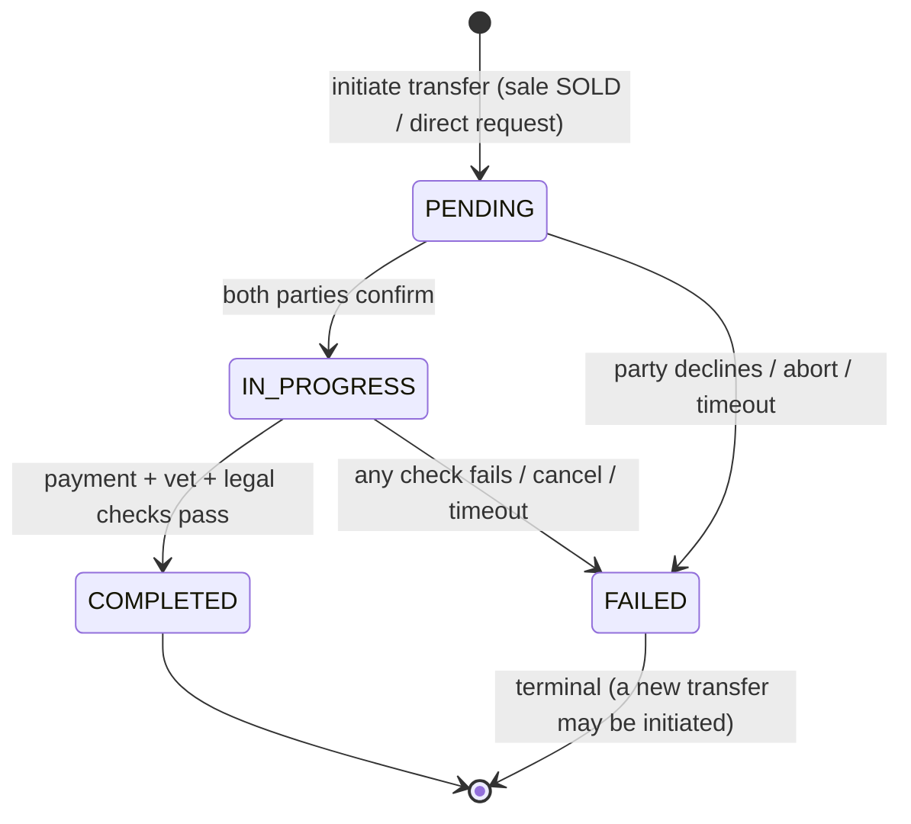

# Ownership Transfer State Machine Specification

## Overview
Defines the lifecycle states and transitions for transferring ownership of an animal between users/organizations in the ZooLink system. This process is triggered when a listing is marked as SOLD or via direct transfer request.

> **MVP note:** animal ownership changes are **locked during MVP** (DB trigger `trg_animals_immutable_and_owner` blocks `owner_id` change). This state machine governs the documented **post-MVP** transfer workflow; the `ownership_transfers` table exists to support it.

## State Diagram

## States

| State | Description | Entry Actions | Exit Actions |
|-------|-------------|---------------|--------------|
| **PENDING** | Initial state after transfer initiation; awaiting confirmation from both parties | - Generate transfer ID - Set initiation timestamp - Notify both current and prospective owner - Create transfer record with animal ID and parties involved | - Clear temporary transfer token if generated |
| **IN_PROGRESS** | Both parties have acknowledged transfer; awaiting final verification steps (e.g., payment, vet check) | - Start verification timer - Enable secure communication channel between parties - Log transfer initiation | - None |
| **COMPLETED** | Transfer successfully finalized; ownership legally changed | - Update animal record with new owner ID - Set completion timestamp - Notify both parties of success - Archive transfer record - Trigger any post-transfer actions (e.g., notification to registry) | - Clear secure communication channel |
| **FAILED** | Transfer could not be completed; ownership remains with original owner | - Set failure timestamp - Record failure reason - Notify both parties of failure - Revert any provisional changes | - Release any held resources (e.g., escrow funds) |

## State Transitions

| From State | To State | Trigger | Guard Condition | Action |
|------------|----------|---------|-----------------|--------|
| PENDING | IN_PROGRESS | Both parties acknowledge transfer | current_owner_confirmed = TRUE && prospective_owner_confirmed = TRUE | Start verification process |
| PENDING | FAILED | One party declines or aborts | current_owner_confirmed = FALSE || prospective_owner_confirmed = FALSE || user_initiated_cancel | Record decline reason; notify other party |
| PENDING | FAILED | Transfer initiation expired | No acknowledgment within PENDING_TIMEOUT_HOURS | Auto-fail; notify parties |
| IN_PROGRESS | COMPLETED | All verification steps passed | payment_confirmed = TRUE && vet_check_passed = TRUE (if required) && legal_docs_submitted = TRUE | Update ownership; complete transfer |
| IN_PROGRESS | FAILED | Verification step failed | payment_confirmed = FALSE || vet_check_passed = FALSE || legal_docs_submitted = FALSE || timeout_exceeded | Record specific failure reason; notify parties |
| IN_PROGRESS | FAILED | Transfer canceled by either party | user_initiated_cancel = TRUE | Notify other party; revert provisional state |
| * | FAILED | System error | Unexpected exception || service unavailable | Log error; notify parties with generic message |
| COMPLETED | * | (No outgoing transitions) | - | Terminal state |
| FAILED | * | (No outgoing transitions) | - | Terminal state (can initiate new transfer) |

## Process Flow (BPMN-style)

### Key rules
- **Two-sided confirmation** is required before IN_PROGRESS (both `from_confirmed` and `to_confirmed`).
- **Verification gates** (payment / vet / legal) depend on animal type & jurisdiction; any failure → FAILED.
- **Atomicity:** on COMPLETED, `animals.owner_id` update and `animal_ownership_history` append happen in one transaction.
- **Timeouts:** `PENDING_TIMEOUT_HOURS` for confirmation, `VERIFICATION_TIMEOUT_HOURS` for the verification phase.

## Constants & Configuration
- `PENDING_TIMEOUT_HOURS`: 72 hours (3 days) for initial acknowledgment
- `VERIFICATION_TIMEOUT_HOURS`: 168 hours (7 days) for completing verification steps
- `MAX_RETRY_ATTEMPTS`: 3 (for failed verification steps before final failure)
- Required verification steps vary by animal type/jurisdiction:
  - Payment confirmation: Always required for sales
  - Vet check: Required for livestock, exotic animals, or per local regulations
  - Legal documentation: Required for regulated species (e.g., CITES animals)

## Notes
- All state transitions are logged with timestamp, transfer ID, user IDs (both parties), and trigger context for audit and dispute resolution.
- Terminal states: COMPLETED and FAILED. From these states, no further transitions occur within this transfer instance (though a new transfer can be initiated).
- The transfer process is animal-specific; multiple simultaneous transfers for different animals are independent.
- In COMPLETED state, the animal's `owner_id` field is updated atomically with the transfer completion to prevent race conditions.
- Failed transfers retain the original owner; the animal's ownership record remains unchanged.
- Escrow or payment holding logic (if used) is outside this state machine but triggered by IN_PROGRESS → COMPLETED transition.