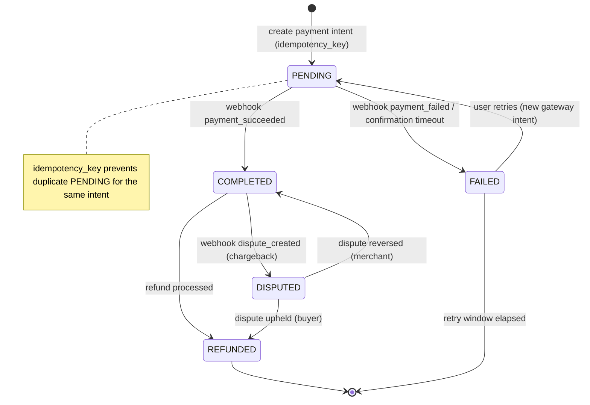

# Payment Transaction State Machine Specification

## Overview
Defines the lifecycle states and transitions for a `payment_transactions` record in the ZooLink system. Status changes are driven primarily by **asynchronous gateway webhooks** (see `docs/specs/14-payment-domain.md`). The Payment domain is gated behind `feature_toggles.payments` (defined but off until post-MVP).

## State Diagram

## States

| State | Description | Entry Actions | Exit Actions |
|-------|-------------|---------------|--------------|
| **PENDING** | Payment intent created at gateway; awaiting confirmation/webhook | - Persist transaction with `idempotency_key` - Return client secret to frontend - Start confirmation timeout timer | - Stop timeout timer |
| **COMPLETED** | Gateway confirmed funds captured | - Mark purpose fulfilled (e.g., activate boosted listing) - Set completion timestamp - Emit `Payment.Completed` (outbox) - Notify user (receipt) | - None |
| **FAILED** | Gateway declined or confirmation timed out | - Record failure reason/code - Notify user with retry option - Emit `Payment.Failed` | - None |
| **REFUNDED** | Funds returned to payer (full); `refunds` row created | - Create `refunds` record - Reverse purpose fulfillment - Notify user | - None |
| **DISPUTED** | Chargeback/dispute opened by payer or bank | - Freeze related benefit - Notify operations - Attach gateway dispute reference | - None |

## State Transitions

| From State | To State | Trigger | Guard Condition | Action |
|------------|----------|---------|-----------------|--------|
| (initial) | PENDING | Create payment intent | `idempotency_key` not seen before && amount > 0 | Persist PENDING txn |
| PENDING | COMPLETED | Webhook `payment_succeeded` | Signature valid && amount/currency match | Capture; fulfill purpose |
| PENDING | FAILED | Webhook `payment_failed` OR confirmation timeout | `now - created_at > PAYMENT_CONFIRM_TIMEOUT` for timeout path | Record reason; notify |
| FAILED | PENDING | User retries payment | Retriable reason && retry within `PAYMENT_RETRY_WINDOW` | Create **new** gateway intent (same purpose_id) |
| COMPLETED | REFUNDED | Refund processed | Refund succeeded at gateway && amount ≤ original | Create `refunds` row; reverse fulfillment |
| COMPLETED | DISPUTED | Webhook `dispute_created` | Signature valid | Freeze benefit; alert ops |
| DISPUTED | REFUNDED | Dispute resolved for payer | Chargeback upheld | Finalize refund |
| DISPUTED | COMPLETED | Dispute resolved for merchant | Chargeback reversed | Restore completed state |

## Constants & Configuration
- `PAYMENT_CONFIRM_TIMEOUT`: 30 min (PENDING auto-fails if no webhook)
- `PAYMENT_RETRY_WINDOW`: 24 h (window in which a FAILED payment may be retried)
- `MAX_REFUND_AGE_DAYS`: per gateway policy (refund eligibility window)

## Notes
- Terminal states: **REFUNDED**, and **FAILED** after the retry window elapses.
- Retrying a FAILED payment creates a **new** `payment_transactions` row (new `gateway_transaction_id`); the original FAILED row is retained for audit.
- All webhooks must be **signature-verified** and processed **idempotently** (replays must not double-transition).
- Partial refunds are out of scope for MVP-baseline (REFUNDED denotes full refund); model as multiple `refunds` rows if introduced later.
- `purpose_type`/`purpose_id` link the payment to what it pays for (e.g., `ListingPromotion` → `listings.id`).
