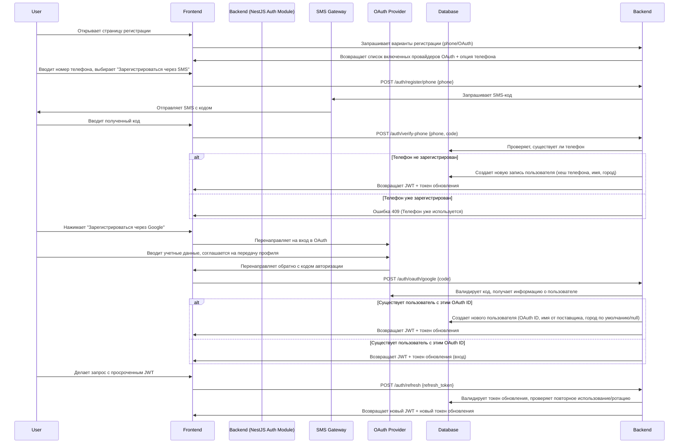

# Домен идентификации: ZooLink

## Цель
Управляет аутентификацией, авторизацией и информацией о профиле пользователя. Этот домен является шлюзом в систему и обеспечивает безопасный доступ при минимальном сборе персональных данных в соответствии с ФЗ-152.

## Основные концепции
- **Пользователь**: Человек, зарегистрированный в системе. Может быть частным лицом, заводчиком, фермером или модератором.
- **Метод аутентификации**: Как пользователь доказывает свою личность (SMS-код телефона, провайдеры OAuth).
- **Роль пользователя**: Определяет разрешения в системе (обычный пользователь, модератор, администратор).
- **Профиль**: Публичная и личная информация, связанная с пользователем.

## Бизнес-правила
1. **Аутентификация**
 - Пользователи должны аутентифицироваться одним из разрешенных методов:
 - Подтверждение номера телефона (SMS-код)
 - OAuth 2.0 с Google, Apple, Telegram, VK
 - Подтверждение email является опциональным и не блокирует регистрацию.
 - После успешной аутентификации выдается сессионный токен (JWT) со сроком действия 24ч.
 - Токены обновления хранятся безопасно и ротируются при использовании.

2. **Регистрация пользователя**
 - Минимальные обязательные поля для регистрации:
 - Номер телефона (уникальный) ИЛИ связанный аккаунт OAuth
 - Полное имя (для отображения, не обязательно юридическое имя)
 - Город (выбран из справочника, используется для гео-поиска)
 - Пароль (если используется аутентификация по телефону; не требуется для OAuth)
 - Необязательные поля при регистрации:
 - Адрес email (для уведомлений и восстановления)
 - Изображение аватара (URL во внешнем хранилище)
 - После регистрации пользователю назначается роль `USER` по умолчанию.
 - Пользователи не могут зарегистрировать более одного аккаунта на один номер телефона (предотвращает спам).

3. **Роли пользователей и разрешения**
 - `USER`: Может создавать/редактировать собственный профиль, создавать/просматривать объявления, искать, просматривать публичные данные, показывать контакты после модерации.
 - `MODERATOR`: Все разрешения USER + может модерировать объявления (одобрять/отклонять), управлять справочными данными (породы, виды), блокировать пользователей.
 - `ADMIN`: Все разрешения MODERATOR + может управлять ролями модератора/администратора, просматривать системную аналитику, изменять глобальные настройки.
 - Роли аддитивны (ADMIN включает разрешения MODERATOR и USER).

4. **Управление профилем**
 - Пользователи могут обновлять свой профиль в любое время:
 - Полное имя
 - Город (изменение запускает повторную индексацию для гео-поиска)
 - Аватар
 - Номер телефона (требует повторной верификации через SMS)
 - Связанные аккаунты OAuth (можно добавлять/удалять)
 - Email
 - Пользователи не могут удалить свой аккаунт на MVP (чтобы сохранить целостность данных для объявлений и истории модерации). Вместо этого они могут:
 - Деактивировать (профиль скрыт, объявления удалены из показа, невозможно войти в систему)
 - Позже повторно активировать (восстанавливает профиль и объявления)
 - Деактивация не удаляет персональные данные немедленно; они сохраняются для юридических и операционных причин (например, разрешение споров) и очищаются через 30 дней бездействия согласно политике хранения данных.

5. **Безопасность и конфиденциальность**
 - На MVP не хранятся данные паспорта, ИНН или другие конфиденциальные идентификаторы.
 - Номера телефонов хешируются в базе данных (bcrypt) для поиска; в интерфейсе показываются только последние 4 цифры для верификации.
 - Токены OAuth хранятся зашифрованными и обновляются через API провайдера.
 - Пароли (если установлены) хешируются с bcrypt (фактор стоимости 12).
 - Все конечные точки аутентификации ограничены по скорости (макс. 5 попыток за 15 минут на IP).
 - Сессионные токены аннулируются при смене пароля или явном выходе из системы.
 - Система логирует события аутентификации (успех/неудача) для аудита, но не логирует пароли или токены.

## Пользовательский путь: Регистрация и вход

## Концептуальная модель данных
| Атрибут | Тип | Обязателен | Описание |
|---------|-----|------------|----------|
| `id` | UUID | Да | Первичный ключ |
| `phone_hash` | VARCHAR(60) | Нет (если OAuth) | Хеш номера телефона bcrypt (для поиска) |
| `oauth_google_id` | VARCHAR(255) | Нет | Уникальный ID от Google |
| `oauth_apple_id` | VARCHAR(255) | Нет | Уникальный ID от Apple |
| `oauth_telegram_id` | VARCHAR(255) | Нет | Уникальный ID от Telegram |
| `oauth_vk_id` | VARCHAR(255) | Нет | Уникальный ID от VK |
| `full_name` | VARCHAR(100) | Да | Отображаемое имя |
| `city_id` | INT (FK to city directory) | Да | Для гео-поиска и локализации |
| `avatar_url` | TEXT | Нет | URL аватара в объектном хранилище |
| `email` | VARCHAR(255) | Нет | Для уведомлений (опционально) |
| `email_verified` | BOOLEAN | Нет | True если email подтвержден через ссылку |
| `password_hash` | VARCHAR(60) | Нет (если только OAuth) | Хеш пароля bcrypt, если используется аутентификация по телефону |
| `role` | ENUM('USER', 'MODERATOR', 'ADMIN') | Да | По умолчанию: USER |
| `is_active` | BOOLEAN | Да | True = может войти; False = деактивирован |
| `created_at` | TIMESTAMP | Да | Время регистрации |
| `updated_at` | TIMESTAMP | Да | Последнее обновление профиля |
| `last_login_at` | TIMESTAMP | Нет | Для отслеживания активности |
| `deactivated_at` | TIMESTAMP | Нет | Когда пользователь выбрал деактивацию |

## Нефункциональные требования (специфичные для Identity)
- **Производительность**: Аутентификация (вход/регистрация) должна завершаться в течение 2с при нормальной нагрузке.
- **Масштабируемость**: Должна поддерживать 1000 одновременных запросов аутентификации (сессий) без degradation.
- **Доступность**: Сервис аутентификации должен иметь uptime 99.9% (критический путь для всех остальных функций).
- **Безопасность**: 
 - Соответствие OWASP ASVS Level 2 для аутентификации.
 - Защита от brute force, credential stuffing и захвата сессий.
 - Все пароли и токены передаются только по HTTPS.
- **Конфиденциальность**: 
 - Минимизирует сбор ПДн (только номер телефона/OAuth ID, имя, город).
 - Предоставляет возможность экспорта/удаления персональных данных (GDPR/ФЗ-152) – будет реализовано в Фазе 2+ через рабочий процесс по запросу пользователя.
- **Логирование**: События аутентификации (успех/неудача входа, обновление токена, деактивация) логируются для аудита безопасности, но исключают конфиденциальные данные.

## Открытые вопросы и предположения
- **Предположение**: Провайдер SMS-шлюза предлагает бесплатный tier, достаточный для валидации MVP (<= 1000 SMS/месяц).
- **Предположение**: Провайдеры OAuth не изменят свои API разрывающе в период MVP.
- **Открытый вопрос**: Следует ли разрешить альтернативный метод входа через username? (Отложено на Фазу 2 для упрощения MVP.)
- **Предположение**: Справочник городов статический и управляется через домен Admin (см. admin-domain.md).

## Связанные домены
- **Домен Администрирования**: Управляет ролями пользователей, привилегиями модерации и справочными данными (города, породы).
- **Домен Животных**: Связан с пользователями через `owner_id` (пользователь, создавший профиль животного).
- **Домен Объявлений**: Связан с пользователями через `creator_id` (пользователь, создавший объявление).
- **Домен Сопоставления**: Может использовать предпочтения пользователей (хранящиеся в профиле) для предложения подборов.

## Ссылки на контракт API (см. 03-architecture/api-contracts/auth-api.yaml)
- `POST /auth/register/phone`
- `POST /auth/verify-phone`
- `POST /auth/oauth/{provider}`
- `POST /auth/refresh`
- `POST /auth/logout`
- `GET /me` (получить текущий профиль пользователя)
- `PATCH /me` (обновить профиль)
- `POST /me/deactivate`
- `POST /me/reactivate`