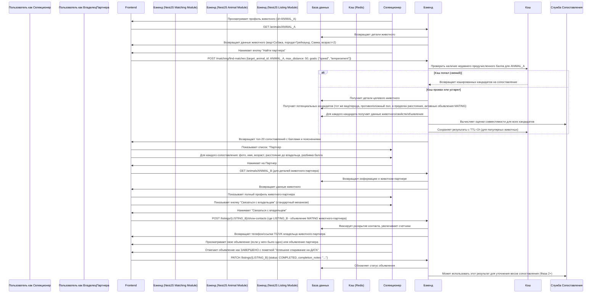

# Домен Сопоставления: ZooLink

## Цель
Обрабатывает специализированную логику для поиска совместимых пар для разведения. Этот домен обеспечивает функции поиска и рекомендаций, специфичные для договоров о вязке, учитывая такие факторы, как генетика, ветеринарные сертификаты, репродуктивное время и цели разведения, которые выходят за рамки простой фильтрации маркетплейса.

## Основные концепции
- **Сопоставление**: Предлагаемая пара двух животных для разведения, генерируемая на основе алгоритмов совместимости.
- **Цель разведения**: То, чего пользователь хочет достичь через вязку (например, улучшить молочную продуктивность, конкретный окрас, темперамент).
- **Оценка совместимости**: Числовое значение (0-100), указывающее, насколько хорошо два животных совпадают на основе взвешенных факторов.
- **Репродуктивное время**: Выравнивание плодородных периодов (течки/эструса) между потенциальными партнерами.
- **Генетическая совместимость**: Анализ генетических маркеров для избежания близкородового скрещивания и поощрения желательных признаков.
- **Ветеринарная совместимость**: Сопоставление животных с комплементарными ветеринарными профилями для минимизации риска наследных заболеваний.

## Бизнес-правила
### 1. Право на сопоставление
- Только животные противоположного пола могут быть сопоставлены (для естественного разведения; ИИ/ЭТ могут иметь другие правила в будущем).
- Оба животных должны быть:
 - Активными (не деактивированными/архивированными)
 - Достигшими возраста для разведения (видоспецифические минимумы применяются)
 - Принадлежать разным владельцам (владельцем может быть пользователь или организация; самосопоставление не допускается)
 - Иметь объявления типа breeding или stud_service (или пользователь указал интерес к разведению)
- Животные должны быть одного вида и породы (сопоставление межпородное зарезервировано для Фазы 2+ с явным согласием пользователя).

### 2. Факторы сопоставления и веса
Алгоритм сопоставления учитывает эти факторы с настраиваемыми весами (веса могут варьироваться по виду/породе):

#### Генетические факторы (30% вес)
- **Коэффициент близкородового скрещивания**: Штраф за высокую связанность (цель <5% для большинства пород)
- **Желательные признаки**: Бонус за комплементарные положительные признаки (например, одно животное сильно в признаке A, другое в признаке B)
- **Нежелательные признаки**: Штраф за наличие одного и того же рецессивного расстройства
- **Гены окраса/рисунка**: Бонус за желаемые комбинации генов окраса
- **Статус бесрогий/рогий**: Бонус для соответствия целям разведения (например, два бесрогих животных для бесрогого стада)

#### Ветеринарные и сертификационные факторы (25% вес)
- **Ветеринарный статус**: Бонус для обоих животных, отрицательных на ключевые заболевания (ТБ, Brucellosis, Johnes и т.д.)
- **Совместимость вакцинации**: Бонус за комплементарные профили вакцинации
- **Генетическое здоровье**: Штраф, если оба являются носителями одного и того же рецессивного состояния
- **Структурная крепкость**: Бонус для животных с хорошими оценками экстерьера

#### Факторы репродуктивного времени (20% вес)
- **Синхронизация течки**: Наибольший бонус, когда самка в течке и самец имеет доказанную плодовитость
- **Сезонные бонусы**: Некоторые породы имеют предпочтительные сезоны разведения
- **Время восстановления**: Штраф, если самка недавно отелилась или had mating attempt
- **Доступность самца**: Бонус для самцов с доказанной плодовитостью и доступными временами сбора

#### Факторы продуктивности и экстерьера (15% вес)
- **Комплиментарность продуктивности**: Бонус, если животные усиливают слабости друг друга (например, высокая объемность + высокий компонент)
- **Оценки экстерьера**: Бонус для животных с комплементарными структурными признаками
- **Совместимость по размеру/рамке**: Бонус за подходящий размер соответствия (особенно важно для лошадей/собак)

#### Факторы местоположения и логистики (10% вес)
- **Географическая близость**: Бонус для животных в пределах осуществимого расстояния транспортировки
- **Совместимость типа услуги**: Бонус для соответствия естественного обслуживания vs. ИИ предпочтениям
- **Совместимость объектов**: Бонус, если обе стороны имеют соответствующие объекты для разведения

### 3. Процесс сопоставления
- **Триггер**: Сопоставление может быть инициировано:
 - Пользователем, просматривающим объявление breeding или stud_service и запрашивающим "Найти похожее" или "Найти сопоставления"
 - Системно-генерируемыми предложениями, показанными в панели пользователя (на основе сохраненных поисков или отслеживаемых животных)
 - Явным поиском через интерфейс сопоставления (фильтры для целей разведения)
- **Ввод**:
 - Целевое животное (то, которое пользователь хочет спарить)
 - Предпочтения пользователя (цели разведения, максимальное расстояние, предпочтительный тип услуги)
 - Опционально: Специфические критерии для приоритизации (например, "приоритизировать генетическое разнообразие")
- **Вывод**:
 - Список потенциальных сопоставлений, отсортированный по оценке совместимости
 - Для каждого сопоставления:
 - Сводка животного (фото, вид/порода/пол/возраст)
 - Разбивка оценки совместимости (по категориям факторов)
 - Ключевые моменты (например, "Отличные показатели тазобедренных суставов", "ТБ-свободный", "Доказанный производитель")
 - Путь инициирования контакта (ведет к показу контактов на объявлении целевого животного)
- **Фильтрация**:
 - Минимальный порог оценки совместимости (настраиваемый, по умолчанию 60)
 - Максимальное количество возвращаемых результатов (по умолчанию 20)
 - Исключать животных, с которыми пользователь ранее сопоставлялся/отклонял
 - Исключать животных от той же собственности (предотвращает случайное самосопоставление)

### 4. Взаимодействие пользователя с сопоставлениями
- При просмотре предложения сопоставления:
 - Пользователь может увидеть детальную разбивку совместимости
 - Пользователь может просмотреть полные профили обоих животных (через ссылки на их профили в Домене Животных)
 - Пользователь может инициировать контакт через стандартный механизм "Показать контакты" на объявлении целевого животного
 - Пользователь может сохранить сопоставление для последующего использования, отклонить (с необязательной обратной связью о причине неуместности), или запросить подобное
 - Система отслеживает:
 - Просмотры сопоставлений (когда результаты сопоставления показаны)
 - Вовлеченность в сопоставления (когда пользователь нажимает, чтобы увидеть полные детали)
 - Инициирование контактов, исходящих из предложений сопоставления
 - Успешные спаривания, сообщаемые обратно через завершение объявления (для обратной связи)

### 5. Особые случаи и aided репродукции
- **Искусственное осеменение (ИО)**:
 - Сопоставление учитывает доступность соломинок, логистику доставки и синхронизацию времени
 - Животное-самец может иметь несколько одновременных сопоставлений (ограничено запасом соломинок)
 - Самка должна быть в обнаружимой течке или запланирована для timed ИО
- **Перенос эмбрионов (ПЭ)**:
 - Зарезервировано для Фазы 2+; сопоставление потребует синхронизации донора/получателя
 - Требует показателей специализированных объектов для обеих сторон
- **Естественное serviço**:
 - Требует географической близости или способности транспортировать животных
 - Учитывает безопасность объектов и историю спариваний
- **Видоспецифические корректировки**:
 - **Коровы/Буйволы**: Акцент на продуктивных записях, генетических индексах (ПТА, ГПТА), признаках плодовитости
 - **Лошади**: Рекорды производительности (гонки, конкурные прыжки и т.д.), экстерьер, популярность кровной линии
 - **Овцы/Козы**: Сопротивление фекальным яичнымCounts, темпы роста, материнские признаки, характеристики шерсти/волокна
 - **Собаки**: Тесты темперамента, ветеринарные допуски (тазобедренные суставы, глаза, сердце), рабочая способность, соответствие стандарту породы
 - **Кошки**: Глубина родословной, награды за показ/породу, генетическое разнообразие, соответствие темпераменту

## Нефункциональные требования (специфичные для Сопоставления)
- **Производительность**: 
 - Вычисление сопоставления: <3s для типичных запросов (<100 кандидатов)
 - Предварительно вычисленные оценки для популярных животных: <500ms извлечение
 - Пакетная обработка: Способность обновить оценки для 1000 животных за <5м
- **Масштабируемость**: 
 - Поддержка сопоставления для 50k активных животных разведения возраста
 - Обработка 100 запросов сопоставления в секунду в пик (с кэшированием)
- **Точность**: 
 - Алгоритм сопоставления должен быть прозрачным и объяснимым (пользователи могут видеть, почему оценка такая)
 - Регулярное backtesting по известным успешным спариваниям для улучшения весов
- **Расширяемость**: 
 - Новые факторы могут быть добавлены без нарушения существующих оценок (аддитивный с весом по умолчанию 0)
 - Видоспецифические профили весов могут быть настроены
 - Модель машинного обучения может заменить эвристическую оценку в Фазе 2+ без изменения интерфейса
- **Конфиденциальность**:
 - Сопоставление не раскрывает полные детали животного, если пользователь не инициирует контакт через стандартные каналы
 - Генетические данные, используемые в сопоставлении, никогда не раскрываются напрямую (только интерпретируются как классификации риска/признака)
 - Местоположение, используемое для сопоставления, никогда не показывается в предложениях сопоставления (только категория расстояния)

## Концептуальная модель данных
| Атрибут | Тип | Обязателен | Описание |
|---------|-----|------------|----------|
| `id` | UUID | Да | Первичный ключ (экземпляр сопоставления) |
| `target_animal_id` | UUID (FK к Animals.id) | Да | Животное, для которого ищутся сопоставления |
| `candidate_animal_id` | UUID (FK к Animals.id) | Да | Потенциальное животное-партнер |
| `compatibility_score` | DECIMAL(5,2) | Да | Общая оценка 0-100 |
| `genetic_score` | DECIMAL(5,2) | Нет | Подбалл 0-100 |
| `health_score` | DECIMAL(5,2) | Нет | Подбалл 0-100 |
| `reproductive_score` | DECIMAL(5,2) | Нет | Подбалл 0-100 |
| `production_score` | DECIMAL(5,2) | Нет | Подбалл 0-100 |
| `logistics_score` | DECIMAL(5,2) | Нет | Подбалл 0-100 |
| `match_reasons` | JSONB | Нет | Массив строк, объясняющих основные положительные факторы |
| `match_concerns` | JSONB | Нет | Массив строк, объясняющих потенциальные проблемы |
| `created_at` | TIMESTAMP | Да | Когда сопоставление было сгенерировано/вычислено |
| `expires_at` | TIMESTAMP | Нет | Когда сопоставление становится устаревшим (по умолчанию 7 дней) |
| `metadata` | JSONB | Нет | Для видспецифических данных или экспериментальных факторов |

## Правила валидации
- `target_animal_id` и `candidate_animal_id` должны ссылаться на разных животных
- Оба животных должны быть активными, достигать возраста для разведения и быть противоположного пола
- `compatibility_score` должен быть между 0 и 100
- Подбаллы (если присутствуют) должны быть между 0 и 100
- Хотя бы один из целевого или кандидатного животного должен иметь активное объявление breeding или stud_service или флаг намерения пользователя на разведение
- Сопоставление истекает не ранее чем через 24 часа после создания (для предотвращения чрезмерных вычислений)

## Пользовательский путь: Использование функций сопоставления


## Реестр GAP
| ID | Description | Критичность (High/Med/Low) | Владелец | Ожидаемое решение | Статус | Связанные решения |
|----|-------------|----------------------------|----------|-------------------|--------|-------------------|
| GAP-MT-001 | Исходные веса сопоставления основаны на экспертных знаниях; уточнение со временем с учетом обратной связи пользователей | Низкая | ML команда | Фаза 1 (обратная связь) | Открыто | Подход к алгоритму сопоставления |
| GAP-MT-002 | Большинство пользователей инициируют сопоставление от собственных животных (а не анонимный поиск) | Низкая | Владелец продукта | Фаза 1 (валидация) | Закрыто | Подтверждение предположения о поведении пользователей |
| GAP-MT-003 | Межпородное сопоставление одного вида на MVP с явным согласием | Средняя | Бэкенд команда | Фаза 2+ | Закрыто | Решение: зарезервировано для Фазы 2+ |
| GAP-MT-004 | Пользователи понимают сопоставление как инструмент предложения; решения о разведении требуют ветеринарной консультации/переговоров | Низкая | UX команда | Фаза 1 (валидация) | Открыто | Дизайн UI/UX для сопоставления |
| GAP-MT-005 | Система не гарантирует плодовитость/беременность; оценка основана только на доступных данных | Низкая | Юридическая команда | Фаза 1 (документация) | Открыто | Подход к дисклеймерам и ответственности |
| GAP-MT-006 | Генетические данные ограничены тем, что владельцы добровольно предоставляют (тесты, родословные) | Низкая | Данные команда | Фаза 1 (валидация) | Открыто | Подход к сбору генетических данных |

## Связанные домены
- **Домен Животных**: Предоставляет основные данные животного (генетические флаги, ветеринарные сертификаты, продуктивные записи), используемые в расчетах совместимости.
- **Домен Рынка Домашних Животных & Домен Рынка Сельхоживотных**: Объявления типа MATING/STUD_SERVICE указывают на интерес пользователя к разведению и предоставляют механизм контакта.
- **Домен Идентификации**: Связывает животных с владельцами; требуется аутентификация для инициирования сопоставления или просмотра полных деталей.
- **Домен Администрирования**: Может управлять справочными данными для целей разведения, библиотек признаков или видов-специфичных профилей весов.
- **Будущие домены**: Портал Генетического Тестирования (может предоставить более детальные генетические данные), Аналитика Разведения (обратная связь от результатов).

## Ссылки на контракт API (см. 03-architecture/api-contracts/matching-api.yaml)
- `GET /matching/new-target/{animal_id}` (получение проверки целевого животного)
- `POST /matching/find-matches` (поиск сопоставлений для целевого животного с предпочтениями)
- `GET /matching/{id}` (получение деталей конкретного сопоставления по ID - полезно для совместного использования/сохранения)
- `GET /matching/history` (получение истории просмотров/вовлеченности пользователем в сопоставления)
- `POST /matching/{id}/feedback` (обратная связь пользователя о качестве сопоставления: полезно/не полезно, почему)
- Примечание: Нет прямого CRUD на сопоставления, поскольку они в основном являются сущностями compute/view-only; история хранится для аналитики.
```