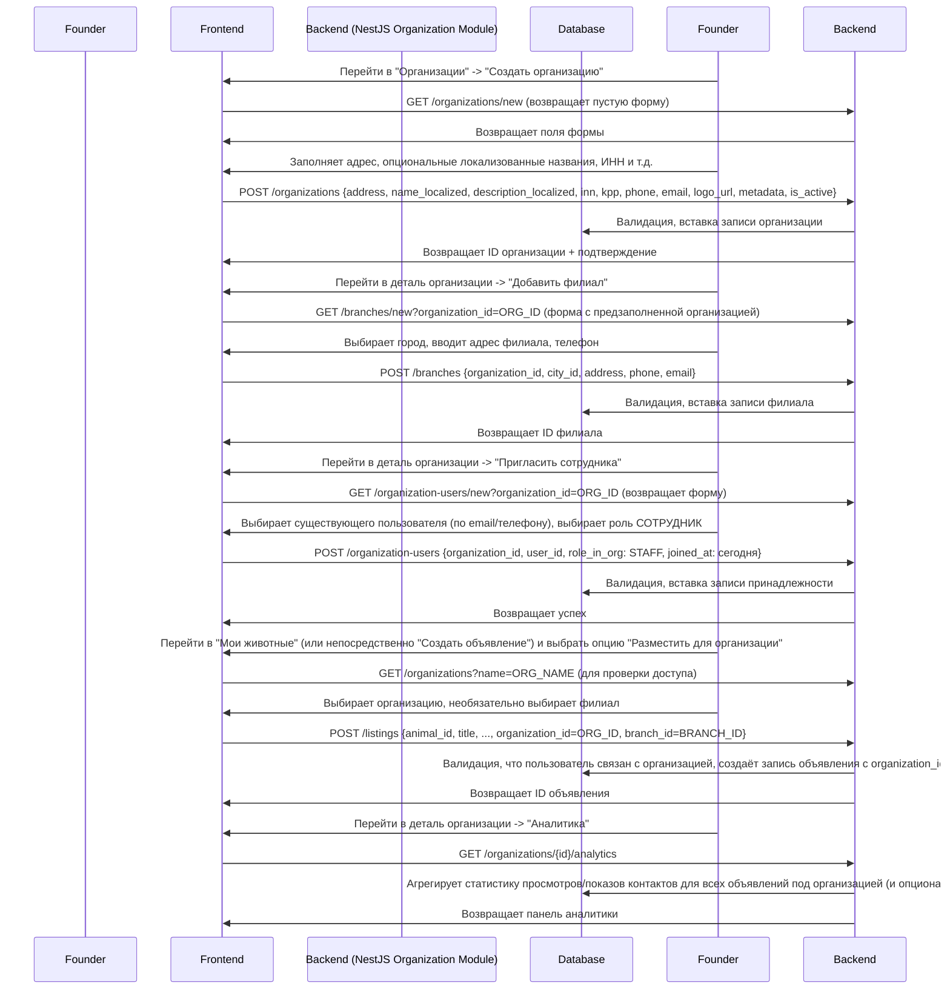

# Домен Организаций: ZooLink

## Цель
Обрабатывает моделирование юридических лиц (организаций) и их физических расположений (филиалов), работающих в рамках платформы ZooLink. Этот домен позволяет компаниям, таким как ветеринарные клиники, питомники, приюты, племенные хозяйства и поставщики услуг, поддерживать единое присутствие, управлять несколькими расположениями и позволять нескольким сотрудникам действовать от имени организации.

## Основные концепты
- **Организация**: Юридическое лицо (например, ветеринарная клиника, питомник, приют), которое может владеть животными, создавать объявления и иметь множество связанных с ним пользователей.
- **Филиал**: Физическое расположение или объект, принадлежащий организации (например, конкретный адрес клиники, сайт племенного хозяйства). Филиалы привязаны к городу для гео-поиска.
- **Пользователь организации**: Пользователь (аккаунт на платформе), связанный с одной или несколькими организациями, имеющий определённую роль (например, ВЛАДЕЛЕЦ, АДМИНИСТРАТОР, СОТРУДНИК, ВЕТЕРИНАР, МОДЕРАТОР).
- **Головной офис**: Специальный филиал, отмеченный как главный или основной офис организации.

## Бизнес-правила
### 1. Создание организации
- Только аутентифицированные пользователи могут создать организацию (создатель становится первоначальным ВЛАДЕЛЬЦЕМ).
- Обязательные поля при создании:
  - `address` (адрес головного офиса)
- Необязательные поля:
  - `name_localized` (локализованные названия, например, {"en": "Name", "ru": "Название"})
  - `description_localized` (локализованное описание, например, {"en": "Description", "ru": "Описание"})
  - `inn` (ИНН, опционально, но рекомендуется для юридических лиц)
  - `kpp` (КПП, опционально)
  - `phone` (контактный телефон)
  - `email` (контактный email)
  - `logo_url` (URL логотипа организации)
  - `metadata` (поле JSONB для расширяемости)
  - `is_active` (по умолчанию true)

### 2. Создание филиала
- Филиалы создаются под существующей организацией.
- Обязательные поля:
  - `organization_id` (ВНЕШНИЙ КЛЮЧ к организациям.id)
  - `city_id` (ВНЕШНИЙ КЛЮЧ к городам.id)
  - `address` (подробный адрес филиала)
- Необязательные поля:
  - `phone`, `email` (контакты филиала)
  - `is_headquarters` (логическое значение, по умолчанию false)
  - `is_active` (по умолчанию true)

### 3. Принадлежность пользователя организации
- Пользователи могут быть связаны с несколькими организациями (например, ветеринар, работающий в двух клиниках).
- Каждая запись принадлежности хранит:
  - `organization_id`
  - `user_id`
  - `role_in_org` (ENUM: 'OWNER', 'ADMIN', 'STAFF', 'VET', 'MODERATOR')
  - `is_primary` (флаг, указывающий основную организацию пользователя для уведомлений, по умолчанию false)
  - `joined_at` (дата, когда пользователь начал работу в организации)

### 4. Присваивание объявлений
- При создании объявления пользователь должен указать либо:
  - Свой персональный аккаунт (через `creator_id`) **ИЛИ**
  - Организацию (через `organization_id`) и опционально филиал (через `branch_id`).
- `creator_id` (тот человек, который подал объявление) всегда записывается в целях аудита.
- Объявления, привязанные к организации, показывают название организации (и филиал, если указан) в публичном виде.

### 5. Собственность животных организацией
- Животные могут принадлежать либо личному пользователю (`owner_id`), либо организации (`organization_id`).
- При уровне приложения должно выполняться условие: хотя бы одно из `owner_id` или `organization_id` НЕ NULL.
- Это позволяет точно представлять животных, принадлежащих племенным хозяйствам, приютам или клиникам.

### 6. Поиск и обнаружение
- Пользователи могут фильтровать результаты поиска по:
  - Название организации
  - Город филиала
  - Тип организации (если тип/классификация добавлена в будущем)
- Результаты поиска отображают название организации (и филиал) для объявлений, привязанных к организации.

### 7. Квалификация для подбора (когда вовлечены организации)
- Для домена подбора "владельцем" считается либо пользователь, либо организация.
- Два животных могут быть подобраны, если они принадлежат разным владельцам (т.е. разным пользователям и/или разным организациям).
- Логика подбора может быть настроена на разрешение или запрет подбора между животными, принадлежащими одной организации (через флаг функции или настройку организации).

### 8. Модерация
- Модераторы видят название организации (и филиал) рядом с отправляющим пользователем при проверке объявлений.
- Организационные политики (например, запрещённые породы) могут быть реализованы в будущем через настройки организации.

### 9. Аналитика и отчётность
- Организации могут просматривать агрегированную статистику по всем своим объявлениям (просмотры, показы контактов и т.д.) во всех филиалах.
- Также доступна аналитика по конкретному филиалу.

## нефункциональные требования
- **Производительность**: Получение организации с её филиалами и связанными пользователями должно занимать менее 300 мс.
- **Масштабируемость**: Должно поддерживать до 10 тыс. организаций и 100 тыс. филиалов без degradation.
- **Расширяемость**: Поля JSONB `metadata` могут использоваться для экспериментальных атрибутов (например, уровень подписки, предпочтения брендинга).
- **Безопасность**:
  - Только пользователи с соответствующей ролью (OWNER, ADMIN) могут изменять детали организации/филиала.
  - Пользователи могут создавать объявления только для организаций, с которыми они связаны (проверка через `organization_users`).
- **Конфиденциальность**:
  - Контактные данные организации (телефон, email) показываются только если организация выбрала их делиться.
  - Личные данные пользователей защищены; объявления организации не раскрывают контактную информацию отдельного создателя, если организация не решит раскрыть её.

## Модель данных (концептуальная)
### Таблица organizations
| Атрибут | Тип | Обязательно | Описание |
|-----------|------|----------|-------------|
| `id` | UUID | Да | Первичный ключ |
| `name_localized` | JSONB | Да | Локализованные названия (например, {"en": "Name", "ru": "Название"}) |
| `description_localized` | JSONB | Нет | Локализованное описание (например, {"en": "Description", "ru": "Описание"}) |
| `inn` | VARCHAR(20) | Нет | Идентификатор налогоплательщика |
| `kpp` | VARCHAR(20) | Нет | Код причины постановки на учёт |
| `address` | TEXT | Да | Адрес головного офиса |
| `phone` | VARCHAR(30) | Нет | Контактный телефон |
| `email` | VARCHAR(255) | Нет | Контактный email |
| `logo_url` | TEXT | Нет | URL изображения логотипа |
| `metadata` | JSONB | Нет | Поле JSONB для расширяемости (уровень подписки, предпочтения брендинга и т.д.) |
| `is_active` | BOOLEAN | Да | Активный статус |
| `created_at` | TIMESTAMP | Да | Время создания записи |
| `updated_at` | TIMESTAMP | Да | Время последнего обновления |

### Таблица branches
| Атрибут | Тип | Обязательно | Описание |
|-----------|------|----------|-------------|
| `id` | UUID | Да | Первичный ключ |
| `organization_id` | UUID | Да | ВНЕШНИЙ КЛЮЧ к organizations.id |
| `city_id` | UUID | Да | ВНЕШНИЙ КЛЮЧ к городам.id |
| `address` | TEXT | Да | Подробный адрес |
| `phone` | VARCHAR(30) | Нет | Телефон филиала |
| `email` | VARCHAR(255) | Нет | Email филиала |
| `is_headquarters` | BOOLEAN | Нет | По умолчанию false |
| `is_active` | BOOLEAN | Да | Активный статус |
| `created_at` | TIMESTAMP | Да | Время создания записи |
| `updated_at` | TIMESTAMP | Да | Время последнего обновления |

### Таблица organization_users (M2M)
| Атрибут | Тип | Обязательно | Описание |
|-----------|------|----------|-------------|
| `id` | UUID | Да | Первичный ключ |
| `organization_id` | UUID | Да | ВНЕШНИЙ КЛЮЧ к organizations.id |
| `user_id` | UUID | Да | ВНЕШНИЙ КЛЮЧ к users.id |
| `role_in_org` | VARCHAR(20) | Да | Роль: OWNER, ADMIN, STAFF, VET, MODERATOR |
| `is_primary` | BOOLEAN | Нет | По умолчанию false |
| `joined_at` | DATE | Да | Дата, когда пользователь присоединился к организации |
| `created_at` | TIMESTAMP | Да | Время создания записи |

### Расширения существующих таблиц
#### Объявления (listings)
| Атрибут | Тип | Обязательно | Описание |
|-----------|------|----------|-------------|
| `organization_id` | UUID | Нет | ВНЕШНИЙ КЛЮЧ к organizations.id (nullable) |
| `branch_id` | UUID | Нет | ВНЕШНИЙ КЛЮЧ к branches.id (nullable) |

#### Животные (animals)
| Атрибут | Тип | Обязательно | Описание |
|-----------|------|----------|-------------|
| `organization_id` | UUID | Нет | ВНЕШНИЙ КЛЮЧ к organizations.id (nullable) |

## Правила валидации (примеры)
- Название организации должно быть уникальным (регистронезависимо) внутри платформы, чтобы избежать дубликатов.
- ИНН, если предоставлен, должен быть уникальным (разрешён NULL).
- Пользователь должен иметь активную запись принадлежности (`organization_users`) с организацией, чтобы создавать объявление от её имени.
- Для собственности животного: хотя бы одно из `owner_id` (ВНЕШНИЙ КЛЮЧ к users) или `organization_id` должно быть NOT NULL.

## Пользовательский путь: Управление организацией

## Реестр GAP
| ID | Description | Критичность (High/Med/Low) | Владелец | Ожидаемое решение | Статус | Связанные решения |
|----|-------------|----------------------------|----------|-------------------|--------|-------------------|
| GAP-ORG-001 | Большинство организаций будет иметь один головной офис и возможно несколько филиалов; модель поддерживает любое количество филиалов | Средняя | Команда инфраструктуры | Фаза 1 (валидация) | Открыто | Подход к моделированию организации/филиала |
| GAP-ORG-002 | Контроль доступа на основе ролей (RBAC) будет реализован на уровне приложения для обеспечения разрешений на управление организацией/филиалом | Высокая | Команда безопасности | Фаза 1 (реализация) | Открыто | Стратегия реализации RBAC |
| GAP-ORG-003 | Пометить организацию как "подтверждённая" (например, с бейджем) после ручного подтверждения | Средняя | Владелец продукта | Фаза 2+ | Открыто | Система верификации организации |
| GAP-ORG-004 | Поля `inn` и `kpp` специфичны для российского законодательства; при международном расширении они могут стать необязательными или заменены на общий налоговый идентификатор | Низкая | Бэкенд команда | Фаза 2 (международная версия) | Открыто | Подход к международной версии для налоговых ID |
| GAP-ORG-005 | Хранение геокоординат (широта/долгота) для филиалов для более точного гео-поиска | Низкая | Гео команда | Фаза 2 (улучшение) | Открыто | Реализация гео-поиска для филиалов |

## Связанные домены
- **Домен идентичности**: Таблица `users` предоставляет отдельные учётные записи, которые связаны с организациями.
- **Домен животных**: Животные могут быть связаны с организациями через `organization_id`.
- **Домен объявлений**: Объявления могут быть привязаны к организациям/филиалам.
- **Домен администрирования**: Управляет справочными данными (виды, породы, города) и очередью модерации; в будущем может также управлять статусом проверки организации.
- **Домен подбора**: Считает организации владельцами для проверки квалификации.

## Ссылки на контракты API (см. 03-architecture/api-contracts/)
- `GET /organizations/new` (получить пустую форму для создания)
- `POST /organizations` (создать организацию)
- `GET /organizations/{id}` (получить организацию по ID)
- `PATCH /organizations/{id}` (обновить организацию)
- `GET /organizations` (список организаций с фильтрами: название, is_active)
- `POST /branches` (создать филиал под организацией)
- `GET /branches/{id}` (получить филиал по ID)
- `PATCH /branches/{id}` (обновить филиал)
- `GET /branches` (список филиалов с фильтрами: organization_id, city_id, is_headquarters)
- `POST /organization-users` (связать пользователя с организацией)
- `GET /organization-users` (список принадлежностей с фильтрами: organization_id, user_id, роль)
- `PATCH /organization-users/{id}` (обновить роль, основной флаг)
- `DELETE /organization-users/{id}` (удалить принадлежность)

---
*Этот документ описывает домен организаций на этапе расширения MVP для поддержки многосущностных организаций. Будущие функции (подтверждённые бейджи, уровни подписки, настройки организации) документированы в `future-features.md`.*