# Диаграмма контейнеров (уровень C4 2): Платформа ZooLink

## Цель
Расширяет системный контейнер ZooLink, показывая внутренние компоненты и их взаимодействия.

## Описание диаграммы

```mermaid
graph TD
    %% Внешние системы (из уровня 1)
    subgraph External_Systems
        direction TB
        SMS["SMS-шлюз<br/>(Twilio или аналогичный)"]
        Email["Email-сервис<br/>(SendGrid или аналогичный)"]
        Maps["Геокодинг и карты<br/>(Yandex.Maps API)"]
        Storage["Объектное хранилище<br/>(S3-совместимое)"]
        OAuth["Провайдеры OAuth<br/>(Google, Apple, Telegram, VK)"]
    end

    %% Граница системы ZooLink
    subgraph ZooLink_System[Платформа ZooLink]
        direction TB
        %% Веб-приложение
        subgraph WebApp["Веб-приложение<br/>(SPA/PWA)"]
            direction TB
            SPA["Одностраничное приложение<br/>(React/Vue/Angular)"]
            PWA_ServiceWorker["Служебный воркер PWA<br/>(Кеширование офлайн)"]
        end

        %% Слой API
        subgraph API["RESTful API<br/>(Бэкенд на NestJS)"]
            direction TB
            API_Gateway["Шлюз API<br/>(Ограничение скорости, аутентификация)"]
            Identity_Module["Модуль идентификации<br/>(Аутентификация, профили, OAuth)"]
            Animal_Module["Модуль животных<br/>(CRUD животных, право собственности)"]
            Listing_Module["Модуль объявлений<br/>(CRUD объявлений, поиск)"]
            Moderation_Module["Модуль модерации<br/>(Очередь, принятие решений)"]
            Matching_Module["Модуль подбора<br/>(Предложения для разведения)"]
            Organization_Module["Модуль организаций<br/>(Организации, филиалы)"]
            Admin_Module["Административный модуль<br/>(Справочные данные, конфигурация)"]
            Notification_Module["Модуль уведомлений<br/>(Email, SMS)"]
            GeoSearch_Module["Модуль гео-поиска<br/>(Пространственные запросы)"]
            Payment_Module["Модуль платежей<br/>(Будущее: транзакции)"]
        end

        %% Хранилища данных
        subgraph Data_Stores
            direction TB
            DB[(PostgreSQL<br/>Основная база данных)]
            Cache[(Redis кеш<br/>Сессии, справочные данные)]
            Search_Index[(Elasticsearch<br/>Полнотекстовый поиск)]
            Object_Storage[(S3-совместимое<br/>Хранилище файлов)]
        end
    end

    %% Пользователи
    User["Пользователи<br/>(Владельцы домашних животных, разведчики, фермеры, модераторы, администраторы)"]

    %% Отношения
    User -- Использует --> SPA
    SPA <--> API_Gateway
    API_Gateway --> Identity_Module
    API_Gateway --> Animal_Module
    API_Gateway --> Listing_Module
    API_Gateway --> Moderation_Module
    API_Gateway --> Matching_Module
    API_Gateway --> Organization_Module
    API_Gateway --> Admin_Module
    API_Gateway --> Notification_Module
    API_Gateway --> GeoSearch_Module
    API_Gateway --> Payment_Module

    %% Доступ к данным
    Identity_Module <--> DB
    Animal_Module <--> DB
    Listing_Module <--> DB
    Moderation_Module <--> DB
    Matching_Module <--> DB
    Organization_Module <--> DB
    Admin_Module <--> DB
    Notification_Module <--> DB
    GeoSearch_Module <--> DB
    GeoSearch_Module <--> Search_Index

    %% Внешние интеграции
    Notification_Module --> SMS
    Notification_Module --> Email
    GeoSearch_Module --> Maps
    Listing_Module --> Storage
    Identity_Module --> OAuth

    %% Кеширование
    Identity_Module -.-> Cache
    Animal_Module -.-> Cache
    Listing_Module -.-> Cache
    Admin_Module -.-> Cache

    %% Поиск
    Listing_Module -.-> Search_Index
```

## Описание элементов

### Веб-приложение
- **Одностраничное приложение**: Клиентское приложение, отвечающее за отрисовку интерфейса и взаимодействие с пользователем
- **Служебный воркер PWA**: Обеспечивает offline-возможности и установку приложения

### Слой API (модули NestJS)
- **Шлюз API**: Точка входа, обрабатывающая ограничение скорости, аутентификацию и маршрутизацию
- **Модуль идентификации**: Управление аутентификацией пользователей, профилями, интеграциями OAuth
- **Модуль животных**: Управление основной сущностью животного (CRUD, право собственности, родословная)
- **Модуль объявлений**: Жизненный цикл объявлений, поиск, отправка на модерацию
- **Модуль модерации**: Управление очередью, workflow принятия решений, журналы аудита
- **Модуль подбора**: Предложения пар для разведения на основе генетики, местоположения, предпочтений
- **Модуль организаций**: Управление организациями и филиалами для бизнес-аккаунтов
- **Административный модуль**: Управление справочными данными (породы, виды, города), конфигурацией системы
- **Модуль уведомлений**: Обработка доставки email и SMS через внешние провайдеры
- **Модуль гео-поиска**: Пространственные запросы и расчеты расстояний
- **Модуль платежей**: Заглушка для будущей обработки платежей

### Хранилища данных
- **База данных PostgreSQL**: Основная реляционная база данных для всех данных доменов
- **Redis кеш**: Хранение сессий, кэширование справочных данных, временные данные
- **Elasticsearch**: Полнотекстовый поиск для объявлений и профилей животных (планируемое улучшение)
- **Объектное хранилище**: Масштабируемое хранилище для загруженных пользователями медиафайлов

### Внешние системы
(Описания такие же, как на уровне 1)

## Интерфейсы
- **Пользователь ↔ Веб-приложение**: HTTPS через настольный или мобильный браузер
- **Веб-приложение ↔ Шлюз API**: REST/JSON через HTTPS с аутентификацией JWT
- **Шлюз API ↔ Модули**: Внутренняя коммуникация между модулями NestJS
- **Модули ↔ База данных**: SQL-запросы через ORM TypeORM/Prisma
- **Модули ↔ Кеш**: Протокол Redis для слоёв кэширования
- **Модули ↔ Поисковый индекс**: DSL Elasticsearch для операций поиска
- **Модули ↔ Объектное хранилище**: API S3-совместимого хранилища для операций с файлами
- **Модули ↔ Внешние сервисы**: HTTPS API для SMS, email, карт, OAuth

## Рекомендации по развертыванию
- Может быть развернут как монолит или как микросервисы (модули могут развертываться независимо)
- Возможен паттерн базы данных на сервис для будущего масштабирования
- Шлюз API может быть заменен сервис-меш (Istio/Linkerd) в будущих версиях