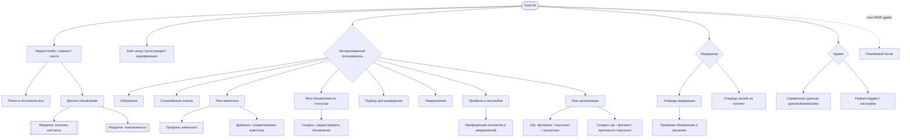

# ZooLink — UI/UX-концепт

> Фундамент для Figma. Строго на основе существующей спеки (без выдуманных фич). Где документированный поток стоит больше кликов, чем нужно — предложено **💡 UX-улучшение**.
>
> Целевые платформы (все первоклассные): **Desktop web**, **Mobile web**, **мобильное приложение**. Дизайн **mobile-first** — пользователь должен комфортно завершать любую ключевую задачу на маленьком экране.
>
> Ключевые ограничения спеки, определяющие дизайн:
> - **Два жёстко разделённых рынка** (ADR-0002): Pet vs Livestock — верхнеуровневый контекст, а не спрятанный фильтр.
> - **Нет встроенного чата** (ADR-0005): контакт передаётся действием **«Показать контакты» (Show Contacts)** на ACTIVE-объявлениях.
> - **Пре-модерация** (ADR-0003): объявления `DRAFT → PENDING_MODERATION → ACTIVE`; продавцу нужна понятная видимость статуса.
> - **Гео-поиск** (1–100 км), локализованный UI (5 языков), роли: User / Moderator / Admin (+ операторы-ИИ-агенты, ADR-0006).

---

## 0. Каталог экранов (сколько, какие)

**MVP: ~24 уникальных экрана** (+ несколько модалок/шитов). Платежи и ИИ-агентные операции — пост-MVP. Счёт не включает переиспользуемые модалки (Показать контакты, Жалоба, диалоги подтверждения) — это не полноэкранные.

| # | Экран | Главная цель | Роль | Фаза |
|---|-------|--------------|------|------|
| 1 | Маркетплейс: главная / лента | Просмотр + поиск + гео (Pet/Livestock) | Гость+ | MVP |
| 2 | Вход | Телефон/SMS + OAuth | Гость | MVP |
| 3 | Регистрация | Создание аккаунта | Гость | MVP |
| 4 | Верификация (код) | Подтверждение SMS/OAuth | Гость | MVP |
| 5 | Детали объявления | Оценить животное; Показать контакты | Гость+ | MVP |
| 6 | Избранное | Сохранённые объявления | User | MVP |
| 7 | Сохранённые поиски | Сохранённые фильтры/локации | User | MVP |
| 8 | Мои животные (список) | Управление своими животными | User | MVP |
| 9 | Профиль животного | Одно животное + записи здоровья/репро | User | MVP |
| 10 | Добавить / редактировать животное | Форма животного | User | MVP |
| 11 | Мои объявления (по статусам) | Контрол-центр продавца | User | MVP |
| 12 | Создать / редактировать объявление | Wizard объявления | User | MVP |
| 13 | Подбор для разведения | Предложения матчинга | User (заводчик) | MVP |
| 14 | Уведомления | Центр активности | User | MVP |
| 15 | Профиль | Просмотр/правка своего профиля | User | MVP |
| 16 | Настройки (преференции контактов + уведомлений) | Приватность и преференции | User | MVP |
| 17 | Мои организации | Список орг | Член орг | MVP |
| 18 | Детали организации | Филиалы / персонал / аналитика | Орг OWNER/ADMIN | MVP |
| 19 | Создать орг / филиал / пригласить персонал | Формы орг | Орг OWNER/ADMIN | MVP |
| 20 | Очередь модерации | Объявления на проверке | Модератор | MVP |
| 21 | Проверка объявления и решение | Approve/Reject/Changes | Модератор | MVP |
| 22 | Очередь жалоб на контент | Триаж жалоб | Модератор | MVP |
| 23 | Админ: справочные данные | CRUD species/breeds/cities | Админ | MVP |
| 24 | Админ: feature toggles / настройки | Системные флаги | Админ | MVP |
| — | Платёжный поток (intent → confirm → result) | Продвижение/оплата | User | Пост-MVP (gated) |
| — | Аудит/дашборд агентов | Надзор за ИИ-агентами | Админ | Пост-MVP |

**Переиспользуемые оверлеи (не считаются экранами):** шит «Показать контакты», модалка «Жалоба», диалоги подтверждения (удалить/деактивировать), bottom-sheet фильтров, загрузчик фото.

---

## 1. Информационная архитектура

### 1.1 Карта сайта (Sitemap)

### 1.2 Глобальная навигация

**Header (верхняя панель)** — постоянная:
- Слева: **Лого** → главная; **Тогл рынка** `Pet | Livestock` (жёсткое разделение, ADR-0002).
- Центр: **Поле поиска** + **чип локации** (текущий город/радиус; тап — изменить).
- Справа (гость): **Войти / Регистрация**.
- Справа (авторизован): **＋ Создать** (быстрое действие животное/объявление), **🔔 Уведомления** (бейдж), **меню аватара** (Профиль, Мои животные, Мои объявления, Организации, Настройки, Выход).

**Основная навигация** (зависит от роли):
- Desktop: **левый сайдбар** с разделами (Поиск, Избранное, Мои животные, Мои объявления, Подбор, Организации).
- Mobile: **нижний таб-бар** (макс. 5): `Поиск · Избранное · ＋Создать · Активность(уведомления) · Профиль`. Остальное — под Профилем.

**Дополнения по ролям:**
| Роль | Доп. навигация |
|---|---|
| User | (базовый набор выше) |
| Moderator | Раздел **Модерация** → Очередь, Жалобы |
| Admin | Раздел **Админ** → Справочные данные, Feature toggles |
| Член орг | **Организации** с филиалами/персоналом/аналитикой; опция «Разместить от организации» в Создать |
| ИИ-агент (ADR-0006) | Нет UI — агенты действуют через API; их действия видны в аудите модерации/админ-дашбордах |

**Footer (только desktop):** О проекте, Условия, **Приватность (152-ФЗ)**, Поддержка, **Переключатель языка** (5 языков), ссылки рынков. На мобиле футер сворачивается в список Профиль/Настройки.

---

## 2. Адаптивная стратегия (Desktop vs Mobile)

Главное правило: **ключевая воронка — найти объявление → увидеть контакты, или создать животное → создать объявление → пройти модерацию — не должна терять ни шага на мобиле.** Мобайл перестраивает, а не ампутирует.

| Паттерн | Desktop (широкий) | Mobile (web и app) |
|---|---|---|
| **Маркетплейс** | 3 зоны: сайдбар фильтров (слева) · сетка результатов 2–3 кол (центр) · карта (справа, sticky) | Один столбец карточек; фильтры → **bottom-sheet «Фильтры»**; карта → переключатель **Список/Карта** |
| **Детали объявления** | 2 кол: галерея + ключевые факты (слева) · sticky-панель «Показать контакты/Избранное/Жалоба» (справа) | Стек: галерея → факты → **sticky нижний action-bar** («Показать контакты» всегда доступна) |
| **Создание объявления / формы** | Многоколоночная форма, живой превью справа | **Пошаговый wizard** (точки прогресса), один раздел на экран, крупные тач-цели, sticky «Далее/Отправить» |
| **Мои объявления / очередь модерации (таблицы)** | Полная **таблица** (колонки: заголовок, статус, рынок, просмотры, показы контактов, дата) | Таблица → **карточки** (заголовок + чип статуса + 2 метрики + меню overflow) |
| **Аналитика орг** | Графики + таблица рядом | Графики стекаются; таблица → карточки; горизонтальный скролл только в крайнем случае |
| **Навигация** | Левый сайдбар + header | Нижний таб-бар + header с бургером для второстепенного |
| **Фильтры** | Всегда видны | Свёрнуты в кнопку **«Фильтр (N)»** со счётчиком активных фильтров |

**Особая забота на мобиле:**
- **Локация и радиус**: запрос геолокации с понятным промптом; запоминать выбор; радиус — слайдером в шите фильтров.
- **Фото при создании**: разрешить съёмку с камеры; показывать прогресс загрузки; 1–5 фото (pet) по спеке.
- **«Показать контакты»** — действие в один тап, в зоне большого пальца, в нижнем баре — это момент конверсии (нет чата, ADR-0005).
- **Bottom-sheets вместо модалок** для фильтров/раскрытия контактов — нативно, dismiss одной рукой.

---

## 3. Текстовые вайрфреймы — 3 ключевых экрана

Выбраны как самые нагруженные задачи по спеке: **(A) Лента поиска маркетплейса** (главная задача покупателя), **(B) Создание объявления** (главная задача продавца), **(C) Детали объявления + «Показать контакты»** (экран конверсии, уникальный из-за отсутствия чата).

### A. Лента поиска маркетплейса
*Цель пользователя: быстро найти релевантных животных рядом, с доверенной информацией.*

**Layout (Десктоп):**
- **[Top Bar]** Слева: Лого, тогл `Pet | Livestock`. Центр: Поиск + чип локации «Москва · 25 км ▾». Справа: ＋Создать, 🔔, Аватар.
- **[Левый сайдбар — Фильтры]** H3 «Фильтры». Контролы: Вид (дропдаун), Порода (автокомплит), Пол, Диапазон возраста, Диапазон цены (RUB; «free»=0), Тип объявления (sale/breeding/show/adoption/stud_service), Слайдер радиуса (1–100 км), Флаги здоровья (вакцинирован, стерилизован), Есть родословная (тогл). Кнопки: **Применить** · **Сбросить**. Ниже: **★ Сохранить этот поиск**.
- **[Контент — Центр]** H1 «Объявления · Pet». Дропдаун сортировки (Новые / Цена ↑ / Цена ↓ / Расстояние). **Сетка результатов (2–3 кол)** карточек: фото, заголовок, вид·порода·пол·возраст, цена/условия, **бейдж расстояния**, бейдж орг (если орг-объявление), тогл избранного ♥.
- **[Контент — Справа]** Sticky **карта** с кластеризованными пинами; ховер на карточку подсвечивает её пин.
- Бесконечный скролл / «Показать ещё».

**Layout (Мобильный):**
- **[Top Bar]** Бургер · Лого · сегмент `Pet|Livestock` · 🔔.
- **[Sub Bar]** Чип локации + кнопка **«Фильтр (3)»** + тогл **Список/Карта**.
- **[Контент]** Одноколоночные карточки (те же данные, крупнее фото). Тап «Фильтр» открывает **bottom sheet**; «Сохранить поиск» — внизу шита.
- 💡 **UX-улучшение:** автоопределение локации при первом открытии (с разрешением) и радиус по умолчанию 25 км — пользователь сразу видит релевантные близкие результаты вместо пустой/глобальной ленты.

### B. Создание объявления
*Цель пользователя: опубликовать точное объявление с минимумом усилий и знать, что оно «на проверке».*

**Layout (Десктоп):**
- **[Top Bar]** стандартный.
- **[Контент — Слева, форма]** H1 «Новое объявление». Шаг 1 **Животное**: выбор из **Мои животные** (карточки) — это **предзаполняет** вид/породу/пол/ДР/фото. Шаг 2 **Тип и детали**: listing_type, заголовок, описание, цена/условия (поля адаптируются к типу, напр. stud_service показывает плату/условия). Шаг 3 **Локация**: город + пин на карте / адрес (геокодинг). Шаг 4 **Фото**: 1–5, drag-сортировка. Шаг 5 **Орг** (опц.): «Разместить от организации» → орг + филиал.
- **[Контент — Справа]** Живая **превью-карточка** (как будет в ленте).
- Sticky-футер: **Сохранить черновик** · **Отправить на проверку**.
- При отправке → статус `PENDING_MODERATION`; показать подтверждение (см. §4).

**Layout (Мобильный):**
- **Wizard**: один шаг на экран с точками прогресса (1/5). Sticky низ **Далее / Отправить**. Превью — по ссылке «Превью».
- 💡 **UX-улучшение:** поскольку каждое объявление должно ссылаться на существующее животное (спека), **старт Создания из профиля животного** (кнопка «Разместить это животное») полностью пропускает Шаг 1 — 2 тапа вместо 5. Дать оба входа.
- 💡 **UX-улучшение:** держать объявление в `DRAFT` с автосейвом; не терять ввод, если модерация медленная или приложение закрылось.

### C. Детали объявления + «Показать контакты»
*Цель пользователя: оценить животное и безопасно связаться с продавцом.*

**Layout (Десктоп):**
- **[Top Bar]** стандартный.
- **[Контент — Слева]** Галерея фото (карусель). H1 заголовок. Строка ключевых фактов (вид·порода·пол·возраст, цена/условия, **расстояние**, дата публикации). Секции: Описание, Здоровье/темперамент, Родословная, Ссылка на профиль животного, Карточка владельца/орг (имя, город — **точный адрес скрыт**).
- **[Контент — Справа, sticky-панель]** Цена/условия · **Показать контакты** (primary) · ♥ Избранное · ⚑ Пожаловаться · Поделиться. Примечание «Адрес никогда не передаётся».
- **Показать контакты** → модалка раскрывает телефон + ссылки Telegram/VK (только те, что владелец согласился показать); раскрытие **логируется** (аналитика). Требует входа → если гость, предложить вход **только в этот момент**.

**Layout (Мобильный):**
- Стек: галерея → заголовок → ключевые факты → секции.
- **Sticky нижний action-bar**: `♥` · **Показать контакты** (primary, широкая) · `⋯` (Пожаловаться/Поделиться). Конверсионное действие всегда в одном тапе большого пальца.
- 💡 **UX-улучшение:** разрешить **просмотр и детали без аккаунта**; гейтить вход только на «Показать контакты»/«Избранное»/«Создать» — снижает трение и совпадает с моментом ценности.

---

## 4. UX Edge Cases (закрытые вопросы)

**Empty States** (иллюстрация + сообщение + primary CTA):
- Лента, нет результатов → «Нет объявлений по фильтрам» + **Сбросить фильтры** / **Расширить радиус**.
- Мои животные пусто → «Пока нет животных» + **Добавить первое животное**.
- Мои объявления пусто → «Вы ещё ничего не разместили» + **Создать объявление**.
- Избранное / Сохранённые поиски пусто → дружелюбная подсказка + ссылка на Поиск.
- Очередь модерации пуста → «Очередь пуста ✅» (позитивное подкрепление).

**Loading States:**
- Списки/лента/таблицы → **скелетоны** карточек/строк (форма контента), не спиннеры.
- Экран деталей → скелетон галереи + строк текста.
- Кнопки действия → инлайн-спиннер + disabled («Отправка…»).
- Карта → лёгкий shimmer над областью карты до загрузки пинов.

**Error States:**
- **Валидация формы** → инлайн, **под полем**, красный текст + красная рамка; сводный тост только при нескольких ошибках; submit disabled, пока невалидно. Сообщения уровня поля зеркалят 422-контракт API.
- **Серверная/сетевая ошибка** → верхний **тост** «Что-то пошло не так, попробуйте снова» + **Повторить**; сохранить ввод пользователя.
- **Доступ/403** (напр. не-модератор зашёл на mod-URL) → дружелюбный экран «Нет доступа», не сырая ошибка.
- **Геолокация отклонена** → фолбэк на ручной ввод города; никогда не блокировать ленту.

**Успех:**
- Быстрые действия (избранное, сохранить поиск) → лёгкий **зелёный тост** + смена состояния; без прерывания.
- Создать/Отправить объявление → **экран/модалка успеха**: «Отправлено на проверку 🕒 — обычно одобряется за 4ч (pet) / 6ч» + кнопки **Мои объявления** / **Создать ещё**. Чип статуса на объявлении — `PENDING_MODERATION`.
- Решение модерации → тост + элемент удалён из очереди; владелец получает уведомление.

---

## 5. Бриф для передачи дизайнеру (Design Handoff)

> **Внимание дизайнеру: при проектировании учитывай…**

1. **Mobile-first, три цели.** Сначала мобайл (app + web), затем масштаб до десктопа. Любая ключевая задача завершается на телефоне одной рукой; используй bottom-sheets и нижний action-bar, а не десктопные модалки.
2. **Разделение рынка — верхнеуровневый тогл**, не фильтр — `Pet | Livestock` в хедере и переопределяет всю ленту (ADR-0002).
3. **Нет чата — «Показать контакты» это конверсия.** Сделай её самым заметным действием на объявлении; раскрывай телефон/Telegram/VK в шите, никогда не точный адрес; действие логируется и за логином (ADR-0005).
4. **Статус объявления всегда виден продавцу** как чип: `DRAFT · PENDING_MODERATION · ACTIVE · EXPIRED · SOLD · DEACTIVATED`. Исход модерации — **отдельный** бейдж (`APPROVED/REJECTED/CHANGES_REQUESTED`). Спроектируй явно состояния «на проверке» и «запрошены изменения».
5. **Каждое объявление привязано к существующему животному** — проектируй Создание как animal-first (выбор из Моих животных → предзаполнено), со входом из профиля животного, чтобы сократить шаги.
6. **Деструктивные и необратимые действия требуют подтверждения попапом** (удалить животное/объявление, деактивировать аккаунт, reject/ban модератором). Reject/Changes-requested требует причину (из предопределённого списка) + опц. заметку.
7. **Локализация и роли меняют «хром».** Поддержка 5 языков (расширение текста, RTL не требуется); навигация и доступные действия отличаются по роли (User / Moderator / Admin / член орг). Empty/loading/error-состояния обязательны для каждого списка и формы.

---

## Совет по UX/UI (моя рекомендация)

- **Снизить трение до момента ценности.** Дать людям смотреть, искать и видеть детали **без аккаунта**; просить аутентификацию только на действии (Показать контакты / Избранное / Создать). Совпадает с моделью спеки «контакт после публикации» и максимизирует охват воронки.
- **Сжать воронку создания.** Спека подразумевает 5-шаговое создание; т.к. объявление должно ссылаться на существующее животное, кнопка **«Разместить это животное»** на профиле животного превращает это в ~2 шага. Дать оба входа; автосейв черновиков.
- **Дать гео делать работу.** Автолокация (с согласием), запомнить последний радиус и объединить гео + фильтры в одной панели — открытие это ядро задачи, оно должно быть мгновенным и локальным.
- **Доверие by design.** Для маркетплейса живых животных выводи сигналы доверия на карточках/деталях (verified phone, бейдж орг, флаги вакцинации/родословной) и держи статус модерации честным и видимым. Никогда не показывай точный адрес.
- **Продавцу нужен контрол-центр.** «Мои объявления» по статусам с понятными следующими действиями (resubmit после CHANGES_REQUESTED, renew EXPIRED) убирает путаницу пре-модерации.
- **Forward-compatible, gated.** Платежи и ИИ-агентная модерация есть в спеке, но gated/пост-MVP — оставь место в IA (напр. аффорданс «Продвинуть», вью аудита агентов), не строя их сейчас.

> Итог: UX ZooLink держится на **быстром локальном открытии → доверенном объявлении → контакте в один тап**, плюс **спокойном жизненном цикле продавца** вокруг пре-модерации. Сделай эти две петли лёгкими на мобиле — и продукт ощущается отлично.

> _EN-канон: `docs/05-ui-ux/ui_ux_concept.md`._
