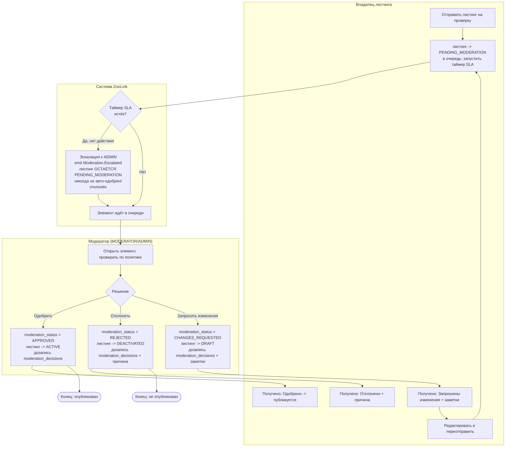
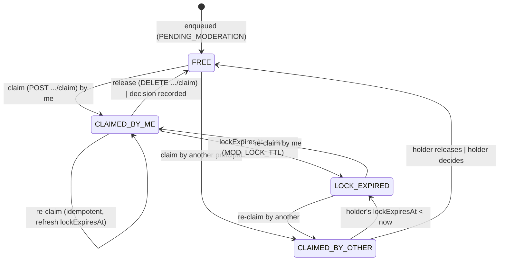

# Спецификация: Домен модерации

## Результат
Предоставить надежный рабочий процесс модерации пользовательского контента (объявлений, профилей животных и т.д.) для обеспечения соответствия политикам платформы, юридическим требованиям и стандартам сообщества. Позволить модераторам просматривать отправки, принимать решения (одобрить, отклонить, запросить изменения) и вести журнал аудита всех действий модерации.

## Область и границы
**Включено:**
- Очередь модерации для объявлений, ожидающих проверки
- Очередь модерации для профилей животных, ожидающих проверки (если применимо)
- Интерфейс модератора для просмотра элементов очереди, доступа к деталям элемента и принятия решений
- Типы решений: Одобрить, Отклонить, Запросить изменения (с конкретными причинами)
- Автоматические триггеры модерации (например, обнаружение ненормативной лексики, обнаружение дубликатов) - откладывается на этап 2
- Процесс обжалования для отклоненных элементов - откладывается на этап 2
- Журнал аудита записывает: ID модератора, timestamp, решение, причину и любые заметки
- Уведомления пользователям о решении модерации (через домен уведомлений)
- Управление доступом на основе ролей: только пользователи с ролью MODERATOR или ADMIN могут получить доступ к функциям модерации
- Интеграция с доменом объявлений (для модерации объявлений) и доменом животных (для модерации профилей животных)
- Массовые действия модерации (одобрить/отклонить несколько элементов) - откладывается на этап 2

**Исключено:**
- Автоматическая модерация контента (анализ изображений/текста на основе ИИ) - откладывается на этап 2
- Система репутации пользователей на основе истории модерации - откладывается на этап 2
- Юридический поток проверки для элементов высокого риска - откладывается на этап 2
- Публичные журналы модерации (отчеты о прозрачности) - откладывается на этап 2
- Интеграция с внешними сервисами модерации (например, сторонними фильтрами контента) - откладывается на этап 2

## Ограничения
- **Юридическое:** Д необходимо соблюдать требования Федерального закона 152-ФЗ (Персональные данные) при обработке пользовательского контента, который может содержать персональные данные. Необходимо соблюдать российские законы о запрещенном контенте (экстремизм и т.д.).
- **Производительность:** Получение очереди модерации < 2с при нормальной нагрузке; обработка индивидуального решения модерации < 1с.
- **Удобство использования:** Интерфейс модератора должен быть простым и эффективным для высокообъемной модерации (целевой показатель: <30 секунд на проверку элемента).
- **Масштабируемость:** Система должна поддерживать 10k+ решений модерации в день.
- **Технология:** Должна соответствовать выбранному стеку (NestJS, TypeScript, PostgreSQL, Redis).
- **Данные:** Решения модерации и журналы аудита должны храниться неизменяемо (дозапись только) для предотвращения подделки.
- **Надежность:** Решения модерации должны сохраняться надежно; нет потери решений или журнала аудита.

## Предыдущие решения
- Модерация реализована как отдельный модуль NestJS с собственным сервисом и контроллером.
- Очередь модерации хранится в PostgreSQL с полем статуса (PENDING, APPROVED, REJECTED, CHANGES_REQUESTED).
- Каждая модерируемая сущность (объявление, профиль животного) имеет статус модерации и ссылку на запись решения модерации.
- Модераторы получают доступ к очереди через конечную точку API с постраничным выводом и опциями фильтрации (по типу сущности, дате отправки и т.д.).
- Причины решений выбираются из заранее определённого списка (настраивается через Домен администрирования) с опциональными заметками в свободной форме.
- Уведомления отправляются асинхронно через домен уведомлений после принятия решения модерации.
- Журнал аудита хранится в отдельной таблице для обеспечения неизменяемости и возможности проведения судебно-технической экспертизы.
- Интерфейс модерации является частью административной панели (Домен администратора), но доступен пользователям с ролью MODERATOR.

## Трассируемость NFR
Эта спецификация отвечает следующим нефункциональным требованиям:
- **Производительность (NFR-PERF)**: Задержка API модерации < 800ms для 95% запросов при нагрузочном тестировании (50 RPS) (см. docs/02-requirements/nfr/performance.md)
- **Безопасность (NFR-SEC)**: Действия модерации требуют аутентификации и авторизации; журналы аудита защищены от подделки (см. docs/02-requirements/nfr/security.md)
- **Доступность (NFR-ACC)**: Интерфейс модератора следует рекомендациям WCAG 2.1 AA (см. docs/02-requirements/nfr/accessibility.md)

## Поток процесса (в стиле BPMN)

Рабочий процесс пре-модерации (ADR-0003): листинг не виден публично до одобрения. Связан со [`statemachines/listing_state_machine.md`](statemachines/listing_state_machine.md). Все решения пишутся в `moderation_decisions` только на дозапись (append-only).

### Ключевые правила
- **Актёры:** Владелец (отправляет/редактирует), Модератор (решает), Система (очередь, SLA, сохранение, уведомления).
- **Покрытые ветки:** Одобрить / Отклонить / Запросить изменения — каждая ведёт к переходу `listings.status` + `moderation_status`. **Таймаут SLA НЕ решает:** он **эскалирует к ADMIN** (`Moderation.Escalated`), и элемент **остаётся `PENDING_MODERATION`** — никогда не авто-одобряется и не авто-отклоняется (см. round-5 §SLA и `statemachines/listing_state_machine.md`).
- **Аудит:** каждое решение — append-only строка `moderation_decisions` (неизменяемая; UPDATE/DELETE блокируется триггером).
- **Уведомления** отправляются через домен уведомлений на каждое терминальное решение.

> **(round-N, нормативно — D1-реконсиляция) WHAT:** ветка таймаута SLA (mermaid + буллет «Покрытые ветки») изменена с «авто-отклонение → листинг EXPIRED / moderation_status REJECTED» на «**эскалация к ADMIN, элемент остаётся PENDING_MODERATION, никогда не авто-одобрен/отклонён**» (и ребро `TO → Rejected-notification` убрано).
> **WHY:** спека противоречила себе — BPMN-диаграмма + буллет говорили об авто-отклонении, но round-5 нормативный §SLA/escalation **и** `listing_state_machine.md:23/58/85` уже говорят escalate-stays-PENDING. По иерархии истины конфликт code↔doc/doc↔doc чинится в сторону нормативного текста + стейт-машины; диаграмма была устаревшим артефактом меньшей точности.
> **WHY-BETTER-for-the-whole-project:** единая SLA-семантика через спеку↔стейт-машину↔контракт (`slaState`/`escalated` — derived-read-only в 4a); нет молчаливого уничтожения листинга продавца при медлительности оператора (не-решение никогда не должно завершать контент); активное событие/джоба эскалации чисто заскоплены на **Slice 4b**, оставляя lock-expiry-computed модель 4a самодостаточной. Альтернатива (сделать авто-отклонение реальным) отвергнута: она бы вернула карающий авто-терминал, запрещённый стейт-машиной, и сломала бы P0-модель «только APPROVE→ACTIVE / явное решение→терминал».

## Разбивка на задачи
1. **Бэкенд (NestJS)**
   - [ ] Создать модуль `moderation` с помощью CLI NestJS
   - [ ] Определить модель ModerationDecision (Prisma) с полями: id, moderatorId (ссылка на пользователя), entityType (Listing/Animal), entityId, решение (APPROVED/REJECTED/CHANGES_REQUESTED), причина (enum), примечания (опционально), createdAt
   - [ ] Добавить поле moderationStatus в сущности Listing и Animal (или создать таблицу ассоциаций)
   - [ ] Реализовать ModerationController (получение очереди, получение деталей элемента, отправка решения)
   - [ ] Реализовать ModerationService (бизнес-логика получения очереди, обработки решения, запуска уведомлений)
   - [ ] Создать enum причины модерации и механизм конфигурации (через Домен администратора)
   - [ ] Настроить ограничение скорости для конечных точек модерации
   - [ ] Написать unit- и интеграционные тесты для потоков модерации
   - [ ] Создать документацию OpenAPI (Swagger) для конечных точек модерации

2. **Фронтенд (React)**
   - [ ] Создать страницу очереди модерации (часть административной панели)
   - [ ] Реализовать представление деталей элемента (показ деталей объявления/животного с элементами управления модерацией)
   - [ ] Реализовать форму отправки решения (выбор причины, примечания)
   - [ ] Создать защиту маршрутов на основе ролей модератора
   - [ ] Реализовать обновления очереди в реальном времени (через WebSocket или опрос)
   - [ ] Написать unit- и e2e-тесты для потоков модерации

3. **Инфраструктура**
   - [ ] Настроить индексы PostgreSQL для запросов очереди модерации (по статусу, типу сущности, createdAt)
   - [ ] Настроить кэширование Redis для очереди модерации (опционально, для производительности)
   - [ ] Добавить заголовки безопасности и конфигурацию CORS
   - [ ] Реализовать журналирование событий модерации (принято решение, доступ к очереди)

## Критерии верификации
- [ ] Unit-тесты обеспечивают покрытие >90% для модуля модерации (бэкенд)
- [ ] Интеграционные тесты покрывают: получение очереди, отправку решений (все типы решений), запуск уведомлений, создание журнала аудита
- [ ] E2E-тесты (Cypress/Playwright) покрывают полный поток модератора: вход в систему -> просмотр очереди -> проверка элемента -> отправка решения -> проверка отправки уведомления
- [ ] Ручное тестирование: проверка правильного сохранения решения модерации, неизменяемости журнала аудита, отправки уведомлений
- [ ] Производительность: задержка API модерации < 800ms для 95% запросов при нагрузочном тестировании (50 RPS)
- [ ] Безопасность: проверка, что только роли MODERATOR и ADMIN имеют доступ к конечным точкам модерации
- [ ] Документация: спецификация OpenAPI сгенерирована и доступна по адресу /api/docs
- [ ] Трассируемость NFR: проверка, что требования производительности, безопасности и доступности правильно учтены и документированы

---

## Операции очереди (раунд 5, нормативно)

- **Очередь и FIFO:** очередь = объявления в `PENDING_MODERATION`, порядок по `moderation_enqueued_at ASC` (ставится
  при сабмите), индекс `idx_listings_modqueue`. Цель <2 с / 100 элементов.
- **Назначение / блокировка (без двойной модерации):** модератор **захватывает** задачу — `assigned_to`, `locked_at`,
  `lock_expires_at` (миграция 0009). Захват эксклюзивен на `MOD_LOCK_TTL` (по умолч. 15 мин, авто-снятие по истечении).
  Два модератора (или AI-агент + человек) не могут действовать над одним элементом; второй захват → `409`.
- **Таксономия причин:** `moderation_reasons` засеяна (миграция 0010): `prohibited_species, incomplete_info,
  poor_photos, suspected_fraud, price_violation, wrong_category, duplicate, animal_welfare, policy_violation`.
  Причина **обязательна** при REJECT и CHANGES_REQUESTED; её `description_localized` идёт в уведомления
  `listing_rejected`/`listing_changes_requested` (переменная `reason`).
- **Ре-модерация при правке:** редактирование **существенных полей** ACTIVE-объявления (title, description, фото,
  цена, species/breed, listing_type) возвращает его в `PENDING_MODERATION` (`moderation_status='PENDING'`); тривиальные
  правки — нет. Энфорс в сервис-слое.
- **SLA и эскалация:** часы SLA с `moderation_enqueued_at`; при таймауте — **эскалация ADMIN** (событие
  `Moderation.Escalated`), остаётся `PENDING_MODERATION` — без авто-одобрения/отклонения.
- **Модерация животных:** в MVP животные **не** модерируются отдельно; животное проверяется через своё объявление.
  `entity_type='ANIMAL'` в `moderation_decisions`/`content_reports` используется только для решений **по жалобам**, не как отдельная очередь.
- **Апелляции:** **нет апелляций в MVP** — hard REJECT терминален (продавец создаёт новое исправленное объявление);
  исправимый путь — CHANGES_REQUESTED. (Апелляции — Фаза 2; appeal-rate не метрика MVP.)
- **Аудит:** каждое решение пишет `moderation_decisions` (append-only) **и** строку `audit_log`.
- **AI-модератор (ADR-0006):** AGENT использует тот же claim/lock-контракт; гейтится feature-флагом, в MVP выключен.

## Стейт-машина claim/lock и форма контракта (B10, раунд 5, нормативно)

Форма контракта заложена сейчас в `moderation-api.yaml` (ФОРМА сейчас, поведение — с доменом Moderation).
Приводит контракт в соответствие с операциями очереди раунда 5 выше.

### Стейт-машина claim/lock (на элемент очереди, относительно вызывающего принципала)

- **Таблица триггеров/гвардов**

| Из | Действие | Гвард | В | Иначе |
|---|---|---|---|---|
| FREE / LOCK_EXPIRED | claim | элемент в PENDING_MODERATION | CLAIMED_BY_ME | 404, если не в очереди |
| CLAIMED_BY_OTHER (живой lock) | claim | — | (нет перехода) | **409 `ALREADY_CLAIMED`** (несёт текущего держателя Actor + lockExpiresAt) |
| CLAIMED_BY_ME | claim (re-claim) | вызывающий == держатель | CLAIMED_BY_ME (обновить TTL) | — |
| CLAIMED_BY_ME | release (DELETE) | вызывающий == держатель OR ADMIN | FREE | **409 `NOT_LOCK_HOLDER`** |
| CLAIMED_BY_ME | submit decision | вызывающий держит живой lock | FREE (+ решение) | **409 `NOT_LOCK_HOLDER`** / **409 `ITEM_NOT_CLAIMED`**, если нет живого lock |

- **TTL блокировки:** `MOD_LOCK_TTL` (по умолч. 15 мин). Истечение авто-снимает (фоновая задача не требуется —
  истечение вычисляется из `lock_expires_at < now()`); фоновый sweep МОЖЕТ обнулять устаревшие колонки, но для
  корректности не обязателен.
- **Паритет AGENT:** AGENT-принципал использует идентичный claim/lock-контракт (ADR-0006, gated).

### SLA / эскалация
- `slaState ∈ {ON_TRACK, BREACHED, ESCALATED}` выводится из `waitingSeconds` относительно цели (ADR-0003: pet <4ч,
  livestock <6ч рабочих часов — точные пороги владеет конфиг). **ESCALATED** = сработал таймаут SLA →
  событие `Moderation.Escalated` к ADMIN; элемент **остаётся PENDING_MODERATION**, без авто-одобрения/отклонения.
- Фильтры очереди: `market`, `slaState`, `escalated=true` (≡ `slaState=ESCALATED`), `lockState`.
- `meta.counts` (byMarket, bySlaState) даёт счётчики-бейджи на вкладках оператора по всей отфильтрованной очереди.

### Agent-transparency (решение владельца #5, зафиксировано 2026-06-24 — показывать «решено ИИ» ВСЕМ)
- Записи операторских решений (`ModerationDecision`) уже несут agent-бейдж `Actor` (B0.6/ADR-0011 §6).
- **Для владельца:** `GET /listings/{id}/moderation-result` → `OwnerModerationResult` несёт
  `decidedBy.principalType` + `decidedByAgent`, чтобы **продавец** видел, решил ли ИИ или человек, плюс
  разрешённые причину/заметки и цепочку human-override (`isHumanOverride`/`supersedesDecisionId`). Чтение владельца
  в `listings-api` ДОЛЖНО встраивать ту же проекцию как аддитивное поле `lastModerationResult` (отмечено для
  backend + doc-keeper).

### Decision-templates = контролируемый словарь (ТАБЛИЦА, не enum) — решение о фазировании §5
**ЧТО:** Заготовленные формулировки решений для REJECT/CHANGES_REQUESTED моделируются как reference-data — НОВАЯ
таблица `decision_templates` (контролируемый, расширяемый админом словарь; `code` PK, `body_localized` JSONB,
`applies_to_decision`, `market`, `related_reason_code`, `sort_order`, `is_active`, provenance) — отдаётся через
`GET /moderation/decision-templates` и выбирается через `ModerationActionRequest.templateCode`. **НЕ enum.**

**ПОЧЕМУ:** Шаблоны — это редактируемый бизнесом контент, который растёт со временем и который ИИ-агент должен
выбирать по стабильному ключу. Это заметки (свободная проза), отличные от обязательной таксономии
`moderation_reasons` (почему-отклонено).

**ПОЧЕМУ ТАК ЛУЧШЕ для проекта:** По §5 cost-of-change — enum вынуждал бы **переписывать контракт + схему** каждый
раз, когда оператор добавляет/правит шаблон (rewrite-test = да); таблица делает новый шаблон одной строкой данных
с **нулевым изменением схемы/контракта**. Она зеркалит проверенную форму reference-data `moderation_reasons` и
конвенцию A2 (`sort_order`/provenance/JSONB-локализация), сохраняет оба языка для операторского редактора (B0.4) и
даёт AGENT стабильный `code` для выбора — agent-first, форвард-совместимо. → **миграция схемы отмечена для
`zoolink-backend-engineer`** (НЕ реализована в этом раунде контракта).

### Коды ошибок B10 (расширяют domain-specific набор API_CONVENTIONS §4)
| code | HTTP | Когда |
|---|---|---|
| `ALREADY_CLAIMED` | 409 | claim на элементе с живым lock другого принципала |
| `NOT_LOCK_HOLDER` | 409 | release/decide не-держателем |
| `ITEM_NOT_CLAIMED` | 409 | decide на элементе без живого lock |

## Admin Slice 4a — инварианты и негативные случаи модерации (round-N, нормативно)

> **Замечание об источнике правды.** Это общий список инвариантов/негативных случаев для
> **backend-engineer** и **reviewer-qa** (гейт) для Slice 4a — та же роль, что списки
> `L-P0..L-15` / `L2-1..L2-16` для листингов. Контракт:
> [moderation-api.yaml](../03-architecture/api-contracts/moderation-api.yaml) (полный — preflight
> не нашёл пробелов в эндпоинтах/схемах; без миграции — claim/lock-колонки, append-only-журнал
> `moderation_decisions`, словари `decision_templates`/`moderation_reasons` и P0-триггер — всё на
> live PG). Стейт-машины: [listing_state_machine.md](statemachines/listing_state_machine.md)
> (модель `status`/`moderation_status` + P0) и стейт-машина claim/lock выше.
>
> **WHAT:** формализовать инварианты модерации Slice-4a (P0 ACTIVE-gate, атомарное решение+
> переход+аудит, claim/lock single-winner, append-only + human-override, agent-as-principal
> прозрачность, обязательная причина, authz, derived-read-only SLA).
> **WHY:** контракт полон, но инварианты были разбросаны по round-5-прозе, двум
> стейт-машинам, ADR-0003/0006/0011 и триггерам схемы — бэкенду и гейту нужен
> один нумерованный список для сборки и проверки (без re-derivation, без расхождений).
> **WHY-BETTER-for-the-whole-project:** один источник правды привязывает бэкенд-тесты и QA-покрытие
> к одним инвариантам; guard P0 ACTIVE-requires-APPROVED остаётся единственным якорем безопасности
> (DB-триггер backstop + сервис); append-only-журнал + цепочка human-override остаются tamper-proof
> и экспортируемыми для регулятора; agent-as-principal прозрачность (решение владельца #5) подключена сейчас, чтобы
> AGENT-путь включился (за своим тогглом) без переписывания; SLA остаётся derived-read в 4a,
> так что активная джоба эскалации чисто откладываема на 4b.

### Scope Slice-4a

**IN:** чтение очереди (FIFO, фильтры, счётчики), claim / release, listing-detail-for-moderation,
submit decision (APPROVE / REJECT / REQUEST_CHANGES, вкл. строку human-override), список решений,
словари reasons & decision-templates, чтение owner moderation-result. **Snapshot/прозрачность
для AGENT-решений работает сейчас**; AGENT-decisioning гейтится feature-тогглом (off в
MVP). **Отложено на Slice 4b** (эндпоинты/таблицы существуют — затрекано, НЕ молча построено или выброшено):
**content-reports** (`createContentReport` / `listContentReports` / `resolveContentReport`;
таблица `content_reports`) и **активная джоба SLA-эскалации** (планировщик существует, но истечение lock —
**вычисляемое** `lock_expires_at < now()`, так что 4a не нужна фоновая джоба для корректности;
emission `Moderation.Escalated` + admin-обработка эскалации — 4b). Апелляции, bulk-действия и
AI-анализ контента — Фаза 2 (round-5 §Appeals / scope).

### Инварианты и негативные случаи

| # | Инвариант (ДОЛЖЕН выполняться) | Негативный случай (ДОЛЖЕН отклоняться/обрабатываться) | Обеспечивается | Ошибка → HTTP / code |
|---|---|---|---|---|
| M-P0 | **Нет ACTIVE без APPROVED.** `APPROVE` — **единственное** решение, ставящее листинг ACTIVE; `REJECT`→DEACTIVATED, `REQUEST_CHANGES`→DRAFT. Ни один эндпоинт не достигает ACTIVE кроме `submitModerationAction(APPROVE)`. | любой путь, ставящий `status=ACTIVE` при `moderation_status≠APPROVED`. | DB `trg_listing_active_requires_approval` (RAISE) + сервис | 422 `VALIDATION_ERROR` (trigger backstop) |
| M-1 | **Атомарное решение + переход + аудит.** Дозапись `moderation_decisions`, флип `listings.status`/`moderation_status` **и** строка `audit_log` — **ОДНА транзакция** — всё-или-ничего. | закоммиченное решение без перехода; переход без строки журнала; решение без строки аудита. | одна DB-транзакция (сервис) | 500 `INTERNAL` (откат; без частичного состояния) |
| M-2 | **Claim single-winner (TOCTOU).** Конкурентные claim'ы на FREE-элементе → ровно один 200, остальные 409; guarded conditional UPDATE / `SKIP LOCKED`. | два принципала оба считают, что держат lock. | сервис guarded UPDATE (`WHERE assigned_to IS NULL OR lock_expires_at < now()`) | 409 `ALREADY_CLAIMED` (несёт holder Actor + lockExpiresAt) |
| M-3 | **Re-claim держателем идемпотентен** — обновляет TTL (`MOD_LOCK_TTL`=15 мин); **истечение lock вычисляется** (`lock_expires_at < now()` освобождает его; фоновая джоба в 4a не нужна). | re-claim держателя выдаёт ошибку; устаревший lock блокирует навсегда. | сервис (проверка держателя + вычисляемое истечение) | 200 (идемпотентный refresh) |
| M-4 | **Decide требует живой lock, удерживаемый вызывающим**; успех освобождает lock. | действие на элементе, заблокированном другим принципалом. | сервис (holder + live-lock проверка) | 409 `NOT_LOCK_HOLDER` |
| M-5 | — (тот же гейт, no-lock случай) | действие на элементе **без** живого lock. | сервис | 409 `ITEM_NOT_CLAIMED` |
| M-6 | **Append-only журнал.** UPDATE/DELETE `moderation_decisions` блокируется. | любой UPDATE/DELETE строки решения. | DB `trg_block_modify_append_only` (RAISE) | DB exception (не API-путь) |
| M-7 | **Human-override = НОВАЯ строка**, никогда не мутация: `supersedesDecisionId` задан + `isHumanOverride=true` + `principalType=HUMAN`; superseded-строка не тронута; biconditional `isHumanOverride ⟺ supersedesDecisionId` выполняется; superseded-решение должно быть на **той же** `(entityType, entityId)`. | мутация superseded-строки; override с `principalType=AGENT`; один из override-пары задан без другого; supersede решения на другой сущности. | DB `chk_moddec_override` + сервис (HUMAN-only + same-entity проверка) | 422 `VALIDATION_ERROR` (несовпадение/другая-сущность); 403 `FORBIDDEN` (AGENT пытается override) |
| M-8 | **Agent-as-principal сквозной.** AGENT-решение снапшотит `actor_principal_type='AGENT'` + `actor_role`; owner-result и список решений выставляют `principalType`/`decidedByAgent` (прозрачность для всех — решение владельца #5). Нет HUMAN-only пути решения; AGENT-decisioning гейтится feature-тогглом (off MVP), но snapshot+прозрачность работают сейчас. | AGENT-решение, скрывающее свой principalType; решение без snapshot актора. | сервис snapshot (ADR-0011 §1/§6) + колонки схемы + feature-toggle | n/a (инвариант времени записи); 403 если AGENT действует при выключенном toggle |
| M-9 | **`reason` обязателен для REJECT / REQUEST_CHANGES**; должен FK на seeded `moderation_reasons.code`. (`APPROVE` причины не требует.) | REJECT/REQUEST_CHANGES без причины, или неизвестный код причины. | сервис + FK на `moderation_reasons` | 422 `VALIDATION_ERROR` |
| M-10 | **`templateCode` опционален**, должен ссылаться на `decision_templates.code` если присутствует (сервер резолвит body в notes; `notes` может расширить/переопределить). | неизвестный `templateCode`. | сервис + FK на `decision_templates` | 422 `VALIDATION_ERROR` |
| M-11 | **Operator authz:** queue / claim / release / action / decisions / reasons / templates = **только MODERATOR | ADMIN**. | USER (или неаутентифицированный) обращается к любому operator-эндпоинту. | `x-required-roles` + сервис | 403 `FORBIDDEN` (401 если неаутентифицирован) |
| M-12 | **Owner-result object-level authz:** `getOwnerModerationResult` (и встроенный `lastModerationResult`) = **владелец** листинга ИЛИ только MODERATOR/ADMIN. | не-владелец USER читает moderation-result другого продавца. | сервис object-level правило (как Slice-1 read-scope) | 403 / 404 (без утечки существования/деталей) |
| M-13 | **SLA derived & read-only в 4a:** `slaState`/`escalated`/`waitingSeconds` **вычисляются** из `moderation_enqueued_at` vs пороги; **нет авто-reject/авто-approve**; элемент никогда не покидает PENDING_MODERATION при таймауте (событие/джоба эскалации = 4b). | любой код, переводящий элемент с PENDING_MODERATION при таймауте SLA. | сервис (derived read; нет write-пути при таймауте) | n/a (derived); D1-реконсиляция |
| M-14 | **Re-moderation при материальной правке:** правка материальных полей ACTIVE-листинга (title/description/photos/price/species/breed/listing_type) возвращает его в PENDING_MODERATION (`moderation_status='PENDING'`); тривиальные правки — нет. | материальная правка, оставляющая листинг ACTIVE без re-review. | сервис (детекция материальных полей) | n/a (переход); композируется с M-P0 |

**B10 / domain-коды ошибок используемые:** `ALREADY_CLAIMED` (409), `NOT_LOCK_HOLDER` (409),
`ITEM_NOT_CLAIMED` (409); плюс стандартные `VALIDATION_ERROR` (422 — reason/template/override/
P0-триггер), `FORBIDDEN` (403 — operator authz, owner-scope, AGENT-override/toggle), `NOT_FOUND`
(404 — не в очереди / owner-scope no-leak), `INTERNAL` (500 — откат атомарной txn).

**RBAC (rbac-matrix.md):** очередь модерации & решение = MODERATOR (C: approve/reject/changes) +
ADMIN (C); owner moderation-result = владелец листинга или MODERATOR/ADMIN. Operator-строка применяется
одинаково независимо от `principal_type` (ADR-0011 §7 — AGENT-модератор держит ту же строку).

## Slice 4b — инварианты и негативные случаи content-reports (round-N, нормативно)

> **Замечание об источнике правды.** Общий список инвариантов/негативных случаев для **backend-engineer** и
> **reviewer-qa** для Slice 4b (content-reports), та же позиция/паттерн, что список M выше.
> Контракт: [moderation-api.yaml](../03-architecture/api-contracts/moderation-api.yaml)
> (блок `/content-reports`). Жизненный цикл:
> [content_report_state_machine.md](statemachines/content_report_state_machine.md). Без миграции —
> `content_reports`, dedup partial-unique `uq_open_report_per_reporter_entity` и status-CHECK —
> на live PG.
>
> **WHAT:** добавить reporter-read-путь (file / role-scoped list / object-scoped get / MOD-resolve)
> и формализовать CR-1..CR-11. **WHY:** rbac-matrix:67/101 даёт USER «C own, R own» на content-
> reports — read-путь **в MVP** (DRIFT-2), а `If-Match` у resolve нужен реальный GET как источник
> ETag (DRIFT-1); без них report-флоу несобираем. **WHY-BETTER-for-the-whole-
> project:** переиспользует read-scope-паттерн листингов (USER self-scoped, не может расширить — IDOR-safe);
> dedup-индекс делает report-spam DB-enforced 409, а не сервисной гонкой; reason-enum держит
> данные agent-friendly и без мусора без миграции; resolve остаётся только MOD/ADMIN, а append-
> trail + аудит остаются атомарными; флоу report-resolve и entity-action остаются разделёнными (DRIFT-3).

### Scope Slice-4b

**IN:** `POST /content-reports` (file), `GET /content-reports` (role-scoped list),
`GET /content-reports/{id}` (object-scoped get — DRIFT-1), `PATCH /content-reports/{id}`
(resolve, MOD/ADMIN). MVP entity_types **LISTING | ANIMAL | USER**; **MESSAGE** — forward-compat
форма, отклоняется в MVP (ADR-0005). **Отложено/forward-compat (затрекано, не построено):** MESSAGE-
жалобы (чат — Фаза 2+), «resolve-and-act» удобство, композирующее report-resolve с 4a
entity-решением (держится разделённым по DRIFT-3), report-driven очереди модерации животных/пользователей.

### Инварианты и негативные случаи

| # | Инвариант (ДОЛЖЕН выполняться) | Негативный случай (ДОЛЖЕН отклоняться/обрабатываться) | Обеспечивается | Ошибка → HTTP / code |
|---|---|---|---|---|
| CR-1 | **`reporter_id` = аутентифицированный актор** (server-derived). | `reporterId` в теле (любое значение — IDOR). | сервис (игнор/reject body reporterId) | значение тела не доверяется; никогда не задаётся клиентом |
| CR-2 | **Dedup:** максимум одна OPEN-жалоба на `(reporter, entity_type, entity_id)`. | вторая жалоба при существующей OPEN на ту же цель. | DB `uq_open_report_per_reporter_entity` (23505) + сервис | 409 `DUPLICATE_REPORT` |
| CR-3 | **Цель должна существовать** для своего `entity_type`. MVP-набор = LISTING|ANIMAL|USER. | жалоба на несуществующую сущность; `MESSAGE`-жалоба (чат вне MVP, ADR-0005). | сервис existence-проверка + entity_type-гейт | 404 `NOT_FOUND` (missing target); 422 `ENTITY_TYPE_UNAVAILABLE` (MESSAGE) |
| CR-4 | **File authz:** любой **аутентифицированный** пользователь может подать. | неаутентифицированный запрос. | глобальный auth | 401 `UNAUTHENTICATED` |
| CR-5 | **Read-scope:** USER видит **только свои** жалобы на list **и** get (`reporter_id=actor`, AND-пересекается, не может расширить); MODERATOR|ADMIN видят все. | не-владелец USER читает чужую жалобу (list-утечка или `GET /{id}`). | сервис object/query scope (listScope-паттерн) | 404 `NOT_FOUND` на get (без утечки существования); self-scoped строки на list |
| CR-6 | **Resolve authz: только MODERATOR|ADMIN** — reporter не может разрешить свою жалобу. | USER (вкл. reporter'а) PATCH'ит жалобу. | `x-required-roles:[MODERATOR,ADMIN]` + сервис | 403 `FORBIDDEN` |
| CR-7 | **Легальность перехода:** OPEN→{REVIEWED,DISMISSED,ACTIONED}; REVIEWED→{DISMISSED,ACTIONED}. | нелегальная цель (напр. →OPEN, или пропуск правил). | сервис (transition-таблица) | 422 `VALIDATION_ERROR` |
| CR-8 | **Терминальная неизменяемость:** DISMISSED/ACTIONED терминальны. | resolve на уже-терминальной жалобе. | сервис (state precondition) + status CHECK | 409 `REPORT_TERMINAL` |
| CR-9 | **Resolve ставит `resolved_by` + аудит в одной txn.** Snapshot актора `{actorId, principalType}` (agent-ready). | терминальный переход без `resolved_by` или без строки аудита; частичная запись. | одна DB-транзакция (сервис) | 500 `INTERNAL` (откат) |
| CR-10 | **Оптимистичная конкуренция на resolve** (`If-Match` из `GET /content-reports/{id}`). | конкурентный resolve с устаревшим ETag; нет If-Match. | сервис ETag-сравнение | 412 `STALE_RESOURCE` / 428 |
| CR-11 | **`reason` ∈ enum** {SPAM,ABUSE,FRAUD,INAPPROPRIATE,OTHER}; **`entity_type` ∈ MVP-набор**. | free-string/неизвестный reason; out-of-set entity_type. | сервис enum-валидация (DB-колонка остаётся VARCHAR(50)) | 422 `VALIDATION_ERROR` |
| CR-12 | **ACTIONED развязан с entity-действием** (DRIFT-3, MVP-loose): resolve фиксирует только статус жалобы; entity-действие — отдельный 4a-шаг. | report-resolve, пытающийся также мутировать/деактивировать целевую сущность. | сервис (resolve не несёт entity-action полей) | n/a (по форме контракта) |

**B10 / domain-коды ошибок используемые (расширяют API_CONVENTIONS §4):** `DUPLICATE_REPORT` (409),
`ENTITY_TYPE_UNAVAILABLE` (422), `REPORT_TERMINAL` (409); плюс стандартные `VALIDATION_ERROR` (422 —
reason/entity_type/transition), `FORBIDDEN` (403 — resolve authz), `NOT_FOUND` (404 — target
missing / read-scope no-leak), `UNAUTHENTICATED` (401), `STALE_RESOURCE` (412), `INTERNAL` (500),
`RATE_LIMITED` (429 — report-spam).

**RBAC (rbac-matrix.md:67/101, подтверждено — reporter-read-путь его соблюдает):** USER = **C own,
R own** (file любой; читает **только свои** жалобы); MODERATOR = R/U (resolve) все; ADMIN = R/U/D все.
Read-путь, построенный здесь, точно соответствует «R own» (CR-5); resolve остаётся operator-only (CR-6).

## Slice 4c — инварианты SLA-эскалации + встраивания moderation-result (round-N, нормативно)

> **Замечание об источнике правды.** Общий список инвариантов для **backend-engineer** и **reviewer-qa**
> для Slice 4c — **аддитивная/безопасная пара**: (A) SLA-job эскалации, эмитящий
> `Moderation.Escalated`, и (B) встраивание `lastModerationResult` в листинг. Событие:
> [event-catalog.md](event-catalog.md) (`Moderation.Escalated`). Встраивание:
> [listings-api.yaml](../03-architecture/api-contracts/listings-api.yaml) `Listing.lastModerationResult`
> (inline-зеркало [moderation-api.yaml](../03-architecture/api-contracts/moderation-api.yaml)
> `OwnerModerationResult`). **M-14 (переход ACTIVE→PENDING re-moderation + сброс `escalated_at`)
> вынесена в Slice 4d — НЕ в scope здесь.**
>
> **WHAT:** формализовать инварианты escalation-job (SLA-1..5) и инварианты embed (EMB-1..4).
> **WHY:** 4c строит две независимые, side-effect-light части поверх уже-нормативной
> SLA-модели (M-13, D1-реконсиляция) и 4a owner-result; им нужны явные инварианты, чтобы
> job оставался read-only, а embed — leak-free.
> **WHY-BETTER-for-the-whole-project:** escalation-job — **чисто read-side** (никогда не меняет
> состояние листинга), так что может поставляться без риска для контента; `escalated_at` делает эмиссию
> at-least-once-safe и once-per-item; embed переиспользует 4a object-scope (без новой authz-поверхности)
> и только single-get (без list N+1). Оба аддитивны — consumer, игнорирующий их, продолжает работать.

### Scope Slice-4c

**IN:** (A) SLA-job эскалации (скан PENDING_MODERATION за порогом → эмит
`Moderation.Escalated` один раз на элемент через outbox; ставит `listings.escalated_at`); (B)
встраивание `lastModerationResult` в `GET /listings/{id}`. **Отложено:** admin-notification **fan-out** —
это notification-consumer события (emit-only в 4c; рекомендуется активный fan-out как
fast-follow — очередь **уже** выставляет `escalated`/`slaState=ESCALATED` как derived-read, так что
операторы не слепы в промежутке). **НЕ в 4c (→ Slice 4d, M-14):** переход ACTIVE→PENDING
re-moderation, **сброс** `escalated_at` при re-enqueue, source-states resolve PATCH,
уточнение re-moderation по виду/породе.

### Инварианты и негативные случаи

| # | Инвариант (ДОЛЖЕН выполняться) | Негативный случай (ДОЛЖЕН отклоняться/обрабатываться) | Обеспечивается | Ошибка / сигнал |
|---|---|---|---|---|
| SLA-1 | **Идемпотентная эмиссия:** `Moderation.Escalated` эмитится **максимум один раз** на просроченный элемент — `listings.escalated_at` ставится в **той же транзакции**, что и outbox-запись; элемент с non-null `escalated_at` пропускается. | два SLA-тика, эмитящие два события для одного элемента. | сервис/job (`WHERE escalated_at IS NULL`) + outbox tx | ровно одна outbox-строка на элемент |
| SLA-2 | **Single-instance запуск:** конкурентные тики job не дабл-процессят — Postgres **advisory lock** (отдельный ключ) сериализует скан. | два worker-инстанса оба сканируют + эмитят. | `pg_advisory_lock`/`pg_try_advisory_lock` (отдельный ключ — см. флаг для backend) | второй тик no-op |
| SLA-3 | **Нет мутации состояния:** job **никогда** не пишет `status`/`moderation_status`; элемент **остаётся PENDING_MODERATION** (M-13). | job, авто-отклоняющий/авто-одобряющий/экспайрящий просроченный элемент. | сервис/job (пишутся только `escalated_at` + outbox) | n/a — инвариант; backstop M-P0 триггер |
| SLA-4 | **Re-эскалация после re-enqueue:** как только `escalated_at` сброшен (M-14/4d при ACTIVE→PENDING re-moderation), вновь-просроченный элемент эскалируется снова. | re-enqueue'нутый элемент, который никогда не сможет эскалироваться, потому что `escalated_at` не был сброшен. | сброс — ответственность **4d** (флагнуто); 4c только соблюдает `escalated_at IS NULL` | n/a (cross-slice контракт) |
| SLA-5 | **Корректность порога:** эскалировать iff `waitingSeconds > threshold(market)` (pet <4ч, livestock <6ч рабочих часов — config, ADR-0003). Чуть-ниже = не эскалирован; чуть-выше = эскалирован. | эскалация элемента чуть-ниже порога, или пропуск чуть-выше. | сервис проверка порога (config-driven) | n/a (корректность; QA boundary-тесты) |
| EMB-1 | **Owner-only & аддитивно:** `lastModerationResult` заполняется только для **владельца** листинга (seller/org-admin) или MOD|ADMIN на `GET /listings/{id}`; **отсутствует/null** для не-владельца/анонима. | чтение не-владельцем, раскрывающее причину/заметки/решающего модерации. | сервис object-scope (переиспользует 4a owner-result scope) | поле опущено (без утечки) |
| EMB-2 | **Agent-transparency выставлен:** AGENT-решение ставит `decidedByAgent=true` + `decidedBy.principalType=AGENT` (решение владельца #5). | сокрытие AI-decided сигнала от владельца. | сервис проекция (из снапшота действующего решения) | n/a (проекция времени записи) |
| EMB-3 | **Null когда никогда-не-модерировался:** листинг без действующего решения → `lastModerationResult = null`. | фабрикация результата для немодерированного листинга. | сервис (null когда нет decision-строки) | null |
| EMB-4 | **Только single-get (без N+1):** embed только на `GET /listings/{id}`; **список** `GET /listings` его НЕ встраивает. | добавление его в ответ списка (per-row moderation-lookup / N+1-регрессия). | контракт (Listing.lastModerationResult задокументирован single-get-only) + сервис | не встроен в список |

**Событие / коды:** новое **событие** `Moderation.Escalated` (Listing; payload `{entityId, market,
waitingSeconds, slaState}`; notification-шаблон `moderation_sla_escalated` → ADMIN). Без новых HTTP-
кодов ошибок (4c — это job + аддитивное read-поле).

## Связанные документы

- [Глоссарий](glossary.md)
- [Стейт-машина объявления](statemachines/listing_state_machine.md)
- [Admin API](../03-architecture/api-contracts/admin-api.yaml)
- [Домен администрирования](06-admin-domain.md)
- [Домен уведомлений](13-notification-domain.md)
- 🌐 EN-зеркало: [docs/specs/12-moderation-domain.md](../../docs/specs/12-moderation-domain.md)
