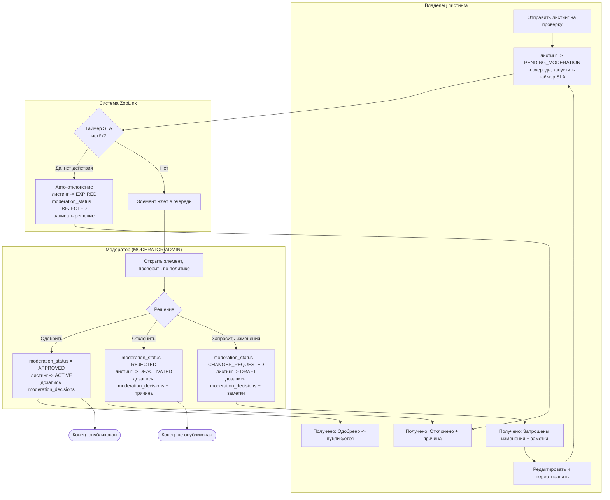
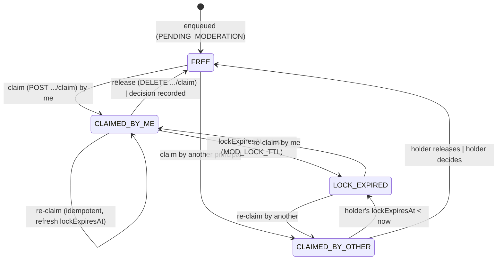

# Спецификация: Домен модерации

## Результат
Предоставить надежный рабочий процесс модерации пользовательского контента (объявлений, профилей животных и т.д.) для обеспечения соответствия политикам платформы, юридическим требованиям и стандартам сообщества. Позволить модераторам просматривать отправки, принимать решения (одобрить, отклонить, запросить изменения) и вести журнал аудита всех действий модерации.

## Область и границы
**Включено:**
- Очередь модерации для объявлений, ожидающих проверки
- Очередь модерации для профилей животных, ожидающих проверки (если применимо)
- Интерфейс модератора для просмотра элементов очереди, доступа к деталям элемента и принятия решений
- Типы решений: Одобрить, Отклонить, Запросить изменения (с конкретными причинами)
- Автоматические триггеры модерации (например, обнаружение ненормативной лексики, обнаружение дубликатов) - откладывается на этап 2
- Процесс обжалования для отклоненных элементов - откладывается на этап 2
- Журнал аудита записывает: ID модератора, timestamp, решение, причину и любые заметки
- Уведомления пользователям о решении модерации (через домен уведомлений)
- Управление доступом на основе ролей: только пользователи с ролью MODERATOR или ADMIN могут получить доступ к функциям модерации
- Интеграция с доменом объявлений (для модерации объявлений) и доменом животных (для модерации профилей животных)
- Массовые действия модерации (одобрить/отклонить несколько элементов) - откладывается на этап 2

**Исключено:**
- Автоматическая модерация контента (анализ изображений/текста на основе ИИ) - откладывается на этап 2
- Система репутации пользователей на основе истории модерации - откладывается на этап 2
- Юридический поток проверки для элементов высокого риска - откладывается на этап 2
- Публичные журналы модерации (отчеты о прозрачности) - откладывается на этап 2
- Интеграция с внешними сервисами модерации (например, сторонними фильтрами контента) - откладывается на этап 2

## Ограничения
- **Юридическое:** Д необходимо соблюдать требования Федерального закона 152-ФЗ (Персональные данные) при обработке пользовательского контента, который может содержать персональные данные. Необходимо соблюдать российские законы о запрещенном контенте (экстремизм и т.д.).
- **Производительность:** Получение очереди модерации < 2с при нормальной нагрузке; обработка индивидуального решения модерации < 1с.
- **Удобство использования:** Интерфейс модератора должен быть простым и эффективным для высокообъемной модерации (целевой показатель: <30 секунд на проверку элемента).
- **Масштабируемость:** Система должна поддерживать 10k+ решений модерации в день.
- **Технология:** Должна соответствовать выбранному стеку (NestJS, TypeScript, PostgreSQL, Redis).
- **Данные:** Решения модерации и журналы аудита должны храниться неизменяемо (дозапись только) для предотвращения подделки.
- **Надежность:** Решения модерации должны сохраняться надежно; нет потери решений или журнала аудита.

## Предыдущие решения
- Модерация реализована как отдельный модуль NestJS с собственным сервисом и контроллером.
- Очередь модерации хранится в PostgreSQL с полем статуса (PENDING, APPROVED, REJECTED, CHANGES_REQUESTED).
- Каждая модерируемая сущность (объявление, профиль животного) имеет статус модерации и ссылку на запись решения модерации.
- Модераторы получают доступ к очереди через конечную точку API с постраничным выводом и опциями фильтрации (по типу сущности, дате отправки и т.д.).
- Причины решений выбираются из заранее определённого списка (настраивается через Домен администрирования) с опциональными заметками в свободной форме.
- Уведомления отправляются асинхронно через домен уведомлений после принятия решения модерации.
- Журнал аудита хранится в отдельной таблице для обеспечения неизменяемости и возможности проведения судебно-технической экспертизы.
- Интерфейс модерации является частью административной панели (Домен администратора), но доступен пользователям с ролью MODERATOR.

## Трассируемость NFR
Эта спецификация отвечает следующим нефункциональным требованиям:
- **Производительность (NFR-PERF)**: Задержка API модерации < 800ms для 95% запросов при нагрузочном тестировании (50 RPS) (см. docs/02-requirements/nfr/performance.md)
- **Безопасность (NFR-SEC)**: Действия модерации требуют аутентификации и авторизации; журналы аудита защищены от подделки (см. docs/02-requirements/nfr/security.md)
- **Доступность (NFR-ACC)**: Интерфейс модератора следует рекомендациям WCAG 2.1 AA (см. docs/02-requirements/nfr/accessibility.md)

## Поток процесса (в стиле BPMN)

Рабочий процесс пре-модерации (ADR-0003): листинг не виден публично до одобрения. Связан со [`statemachines/listing_state_machine.md`](statemachines/listing_state_machine.md). Все решения пишутся в `moderation_decisions` только на дозапись (append-only).

### Ключевые правила
- **Актёры:** Владелец (отправляет/редактирует), Модератор (решает), Система (очередь, SLA, сохранение, уведомления).
- **Покрытые ветки:** Одобрить / Отклонить / Запросить изменения / **авто-отклонение по таймауту SLA** — каждая ведёт к переходу `listings.status` + `moderation_status`.
- **Аудит:** каждое решение — append-only строка `moderation_decisions` (неизменяемая; UPDATE/DELETE блокируется триггером).
- **Уведомления** отправляются через домен уведомлений на каждое терминальное решение.

## Разбивка на задачи
1. **Бэкенд (NestJS)**
   - [ ] Создать модуль `moderation` с помощью CLI NestJS
   - [ ] Определить модель ModerationDecision (Prisma) с полями: id, moderatorId (ссылка на пользователя), entityType (Listing/Animal), entityId, решение (APPROVED/REJECTED/CHANGES_REQUESTED), причина (enum), примечания (опционально), createdAt
   - [ ] Добавить поле moderationStatus в сущности Listing и Animal (или создать таблицу ассоциаций)
   - [ ] Реализовать ModerationController (получение очереди, получение деталей элемента, отправка решения)
   - [ ] Реализовать ModerationService (бизнес-логика получения очереди, обработки решения, запуска уведомлений)
   - [ ] Создать enum причины модерации и механизм конфигурации (через Домен администратора)
   - [ ] Настроить ограничение скорости для конечных точек модерации
   - [ ] Написать unit- и интеграционные тесты для потоков модерации
   - [ ] Создать документацию OpenAPI (Swagger) для конечных точек модерации

2. **Фронтенд (React)**
   - [ ] Создать страницу очереди модерации (часть административной панели)
   - [ ] Реализовать представление деталей элемента (показ деталей объявления/животного с элементами управления модерацией)
   - [ ] Реализовать форму отправки решения (выбор причины, примечания)
   - [ ] Создать защиту маршрутов на основе ролей модератора
   - [ ] Реализовать обновления очереди в реальном времени (через WebSocket или опрос)
   - [ ] Написать unit- и e2e-тесты для потоков модерации

3. **Инфраструктура**
   - [ ] Настроить индексы PostgreSQL для запросов очереди модерации (по статусу, типу сущности, createdAt)
   - [ ] Настроить кэширование Redis для очереди модерации (опционально, для производительности)
   - [ ] Добавить заголовки безопасности и конфигурацию CORS
   - [ ] Реализовать журналирование событий модерации (принято решение, доступ к очереди)

## Критерии верификации
- [ ] Unit-тесты обеспечивают покрытие >90% для модуля модерации (бэкенд)
- [ ] Интеграционные тесты покрывают: получение очереди, отправку решений (все типы решений), запуск уведомлений, создание журнала аудита
- [ ] E2E-тесты (Cypress/Playwright) покрывают полный поток модератора: вход в систему -> просмотр очереди -> проверка элемента -> отправка решения -> проверка отправки уведомления
- [ ] Ручное тестирование: проверка правильного сохранения решения модерации, неизменяемости журнала аудита, отправки уведомлений
- [ ] Производительность: задержка API модерации < 800ms для 95% запросов при нагрузочном тестировании (50 RPS)
- [ ] Безопасность: проверка, что только роли MODERATOR и ADMIN имеют доступ к конечным точкам модерации
- [ ] Документация: спецификация OpenAPI сгенерирована и доступна по адресу /api/docs
- [ ] Трассируемость NFR: проверка, что требования производительности, безопасности и доступности правильно учтены и документированы

---

## Операции очереди (раунд 5, нормативно)

- **Очередь и FIFO:** очередь = объявления в `PENDING_MODERATION`, порядок по `moderation_enqueued_at ASC` (ставится
  при сабмите), индекс `idx_listings_modqueue`. Цель <2 с / 100 элементов.
- **Назначение / блокировка (без двойной модерации):** модератор **захватывает** задачу — `assigned_to`, `locked_at`,
  `lock_expires_at` (миграция 0009). Захват эксклюзивен на `MOD_LOCK_TTL` (по умолч. 15 мин, авто-снятие по истечении).
  Два модератора (или AI-агент + человек) не могут действовать над одним элементом; второй захват → `409`.
- **Таксономия причин:** `moderation_reasons` засеяна (миграция 0010): `prohibited_species, incomplete_info,
  poor_photos, suspected_fraud, price_violation, wrong_category, duplicate, animal_welfare, policy_violation`.
  Причина **обязательна** при REJECT и CHANGES_REQUESTED; её `description_localized` идёт в уведомления
  `listing_rejected`/`listing_changes_requested` (переменная `reason`).
- **Ре-модерация при правке:** редактирование **существенных полей** ACTIVE-объявления (title, description, фото,
  цена, species/breed, listing_type) возвращает его в `PENDING_MODERATION` (`moderation_status='PENDING'`); тривиальные
  правки — нет. Энфорс в сервис-слое.
- **SLA и эскалация:** часы SLA с `moderation_enqueued_at`; при таймауте — **эскалация ADMIN** (событие
  `Moderation.Escalated`), остаётся `PENDING_MODERATION` — без авто-одобрения/отклонения.
- **Модерация животных:** в MVP животные **не** модерируются отдельно; животное проверяется через своё объявление.
  `entity_type='ANIMAL'` в `moderation_decisions`/`content_reports` используется только для решений **по жалобам**, не как отдельная очередь.
- **Апелляции:** **нет апелляций в MVP** — hard REJECT терминален (продавец создаёт новое исправленное объявление);
  исправимый путь — CHANGES_REQUESTED. (Апелляции — Фаза 2; appeal-rate не метрика MVP.)
- **Аудит:** каждое решение пишет `moderation_decisions` (append-only) **и** строку `audit_log`.
- **AI-модератор (ADR-0006):** AGENT использует тот же claim/lock-контракт; гейтится feature-флагом, в MVP выключен.

## Стейт-машина claim/lock и форма контракта (B10, раунд 5, нормативно)

Форма контракта заложена сейчас в `moderation-api.yaml` (ФОРМА сейчас, поведение — с доменом Moderation).
Приводит контракт в соответствие с операциями очереди раунда 5 выше.

### Стейт-машина claim/lock (на элемент очереди, относительно вызывающего принципала)

- **Таблица триггеров/гвардов**

| Из | Действие | Гвард | В | Иначе |
|---|---|---|---|---|
| FREE / LOCK_EXPIRED | claim | элемент в PENDING_MODERATION | CLAIMED_BY_ME | 404, если не в очереди |
| CLAIMED_BY_OTHER (живой lock) | claim | — | (нет перехода) | **409 `ALREADY_CLAIMED`** (несёт текущего держателя Actor + lockExpiresAt) |
| CLAIMED_BY_ME | claim (re-claim) | вызывающий == держатель | CLAIMED_BY_ME (обновить TTL) | — |
| CLAIMED_BY_ME | release (DELETE) | вызывающий == держатель OR ADMIN | FREE | **409 `NOT_LOCK_HOLDER`** |
| CLAIMED_BY_ME | submit decision | вызывающий держит живой lock | FREE (+ решение) | **409 `NOT_LOCK_HOLDER`** / **409 `ITEM_NOT_CLAIMED`**, если нет живого lock |

- **TTL блокировки:** `MOD_LOCK_TTL` (по умолч. 15 мин). Истечение авто-снимает (фоновая задача не требуется —
  истечение вычисляется из `lock_expires_at < now()`); фоновый sweep МОЖЕТ обнулять устаревшие колонки, но для
  корректности не обязателен.
- **Паритет AGENT:** AGENT-принципал использует идентичный claim/lock-контракт (ADR-0006, gated).

### SLA / эскалация
- `slaState ∈ {ON_TRACK, BREACHED, ESCALATED}` выводится из `waitingSeconds` относительно цели (ADR-0003: pet <4ч,
  livestock <6ч рабочих часов — точные пороги владеет конфиг). **ESCALATED** = сработал таймаут SLA →
  событие `Moderation.Escalated` к ADMIN; элемент **остаётся PENDING_MODERATION**, без авто-одобрения/отклонения.
- Фильтры очереди: `market`, `slaState`, `escalated=true` (≡ `slaState=ESCALATED`), `lockState`.
- `meta.counts` (byMarket, bySlaState) даёт счётчики-бейджи на вкладках оператора по всей отфильтрованной очереди.

### Agent-transparency (решение владельца #5, зафиксировано 2026-06-24 — показывать «решено ИИ» ВСЕМ)
- Записи операторских решений (`ModerationDecision`) уже несут agent-бейдж `Actor` (B0.6/ADR-0011 §6).
- **Для владельца:** `GET /listings/{id}/moderation-result` → `OwnerModerationResult` несёт
  `decidedBy.principalType` + `decidedByAgent`, чтобы **продавец** видел, решил ли ИИ или человек, плюс
  разрешённые причину/заметки и цепочку human-override (`isHumanOverride`/`supersedesDecisionId`). Чтение владельца
  в `listings-api` ДОЛЖНО встраивать ту же проекцию как аддитивное поле `lastModerationResult` (отмечено для
  backend + doc-keeper).

### Decision-templates = контролируемый словарь (ТАБЛИЦА, не enum) — решение о фазировании §5
**ЧТО:** Заготовленные формулировки решений для REJECT/CHANGES_REQUESTED моделируются как reference-data — НОВАЯ
таблица `decision_templates` (контролируемый, расширяемый админом словарь; `code` PK, `body_localized` JSONB,
`applies_to_decision`, `market`, `related_reason_code`, `sort_order`, `is_active`, provenance) — отдаётся через
`GET /moderation/decision-templates` и выбирается через `ModerationActionRequest.templateCode`. **НЕ enum.**

**ПОЧЕМУ:** Шаблоны — это редактируемый бизнесом контент, который растёт со временем и который ИИ-агент должен
выбирать по стабильному ключу. Это заметки (свободная проза), отличные от обязательной таксономии
`moderation_reasons` (почему-отклонено).

**ПОЧЕМУ ТАК ЛУЧШЕ для проекта:** По §5 cost-of-change — enum вынуждал бы **переписывать контракт + схему** каждый
раз, когда оператор добавляет/правит шаблон (rewrite-test = да); таблица делает новый шаблон одной строкой данных
с **нулевым изменением схемы/контракта**. Она зеркалит проверенную форму reference-data `moderation_reasons` и
конвенцию A2 (`sort_order`/provenance/JSONB-локализация), сохраняет оба языка для операторского редактора (B0.4) и
даёт AGENT стабильный `code` для выбора — agent-first, форвард-совместимо. → **миграция схемы отмечена для
`zoolink-backend-engineer`** (НЕ реализована в этом раунде контракта).

### Коды ошибок B10 (расширяют domain-specific набор API_CONVENTIONS §4)
| code | HTTP | Когда |
|---|---|---|
| `ALREADY_CLAIMED` | 409 | claim на элементе с живым lock другого принципала |
| `NOT_LOCK_HOLDER` | 409 | release/decide не-держателем |
| `ITEM_NOT_CLAIMED` | 409 | decide на элементе без живого lock |

## Связанные документы

- [Глоссарий](glossary.md)
- [Стейт-машина объявления](statemachines/listing_state_machine.md)
- [Admin API](../03-architecture/api-contracts/admin-api.yaml)
- [Домен администрирования](06-admin-domain.md)
- [Домен уведомлений](13-notification-domain.md)
- 🌐 EN-зеркало: [docs/specs/12-moderation-domain.md](../../docs/specs/12-moderation-domain.md)
