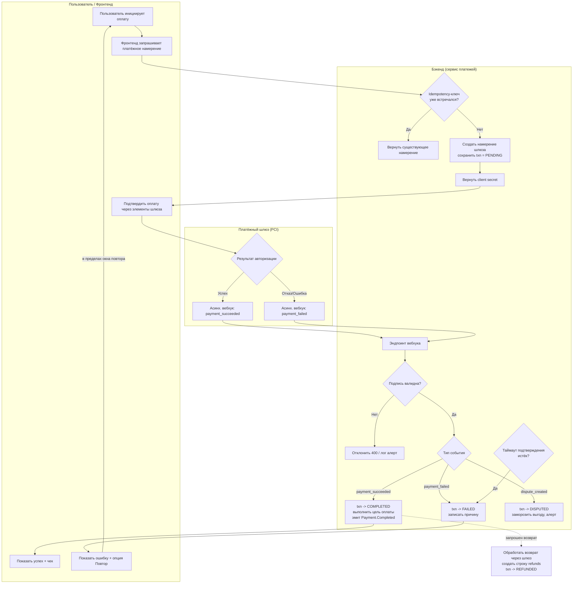

# Спецификация: Домен платежей

## Результат
Предоставить безопасный и надежный сервис обработки платежей для обработки финансовых операций на платформе ZooLink. Позволить пользователям совершать платежи за услуги (продвижение объявлений, премиум-функции и т.д.) и получать выплаты (за продажи, сборы за разведение и т.д.), обеспечивая соответствие финансовым нормативкам, защищая конфиденциальную финансовую информацию и предоставляя четкие записи транзакций.

## Область и границы
**Включено:**
- Обработка платежей за услуги платформы (продвижение объявлений, destacados размещения, премиум-подписки)
- Обработка выплат пользователям (выручка от продаж, сборы за разведение, платежи за услуги)
- Интеграция с **доступными в РФ** платежными шлюзами (ЮKassa + СБП; альтернативы Т-Касса/CloudPayments) через абстракцию `PaymentProvider` — см. [ADR-0008](../04-decisions/0008-rf-provider-matrix.md). Stripe/PayPal **не работают в РФ**.
- Безопасное хранение метаданных платежей (ID транзакций, суммы, статусы) - НЕ хранение полных данных карт
- Отслеживание статуса платежа (ожидает, завершен, не удался, возвращен, оспорен)
- Обработка возвратов для отмененных или неудачных транзакций
- Генерация квитанций и счетов об оплате
- Обработка вебхуков от платежного шлюза (успех платежа, неудача, спор)
- Интеграция с системой учет/ биллинга (будет реализовано в будущих этапах)
- Поддержка одноразовых платежей и повторяющихся платежей (подписки)
- Локализация интерфейса платежа и квитанций (английский/русский)
- Минимизация PCI DSS-периметра: данные карт обрабатываются полностью на стороне РФ-провайдера (ЮKassa) через hosted-элементы/токенизацию; необработанные данные карт не попадают в наши системы
- **54-ФЗ фискализация:** выпуск онлайн-чеков через фискализацию провайдера (ЮKassa это поддерживает)
- Журнал аудита всех действий, связанных с платежами

**Исключено:**
- Прямая обработка необработанных номеров кредитных карт или конфиденциальных данных аутентификации (делегируется PCI-соответствующим шлюзам)
- Платежи криптовалютой - откладывается на этап 2
- Сервисы эскроу для транзакций высокой стоимости - откладываются на этап 2
- Сложное управление подписками (пропорциональное распределение, изменения планов) - откладывается на этап 2
- Поддержка множественных валют (изначально только RUB) - откладывается на этап 2
- Расчет и отчетность по налогам - откладывается на этап 2
- Интеграция с бухгалтерским ПО (QuickBooks и др.) - откладывается на этап 2
- Система кошелька/кредита в платформе - откладывается на этап 2

## Ограничения
- **Юридическое:** Соблюдать Федеральный закон 161-ФЗ "О национальной платежной системе", **54-ФЗ (ККТ / онлайн-чеки)** и закон о защите данных 152-ФЗ для любых персональных данных, связанных с платежами.
- **Безопасность:** Обязательства PCI DSS выполняются на **стороне провайдера** (ЮKassa); мы никогда не храним, не обрабатываем и не передаём необработанные данные карт. Храним только токенизированные метаданные платежей.
- **Производительность:** Задержка вызова API платежа < 1с для инициирования платежа; фактическое время обработки зависит от шлюза, но должно завершаться в разумные сроки (<30с для большинства транзакций).
- **Надежность:** Система должна грациозно обрабатывать простои платежного шлюза (очередь, уведомления пользователей). Необходимо обеспечить отсутствие финансовых потерь из-за сбоев системы.
- **Удобство использования:** Процесс оплаты должен быть простым и понятным для пользователей; сообщения об ошибках должны быть выполнимыми.
- **Масштабируемость:** Система должна поддерживать 1k+ транзакций платежа в день inicialmente, с масштабированием до 10k+.
- **Технология:** Должна соответствовать выбранному стеку (NestJS, TypeScript, PostgreSQL, **Prisma** ORM по [ADR-0007](../04-decisions/0007-orm-strategy.md), Redis).
- **Данные:** Метаданные платежей должны храниться безопасно; конфиденциальные данные должны быть токенизированы/храниться только в шлюзе.
- **Финансовая целостность:** Все транзакции должны быть сведены; система должна предотвращать двойное списание или пропущенные платежи.

## Предыдущие решения
- Сервис платежей реализован как отдельный модуль NestJS.
- Используются доступные в РФ платежные шлюзы (**ЮKassa + СБП** по умолчанию; альтернативы Т-Касса/CloudPayments) через их API за портом `PaymentProvider` — см. [ADR-0008](../04-decisions/0008-rf-provider-matrix.md).
- Наши серверы никогда не касаются необработанных данных карт; вся информация о платежах обрабатывается непосредственно шлюзом или через защищенные элементы платежа.
- Мы храним только метаданные платежа: ID транзакции шлюза, сумма, валюта, статус, ссылка на пользователя, ссылка на цель (ID объявления и т.д.) и временные метки.
- Намерения платежа создаются через API шлюза и подтверждаются клиентской стороной с аутентификацией пользователя.
- Вебхуки от платежных шлюзов используются для асинхронного обновления статуса транзакции.
- Неудачные платежи могут быть повторены с четкой обратной связью для пользователя.
- Возвраты обрабатываются через API шлюза и записываются в нашу систему.
- Метаданные платежа связаны с соответствующими сущностями (Объявления, Пользователи и т.д.) через внешние ключи.
- Сервис платежей взаимодействует с другими доменами через события или прямые вызовы сервиса (например, активация продвинутого объявления после успешного платежа).
- Выплаты пользователям (за продажи) будут обрабатываться отдельно и могут включать ручную обработку inicialmente.

## Трассируемость NFR
Эта спецификация отвечает следующим нефункциональным требованиям:
- **Производительность (NFR-PERF)**: Задержка API платежа < 1с для 95% запросов при нагрузочном тестировании (20 RPS) (см. docs/02-requirements/nfr/performance.md)
- **Безопасность (NFR-SEC)**: Сервис платежей достигает соответствия PCI DSS через токенизацию; конфиденциальные данные никогда не касаются наших серверов (см. docs/02-requirements/nfr/security.md)
- **Доступность (NFR-AVAIL)**: Сервис платежей грациозно обрабатывает простои шлюза с очередью и уведомлениями пользователей (см. docs/02-requirements/nfr/availability.md)

## Поток процесса (в стиле BPMN)

Переходы статусов формализованы в [`statemachines/payment_state_machine.md`](statemachines/payment_state_machine.md). Сквозной поток с актёрами и ветками ошибок:

### Ключевые правила
- **Идемпотентность:** каждый create/confirm/вебхук несёт idempotency-ключ; повторы не должны вызывать двойное списание/переход.
- **Источник истины — асинхронный:** именно вебхук шлюза (а не клиентский редирект) определяет COMPLETED/FAILED/DISPUTED.
- **Ветка таймаута:** PENDING-транзакция без вебхука в пределах `PAYMENT_CONFIRM_TIMEOUT` авто-фейлится.
- **Повтор:** FAILED-платёж можно повторить в пределах `PAYMENT_RETRY_WINDOW`, создавая **новую** транзакцию (тот же `purpose_id`).
- **Гейтинг:** весь поток за `feature_toggles.payments` (выключен до пост-MVP).

## Разбивка на задачи
1. **Бэкенд (NestJS)**
   - [ ] Создать модуль `payment` с помощью CLI NestJS
   - [ ] Определить модель PaymentTransaction (Prisma) с полями: id, userId, gatewayTransactionId, amount_minor (BIGINT), currency, статус (PENDING/COMPLETED/FAILED/REFUNDED/DISPUTED), purposeType (ListingPromotion/PremiumSubscription/и т.д.), purposeId, idempotencyKey, createdAt, updatedAt
   - [ ] Определить модель Refund (Prisma) для отслеживания возвратов (id, paymentTransactionId, gatewayRefundId, amount_minor, причина, статус, createdAt)
   - [ ] Реализовать PaymentController (создание намерения платежа, подтверждение платежа, получение статуса транзакции, обработка возврата, обработчик вебхука)
   - [ ] Реализовать PaymentService (бизнес-логика создания платежа, проверки статуса, обработки возврата)
   - [ ] Создать абстракцию `PaymentProvider` с РФ-адаптерами (ЮKassa/Т-Касса/CloudPayments)
   - [ ] Реализовать безопасный конечный точка для вебхуков от платежного шлюза
   - [ ] Реализовать ключи идемпотентности для запросов платежа, чтобы предотвратить двойное списание
   - [ ] Настроить ведение журнала событий платежа (создан, завершен, не удался, возвращен)
   - [ ] Написатьunit и интеграционные тесты для потоков платежей (используя тестовые режимы шлюзов)
   - [ ] Создать документацию OpenAPI (Swagger) для конечных точек платежа

2. **Фронтенд (React)**
   - [ ] Создать компоненты интерфейса платежа (безопасная форма платежа с элементами шлюза)
   - [ ] Реализовать поток оплаты: инициировать оплату -> подтвердить со шлюзом -> показать результат
   - [ ] Создать страницу истории платежей для пользователей
   - [ ] Реализовать интерфейс инициирования возврата (где применимо)
   - [ ] Создать функциональность просмотра и загрузки счетов/квитанций
   - [ ] Написатьunit и e2e-тесты для потоков платежей

3. **Инфраструктура**
   - [ ] Настроить переменные окружения для ключей API платежного шлюза (тестовые и боевые)
   - [ ] Настроить журналирование событий платежа и доставки вебхуков
   - [ ] Добавить заголовки безопасности и конфигурацию CORS (с строгими origins для вебхуков)
   - [ ] Реализовать мониторинг показателей успешности платежей, причин неудач и задержек шлюза
   - [ ] Подтвердить PCI DSS-позицию на стороне провайдера (ЮKassa) и настроить выпуск 54-ФЗ онлайн-чеков

4. **Критерии верификации**
   - [ ] Unit-тесты обеспечивают покрытие >90% для модуля платежа (бэкенд)
   - [ ] Интеграционные тесты покрывают: создание намерения платежа, подтверждение (успех/неудача), обработка вебхуков, обработка возврата, идемпотентность
   - [ ] Ручное тестирование: проверка работоспособности потоков оплаты в тестовом режиме с шлюзами, проверка вебхуков, проверка записей транзакций
   - [ ] Производительность: задержка API платежа < 1с для 95% запросов при нагрузочном тестировании (20 RPS)
   - [ ] Безопасность: проверка, что в журналах, базе данных или ответах не хранится необработанных данных карт
   - [ ] Надежность: проверка грациозного обрабатывания простоев шлюза (очередь, уведомления пользователей)
   - [ ] Документация: спецификация OpenAPI сгенерирована и доступна по адресу /api/docs
   - [ ] Трассируемость NFR: проверка, что требования производительности, безопасности и доступности правильно учтены и documented

---

## Связанные документы

- [Глоссарий](glossary.md)
- [Домен pet-маркетплейса](03-pet-marketplace-domain.md)
- [Домен livestock-маркетплейса](04-livestock-marketplace-domain.md)
- [Домен уведомлений](13-notification-domain.md)
- 🌐 EN-зеркало: [docs/specs/14-payment-domain.md](../../docs/specs/14-payment-domain.md)
