# Спецификация: Репутация и примитив подтверждённой сделки (FORM-first)

> **Тройка обоснования изменения документа (протокол doc↔code).**
> **ЧТО:** Ввести проектный контракт двусторонней **подтверждённой сделки** (`confirmed_sales`) и
> примитива **репутации/отзывов**, который на неё опирается — **только как спецификацию**, с DDL в виде
> **эскиза внутри спеки** (без правки `database_schema.sql`, без миграции, без изменения ERD).
> **ПОЧЕМУ:** AUDIT4 P3-1 (`⇊converged` по active-user / psychologist / growth) выявил: построенный
> маркетплейс — это **односторонний contact-reveal, который «утекает» всей связью в Telegram**: нет
> сигнала о подтверждённой сделке, нет репутации. Платформа поэтому **не захватывает ценность, которую
> создаёт** — глубочайший стратегический разрыв.
> **ПОЧЕМУ ЭТО ЛУЧШЕ для всего проекта:** это включатель **обеих вершинных целей сразу** — цикл
> **win-win** (спрос получает способ оценить и доверять незнакомцу перед эмоциональной сделкой с живым
> животным; предложение — переносимую репутацию) и **Северная звезда — агент-управляемое будущее**
> (агент способен модерировать, оценивать, страховать и улучшать только ту сделку, которую **видит**).
> Сознательно **FORM-first**: безвозвратно теряемый сигнал подтверждённой сделки захватывается уже
> сейчас, а *поведение* репутации остаётся под гейтом — та же дисциплина cost-of-change, что зарезервировала
> `user_roles` спящим (миг. 0034) и `view_count` сигналом-вперёд (миг. 0031, D1).

---

## Результат (Outcome)
Однозначно определить, как ZooLink **фиксирует факт реальной сделки** и как на этой записи строится
**двусторонняя репутация с доказательством транзакции** — чтобы (a) сигнал сделки перестал утекать за
пределы платформы, (b) покупатель мог оценить незнакомца перед высокотревожной покупкой живого животного,
(c) появились данные для будущего ИИ-оператора trust & safety. Репутация — **общественное благо доверия,
никогда не платная поверхность** (win-win); репутации двух рынков **никогда не смешиваются** (ADR-0002).

## Область и границы
**В области (эта спека — контракт):**
- **`confirmed_sales`** — запись-источник истины: двусторонне подтверждённая сделка, её машина состояний
  и как она *привязывается* к сильнейшим существующим сигналам — **COMPLETED `ownership_transfers`**
  (ADR-0013, сильнейший сигнал для животных) или seller **`markSold` + подтверждение покупателя** по
  объявлению.
- **`reviews`** — append-only, один на (сделку, направление), под гейтом доказательства транзакции.
- **`reputation_aggregates`** — производный кэш рейтинга: **на субъект × на рынок**, пересчитываемый
  (никогда не пишется вручную).
- Машина состояний подтверждения сделки (кто подтверждает, взаимно vs односторонне, спор, таймаут).
- Таблицы решений / Gherkin по ключевым правилам; обработка ошибок; NFR; хуки анти-абьюза (фейковые
  отзывы, review-bombing, Sybil) **с маршрутизацией в модерацию**; трактовка ФЗ-152; явная граница
  **FORM-сейчас vs поведение-потом**; guardrail доверия и этики.

**Вне области (отложено, с причиной):**
- **Встроенный чат / запрос** до reveal (ADR-0005 держит чат вне MVP) — репутация от него не зависит;
  отмечено как смежный разрыв цикла спроса (AUDIT4 WW-4 / P3-2).
- **Монетизация reveal или репутации** — отложено владельцем (soft-start); репутация *никогда* не должна
  быть платной поверхностью (см. Доверие и этика).
- **Отзывы по услугам / товарам / экспертизе** — сущность спроектирована с **полиморфным субъектом**,
  чтобы тот же примитив позже обслуживал шов Offering (ADR-0014), но в первой фазе поведения только
  продажи по объявлениям на животных.
- **Физический DDL, миграция, ERD, правки event-catalog** — отложены до миграции + ADR после ответов
  владельца на развилки ниже (документ только проектный; architect и backend-engineer правят эти файлы
  параллельно).

## Ограничения
- **Два рынка не смешиваются (ADR-0002):** агрегат репутации имеет scope `market ('pet'|'livestock')`;
  pet-оценка и livestock-оценка считаются и показываются **раздельно** — без межрыночной утечки.
- **Доказательство транзакции (жёсткий инвариант):** отзыв ОБЯЗАН ссылаться на строку `confirmed_sales`
  в статусе **CONFIRMED**. Нет подтверждённой сделки ⇒ нет отзыва. Это главная защита от фейков
  (psychologist TP-7).
- **Append-only + снимок актёра** (по образцу `consents`/`moderation_decisions`/`audit_log`): отзывы и
  строки состояния сделки **append-only**, каждая несёт `actor_id` + `actor_principal_type
  ('HUMAN'|'AGENT')` (ADR-0006), защищена переиспользуемым триггером `trg_block_modify_append_only`.
- **ФЗ-152:** отзыв — одновременно **персональные данные автора** (авторство) и **данные о субъекте**
  (оцениваемое физлицо) — обе стороны в области; см. отдельный раздел.
- **Производное, не заявляемое:** `reputation_aggregates` — пересчитываемый кэш `reviews`; **никогда** не
  пишется вручную и **никогда** не покупается (psychologist TP-8 — платный «сигнал доверия» = тёмный
  паттерн).
- **Технологии / правила дома:** SQL-canonical схема (ADR-0007), ошибки RFC7807, `Idempotency-Key` на
  небезопасных POST, зеркало EN↔RU, agent-as-principal с первой строки.

## Предшествующие решения, НА которых строим (не дублировать)
- **`ownership_transfers`** (ADR-0013): COMPLETED-передача уже **двусторонне согласована** и атомарно
  переатрибутирует животное — это **сильнейший сигнал сделки** и естественный источник авто-подтверждения
  для `confirmed_sales`.
- **`contact_reveals`** (миг. 0029, `UNIQUE(viewer,listing)`): сигнал намерения спроса; reveal — это
  *лид*, confirmed_sale — *итог*; репутация висит на итоге, не на лиде.
- **listing `markSold`** (`listing.service.ts`) — сегодня заявляется только продавцом; эта спека
  добавляет **встречное подтверждение покупателя**, превращающее это в доказательство.
- **`decision_templates` / `moderation_reasons`** модерации (миг. 0022): маршрутизация споров и абьюза
  переиспользует модерацию, не изобретает параллельный «суд отзывов».
- **Паттерн гейтов `feature_toggles`** (форма-сейчас/поведение-потом) и прецедент **спящего
  `user_roles`** (миг. 0034) — фазовая модель всей этой спеки.

---

## 1. Бизнес-цель и контекст

**[БИЗНЕС-КОНТЕКСТ]** Единственный актив ZooLink — *создаваемая им связь*. Сегодня платформа отдаёт эту
связь за одну единицу квоты reveal и не удерживает ничего — сделка уходит в Telegram, навсегда невидимая.
Два вершинных последствия (AUDIT4 §4):

- **Win-win перекошен в сторону продавцов.** Покупатель несёт 100 % риска мошенничества на самой тревожной
  покупке каталога (*живое существо*), не имея **ничего, чем оценить незнакомца** — главная причина, по
  которой пользователь всё ещё выбирает Avito (там хотя бы виден возраст профиля). Честный заводчик не
  может отличиться от мошенника.
- **Северная звезда не может замкнуться.** ИИ-оператор может модерировать, оценивать, страховать и
  улучшать только видимую ему сделку; утёкшая, неподтверждённая сделка невидима любому агенту.

**Двигаемая метрика:** on-platform **сигнал завершения** (подтверждённые сделки / reveals), **удержание
спроса / would-I-return** (active-user CRITICAL WW-3), и **приор доверия**, который гейтит каждую будущую
вертикаль (`service_marketplace`, `premium_profiles` win-win только *после* появления отзывов —
psychologist PERSP-4).

---

## 2. Дополнения в глоссарий
> Предлагается в `docs/specs/glossary.md` (мержит doc-keeper; идентификаторы дословно EN/RU).

**Confirmed Sale / Подтверждённая сделка** (`confirmed_sales`)
Запись о реально закрытой сделке между двумя идентифицированными сторонами, подтверждённая **обеими**
сторонами (или авто-подтверждённая при привязке к COMPLETED `ownership_transfers`). Корень
доказательства транзакции, на который обязан ссылаться каждый отзыв.

**Sale Anchor / Якорь сделки**
Вышестоящее событие, из которого выводится подтверждённая сделка: `TRANSFER` (COMPLETED
`ownership_transfers`, сильнейший — животные) или `LISTING_MARK_SOLD` (seller `markSold` + встречное
подтверждение покупателя).

**Review / Отзыв** (`reviews`)
Append-only, один-на-(сделку,направление) рейтинг + опциональный текст, написанный одной стороной
подтверждённой сделки о другой. Требует CONFIRMED-сделки (доказательство транзакции).

**Review Direction / Направление отзыва**
`BUYER_ON_SELLER` или `SELLER_ON_BUYER` — репутация **двусторонняя**; обе стороны могут оценить друг
друга.

**Reputation Aggregate / Агрегат репутации** (`reputation_aggregates`)
**Производная, пересчитываемая** сводка рейтинга на субъект × на рынок (количество, среднее,
распределение). Никогда не пишется вручную, никогда не покупается.

**Double-blind release / Двойное-слепое раскрытие**
Отзыв ни одной стороны не виден, пока **обе** не отправили **или** окно отзыва не закрылось — снижает
предвзятость мести/взаимности (рекомендуемая политика видимости; развилка владельца Q2).

**Unconfirmed / weak sale / Неподтверждённая (слабая) сделка**
`markSold`, так и не подтверждённый встречно (EXPIRED-подтверждение). *Сигнал* захватывается, но он **не
открывает отзывы**.

---

## 3. Контракт данных (предлагаемые сущности — DDL **ЭСКИЗ**, не канон)

> ⚠️ **Только эскиз.** Блоки иллюстрируют форму для architect/backend; авторитетный DDL появится в
> `database_schema.sql` + миграции **после** развилок владельца (§10) и ADR (§11). Столбцы, помеченные
> *(развилка)*, зависят от ответа владельца. Все сущности **append-only** и несут пару снимка актёра по
> ADR-0006.

### 3.1 `confirmed_sales` — источник истины (кандидат FORM-сейчас)
```sql
-- ЭСКИЗ — не канон. Append-only запись сделки; сигнал, который мы сегодня безвозвратно теряем.
CREATE TABLE confirmed_sales (
    id                    UUID PRIMARY KEY DEFAULT uuid_generate_v4(),
    -- Что продано (полиморфный субъект, чтобы тот же примитив позже обслуживал услуги/товары)
    offering_type         VARCHAR(30) NOT NULL DEFAULT 'ANIMAL_LISTING'
                            CHECK (offering_type IN ('ANIMAL_LISTING')),   -- расширяется аддитивно (шов ADR-0014)
    listing_id            UUID REFERENCES listings(id) ON DELETE SET NULL, -- экземпляр предложения
    animal_id             UUID REFERENCES animals(id)  ON DELETE SET NULL, -- когда привязано к передаче
    market                VARCHAR(9)  NOT NULL CHECK (market IN ('pet','livestock')), -- производный, scope ADR-0002
    -- Стороны (идентифицированы; org-сторона зарезервирована как в ownership_transfers)
    seller_user_id        UUID REFERENCES users(id) ON DELETE SET NULL,
    buyer_user_id         UUID REFERENCES users(id) ON DELETE SET NULL,
    seller_organization_id UUID REFERENCES organizations(id) ON DELETE SET NULL,
    buyer_organization_id  UUID REFERENCES organizations(id) ON DELETE SET NULL,
    -- Якорь + жизненный цикл
    anchor_type           VARCHAR(20) NOT NULL CHECK (anchor_type IN ('TRANSFER','LISTING_MARK_SOLD')),
    ownership_transfer_id UUID REFERENCES ownership_transfers(id) ON DELETE SET NULL, -- когда anchor=TRANSFER
    status                VARCHAR(24) NOT NULL DEFAULT 'PENDING_CONFIRMATION'
        CHECK (status IN ('PENDING_CONFIRMATION','CONFIRMED','DISPUTED','EXPIRED','CANCELLED')),
    seller_confirmed_at   TIMESTAMPTZ,   -- время markSold (или инициации передачи) — заявляющая сторона
    buyer_confirmed_at    TIMESTAMPTZ,   -- встречное подтверждение (или авто при anchor=TRANSFER)
    confirmed_at          TIMESTAMPTZ,   -- ставится при status→CONFIRMED (обе стороны подтвердили)
    confirm_expires_at    TIMESTAMPTZ,   -- горизонт таймаута PENDING_CONFIRMATION (развилка Q3)
    -- опционально захваченные факты сделки (пусто для торгуемого livestock, GAP-BA-001)
    amount_minor          BIGINT,        -- целые минорные единицы, NULL при off-record/торге
    currency              VARCHAR(3) DEFAULT 'RUB',
    -- снимок актёра (ADR-0006)
    initiated_by_user_id  UUID REFERENCES users(id) ON DELETE SET NULL,
    initiated_by_principal_type VARCHAR(10) NOT NULL DEFAULT 'HUMAN' CHECK (initiated_by_principal_type IN ('HUMAN','AGENT')),
    created_at            TIMESTAMPTZ NOT NULL DEFAULT NOW(),
    -- одна живая подтверждённая сделка на привязанную передачу (по образцу INV-4 ownership_transfers)
    CONSTRAINT uq_confirmed_sales_transfer UNIQUE (ownership_transfer_id)
);
CREATE INDEX idx_confirmed_sales_subject ON confirmed_sales (offering_type, listing_id);
CREATE INDEX idx_confirmed_sales_parties ON confirmed_sales (seller_user_id, buyer_user_id);
CREATE INDEX idx_confirmed_sales_confirm_scan
    ON confirmed_sales (confirm_expires_at) WHERE status = 'PENDING_CONFIRMATION';
```

### 3.2 `reviews` — append-only, под гейтом доказательства транзакции (поведение под гейтом)
```sql
-- ЭСКИЗ — не канон. Один отзыв на (сделку, направление). Append-only (правка = новая замещающая строка).
CREATE TABLE reviews (
    id                UUID PRIMARY KEY DEFAULT uuid_generate_v4(),
    confirmed_sale_id UUID NOT NULL REFERENCES confirmed_sales(id) ON DELETE CASCADE, -- доказательство txn
    direction         VARCHAR(16) NOT NULL CHECK (direction IN ('BUYER_ON_SELLER','SELLER_ON_BUYER')),
    reviewer_user_id  UUID NOT NULL REFERENCES users(id) ON DELETE SET NULL,
    subject_user_id   UUID NOT NULL REFERENCES users(id) ON DELETE SET NULL,
    market            VARCHAR(9) NOT NULL CHECK (market IN ('pet','livestock')), -- скопировано из сделки (ADR-0002)
    rating            SMALLINT NOT NULL CHECK (rating BETWEEN 1 AND 5),
    body              TEXT,               -- опциональный текст; модерируется как контент объявления
    moderation_status VARCHAR(20) NOT NULL DEFAULT 'PENDING'
        CHECK (moderation_status IN ('PENDING','APPROVED','REJECTED','CHANGES_REQUESTED')),
    is_visible        BOOLEAN NOT NULL DEFAULT FALSE, -- гейт double-blind (развилка Q2); флипается при раскрытии
    superseded_by_id  UUID REFERENCES reviews(id) ON DELETE SET NULL, -- правка в grace = новая строка (развилка Q3)
    -- снимок актёра (ADR-0006 — AGENT-рецензент это будущий/гейтированный случай)
    actor_principal_type VARCHAR(10) NOT NULL DEFAULT 'HUMAN' CHECK (actor_principal_type IN ('HUMAN','AGENT')),
    created_at        TIMESTAMPTZ NOT NULL DEFAULT NOW(),
    -- один ТЕКУЩИЙ отзыв на (сделку, направление); правка замещает, а не мутирует
    CONSTRAINT uq_reviews_sale_direction UNIQUE (confirmed_sale_id, direction, superseded_by_id)
);
CREATE INDEX idx_reviews_subject_market ON reviews (subject_user_id, market)
    WHERE moderation_status = 'APPROVED' AND is_visible = TRUE AND superseded_by_id IS NULL;
```

### 3.3 `reputation_aggregates` — производный кэш (поведение под гейтом)
```sql
-- ЭСКИЗ — не канон. Пересчитывается из видимых+одобренных отзывов; никогда не пишется вручную.
CREATE TABLE reputation_aggregates (
    subject_user_id  UUID NOT NULL REFERENCES users(id) ON DELETE CASCADE,
    market           VARCHAR(9) NOT NULL CHECK (market IN ('pet','livestock')), -- на рынок, ADR-0002
    review_count     INTEGER NOT NULL DEFAULT 0 CHECK (review_count >= 0),
    rating_sum       INTEGER NOT NULL DEFAULT 0 CHECK (rating_sum >= 0),
    rating_avg       NUMERIC(3,2),          -- производное = rating_sum / NULLIF(review_count,0)
    dist_1..dist_5   INTEGER NOT NULL DEFAULT 0, -- гистограмма звёзд (иллюстративно)
    recomputed_at    TIMESTAMPTZ NOT NULL DEFAULT NOW(),
    PRIMARY KEY (subject_user_id, market)      -- одна строка на субъект на рынок
);
```

### 3.4 Контракт эндпоинтов (поведение под гейтом; форма зарезервирована сейчас)
| Метод / Путь | Назначение | Auth / роль | Идемпотентность | Заметки |
|---|---|---|---|---|
| `POST /v1/listings/{id}/mark-sold` | продавец заявляет сделку + номинирует покупателя (создаёт `confirmed_sales` PENDING) | seller, владеет объявлением | `Idempotency-Key` | расширяет текущий markSold; anchor=`LISTING_MARK_SOLD` |
| `POST /v1/confirmed-sales/{id}/confirm` | покупатель встречно подтверждает → CONFIRMED | только номинированный покупатель | `Idempotency-Key` | no-op/авто при anchor=`TRANSFER` |
| `POST /v1/confirmed-sales/{id}/dispute` | любая сторона оспаривает → DISPUTED → модерация | сторона сделки | `Idempotency-Key` | маршрут в очередь модерации |
| `POST /v1/confirmed-sales/{id}/reviews` | написать отзыв (рейтинг+текст) | сторона CONFIRMED-сделки | `Idempotency-Key`, `ETag` на правке | один на направление; правка в grace замещает |
| `GET /v1/users/{id}/reputation?market=pet` | читать производный агрегат субъекта | публичное чтение | — | `ETag`/`Cache-Control`; только на рынок |
| `GET /v1/users/{id}/reviews?market=pet` | список видимых+одобренных отзывов | публичное чтение | — | пагинация `{items,meta}`; double-blind соблюдается |

---

## 4. Машина состояний — поток подтверждения сделки

**Сущность:** строка `confirmed_sales`. **Триггеры/условия** ниже. Терминальные состояния: `CONFIRMED`,
`EXPIRED`, `CANCELLED` (и `DISPUTED` → возвращается в CONFIRMED или CANCELLED через модерацию).

```mermaid
stateDiagram-v2
    [*] --> PENDING_CONFIRMATION: продавец markSold + номинирует покупателя  (anchor=LISTING_MARK_SOLD)
    [*] --> CONFIRMED: ownership_transfers COMPLETED  (anchor=TRANSFER — уже двусторонне)
    PENDING_CONFIRMATION --> CONFIRMED: покупатель встречно подтверждает (now <= confirm_expires_at)
    PENDING_CONFIRMATION --> DISPUTED: любая сторона оспаривает («этой сделки не было»)
    PENDING_CONFIRMATION --> EXPIRED: now > confirm_expires_at (нет подтверждения) → слабая/неподтверждённая
    PENDING_CONFIRMATION --> CANCELLED: продавец отзывает до подтверждения
    DISPUTED --> CONFIRMED: модерация подтверждает сделку
    DISPUTED --> CANCELLED: модерация аннулирует сделку
    CONFIRMED --> [*]: открывается окно отзывов (см. жизненный цикл отзыва)
    EXPIRED --> [*]: сигнал захвачен; отзывов НЕТ
    CANCELLED --> [*]: терминал (можно создать новую запись сделки)
```



**Условия переходов (нормативно):**
| Из → В | Триггер | Условие (все должны выполняться) |
|---|---|---|
| ∅ → CONFIRMED | `OwnershipTransfer.Accepted` (завершение передачи = accept, §10) | anchor=`TRANSFER`; стороны = from/to передачи; авто-подтверждение (передача уже двусторонняя по ADR-0013) |
| ∅ → PENDING_CONFIRMATION | продавец `markSold` | вызывающий владеет объявлением; покупатель номинирован; объявление было `ACTIVE`; нет живой сделки по этому объявлению |
| PENDING → CONFIRMED | подтверждение покупателя | вызывающий = номинированный покупатель; `now <= confirm_expires_at`; статус ещё PENDING |
| PENDING → DISPUTED | спор | вызывающий — сторона; статус PENDING; указана причина → reason code модерации |
| PENDING → EXPIRED | тик планировщика | `now > confirm_expires_at` (маркер идемпотентной эмиссии, по образцу transfer-expiry sweeper H3) |
| PENDING → CANCELLED | отзыв продавцом | вызывающий = продавец; статус PENDING |
| DISPUTED → CONFIRMED/CANCELLED | решение модерации | у актёра есть ability модерации; решение записано в `moderation_decisions` (снимок актёра) |

**Жизненный цикл отзыва (на направление, открывается при CONFIRMED):**
`ELIGIBLE (окно открыто) → SUBMITTED (в ожидании модерации) → APPROVED+раскрыт (double-blind) →`
редактируемо в grace (правка = новая замещающая строка) → **неизменяемо** после grace / закрытия окна.

---

## 5. Бизнес-логика и правила (таблицы решений / Gherkin)

### 5.1 Право на отзыв — таблица решений
| Статус сделки | Вызывающий — сторона? | Направление уже отрецензировано (текущее)? | В окне отзыва? | Результат |
|---|---|---|---|---|
| CONFIRMED | да | нет | да | **РАЗРЕШИТЬ** создание отзыва |
| CONFIRMED | да | да (текущее, в grace правки) | да | **РАЗРЕШИТЬ** правку (замещение) |
| CONFIRMED | да | да (grace истёк) | да | **ОТКЛОНИТЬ** `REVIEW_IMMUTABLE` |
| CONFIRMED | да | нет | нет (окно закрыто) | **ОТКЛОНИТЬ** `REVIEW_WINDOW_CLOSED` |
| PENDING/EXPIRED/CANCELLED | любой | — | — | **ОТКЛОНИТЬ** `SALE_NOT_CONFIRMED` (доказательство txn) |
| любой | нет | — | — | **ОТКЛОНИТЬ (404-без-утечки)** `NOT_A_PARTY` |

### 5.2 Подтверждение сделки — Gherkin
```gherkin
Feature: Двусторонняя подтверждённая сделка

  Scenario: Авто-подтверждение из завершённой передачи животного (сильнейший сигнал)
    Given строка ownership_transfers достигает COMPLETED для животного A между продавцом S и покупателем B
    When обрабатывается событие OwnershipTransfer.Accepted (завершение передачи = accept, §10)
    Then создаётся строка confirmed_sales с anchor_type = 'TRANSFER'
    And status = 'CONFIRMED' с установленным confirmed_at
    And отдельное встречное подтверждение покупателя не требуется
    And открывается окно отзывов для BUYER_ON_SELLER и SELLER_ON_BUYER

  Scenario: markSold по объявлению требует встречного подтверждения покупателя
    Given продавец S помечает объявление L SOLD и номинирует покупателя B
    Then создаётся строка confirmed_sales со статусом 'PENDING_CONFIRMATION'
    And confirm_expires_at устанавливается в now + <confirm_window> дней
    When покупатель B подтверждает до confirm_expires_at
    Then статус становится 'CONFIRMED' и открывается окно отзывов
    When покупатель B никогда не подтверждает и now > confirm_expires_at
    Then тик планировщика ставит статус 'EXPIRED'
    And сигнал сделки захвачен, но отзыв создать НЕЛЬЗЯ

  Scenario: Доказательство транзакции блокирует фейковый отзыв
    Given пользователь U не является стороной ни одной подтверждённой сделки с субъектом X
    When U пытается сделать POST отзыва о X
    Then запрос ОТКЛОНЯЕТСЯ с SALE_NOT_CONFIRMED (или NOT_A_PARTY, 404-без-утечки)
    And агрегат репутации X не меняется
```

### 5.3 Double-blind раскрытие (рекомендуется — развилка Q2)
```gherkin
  Scenario: Ни один отзыв не виден, пока оба не отправлены или окно не закрылось
    Given CONFIRMED-сделка между S и B
    When B отправляет отзыв о S
    Then отзыв B хранится is_visible = FALSE (ждёт контрагента или закрытия окна)
    When S отправляет отзыв о B (или окно отзыва закрывается)
    Then оба APPROVED-отзыва флипают is_visible = TRUE вместе
    And каждый агрегат пересчитывается, как только его отзыв становится видимым+одобренным
```

### 5.4 Пересчёт агрегата (производный, не заявляемый)
```gherkin
  Scenario: Агрегат — чистая функция видимых одобренных отзывов, на рынок
    Given у субъекта X есть N видимых+одобренных отзывов на рынке 'pet'
    When у любого из них меняется видимость/статус модерации
    Then reputation_aggregates(X,'pet') пересчитывается: count, sum, avg, гистограмма
    And 'livestock'-отзыв о X никогда не влияет на 'pet'-агрегат (ADR-0002)
    And ни один путь кода не пишет rating_avg напрямую
```

---

## 6. Обработка ошибок и краевые случаи
| Сценарий | Ответ системы | Код (RFC7807 `code`) | HTTP | Намерение для пользователя |
|---|---|---|---|---|
| Отзыв на неподтверждённую сделку | отклонить | `SALE_NOT_CONFIRMED` | 409 | «Отзыв можно оставить только после подтверждения сделки.» |
| Рецензент не сторона | отклонить, без утечки существования | `NOT_A_PARTY` | 404 | обобщённое not-found |
| Дубликат текущего отзыва (то же направление) | отклонить | `REVIEW_ALREADY_EXISTS` | 409 | «Вы уже оставили отзыв по этой сделке.» |
| Правка после grace | отклонить | `REVIEW_IMMUTABLE` | 409 | «Этот отзыв больше нельзя редактировать.» |
| Окно отзыва закрыто | отклонить | `REVIEW_WINDOW_CLOSED` | 409 | «Период отзывов завершён.» |
| Подтверждение покупателя после истечения | отклонить | `CONFIRMATION_EXPIRED` | 409 | «Срок подтверждения сделки истёк.» |
| Подтверждение не-номинированным | отклонить, 404-без-утечки | `NOT_A_PARTY` | 404 | обобщённое not-found |
| markSold без валидного покупателя / сам как покупатель | отклонить | `INVALID_COUNTERPARTY` | 422 | «Выберите корректного покупателя.» |
| Рейтинг вне 1..5 | отклонить (валидация) | `VALIDATION_ERROR` | 422 | ошибка поля |
| Спор по уже терминальной сделке | отклонить | `SALE_NOT_DISPUTABLE` | 409 | «Эту сделку больше нельзя оспорить.» |
| Чтение репутации без рынка (`?market` пропущен) | требовать явный рынок | `MARKET_REQUIRED` | 422 | форсировать чтение на рынок (ADR-0002) |
| Гейт выключен (фаза поведения не активна) | эндпоинты 404/`FEATURE_DISABLED` | `FEATURE_DISABLED` | 404 | функция недоступна |

---

## 7. Нефункциональные требования (NFR)
- **Производительность:** `GET /users/{id}/reputation` — единичное индексное чтение
  `reputation_aggregates` (< 50 мс p95); никогда не агрегирует `reviews` на лету. Пересчёт инкрементален
  на пути события, не на чтении.
- **Надёжность:** истечение подтверждения и закрытие окна double-blind работают на **существующем
  паттерне планировщика/sweeper** (transfer-expiry sweeper, H3; SLA-tick advisory lock) — никогда не
  lazy-on-read (избегаем дефекта-остатка F4). Маркеры идемпотентной эмиссии (`confirmed_at`/
  `confirm_expires_at` по образцу `escalated_at`).
- **Согласованность / конкурентность:** создание подтверждённой сделки из передачи пишется **в той же
  транзакции**, что и завершение передачи (transactional-outbox), поэтому сигнал не теряется. `UNIQUE
  (ownership_transfer_id)` предотвращает дубликат сделки на передачу (по образцу INV-4).
- **Аудируемость:** каждое изменение состояния и каждый отзыв несут `actor_id` + `actor_principal_type`;
  разрешения споров — строки `moderation_decisions` (append-only, human-override) — путь ИИ-оператора
  аудируем с первого дня (Северная звезда).
- **Безопасность / authz:** object-level авторизация на каждой мутации (паритет
  `assertCan... OrNotFound`, класс риска №1 кодовой базы); confirm/dispute/review только для стороны
  сделки.
- **Масштабируемость:** агрегат — ограниченная строка на (пользователь,рынок); гистограмма + сумма
  делают пересчёт O(Δ), не O(всех отзывов).
- **i18n / EN↔RU:** все `code` и клиентские тексты зеркалятся; локализация текста отзыва — на языке
  автора (не переводится).

---

## 8. Анти-абьюз (маршрут в модерацию, не параллельный суд)
| Угроза | Основная защита (структурная) | Хук эскалации |
|---|---|---|
| **Фейковые отзывы** (сделки не было) | **Доказательство транзакции** — отзыв требует CONFIRMED-сделки; `UNIQUE(ownership_transfer_id)` + подтверждение номинированного покупателя | нет — блок на входе |
| **Review-bombing** (много негатива быстро) | сигнал аномалии: rate/velocity на субъект; текст всё равно проходит контент-модерацию (`moderation_status`) | эмитировать **событие абьюза/аномалии** (семейство P3-6) → очередь модерации + data-analyst |
| **Sybil** (много аккаунтов → фейковые сделки/отзывы) | отзывам нужен *подтверждённый* контрагент; связать вес с **уровнем верификации** (ADR-0016) как развилка; квота создания на пользователя (переиспользовать listing-quota H2-B) | сигнал Sybil-кластера → модерация |
| **Месть / предвзятость взаимности** | **double-blind раскрытие** (развилка Q2) | флаг паттерна → модерация |
| **Принуждённые / стимулированные отзывы** | запрет в ToS; никакого вознаграждения за оставленный отзыв (Доверие и этика) | репорт → reason code модерации |
| **Вымогательство** («дай X или 1 звезда») | путь спора + репорт; текст модерируется | reason code модерации + аудит |

Новые **reason codes** модерации и **decision_templates** (форма миг. 0022) предлагаются для
споров/удаления отзывов — добавляются владельцами спеки модерации, не изобретаются здесь.

---

## 9. Соображения ФЗ-152 (персональные данные)
- **Двойной субъект данных.** Отзыв — это ПДн **автора** (авторство, мнение) *и* персональные данные
  **субъекта** (оцениваемое физлицо). Обе стороны в области. Правовое основание для публикации оценки
  субъекта и авторского текста рецензента должно быть установлено (согласие при отправке отзыва и/или
  законный интерес системы доверия — **маршрут к legal**).
- **Согласие-запись.** Переиспользовать модель `consents` (миг. 0029): тип согласия `REVIEW_PUBLICATION`
  — кандидат-зарезервированная строка (append-only, версионируемая, снимок актёра) — не изобретать второе
  хранилище согласий.
- **Стирание (`erased_at`).** При `eraseUser` авторство рецензента должно **псевдонимизироваться** (автор
  → «Удалённый пользователь»), а оценка **может** сохраниться, чтобы агрегаты оставались правдивыми —
  точная политика это развилка владельца+legal; FK `ON DELETE SET NULL` уже поддерживает
  псевдонимизацию.
- **Минимизация данных.** `amount_minor` опционален/off-record; чтения репутации раскрывают только агрегат
  + видимые отзывы, никогда идентичности сторон сверх отображаемого имени.
- **Право на возражение / исправление.** Субъект может оспорить отзыв (→ модерация), согласуясь со ст.9 и
  позицией прозрачности ИИ-решений (ADR-0011), если агент когда-либо модерирует отзывы.

---

## 10. FORM-сейчас vs поведение-потом (граница cost-of-change)

**Принцип (doc-code-protocol §Границы фаз):** тянуть *форму* вперёд, когда откладывание форсирует
переписывание **или** сигнал теряется безвозвратно; держать *поведение* под реальным гейтом. Прецеденты:
спящий `user_roles` (миг. 0034), сигнал-вперёд `view_count` (миг. 0031, D1 reserved-first).

**Шорт-лист FORM-сейчас (отгрузить спящим скорее всего — рекомендуемый порядок):**
1. **✅ ОТГРУЖЕНО-form (2026-07-10, миграция 0039 / ADR-0038).** **`confirmed_sales` пишется пассивно при
   завершении передачи** (anchor=`TRANSFER`, авто-CONFIRMED, в той же транзакции, что и accept передачи).
   **Это шов наивысшей ценности из спящих** — *сигнал подтверждённой сделки, который мы сегодня
   безвозвратно теряем* (та же логика reserved-first, что у `view_count` D1). Отзывы выключены;
   *источник истины* начинает накапливаться уже сейчас.
   > **Примечание по реализации (backend-engineer, 2026-07-10).** События `OwnershipTransfer.Completed`
   > в построенной системе **нет** — переход завершения (`PENDING → COMPLETED`) живёт в
   > `TransferService.accept()` и эмитит `OwnershipTransfer.Accepted`. Пассивный захват встраивается в эту
   > транзакцию accept: INSERT в `confirmed_sales` + outbox-событие `ConfirmedSale.Confirmed` пишутся **в
   > той же tx**, что и завершение, поэтому сигнал атомарен со сделкой (сбой INSERT откатывает весь accept
   > — передача не завершается без строки истины). Путь передачи эмитит **только `ConfirmedSale.Confirmed`**
   > (строка рождается CONFIRMED без фазы PENDING по §4 `[*] --> CONFIRMED`), **не `ConfirmedSale.Created`**
   > (зарезервировано за отложенным markSold-путём PENDING). Exactly-once при повторной доставке/параллельном
   > accept = статус-гард accept (single-winner) + backstop `UNIQUE(ownership_transfer_id)`. Производный
   > `market` переиспользует санкционированное внутри-агрегатное значение (ADR-0018; без нового join). См.
   > примечание `ConfirmedSale.*` в event-catalog.md.
   >
   > **Триплет изменения доков.** **ЧТО:** пункт 1 FORM помечен ОТГРУЖЕНО-form, зафиксирована построенная
   > семантика эмиссии (хук в tx accept, только `Confirmed`, exactly-once). **ПОЧЕМУ:** ADR/спека ссылались
   > на несуществующее событие `OwnershipTransfer.Completed` и оставляли выбор Created-против-Confirmed
   > открытым — читатель/агент не мог понять, что реально эмитится. **ПОЧЕМУ ЛУЧШЕ для проекта:** каталог/спека
   > теперь точно соответствуют коду (нет инверсии doc↔code), семантически-честное событие (без фантомной
   > фазы PENDING) держит будущих consumer'ов окна-отзывов/аналитики корректными, а атомарность в-tx
   > документирует гарантию «сигнал не теряется», на которой держится весь цикл репутации.
2. **✅ ОТГРУЖЕНО-form (2026-07-10, миграция 0040 / ADR-0039).** **`reviews` + `reputation_aggregates`
   созданы СПЯЩИМИ** (поверх `confirmed_sales`, FORM-пункт 1 / миграция 0039), с переиспользованием
   append-only-триггера. Эндпоинтов чтения/записи нет, пути пересчёта нет. `reviews` — append-only
   (`trg_reviews_immutable`), один-ТЕКУЩИЙ-на-(сделку, направление) через частичный уникальный
   `uq_reviews_current_per_direction … WHERE superseded_by_id IS NULL` (форма transfer INV-4 — простой
   3-колоночный `UNIQUE(sale,direction,superseded_by_id)` неэффективен, т.к. NULL-ы различны),
   текущий/замещение разрешаются по монотонному `seq BIGINT GENERATED ALWAYS AS IDENTITY` (урок миграции
   0036, **не** `created_at`); `reputation_aggregates` PK `(subject_user_id, market)`, `rating_avg` —
   производная колонка Postgres `GENERATED … STORED` (только-пересчёт, неподделываемая — форк 7/TP-8).
   Отзывы определяют своё предложение **через FK `confirmed_sale_id`** (сделка несёт `offering_type`) —
   без дублирующей колонки `offering_type` на `reviews` (пункт 5 выполнен через сделку, не копией).
   > **Примечание по реализации (backend-engineer, 2026-07-10).** Named в ADR §3/§7 **прямой** указатель
   > `superseded_by_id` конфликтует с переиспользованным append-only-триггером — пометка предшественника
   > замещённым требует UPDATE, который триггер блокирует. Этот FORM-слайс отгружает ADR-именованную
   > колонку + корректный-и-инертный head partial-unique; слайс поведения выбирает (i) разрешать «текущий»
   > чисто по `seq DESC` (как `consents` — тогда убрать partial-unique) или (ii) инвертировать в **обратный**
   > `supersedes_review_id`, ставящийся при INSERT (как `moderation_decisions.supersedes_decision_id`), с
   > `UNIQUE(supersedes_review_id)`. Отмечено архитектору (зеркалит флаг перехода markSold из миграции 0039).
   >
   > **Триплет изменения доков. ЧТО:** пункт 2 FORM (reviews + reputation_aggregates) помечен
   > ОТГРУЖЕНО-form, зафиксированы построенные решения хранения (head partial-unique вместо неэффективного
   > 3-колоночного UNIQUE из скетча; `GENERATED` `rating_avg`; флаг прямой-указатель-vs-append-only).
   > **ПОЧЕМУ:** скетч оставлял форму UNIQUE неэффективной и не разрешал напряжение прямого-указателя/append-only
   > — читатель/агент не мог понять, что реально проверяется. **ПОЧЕМУ ЛУЧШЕ для проекта:** спека теперь точно
   > соответствует мигрированной схеме (нет инверсии doc↔code); честный head partial-unique + `GENERATED` avg
   > делают «один текущий отзыв» и «непокупаемый рейтинг» структурными, а зафиксированный флаг не даёт слайсу
   > поведения тихо реализовать замещение неправильно.
3. **Строки `feature_toggles`** засеяны off/0 %: **✅ `reputation_reviews` (авторство/чтение отзывов) —
   засеян ВЫКЛ, миграция 0040**; `sale_buyer_confirmation` (путь встречного подтверждения listing-markSold —
   засеян миграцией 0039). Форма как у `ownership_transfer_verification`. **CHECK `consents.consent_type`
   расширен зарезервированным значением `REVIEW_PUBLICATION` (миграция 0040, ADR-0039 §4)** — согласие-
   источник на публикацию отзыва переиспользует существующую модель `consents` (без второго хранилища
   согласий; строки не пишутся).
4. **Столбец номинации покупателя** для markSold зарезервирован сейчас на записи сделки, чтобы путь
   объявления не требовал изменения схемы при включении поведения подтверждения.
5. **Полиморфный `offering_type`** на `confirmed_sales`/`reviews` (аддитивно-расширяемый CHECK), чтобы
   тот же примитив позже обслуживал услуги/товары (шов ADR-0014) без переписывания.

**Поведение-потом (под гейтом, отложено — с причиной):**
- Авторство/чтение отзывов, double-blind раскрытие, отображение агрегата → под `reputation_reviews`
  (нужны ответы владельца по видимости+окну и правовой проход).
- Встречное подтверждение покупателя для listing-markSold → под `sale_buyer_confirmation`.
- Отзывы, написанные/модерируемые ИИ-агентом → под scoped-ability агента (ADR P1-6).
- Репутация услуг/товаров → под соответствующими гейтами предложений.
- Любая монетизация репутации → **никогда** (Доверие и этика), если владелец не переопределит.

---

## 11. Guardrail доверия и этики (линза psychologist — AUDIT4/psychologist.md)
Отзывы вокруг **живых животных** эмоционально нагружены; примитив должен быть симметричным и без тёмных
паттернов.
- **Никаких принуждённых или стимулированных отзывов.** Никакой награды, скидки или разблокировки не
  привязано к оставлению отзыва (это исказило бы сигнал и давило бы на пользователя). Запрет уровня ToS
  + путь репорта.
- **Репутация — общественное благо, никогда не покупаемое.** «Сигнал доверия», который покупатель читает
  как надёжность, должен быть **производным/заработанным**, никогда не купленным (psychologist TP-8;
  защищает границу `premium_profiles`). Не позволять никакому платному гейту вставлять фальшивый бейдж
  доверия.
- **Double-blind по умолчанию** для предотвращения манипуляции местью/взаимностью (дух TP-7).
- **Никакой искусственной срочности.** Агрегаты и счётчики информационны; никогда не рендерить FOMO вида
  «N человек сейчас пишут отзыв» (сосед гарда `view_count` F9).
- **Эмоциональная безопасность в спорах.** Оспоренная сделка (сделка, которая кого-то ранила) маршрутизируется
  в *человеко-ориентированный* путь модерации с тёплым текстом; если агент когда-либо разбирает спор,
  применяется поверхность прозрачности ст.16 ФЗ-152 + право на возражение (ADR-0011).
- **Симметричный выход.** Субъект всегда может оспорить/оспаривать; стирание псевдонимизирует авторство.
  Доверие должно быть настолько же оспариваемым, насколько заработанным.

---

## 12. Список требуемых ADR (отложено к architect — здесь НЕ решать)
1. **`confirmed_sales`: новая сущность vs производное представление** над `ownership_transfers` + markSold
   объявления (формирует схему — сделка это своя сущность или проекция?).
2. **Стратегия хранения/пересчёта агрегата репутации** — материализованная таблица (этот эскиз) vs
   on-read vs event-sourced проекция; выбор масштаба и согласованности.
3. **Модель межрыночной репутации** — одна личность с оценками на рынок vs полностью раздельные репутации
   (граница ADR-0002; влияет на PK `reputation_aggregates` и отображение).
4. **Связка с уровнем верификации** — взвешивает/гейтит ли верифицированная личность (ADR-0016) репутацию
   (устойчивость к Sybil) или остаётся ортогональной?
5. **Интеграция спор → модерация** — новые reason codes + `decision_templates`, и является ли спор отзыва
   первоклассным подтипом `content_report` модерации.
6. **Агент-рецензент / агент-модератор отзывов** (ADR-0006) — scoped-ability для ИИ-оператора писать или
   разбирать отзывы (связано с ADR scoped-ability P1-6).
7. **Репутация над швом Offering** (ADR-0014) — путь аддитивного расширения `offering_type` для репутации
   услуг/товаров.
8. **Политика стирания для отзывов** — псевдонимизировать-автора-сохранить-оценку vs полное удаление (с
   legal).
9. **Дополнения event-catalog** — `ConfirmedSale.{Created,Confirmed,Disputed,Expired}` и
   `Review.{Submitted,Released}` (event-catalog ведёт backend-engineer; перечислено для координации, не
   редактируется здесь).

---

## 13. Открытые вопросы / Допущения — РЕШЕНЫ владельцем (2026-07-09)
> Согласно операционной модели я **не** останавливаюсь и не жду; каждая несёт мою рекомендацию, чтобы
> владелец подтвердил или перенаправил.
>
> **Решение владельца (2026-07-09, секционный разбор): все 8 развилок ПОДТВЕРЖДЕНЫ ровно по
> рекомендациям.** Строки *Рекомендация* ниже — теперь **нормативные бизнес-решения** для
> reputation-слайсов (развилка 1 гибридное подтверждение · 2 double-blind · 3 90 дней/72 часа ·
> 4 только-CONFIRMED · 5 звёзды+текст с фасет-колонками form-now · 6 по-рыночный показ ·
> 7 репутация никогда не монетизируется · 8 псевдонимизация-с-сохранением-рейтинга). Развилка 8
> остаётся под подтверждением legal из §9 до включения поведенческого toggle.

1. **Одностороннее vs взаимное подтверждение сделки?**
   *Рекомендация:* **Гибрид** — **авто-подтверждение** при привязке к COMPLETED `ownership_transfers`
   (уже двустороннее по ADR-0013, ноль трения для животных); **требовать встречное подтверждение
   покупателя** для пути listing-`markSold` (доказательство для livestock/товаров/случаев без передачи).
   Лучшее качество сигнала при минимальном трении.

2. **Видимость отзывов: double-blind vs немедленно?**
   *Рекомендация:* **Double-blind раскрытие** (оба раскрываются, когда оба отправили или окно закрылось)
   — существенно снижает предвзятость мести/взаимности на эмоциональных сделках с живыми животными
   (psychologist).

3. **Окно отзыва + grace правки?**
   *Рекомендация:* **90-дневное** окно для отправки после CONFIRMED; **72-часовой** grace правки (правка
   = замещающая строка), затем неизменяемо. Достаточно долго, чтобы обдумать, достаточно коротко, чтобы
   оставаться актуальным.

4. **Можно ли когда-либо оставить отзыв на неподтверждённую/EXPIRED сделку?**
   *Рекомендация:* **Нет.** Захватить слабый сигнал для аналитики, но только CONFIRMED-сделка открывает
   отзывы — это краеугольный камень против фейков.

5. **Форма отзыва: 1–5 звёзд + текст, или структурные фасеты?**
   *Рекомендация:* **MVP = 1–5 + опциональный текст**; зарезервировать *опциональные* столбцы-фасеты
   (точность описания, коммуникация, животное-как-описано) как форму-сейчас для поздней фазы — UI фасетов
   пока не строить.

6. **Единая репутация личности vs отображение на рынок?**
   *Рекомендация:* **На рынок** — агрегаты и отображение (уважает ментальное разделение ADR-0002), поверх
   **единой базовой личности** — pet-покупатель никогда не видит примешивание livestock-оценки.

7. **Монетизируется ли репутация когда-либо (напр. платный «verified/premium» бейдж доверия)?**
   *Рекомендация:* **Никогда не гейтить репутацию за плату** — репутация это общественное благо доверия;
   платный сигнал доверия это тёмный паттерн (psychologist TP-8). Монетизировать *инструменты/объём*
   продавца, не доверие.

8. **При `eraseUser` сохранить оценку или удалить отзыв?**
   *Рекомендация:* **Псевдонимизировать авторство, сохранить оценку** в агрегате (правдивая история), при
   подтверждении legal — FK `ON DELETE SET NULL` это уже поддерживает.

---

*Только проектирование. Эта спека не меняет `database_schema.sql`, миграции, ERD, event-catalog, ADR или
код. Блоки DDL — эскизы; структурные решения маршрутизированы к architect (§12); бизнес-развилки — к
владельцу (§13). EN — канон; RU-зеркало этого файла.*
