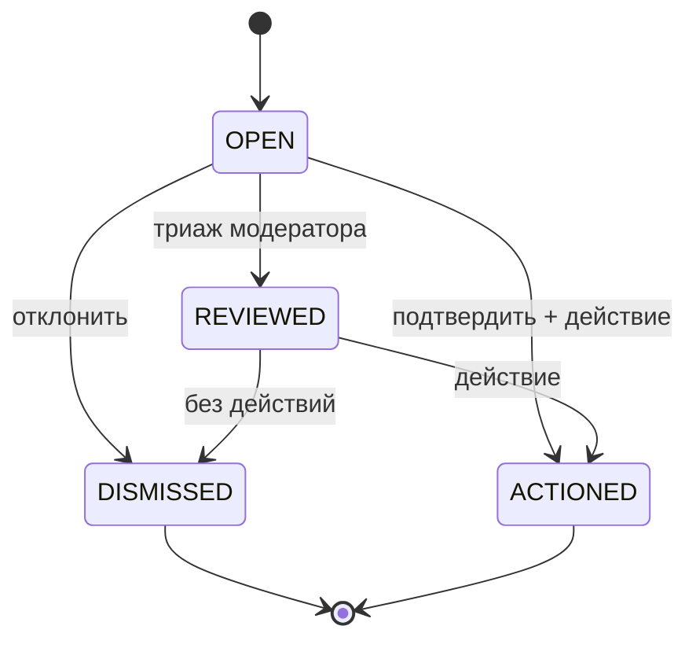

# Стейт-машина: Жалоба на контент (Content Report)

Жизненный цикл строки `content_reports` (жалоба пользователя на объявление/животное/пользователя/сообщение).
Значения статусов соответствуют CHECK `content_reports.status` в `database_schema.sql`.

## Состояния
- **OPEN** — создана заявителем; ожидает триажа модератором. (начальное)
- **REVIEWED** — модератор изучил; промежуточное (опционально) перед терминальным решением.
- **DISMISSED** — нарушения не найдено; закрыто без действий. (терминальное)
- **ACTIONED** — нарушение подтверждено; принято действие по цели. (терминальное)

## Переходы
| Из | В | Триггер | Гард / Актор |
|---|---|---|---|
| (нет) | OPEN | заявитель отправляет жалобу | аутентифицированный пользователь; не дубль уже решённой |
| OPEN | REVIEWED | модератор открывает/триажит | актор = MODERATOR/ADMIN |
| OPEN | DISMISSED | модератор отклоняет | актор = MODERATOR/ADMIN; ставит `resolved_by` |
| OPEN | ACTIONED | модератор подтверждает + действует | актор = MODERATOR/ADMIN; ставит `resolved_by`; entity-действие — отдельный 4a-шаг (см. Правила) |
| REVIEWED | DISMISSED | решение «без действий» | актор = MODERATOR/ADMIN; ставит `resolved_by` |
| REVIEWED | ACTIONED | решение «действовать» | актор = MODERATOR/ADMIN; ставит `resolved_by`; entity-действие — отдельный 4a-шаг (см. Правила) |

## Правила
- Терминальные состояния (DISMISSED, ACTIONED) неизменяемы; повторное открытие требует новой жалобы.
- `resolved_by` (FK users) ставится при любом терминальном переходе; `updated_at` обновляется. Resolve пишет
  строку `audit_log` в той же транзакции (snapshot актора `{actorId, principalType}`, agent-ready).
- **ACTIONED фиксирует только статус жалобы (MVP-loose, round-N).** `resolve(ACTIONED)` помечает жалобу
  ACTIONED; модератор **обычно также** записывает moderation-решение по целевой сущности (деактивировать
  листинг и т.п.) как **отдельный 4a-шаг модерации** (который требует своего claim/lock). Эти два НЕ являются
  одной связанной транзакцией — строка `moderation_decisions` **не** является предусловием ACTIONED.
- Заявитель не может переводить свою жалобу; только MODERATOR/ADMIN (см. `specs/security/rbac-matrix.md`).

> **(round-N, нормативно — DRIFT-3-реконсиляция) WHAT:** связка ACTIONED изменена с «ACTIONED **должна**
> сопровождаться строкой `moderation_decisions` по целевой сущности» на MVP-loose — `resolve(ACTIONED)` фиксирует
> только статус жалобы; entity-действие — отдельный 4a-шаг модератора (ячейки «emits moderation decision» в
> таблице переходов смягчены под это).
> **WHY:** 4a-флоу модерации требует **claim/lock** на целевой сущности (M-2..M-5); связка report-resolve с
> также-emission moderation-решения заставила бы report-resolve-путь захватывать этот lock и гонять полную
> decision-транзакцию внутри разрешения жалобы — переплетая два независимо-авторизованных флоу (resolve = MOD/ADMIN
> на жалобе; decide = lock-holder на сущности). Контракт `resolveContentReport` намеренно не несёт
> entity-action полей.
> **WHY-BETTER-for-the-whole-project:** держит два append-only следа (`content_reports`, `moderation_decisions`)
> независимо атомарными и независимо авторизованными; позволяет модератору dismiss/триажить жалобу без касания
> сущности; entity-действие, когда принято, всё ещё идёт через аудируемый 4a-путь (без потери аудита). Тесная связка
> отложена (будущее удобство «resolve-and-act» могло бы скомпоновать оба за одним вызовом, за lock) — не
> требование сейчас. Реконсилирует SM со Slice-4b scope `12-moderation-domain.md`.

## Связанное
- [Домен модерации](../12-moderation-domain.md) · `database_schema.sql` (`content_reports`)
- 🌐 EN: [docs/specs/statemachines/content_report_state_machine.md](../../../docs/specs/statemachines/content_report_state_machine.md)
