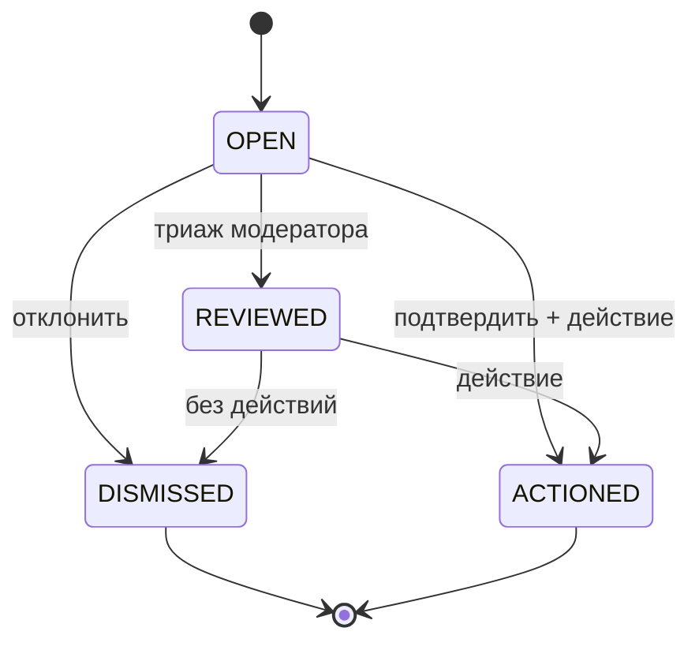

# Стейт-машина: Жалоба на контент (Content Report)

Жизненный цикл строки `content_reports` (жалоба пользователя на объявление/животное/пользователя/сообщение).
Значения статусов соответствуют CHECK `content_reports.status` в `database_schema.sql`.

## Состояния
- **OPEN** — создана заявителем; ожидает триажа модератором. (начальное)
- **REVIEWED** — модератор изучил; промежуточное (опционально) перед терминальным решением.
- **DISMISSED** — нарушения не найдено; закрыто без действий. (терминальное)
- **ACTIONED** — нарушение подтверждено; принято действие по цели. (терминальное)

## Переходы
| Из | В | Триггер | Гард / Актор |
|---|---|---|---|
| (нет) | OPEN | заявитель отправляет жалобу | аутентифицированный пользователь; не дубль уже решённой |
| OPEN | REVIEWED | модератор открывает/триажит | актор = MODERATOR/ADMIN |
| OPEN | DISMISSED | модератор отклоняет | актор = MODERATOR/ADMIN; ставит `resolved_by` |
| OPEN | ACTIONED | модератор подтверждает + действует | актор = MODERATOR/ADMIN; пишет moderation decision; `resolved_by` |
| REVIEWED | DISMISSED | решение «без действий» | актор = MODERATOR/ADMIN; `resolved_by` |
| REVIEWED | ACTIONED | решение «действовать» | актор = MODERATOR/ADMIN; moderation decision; `resolved_by` |

## Правила
- Терминальные состояния (DISMISSED, ACTIONED) неизменяемы; повторное открытие = новая жалоба.
- `resolved_by` (FK users) ставится при любом терминальном переходе; `updated_at` обновляется.
- ACTIONED сопровождается строкой `moderation_decisions` (append-only аудит) по целевой сущности.
- Заявитель не может переводить свою жалобу; только MODERATOR/ADMIN (см. `specs/security/rbac-matrix.md`).

## Связанное
- [Домен модерации](../12-moderation-domain.md) · `database_schema.sql` (`content_reports`)
- 🌐 EN: [docs/specs/statemachines/content_report_state_machine.md](../../../docs/specs/statemachines/content_report_state_machine.md)
