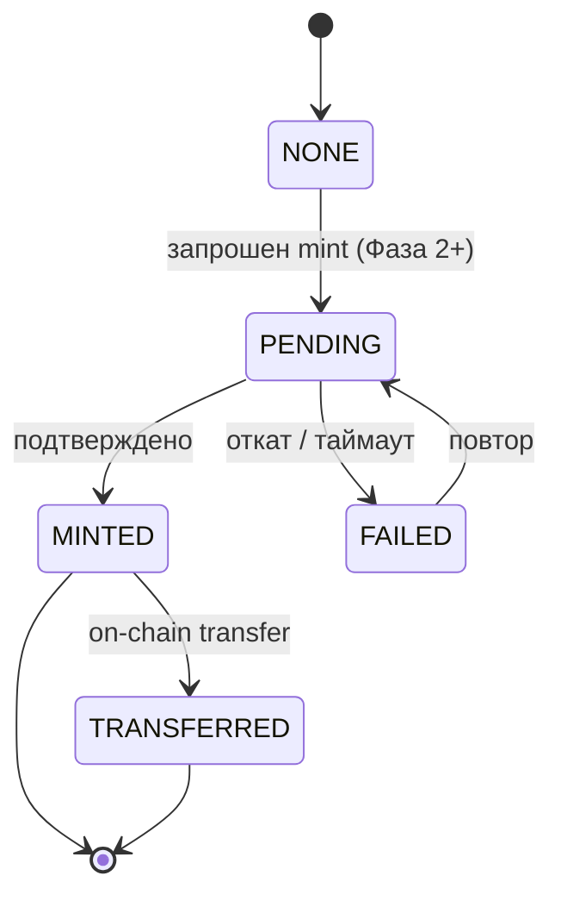

# Стейт-машина: Цифровой актив (NFT) — Фаза 2+

Жизненный цикл строки `digital_assets` (токенизированная родословная/сертификат/владение). **MVP: только хук схемы**,
все строки в `NONE`; mint/transfer реализуется в Фазе 2+ ([ADR-0010](../../04-decisions/0010-nft-digital-assets-hooks.md)),
гейтится `feature_toggles('digital_assets')`. Значения статусов соответствуют CHECK `digital_assets.mint_status`.

## Состояния
- **NONE** — строка существует (или актив доступен), но on-chain действий не запрошено. (начальное; единственное в MVP)
- **PENDING** — mint/transfer отправлен в сеть; ждём подтверждения (indexer/listener следит за tx).
- **MINTED** — токен подтверждён on-chain (TON/Polygon); заполнены `token_id`, `tx_hash`, `ipfs_cid`. (стабильное)
- **TRANSFERRED** — владение токеном изменено on-chain (после передачи владения животным). (стабильное)
- **FAILED** — tx сети упала/откатилась или истёк таймаут подтверждения. (терминальное, retryable)

## Переходы
| Из | В | Триггер | Гард |
|---|---|---|---|
| NONE | PENDING | запрошен mint (Фаза 2+) | toggle on; актор владеет животным или ADMIN; нет живого токена на (animal, asset_type) |
| PENDING | MINTED | indexer подтверждает mint на нужной глубине | подпись webhook/poll проверена |
| PENDING | FAILED | tx откат / таймаут | — |
| MINTED | TRANSFERRED | подтверждён on-chain transfer | привязан к свершившемуся `ownership_transfers` |
| FAILED | PENDING | повтор mint | новый tx; идемпотентность сохранена |

## Правила
- **MVP:** переходов нет; строки остаются `NONE`. Не реализовывать mint в Фазе 1.
- PostgreSQL — источник истины; on-chain зеркалится только после глубины подтверждения (не доверять неподтверждённому tx).
  Синхронизация chain→app идёт через outbox/inbox (`outbox_events`).
- On-chain метаданные содержат только публичные верифицируемые факты (происхождение, титулы) — **никогда** ПДн владельца (ФЗ-152).
- Уникальный частичный индекс `uq_digital_asset_per_type` запрещает два живых токена на (animal, asset_type).

## Связанное
- [ADR-0010](../../04-decisions/0010-nft-digital-assets-hooks.md) · [Стейт-машина передачи владения](ownership_transfer_state_machine.md) · `database_schema.sql` (`digital_assets`)
- 🌐 EN: [docs/specs/statemachines/digital_asset_state_machine.md](../../../docs/specs/statemachines/digital_asset_state_machine.md)
