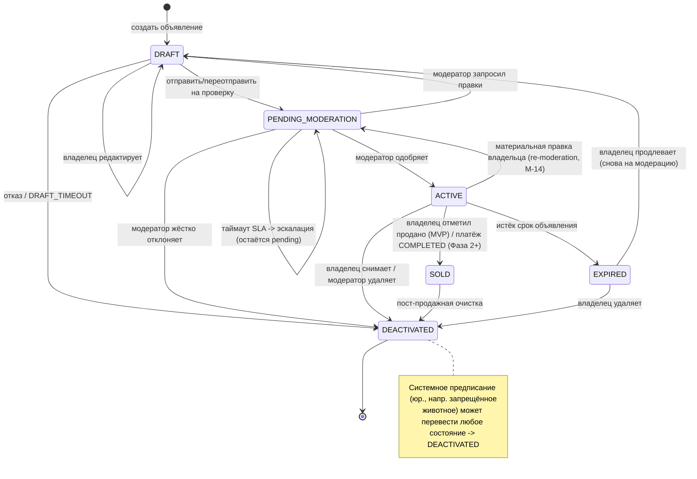

# Спецификация конечного автомата состояний объявления

## Обзор
Определяет состояния жизненного цикла и переходы для объявления (животное на продажу/удочерение) в системе ZooLink.

## Поля статуса и ключевой инвариант
Объявление несёт **два** столбца (`database_schema.sql`): `status` (этот автомат) и `moderation_status`
(`PENDING|APPROVED|REJECTED|CHANGES_REQUESTED`). **Инвариант (P0):** `status = 'ACTIVE'` допустим **только** при
`moderation_status = 'APPROVED'`. Обеспечивается триггером БД `trg_listing_active_requires_approval` (миграция 0004)
и перепроверяется в сервис-слое. Поля не независимы.

## Диаграмма состояний

## Состояния

| Состояние | Описание | Действия при входе | Действия при выходе |
|-----------|----------|-------------------|---------------------|
| **DRAFT** | Исходное состояние после создания объявления; видно только владельцу; недоступно в публичном поиске | - Назначить временный ID объявления - Установить временной отметкой создания - Проверить минимально требуемые поля (заголовок, цена, местоположение, ID животного) | - Очистить временные данные черновика |
| **PENDING_MODERATION** | Объявление отправлено на рассмотрение; не видно в публичном поиске; ожидает действий модератора | - Увеличить счетчик очереди модерации - Уведомить команду модерации - Запустить таймер SLA модерации | - Остановить таймер SLA при быстром выходе |
| **ACTIVE** | Объявление одобрено и видно в публичном поиске; доступно для покупки/удочерения | - Опубликовать в поисковых индексах - Активировать видимость гео-поиска - Установить временную метку публикации - Активировать кнопки покупки/запроса | - Нет |
| **EXPIRED** | Объявление автоматически деактивировано после истечения срока; сохраняет историю | - Удалить из активных поисковых индексов - Установить временную отметку истечения - Уведомить владельца об истечении | - Нет |
| **SOLD** | Объявление отмечено как завершённое; сохраняет историю | **MVP:** - Установить `sold_at` - Уведомить владельца - (пометка SOLD НЕ авто-инициирует передачу владения; передача владения есть в MVP как отдельный явный owner-initiated флоу — [ADR-0013](../../04-decisions/0013-mvp-ownership-transfer.md); авто-передача-при-SOLD — Фаза 2). **Фаза 2+:** - Записать `transaction_id` - Запустить процесс трансфера собственности (авто-передача-при-SOLD, payment-gated) | - Нет |
| **DEACTIVATED** | Объявление вручную удалено владельцем или модератором; сохраняет историю | - Установить временную отметку деактивации - Зафиксировать причину деактивации - Уведомить заинтересованные стороны (если применимо) | - Нет |

## Переходы между состояниями

| Из состояния | В состояние | Триггер | Условие сохранности | Действие |
|--------------|-------------|---------|---------------------|----------|
| DRAFT | PENDING_MODERATION | Владелец отправляет/переотправляет | Все обязательные поля валидны && медиа загружены && (цена >= MIN_LISTING_PRICE **только если** listing_type='sale') | Установить `moderation_status='PENDING'`; счётчик отправок |
| DRAFT | DRAFT | Владелец редактирует объявление | Пользователь является владельцем && объявление не истекло/не продано | Обновить поля; сбросить валидацию (без re-enqueue — остаётся DRAFT) |
| ACTIVE | PENDING_MODERATION | Владелец редактирует **материальное** поле ACTIVE-объявления (re-moderation, M-14) | Пользователь — владелец/org-admin && изменилось материальное поле (title/description/photos/price/listing_type; `animal_id` иммутабелен, так что species/breed измениться не могут — см. Правила) | **Re-enqueue:** `status='PENDING_MODERATION'`, `moderation_status='PENDING'`, `moderation_enqueued_at=now()`; **снять lock** (`assigned_to`/`locked_at`/`lock_expires_at`→NULL); **сбросить `escalated_at`→NULL** (чтобы повторное ревью могло пере-эскалировать — SLA-4); уведомить владельца (снова на проверке) |
| DRAFT | DEACTIVATED | Владелец бросает черновик | Пользователь явно удаляет \|\| автоочистка по DRAFT_TIMEOUT | Журналировать; очистить временные данные |
| PENDING_MODERATION | ACTIVE | Модератор одобряет | Решение = APPROVE && нет нарушений | Установить `moderation_status='APPROVED'`; опубликовать; уведомить владельца |
| PENDING_MODERATION | DEACTIVATED | Модератор жёстко отклоняет | Решение = REJECT (нарушение, неисправимо) | Установить `moderation_status='REJECTED'`; уведомить с причиной (терминально) |
| PENDING_MODERATION | DRAFT | Модератор запросил правки | Решение = CHANGES_REQUESTED (исправимо) | Установить `moderation_status='CHANGES_REQUESTED'`; уведомить; владелец правит и переотправляет |
| PENDING_MODERATION | PENDING_MODERATION | Таймаут SLA модерации | Нет действий в течение MODERATION_SLA_HOURS | **Эскалация** (алерт админу/лиду); остаётся pending — никогда не авто-публикуется/авто-отклоняется |
| ACTIVE | EXPIRED | Истёк срок объявления | Время с публикации > LISTING_DURATION_DAYS && не продано | Удалить из поиска; уведомить владельца |
| ACTIVE | SOLD | **MVP:** владелец отмечает продано | Пользователь — владелец && объявление ACTIVE | Установить `sold_at`; убрать из поиска; уведомить владельца (без трансфера) |
| ACTIVE | SOLD | **Фаза 2+:** транзакция завершена | `payment_transactions.status` = COMPLETED && покупатель подтвердил | Записать `transaction_id`; инициировать трансфер собственности |
| ACTIVE | DEACTIVATED | Владелец снимает объявление | Пользователь — владелец && активно && не в транзакции | Уведомить заинтересованных; журнал снятия |
| ACTIVE | DEACTIVATED | Модератор удаляет | Решение модерации = REMOVE_ACTIVE || тяжелое нарушение политики | Уведомить владельца; журнал действия модерации |
| SOLD | DEACTIVATED | Очистка после продажи | Транзакция полностью завершена && собственность передана | Архивировать данные объявления; сохранить для истории |
| EXPIRED | DEACTIVATED | Владелец продлевает или удаляет | Инициировано продление удаление пользователем | Если продление: сброс в DRAFT; если удаление: архивировать |
| * | DEACTIVATED | Системный мандат | Требование законодательства (например, запрещенное животное) | Анонимизировать конфиденциальные данные; журнал соответствия |

## Константы и конфигурация
- `MIN_LISTING_PRICE`: 0 (бесплатные объявления разрешены) или 1 (минимальная единица валюты) - настраивается по региону
- `DRAFT_TIMEOUT`: 7 дней (автоочистка заброшенных черновиков)
- `MODERATION_SLA_HOURS`: 24 часа (окно проверки модерации)
- `LISTING_DURATION_DAYS`: 30 дней (стандартная продолжительность объявления; настраивается по типу объявления)
- `MAX_MEDIA_ITEMS`: 10 (максимум фото/видео на объявление)
- `MIN_TITLE_LENGTH`: 3 символа
- `MAX_TITLE_LENGTH`: 100 символов

## Замечания
- Все переходы логируются с временной отметкой, ID объявления, ID пользователя (владельца/модератора) и контекстом триггера.
- Терминальные состояния: EXPIRED, SOLD, DEACTIVATED. DRAFT и PENDING_MODERATION — переходные; ACTIVE — живое.
- Из DEACTIVATED допускаются переходы только: в DEACTIVATED (самопетля) или системное мандатное архивирование.
- **REJECT vs CHANGES_REQUESTED (согласование P0):** *жёсткий* reject (нарушение политики) терминален →
  DEACTIVATED с `moderation_status=REJECTED`; *исправимая* проблема → DRAFT с `moderation_status=CHANGES_REQUESTED`,
  владелец правит и переотправляет (DRAFT → PENDING_MODERATION). Это заменяет одно-статусные формулировки в
  `0003-pre-moderation-workflow.md` / `12-moderation-domain.md`.
- **Таймаут SLA модерации** никогда не авто-одобряет и не авто-отклоняет: эскалация, объявление остаётся в
  PENDING_MODERATION. (`EXPIRED` — только для *ACTIVE* объявления, у которого истёк срок показа.)
- **Re-moderation при материальной правке ACTIVE (M-14, Slice 4d):** правка **материального** поля ACTIVE-
  объявления возвращает его в PENDING_MODERATION (re-enqueue). **Материальный набор (закреплён, MVP):** title,
  description, photos, price, `listing_type`. **В MVP нет пути тривиальной правки на ACTIVE-объявлении** — каждая
  правка редактируемых контент-полей ACTIVE-объявления материальна и re-enqueue'ит (DRIFT-M14b: прежний пример
  «тривиальная, напр. переключение сохранённого флага» не был полем листинга; простейшее + безопасное правило =
  все контент-правки ACTIVE материальны). **species/breed:** листинг ссылается на *животное*, чьи
  `species_id`/`breed_id` иммутабельны, и **`animal_id` иммутабелен на листинге после создания** (чтобы выставить
  другое животное, создайте новый листинг) — так что species/breed листинга никогда не меняются; пункт
  «species/breed материальны» удовлетворён этой иммутабельностью, а не редактируемым путём (DRIFT-M14c). Правка
  выводит листинг **из ACTIVE**, так что инвариант P0 ACTIVE-requires-APPROVED выполняется (нет правки-на-месте
  на ACTIVE; P0-триггер backstop'ит).
- EXPIRED продлевается сбросом в DRAFT и **повторной модерацией** (без обхода ревью).
- **SOLD в MVP** = владелец вручную помечает продано; пометка SOLD **НЕ авто-инициирует** передачу владения.
  Передача владения **есть в MVP**, но это **отдельный явный owner-initiated флоу**
  ([ADR-0013](../../04-decisions/0013-mvp-ownership-transfer.md), `ownership_transfer_state_machine.md`) —
  не побочный эффект жизненного цикла объявления. **Авто-передача-при-SOLD** (автоматическая инициация
  передачи при завершении продажи, payment-gated) — **Фаза 2+** (гейт `feature_toggles.payments`).
- **Каскады:** деактивация животного переводит его объявления → DEACTIVATED; деактивация пользователя переводит его
  ACTIVE-объявления → DEACTIVATED (см. стейт-машины животного/пользователя).

> **(round-N, нормативно — M-14 re-moderation, Slice 4d) WHAT:** добавлен переход `ACTIVE → PENDING_MODERATION`
> (материальная правка владельца) в таблицу + mermaid + Примечания; закреплён материальный набор (title/description/
> photos/price/listing_type), закреплено **отсутствие пути тривиальной правки на ACTIVE** (DRIFT-M14b) и
> **иммутабельность `animal_id`**, так что species/breed измениться не могут (DRIFT-M14c). Re-enqueue снимает
> lock модератора и сбрасывает `escalated_at` (SLA-4).
> **WHY:** спека закрепила re-moderation-при-материальной-правке (M-14, `12-moderation-domain.md`), но у стейт-машины
> был только `DRAFT→DRAFT (правка владельца)` — не было перехода правки-на-ACTIVE, а «тривиальные правки
> (переключение сохранённого флага)» / «species/breed» были неоднозначны (пример не был полем; species/breed не
> принадлежат листингу). У бэкенда не было однозначного правила.
> **WHY-BETTER-for-the-whole-project:** сохраняет **M-P0** — материальная правка выводит листинг ИЗ ACTIVE, а не
> мутирует ACTIVE-листинг на месте, так что «ACTIVE ⇒ APPROVED» никогда не нарушается (P0-триггер backstop'ит);
> простейшее безопасное правило (все контент-правки ACTIVE материальны) убирает целый класс неоднозначности без
> минусов (повторное ревью дёшево, выход непроверенной правки в публикацию — нет); иммутабельность `animal_id`
> согласована с иммутабельными species/sex/DoB/breed агрегата животного (ADR-0004) и причинами целостности
> родословной за ними; сброс `escalated_at` закрывает cross-slice контракт, отложенный здесь из 4c (SLA-4), чтобы
> повторное ревью могло пере-эскалировать. Без новой миграции — переиспользует существующие claim/lock-колонки и
> `escalated_at` (0024).

## Listings Slice 1 — инварианты и негативные случаи (round-N, нормативно)

> **Замечание об источнике правды.** Готовый к сборке контракт: [listings-api.yaml](../../03-architecture/api-contracts/listings-api.yaml).
> Эта секция — общий список инвариантов/негативных случаев для **backend-engineer** и
> **reviewer-qa** по Slice 1 (жизненный цикл DRAFT: create / update / add+remove photo / submit /
> withdraw / read+list). Переходы со стороны модератора (approve/reject/changes), ACTIVE→SOLD/EXPIRED,
> платёж и гео-поиск — **вне Slice 1** (Admin Slice 4 / Фаза 2 / Slice 2).
>
> **WHAT:** формализовать инварианты Slice-1, всплывшие на reviewer-qa preflight, + дельты
> контракта (submit-переход, server-derived seller, leasing enum, lat/lng гео-форма, MODERATOR
> write-block).
> **WHY:** контракт имел реальные build-blocking пробелы (нет submit-перехода; client-supplied
> `sellerId` = IDOR; дрейф `leasing`/гео от валидированной схемы; MODERATOR over-granted на
> записи) — бэкенд, построенный по нему, разошёлся бы со схемой (tier 3 истины) и rbac.
> **WHY-BETTER-for-the-whole-project:** один нормативный список привязывает бэкенд-тесты и QA-покрытие к
> одним инвариантам; жизненный цикл движется только через действия (согласовано с паттерном transfer
> accept/decline ADR-0013); guard P0 ACTIVE-requires-APPROVED остаётся единственным якорем безопасности;
> рынки остаются раздельными (ADR-0002, рынок выводится, не записывается); leasing/гео поставляются как form-now,
> behaviour-later без будущего слома контракта.

### Набор эндпоинтов Slice-1 (В scope)

`POST /listings` (create→DRAFT) · `GET /listings` (публично, только active) · `GET /listings/{id}`
(публично, только active) · `PATCH /listings/{id}` (правка владельцем) · `DELETE /listings/{id}`
(мягкий отзыв→DEACTIVATED) · `POST /listings/{id}/submit` (DRAFT→PENDING_MODERATION) ·
`GET|POST /listings/{id}/photos` · `DELETE /listings/{id}/photos/{photoId}`.
**Отложено (сохранено в контракте, НЕ В Slice-1):** `GET /listings/{id}/analytics` (нужны
колонки view_count/contact_shown_count — GAP-TRACE-006), `/listings/{id}/conversations` (чат,
ADR-0005, deprecated), переходы модератора (Admin Slice 4), PostGIS гео-поиск (Slice 2).

### Инварианты и негативные случаи

| # | Инвариант (ДОЛЖЕН выполняться) | Негативный случай (ДОЛЖЕН отклоняться) | Обеспечивается | Ошибка → HTTP / code |
|---|---|---|---|---|
| L-P0 | **ACTIVE требует `moderation_status='APPROVED'`.** Ни один путь Slice-1 не ставит ACTIVE. | любая попытка поставить `status=ACTIVE` (вкл. на submit). | DB `trg_listing_active_requires_approval` + сервис | 422 `VALIDATION_ERROR` (триггер raise) |
| L-1 | **Продавец = аутентифицированный актор** (`seller_id` server-derived). | `sellerId` в теле (любое значение, вкл. отличное от актора — IDOR). | сервис whitelist неизвестных полей (отклоняет body sellerId) | 400 `VALIDATION_ERROR` (неизвестное поле) — продавец выводится, никогда не задаётся клиентом (D2) |
| L-2 | **Актор должен владеть животным**, чтобы создать для него объявление. | create для животного другого пользователя. | сервис (object-level authz) | 403 `FORBIDDEN` |
| L-3 | **Мутирующие операции — только продавец-или-org-admin** (rbac-matrix §99); MODERATOR — R-only на объявлениях. | не-владелец (вкл. MODERATOR) PATCH/DELETE/submit/photo. | сервис object-level + `x-required-roles` (MODERATOR убран из записей) | 403 `FORBIDDEN` |
| L-4 | **`chk_listing_ownership`:** личное = orgId+branchId оба null; орг = orgId задан (branchId опционально); branchId⇒orgId. | branchId задан без orgId; смешанное личное/орг. | DB CHECK + сервис pre-validate | 422 `VALIDATION_ERROR` (не 500) |
| L-5 | **Owner-scoping списка/чтения:** не-active объявления (DRAFT/PENDING/DEACTIVATED) видны только их владельцу (и operator scope). | другой пользователь читает/листит чужой DRAFT/PENDING. | сервис query scoping; публичный `GET` возвращает только active | 404 `NOT_FOUND` (не утекать существование) |
| L-6 | **Submit-guard:** DRAFT→PENDING_MODERATION требует все обязательные поля валидны И ≥1 фото И (цена ≥ MIN_LISTING_PRICE **только если** `listingType='sale'`). | submit без фото / цена продажи ниже min / нет обязательного поля. | сервис | 422 `VALIDATION_ERROR` |
| L-7 | **Предусловие submit:** только DRAFT может быть отправлен. | submit на не-DRAFT (PENDING/ACTIVE/и т.п.). | сервис (state precondition) | 409 `LISTING_NOT_DRAFT` |
| L-8 | **Отзыв — мягкий → DEACTIVATED** из управляемых владельцем состояний; терминальные отклоняют. | DELETE на SOLD/EXPIRED/уже-DEACTIVATED объявлении. | сервис (state precondition) | 409 `CONFLICT` |
| L-9 | **Value CHECK-и:** `price_cents ≥ 0`, `quantity ≥ 1`, `currency` ISO-4217 `^[A-Z]{3}$`, lat/lng оба-null-или-оба-заданы в диапазоне. | отрицательная цена / quantity 0 / плохая валюта / out-of-range или полузаданные lat-lng. | DB CHECK-и (`chk_listings_currency_iso`, `chk_listings_latlng`) + сервис | 422 `VALIDATION_ERROR` |
| L-10 | **Рынок выводится** из вида животного (ADR-0002), никогда не задаётся клиентом. | поле тела, пытающееся задать market/market-crossing. | сервис (derive, игнор клиента) | n/a (выведено) / 422 при cross-market несовпадении животное⇄орг |
| L-11 | **`leasing` принимается без поведения** (только форма, Фаза 2). | ожидание leasing-специфичных правил в Slice 1. | сервис (хранит значение, без спец-логики) | n/a (принято) |
| L-12 | **`status`/`moderationStatus`/`sellerId` не записываемы** через create/update — жизненный цикл движется только через действия. | тело, задающее `status`/`moderationStatus`/`sellerId`. | схема `readOnly`/omitted + сервис | игнорируется (или 422 в strict-reject режиме) |
| L-13 | **Оптимистичная конкуренция** на PATCH и на /submit (If-Match). | конкурентная правка с устаревшим ETag; нет If-Match. | сервис ETag-сравнение | 412 `STALE_RESOURCE` / 428 |
| L-14 | **`MAX_MEDIA_ITEMS=10`** фото на объявление. | добавление 11-го фото. | сервис | 422 `VALIDATION_ERROR` |
| L-15 | **Переходы audit/principal-stamped** (`{actor_id, principal_type}` HUMAN/AGENT). | переход, сохранённый без snapshot принципала. | сервис + audit | n/a (инвариант времени записи) |

**Доменные коды ошибок (расширяют API_CONVENTIONS §4):** `LISTING_NOT_DRAFT` (409); плюс стандартные
`CONFLICT` (409, отзыв в терминальном состоянии), `VALIDATION_ERROR` (422 для нарушений значений/guard;
**400** для неизвестного поля тела, напр. `sellerId` — whitelist неизвестных полей), `FORBIDDEN` (403),
`NOT_FOUND` (404), `STALE_RESOURCE` (412).

**RBAC (rbac-matrix.md §64/§99, MVP нормативно):** USER (и breeder/farmer/vet/groomer) =
C/R/U/D **own** (R любые **active**); MODERATOR = **R любые** (вкл. pending) — **нет C/U/D**;
ADMIN = R/U/D любые. Мутирующие операции контракта поэтому исключают MODERATOR из `x-required-roles`
(D4), а object-level ownership (`seller_id==actor` или org-admin) обеспечивается на сервисе.

## Listings Slice 2 — инварианты и негативные случаи поиска/фильтрации (round-N, нормативно)

> **Замечание об источнике правды.** Это расширяет `GET /v1/listings` (read-only; без миграции — все
> индексы есть). Контракт: [listings-api.yaml](../../03-architecture/api-contracts/listings-api.yaml)
> (`listListings`). Гео-алгоритм: [07-geo-search-service.md](../07-geo-search-service.md)
> (Haversine + bbox-префильтр; радиус **1–100 км**; `search_radius_m` НЕ является радиусом поиска).
> Разделение рынков: [ADR-0002](../../04-decisions/0002-hard-split-markets.md) (MVP = один эндпоинт +
> enforced `market`-фильтр, по [ADR-0009](../../04-decisions/0009-mvp-vs-target-architecture.md);
> целевые separate-per-market эндпоинты — ADR-0002 §97). Это общий список инвариантов для
> **backend-engineer** и **reviewer-qa**.
>
> **WHAT:** добавить гео (`lat`/`lng`/`radius_km`), `market`, `species_id`/`breed_id` и
> whitelisted `sort` в публичный поиск объявлений; добавить `distanceM` в ответ.
> **WHY:** discovery — ключевое требование маркетплейса; схема/индексы (`idx_listings_latlng`,
> `idx_animals_species_breed`, `species.market`) и гео-алгоритм уже существуют, но
> контракт не выставлял ничего из этого — бэкенду не на чём было строить поиск.
> **WHY-BETTER-for-the-whole-project:** держит жёсткое разделение рынков (ADR-0002) enforced на
> контракте+сервисе, так что ни один запрос не может утечь между рынками; переиспользует MVP Haversine-путь (без PostGIS
> до Фазы 2, ADR-0009); snake_case filter/sort (§12) и sort-whitelist держат поверхность запроса
> безопасной и codegen-стабильной; `distanceM` аддитивен (null вне гео-пути).

### Scope Slice-2

**IN:** гео-поиск по радиусу, фильтр рынка, фильтры по виду/породе, sort-whitelist, `distanceM`.
**Отложено (свои поздние слайсы — затрекано, не выброшено):** **saved_searches** save/list/delete
(`saved_searches` таблица существует, geo-spec §86 — Slice 3) и **address→lat/lng геокодинг**
(вызывающий передаёт координаты; провайдер Yandex для позднего слайса). **PostGIS**-гео — Фаза 2 (ADR-0009).

### Инварианты и негативные случаи

| # | Инвариант (ДОЛЖЕН выполняться) | Негативный случай (ДОЛЖЕН отклоняться/обрабатываться) | Обеспечивается | Ошибка → HTTP / code |
|---|---|---|---|---|
| L2-1 | **MARKET NO-LEAK (ADR-0002, IDOR-класс).** Поиск `market=pet` возвращает **ноль** livestock-строк (и наоборот), даже с подделанным `species_id`/`animal_id`/`organization_id`. Фильтр рынка join'ит `listings.animal_id → animals.species_id → species.market` и **AND-пересекается** — он может только сузить. | запрос, пытающийся расширить между рынками через другой фильтр. | сервис: обязательный join-clause `species.market`, AND-composed; market выводится, не доверяется от клиента сверх enum | результаты никогда не смешивают рынки; n/a ошибка (фильтр, не reject) |
| L2-2 | **`market` conditional-required.** Обязателен на public/discovery-пути (анонимное чтение ИЛИ присутствует любой гео-параметр); опционален только для аутентифицированного owner-scoped чтения (результаты pre-constrained `listScope`). | public/гео-запрос без `market`. | сервис (OpenAPI-параметр non-required; это правило service-enforced — см. замечание D2) | 422 `MARKET_REQUIRED` |
| L2-3 | **Гео-набор all-or-none:** `lat`,`lng`,`radius_km` переданы вместе или вообще нет. | один или два из трёх присутствуют. | сервис | 422 `GEO_PARAMS_INCOMPLETE` |
| L2-4 | **Границы радиуса 1–100 км** (geo-spec §152). | `radius_km` < 1 или > 100. | сервис (параметр `minimum`/`maximum` + сервис) | 422 `RADIUS_OUT_OF_RANGE` |
| L2-5 | **Диапазон lat/lng** lat ∈ [−90,90], lng ∈ [−180,180]. | координата вне диапазона. | схема параметра + сервис | 422 `VALIDATION_ERROR` |
| L2-6 | **ACTIVE-only видимость композируется с гео.** Гео-clause AND `status='ACTIVE'` (публичные чтения никогда не видят не-ACTIVE) — гео никогда не расширяет видимость. | гео-поиск, всплывающий DRAFT/PENDING/DEACTIVATED-объявление. | сервис (status-фильтр AND гео-clause) | n/a (фильтр) |
| L2-7 | **Граница Haversine (±100 м допуск, geo-spec §141):** точка чуть-внутри радиуса включается, чуть-снаружи исключается, ровно-на-радиусе включается. | истинная in-radius точка отброшена, или out-of-radius точка возвращена сверх допуска. | сервис Haversine `d ≤ radius_m` с допуском | n/a (корректность; QA boundary-тесты) |
| L2-8 | **Bbox-префильтр loss-less:** bounding-box-префильтр никогда не отбрасывает точку, которую точный Haversine оставил бы (префильтр ⊇ результат-сет). | истинная in-radius точка исключена слишком-тесным bbox. | сервис (Δlat/Δlng по geo-spec §139) | n/a (корректность) |
| L2-9 | **NULL-координаты исключены** из гео-результатов — без city-centroid-fallback (geo-spec §151). | объявление с NULL lat/lng, появляющееся в гео-поиске. | сервис (гео-запрос требует non-null lat/lng) | n/a (фильтр) |
| L2-10 | **Антимеридиан (±180° lng):** когда bbox пересекает ±180 (РФ Чукотка/Камчатка), он разбивается на два lng-диапазона (`lng ≥ min` ИЛИ `lng ≤ max`); near-pole `Δlng` зажат до 180°. | поиск около ±180°, пропускающий валидные точки на wrapped-стороне. | сервис (geo-spec §148–150) | n/a (корректность) |
| L2-11 | **Sort-whitelist:** только `created_at`,`price`,`distance` × `asc`/`desc`. | неизвестное sort-поле или направление. | сервис (whitelist) | 400 `VALIDATION_ERROR` |
| L2-12 | **`sort=distance` требует координат.** | `sort=distance` без `lat`/`lng`. | сервис | 400 `VALIDATION_ERROR` |
| L2-13 | **Детерминированный порядок:** гео → `distance_m ASC, created_at DESC, id ASC`; не-гео по умолчанию `created_at DESC` (стабильный tie-break по `id`). | нестабильная пагинация (строки сдвигаются между страницами). | сервис ORDER BY (geo-spec §143) | n/a (корректность) |
| L2-14 | **`distanceM` заполняется только на гео-поиске;** иначе null; метры, округлённые; вычисляется не хранится. | `distanceM` задан без координат, или персистится. | сервис (вычисление per request) | n/a (форма ответа) |
| L2-15 | **Только параметризованный SQL** (без string-built фильтров — ESLint-guarded, doc-code-protocol). | любое гео/фильтр-значение, конкатенированное в SQL. | сервис (Kysely/`$queryRaw` bindings) | n/a (инвариант безопасности) |
| L2-16 | **`search_radius_m` никогда не используется** как радиус гео-поиска (geo-spec §153) — `radius_km` авторитетен. | сервис, читающий `listings.search_radius_m` для радиуса. | сервис (использовать request `radius_km`) | n/a (корректность) |

**Доменные коды ошибок (расширяют API_CONVENTIONS §4):** `MARKET_REQUIRED` (422),
`GEO_PARAMS_INCOMPLETE` (422), `RADIUS_OUT_OF_RANGE` (422); плюс стандартный `VALIDATION_ERROR`
(400 для sort-whitelist / `distance`-без-координат; 422 для нарушений значений).

### Реконсиляции (round-N, нормативно)

**N1 — `sellerId` в теле отклоняется (400), а не игнорируется.**
- **WHAT:** L-1 и описания `createListing`/`ListingCreate` в `listings-api.yaml` изменены с «`sellerId` в теле
  игнорируется» на «`sellerId` в теле **отклоняется (400, неизвестное поле)** whitelist'ом неизвестных полей;
  продавец выводится из аутентифицированного актора».
- **WHY:** реализация корректно отклоняет неизвестные поля (whitelist), согласованно с каждым другим модулем;
  reviewer-qa рассудил, что **код прав, а доки были неверны**. Док, обещавший «игнорируется», задавал ложное
  ожидание контракта и расходился с фактическим (и более защищённым) поведением.
- **WHY-BETTER-for-the-whole-project:** контракт теперь совпадает с валидированным поведением и с platform-wide
  конвенцией неизвестных полей; отклонение (а не молчаливое отбрасывание) client-supplied `sellerId` даёт более
  громкий и ранний IDOR-сигнал и одну согласованную историю input-валидации по всем модулям; продавец остаётся
  server-derived (D2).

**N2 — SOLD не авто-инициирует передачу (согласование с ADR-0013).**
- **WHAT:** буллет SOLD-в-MVP изменён с «SOLD НЕ передаёт владение животным (заблокировано в MVP)» на
  «пометка SOLD **НЕ авто-инициирует** передачу владения; передача владения **есть в MVP** как отдельный явный
  owner-initiated флоу ([ADR-0013](../../04-decisions/0013-mvp-ownership-transfer.md)); **авто-передача-при-SOLD**
  (payment-gated) — Фаза 2+».
- **WHY:** прежняя формулировка говорила, что передача «заблокирована в MVP», что устарело, когда
  [ADR-0013](../../04-decisions/0013-mvp-ownership-transfer.md) (Accepted) внёс упрощённую передачу владения
  **в** MVP. Это коррекция **в сторону Accepted ADR** (tier 2 иерархии истины), а не новое решение.
- **WHY-BETTER-for-the-whole-project:** убирает прямое противоречие с ADR-0013; держит жизненный цикл объявления
  и жизненный цикл передачи как два независимых флоу (согласованно с тем, как `ownership_transfer_state_machine.md`
  фреймит MVP-vs-Фаза-2), так что SOLD-объявление никогда молча не меняет владение животным, а единственный путь к
  переатрибуции остаётся явным, дополняющим историю флоу передачи.