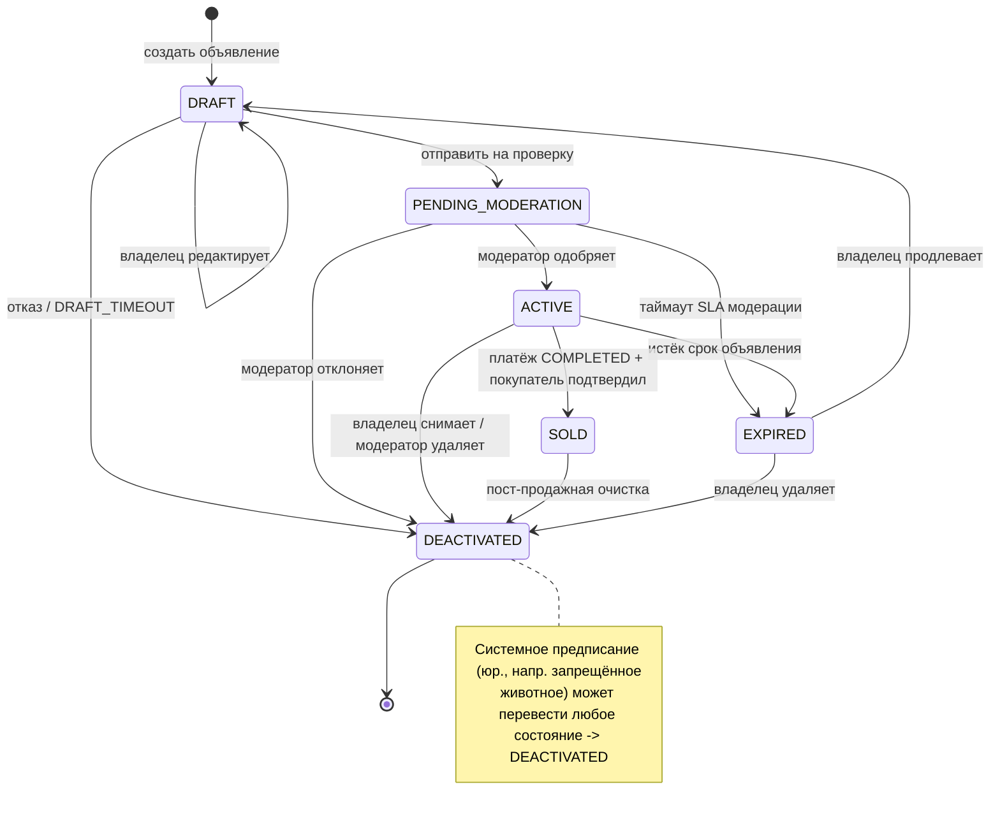

# Спецификация конечного автомата состояний объявления

## Обзор
Определяет состояния жизненного цикла и переходы для объявления (животное на продажу/удочерение) в системе ZooLink.

## Диаграмма состояний

## Состояния

| Состояние | Описание | Действия при входе | Действия при выходе |
|-----------|----------|-------------------|---------------------|
| **DRAFT** | Исходное состояние после создания объявления; видно только владельцу; недоступно в публичном поиске | - Назначить временный ID объявления - Установить временной отметкой создания - Проверить минимально требуемые поля (заголовок, цена, местоположение, ID животного) | - Очистить временные данные черновика |
| **PENDING_MODERATION** | Объявление отправлено на рассмотрение; не видно в публичном поиске; ожидает действий модератора | - Увеличить счетчик очереди модерации - Уведомить команду модерации - Запустить таймер SLA модерации | - Остановить таймер SLA при быстром выходе |
| **ACTIVE** | Объявление одобрено и видно в публичном поиске; доступно для покупки/удочерения | - Опубликовать в поисковых индексах - Активировать видимость гео-поиска - Установить временную метку публикации - Активировать кнопки покупки/запроса | - Нет |
| **EXPIRED** | Объявление автоматически деактивировано после истечения срока; сохраняет историю | - Удалить из активных поисковых индексов - Установить временную отметку истечения - Уведомить владельца об истечении | - Нет |
| **SOLD** | Объявление отмечено как завершенное через успешную транзакцию; сохраняет историю | - Записать ID транзакции - Установить временную отметку завершения - Уведомить покупателя и продавца - Запустить процесс трансфера собственности | - Нет |
| **DEACTIVATED** | Объявление вручную удалено владельцем или модератором; сохраняет историю | - Установить временную отметку деактивации - Зафиксировать причину деактивации - Уведомить заинтересованные стороны (если применимо) | - Нет |

## Переходы между состояниями

| Из состояния | В состояние | Триггер | Условие сохранности | Действие |
|--------------|-------------|---------|---------------------|----------|
| DRAFT | PENDING_MODERATION | Владелец отправляет на рассмотрение | Все обязательные поля валидны && медиа загружены && цена >= MIN_LISTING_PRICE | Увеличить счетчик отправок |
| DRAFT | DRAFT | Владелец редактирует объявление | Пользователь является владельцем && объявление не истекло/не продано | Обновить поля; сбросить валидацию |
| DRAFT | DEACTIVATED | Владелец бросает черновик | Пользователь явно удаляет || автоматическая очистка по таймауту DRAFT | Журналировать бросание; очистить временные данные |
| PENDING_MODERATION | ACTIVE | Модератор одобряет | Решение модерации = APPROVE && нет нарушений политики | Опубликовать объявление; уведомить владельца |
| PENDING_MODERATION | DEACTIVATED | Модератор отклоняет | Решение модерации = REJECT || нарушение политики найдено | Уведомить владельца с причиной; журнал отклонения |
| PENDING_MODERATION | EXPIRED | Таймаут модерации истек | Нет действий модератора в течение MODERATION_SLA_HOURS | Автоматически отклонить; уведомить владельца |
| ACTIVE | EXPIRED | Истек срок объявления | Время с публикации > LISTING_DURATION_DAYS && не продано | Удалить из поиска; уведомить владельца |
| ACTIVE | SOLD | Транзакция завершена | `payment_transactions.status` = COMPLETED && покупатель подтвердил получение | Записать продажу; инициировать трансфер собственности |
| ACTIVE | DEACTIVATED | Владелец снимает объявление | Пользователь является владельцем && объявление активно && не в транзакции | Уведомить заинтересованные стороны; журнал снятия |
| ACTIVE | DEACTIVATED | Модератор удаляет | Решение модерации = REMOVE_ACTIVE || тяжелое нарушение политики | Уведомить владельца; журнал действия модерации |
| SOLD | DEACTIVATED | Очистка после продажи | Транзакция полностью завершена && собственность передана | Архивировать данные объявления; сохранить для истории |
| EXPIRED | DEACTIVATED | Владелец продлевает или удаляет | Инициировано продление удаление пользователем | Если продление: сброс в DRAFT; если удаление: архивировать |
| * | DEACTIVATED | Системный мандат | Требование законодательства (например, запрещенное животное) | Анонимизировать конфиденциальные данные; журнал соответствия |

## Константы и конфигурация
- `MIN_LISTING_PRICE`: 0 (бесплатные объявления разрешены) или 1 (минимальная единица валюты) - настраивается по региону
- `DRAFT_TIMEOUT`: 7 дней (автоочистка заброшенных черновиков)
- `MODERATION_SLA_HOURS`: 24 часа (окно проверки модерации)
- `LISTING_DURATION_DAYS`: 30 дней (стандартная продолжительность объявления; настраивается по типу объявления)
- `MAX_MEDIA_ITEMS`: 10 (максимум фото/видео на объявление)
- `MIN_TITLE_LENGTH`: 3 символа
- `MAX_TITLE_LENGTH`: 100 символов

## Замечания
- Все переходы между состояниями логируются с временной отметкой, ID объявления, ID пользователя (владельца/модератора) и контекстом триггера.
- Терминальные состояния: ACTIVE, EXPIRED, SOLD, DEACTIVATED (DRAFT и PENDING_MODERATION являются переходными).
- Из состояния DEACTIVATED допускаются переходы только: в DEACTIVATED (самопетля для обновлений) или системное мандатное архивирование.
- EXPIRED объявления могут быть продлены владельцем, эффективно сбрасывая в состояние DRAFT с существующими данными.
- Состояние SOLD указывает на успешное завершение транзакции, но не автоматически передаёт собственность - это отдельный процесс, запускаемый продажей.