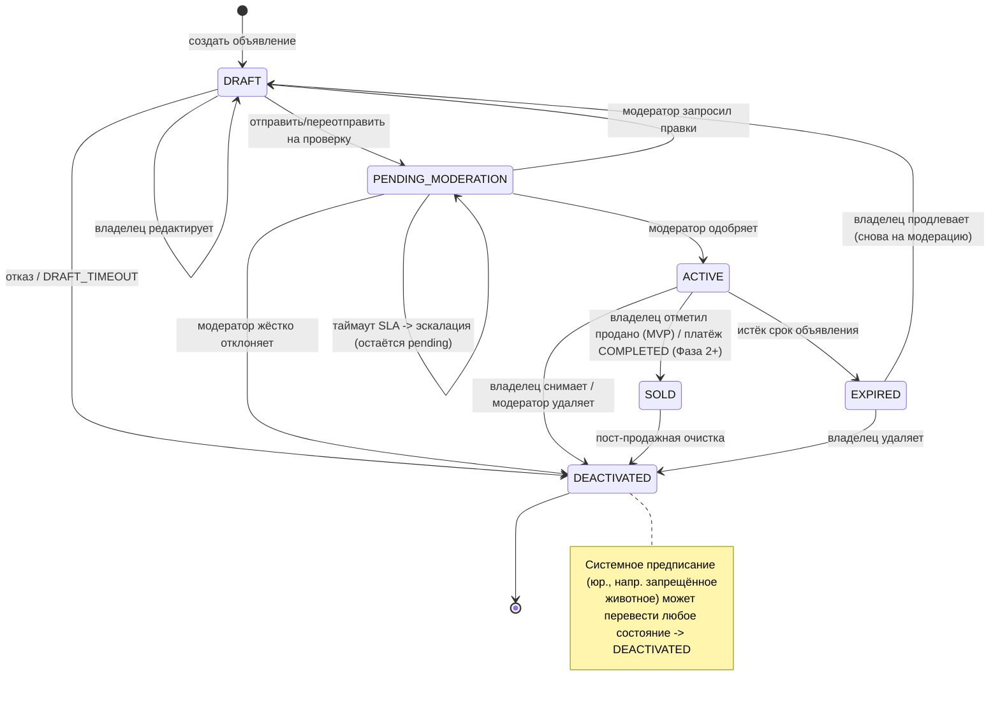

# Спецификация конечного автомата состояний объявления

## Обзор
Определяет состояния жизненного цикла и переходы для объявления (животное на продажу/удочерение) в системе ZooLink.

## Поля статуса и ключевой инвариант
Объявление несёт **два** столбца (`database_schema.sql`): `status` (этот автомат) и `moderation_status`
(`PENDING|APPROVED|REJECTED|CHANGES_REQUESTED`). **Инвариант (P0):** `status = 'ACTIVE'` допустим **только** при
`moderation_status = 'APPROVED'`. Обеспечивается триггером БД `trg_listing_active_requires_approval` (миграция 0004)
и перепроверяется в сервис-слое. Поля не независимы.

## Диаграмма состояний

## Состояния

| Состояние | Описание | Действия при входе | Действия при выходе |
|-----------|----------|-------------------|---------------------|
| **DRAFT** | Исходное состояние после создания объявления; видно только владельцу; недоступно в публичном поиске | - Назначить временный ID объявления - Установить временной отметкой создания - Проверить минимально требуемые поля (заголовок, цена, местоположение, ID животного) | - Очистить временные данные черновика |
| **PENDING_MODERATION** | Объявление отправлено на рассмотрение; не видно в публичном поиске; ожидает действий модератора | - Увеличить счетчик очереди модерации - Уведомить команду модерации - Запустить таймер SLA модерации | - Остановить таймер SLA при быстром выходе |
| **ACTIVE** | Объявление одобрено и видно в публичном поиске; доступно для покупки/удочерения | - Опубликовать в поисковых индексах - Активировать видимость гео-поиска - Установить временную метку публикации - Активировать кнопки покупки/запроса | - Нет |
| **EXPIRED** | Объявление автоматически деактивировано после истечения срока; сохраняет историю | - Удалить из активных поисковых индексов - Установить временную отметку истечения - Уведомить владельца об истечении | - Нет |
| **SOLD** | Объявление отмечено как завершённое; сохраняет историю | **MVP:** - Установить `sold_at` - Уведомить владельца - (БЕЗ трансфера собственности — владение животным заблокировано в MVP). **Фаза 2+:** - Записать `transaction_id` - Запустить процесс трансфера собственности | - Нет |
| **DEACTIVATED** | Объявление вручную удалено владельцем или модератором; сохраняет историю | - Установить временную отметку деактивации - Зафиксировать причину деактивации - Уведомить заинтересованные стороны (если применимо) | - Нет |

## Переходы между состояниями

| Из состояния | В состояние | Триггер | Условие сохранности | Действие |
|--------------|-------------|---------|---------------------|----------|
| DRAFT | PENDING_MODERATION | Владелец отправляет/переотправляет | Все обязательные поля валидны && медиа загружены && (цена >= MIN_LISTING_PRICE **только если** listing_type='sale') | Установить `moderation_status='PENDING'`; счётчик отправок |
| DRAFT | DRAFT | Владелец редактирует объявление | Пользователь является владельцем && объявление не истекло/не продано | Обновить поля; сбросить валидацию |
| DRAFT | DEACTIVATED | Владелец бросает черновик | Пользователь явно удаляет \|\| автоочистка по DRAFT_TIMEOUT | Журналировать; очистить временные данные |
| PENDING_MODERATION | ACTIVE | Модератор одобряет | Решение = APPROVE && нет нарушений | Установить `moderation_status='APPROVED'`; опубликовать; уведомить владельца |
| PENDING_MODERATION | DEACTIVATED | Модератор жёстко отклоняет | Решение = REJECT (нарушение, неисправимо) | Установить `moderation_status='REJECTED'`; уведомить с причиной (терминально) |
| PENDING_MODERATION | DRAFT | Модератор запросил правки | Решение = CHANGES_REQUESTED (исправимо) | Установить `moderation_status='CHANGES_REQUESTED'`; уведомить; владелец правит и переотправляет |
| PENDING_MODERATION | PENDING_MODERATION | Таймаут SLA модерации | Нет действий в течение MODERATION_SLA_HOURS | **Эскалация** (алерт админу/лиду); остаётся pending — никогда не авто-публикуется/авто-отклоняется |
| ACTIVE | EXPIRED | Истёк срок объявления | Время с публикации > LISTING_DURATION_DAYS && не продано | Удалить из поиска; уведомить владельца |
| ACTIVE | SOLD | **MVP:** владелец отмечает продано | Пользователь — владелец && объявление ACTIVE | Установить `sold_at`; убрать из поиска; уведомить владельца (без трансфера) |
| ACTIVE | SOLD | **Фаза 2+:** транзакция завершена | `payment_transactions.status` = COMPLETED && покупатель подтвердил | Записать `transaction_id`; инициировать трансфер собственности |
| ACTIVE | DEACTIVATED | Владелец снимает объявление | Пользователь — владелец && активно && не в транзакции | Уведомить заинтересованных; журнал снятия |
| ACTIVE | DEACTIVATED | Модератор удаляет | Решение модерации = REMOVE_ACTIVE || тяжелое нарушение политики | Уведомить владельца; журнал действия модерации |
| SOLD | DEACTIVATED | Очистка после продажи | Транзакция полностью завершена && собственность передана | Архивировать данные объявления; сохранить для истории |
| EXPIRED | DEACTIVATED | Владелец продлевает или удаляет | Инициировано продление удаление пользователем | Если продление: сброс в DRAFT; если удаление: архивировать |
| * | DEACTIVATED | Системный мандат | Требование законодательства (например, запрещенное животное) | Анонимизировать конфиденциальные данные; журнал соответствия |

## Константы и конфигурация
- `MIN_LISTING_PRICE`: 0 (бесплатные объявления разрешены) или 1 (минимальная единица валюты) - настраивается по региону
- `DRAFT_TIMEOUT`: 7 дней (автоочистка заброшенных черновиков)
- `MODERATION_SLA_HOURS`: 24 часа (окно проверки модерации)
- `LISTING_DURATION_DAYS`: 30 дней (стандартная продолжительность объявления; настраивается по типу объявления)
- `MAX_MEDIA_ITEMS`: 10 (максимум фото/видео на объявление)
- `MIN_TITLE_LENGTH`: 3 символа
- `MAX_TITLE_LENGTH`: 100 символов

## Замечания
- Все переходы логируются с временной отметкой, ID объявления, ID пользователя (владельца/модератора) и контекстом триггера.
- Терминальные состояния: EXPIRED, SOLD, DEACTIVATED. DRAFT и PENDING_MODERATION — переходные; ACTIVE — живое.
- Из DEACTIVATED допускаются переходы только: в DEACTIVATED (самопетля) или системное мандатное архивирование.
- **REJECT vs CHANGES_REQUESTED (согласование P0):** *жёсткий* reject (нарушение политики) терминален →
  DEACTIVATED с `moderation_status=REJECTED`; *исправимая* проблема → DRAFT с `moderation_status=CHANGES_REQUESTED`,
  владелец правит и переотправляет (DRAFT → PENDING_MODERATION). Это заменяет одно-статусные формулировки в
  `0003-pre-moderation-workflow.md` / `12-moderation-domain.md`.
- **Таймаут SLA модерации** никогда не авто-одобряет и не авто-отклоняет: эскалация, объявление остаётся в
  PENDING_MODERATION. (`EXPIRED` — только для *ACTIVE* объявления, у которого истёк срок показа.)
- EXPIRED продлевается сбросом в DRAFT и **повторной модерацией** (без обхода ревью).
- **SOLD в MVP** = владелец вручную помечает продано; владение животным НЕ передаётся (заблокировано в MVP,
  см. `ownership_transfer_state_machine.md`). Платёжный путь SOLD и трансфер — **Фаза 2+** (гейт `feature_toggles.payments`).
- **Каскады:** деактивация животного переводит его объявления → DEACTIVATED; деактивация пользователя переводит его
  ACTIVE-объявления → DEACTIVATED (см. стейт-машины животного/пользователя).