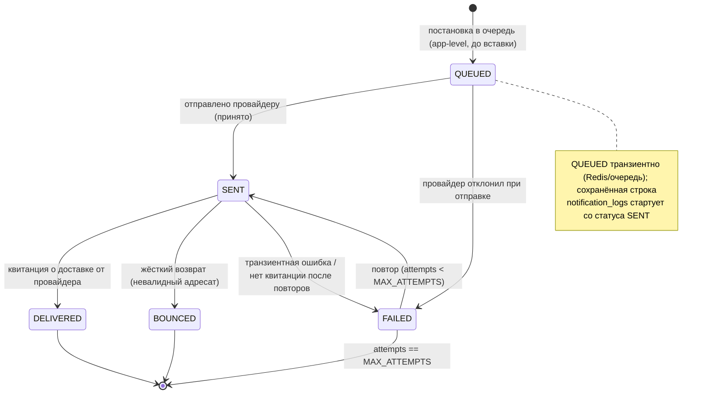

# Спецификация конечного автомата доставки уведомления

## Обзор
Определяет жизненный цикл и переходы записи `notification_logs` (одно исходящее EMAIL/SMS) в системе ZooLink. Исходы доставки управляются **вебхуками доставки провайдера** (см. `docs/specs/13-notification-domain.md`). Транзиентная стадия `QUEUED` существует на уровне приложения до сохранения строки со статусом `SENT`.

## Диаграмма состояний

## Состояния

| Состояние | Описание | Действия при входе | Действия при выходе |
|-----------|----------|--------------------|---------------------|
| **QUEUED** | App-level: сообщение собрано из шаблона, ожидает отправки (ещё не сохранено) | - Отрендерить тело `notification_templates` на языке адресата - Проверить opt-in в `users.notification_prefs` | - Поставить в очередь провайдеру |
| **SENT** | Передано провайдеру (email/SMS-шлюз принял к доставке) | - Вставить строку `notification_logs` (статус SENT) - Сохранить message id провайдера - Инкремент `attempts` | - Нет |
| **DELIVERED** | Провайдер подтвердил доставку адресату | - Установить отметку доставки - Сохранить квитанцию провайдера | - Нет |
| **FAILED** | Транзиентная/постоянная ошибка отправки; возможен повтор | - Записать ошибку провайдера в `provider_response` - Запланировать повтор, если `attempts < MAX_ATTEMPTS` | - Нет |
| **BOUNCED** | Жёсткий возврат — адресат невалиден/недостижим | - Записать причину возврата - Пометить адресата недоставляемым (подавить будущие отправки) | - Нет |

## Переходы состояний

| Из | В | Триггер | Условие (Guard) | Действие |
|----|----|---------|-----------------|----------|
| (начало) | QUEUED | Доменное событие требует уведомления | Адресат дал согласие (`notification_prefs`) && шаблон активен | Отрендерить контент |
| QUEUED | SENT | Провайдер принял отправку | Провайдер вернул message id | Сохранить лог; attempts=1 |
| QUEUED | FAILED | Провайдер отклонил при отправке | Ошибка отправки (конфиг, авторизация) | Залогировать сбой |
| SENT | DELIVERED | Вебхук квитанции доставки | Квитанция совпадает с message id | Отметить доставленным |
| SENT | BOUNCED | Вебхук возврата | Жёсткий возврат | Подавить адресата |
| SENT | FAILED | Нет квитанции / транзиентная ошибка | Доставка не подтверждена в окне | Запланировать повтор |
| FAILED | SENT | Повторная отправка | `attempts < MAX_ATTEMPTS` && не BOUNCED | Переотправить; инкремент attempts |

## Константы и конфигурация
- `MAX_ATTEMPTS`: 3 (макс. число попыток до терминального FAILED)
- `RETRY_BACKOFF`: экспоненциальный (напр. 1м, 5м, 30м)
- `DELIVERY_RECEIPT_WINDOW`: 15 мин (ожидание квитанции провайдера перед FAILED)

## Примечания
- Терминальные состояния: **DELIVERED**, **BOUNCED**, и **FAILED** при `attempts == MAX_ATTEMPTS`.
- BOUNCED-адресат подавляется от будущих отправок (без повтора).
- Транзакционные уведомления (верификация, исход модерации) активны в MVP; промо-уведомления учитывают `notification_prefs.promo`.
- Вебхуки провайдера обрабатываются идемпотентно (повторные квитанции не должны вызывать повторный переход).
