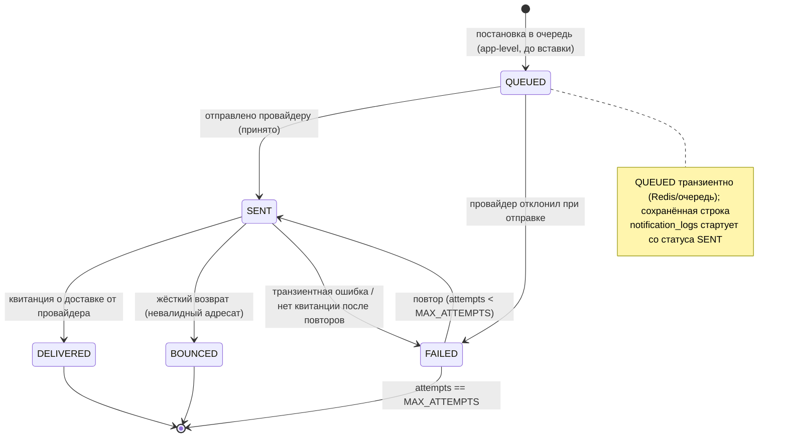
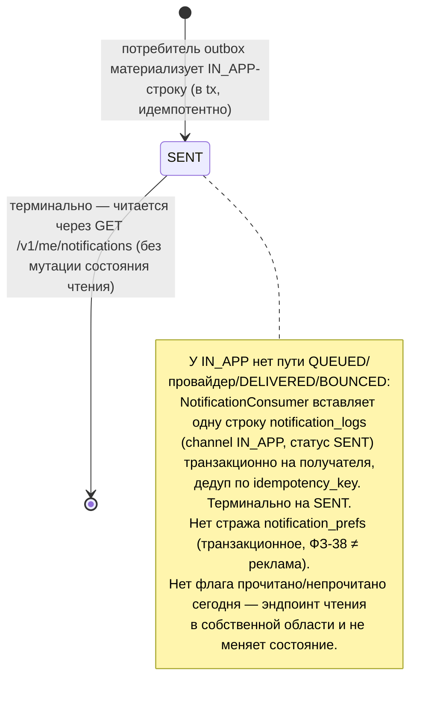

# Спецификация конечного автомата доставки уведомления

## Обзор
Определяет жизненный цикл и переходы записи `notification_logs` (одно исходящее EMAIL/SMS/IN_APP) в системе ZooLink. Исходы доставки для каналов провайдера (EMAIL/SMS) управляются **вебхуками доставки провайдера** (см. `docs/specs/13-notification-domain.md`). Транзиентная стадия `QUEUED` существует на уровне приложения до сохранения строки со статусом `SENT`. Канал **IN_APP** (ADR-0021, построенный MVP-канал) не имеет провайдера и вебхука — см. полосу IN_APP ниже.

## Диаграмма состояний

```mermaid
stateDiagram-v2
    [*] --> QUEUED: постановка в очередь (app-level, до вставки)
    QUEUED --> SENT: отправлено провайдеру (принято)
    QUEUED --> FAILED: провайдер отклонил при отправке
    SENT --> DELIVERED: квитанция о доставке от провайдера
    SENT --> BOUNCED: жёсткий возврат (невалидный адресат)
    SENT --> FAILED: транзиентная ошибка / нет квитанции после повторов
    FAILED --> SENT: повтор (attempts < MAX_ATTEMPTS)
    DELIVERED --> [*]
    BOUNCED --> [*]
    FAILED --> [*]: attempts == MAX_ATTEMPTS
    note right of QUEUED
        QUEUED транзиентно (Redis/очередь); сохранённая строка
        notification_logs стартует со статуса SENT
    end note
```

### Полоса IN_APP (ADR-0021 — нет провайдера, нет вебхука)

```mermaid
stateDiagram-v2
    [*] --> SENT: потребитель outbox материализует IN_APP-строку (в tx, идемпотентно)
    SENT --> [*]: терминально — читается через GET /v1/me/notifications (без мутации состояния чтения)
    note right of SENT
        У IN_APP нет пути QUEUED/провайдер/DELIVERED/BOUNCED:
        NotificationConsumer вставляет одну строку notification_logs
        (channel IN_APP, статус SENT) транзакционно на получателя,
        дедуп по idempotency_key. Терминально на SENT.
        Нет стража notification_prefs (транзакционное, ФЗ-38 ≠ реклама).
        Нет флага прочитано/непрочитано сегодня — эндпоинт чтения
        в собственной области и не меняет состояние.
    end note
```

> **(round-N, нормативно — полоса доставки IN_APP, Slice H3 / ADR-0021 §Поправка 2026-07-08) WHAT:** документирует жизненный цикл канала IN_APP, отличный от EMAIL/SMS: единственный переход `[*] → SENT` (терминальный). Первый потребитель outbox (`NotificationConsumer`) материализует одну строку `notification_logs` (channel `IN_APP`, статус `SENT`) **в той же tx**, что и обработка события, дедуп по `idempotency_key` (event.id‖recipient‖template). **Нет** `QUEUED`, отправки провайдеру, `DELIVERED`/`BOUNCED` или повторов — провайдер не задействован. **Нет стража `notification_prefs`** (транзакционное, не реклама — ФЗ-38). Строка читается в собственной области через `GET /v1/me/notifications`, и чтение **не меняет состояние** — сознательно **нет флага прочитано/непрочитано** в MVP (его нет в схеме; не изобретать). **WHY:** базовый автомат моделирует только путь провайдера (EMAIL/SMS), но ADR-0021 поставил IN_APP как живой MVP-канал с принципиально другим (без провайдера, терминальным при вставке) жизненным циклом — иначе backend-разработчик или агент, читающий спеку, ошибочно ожидал бы поток QUEUED→провайдер→вебхук для IN_APP. **WHY-BETTER-for-the-whole-project:** это делает спеку точно соответствующей построенному пути чтения (собственная область, без состояния чтения), сохраняет полосу провайдера неизменной для будущего slice EMAIL/SMS и фиксирует *отсутствие* флага прочитано/непрочитано как сознательный выбор MVP, чтобы более поздняя фича «пометить прочитанным» была явным аддитивным решением, а не случайным пробелом. EN-оригинал обновлён.

## Состояния

| Состояние | Описание | Действия при входе | Действия при выходе |
|-----------|----------|--------------------|---------------------|
| **QUEUED** | App-level: сообщение собрано из шаблона, ожидает отправки (ещё не сохранено) | - Отрендерить тело `notification_templates` на языке адресата - Проверить opt-in в `users.notification_prefs` | - Поставить в очередь провайдеру |
| **SENT** | Передано провайдеру (email/SMS-шлюз принял к доставке) | - Вставить строку `notification_logs` (статус SENT) - Сохранить message id провайдера - Инкремент `attempts` | - Нет |
| **DELIVERED** | Провайдер подтвердил доставку адресату | - Установить отметку доставки - Сохранить квитанцию провайдера | - Нет |
| **FAILED** | Транзиентная/постоянная ошибка отправки; возможен повтор | - Записать ошибку провайдера в `provider_response` - Запланировать повтор, если `attempts < MAX_ATTEMPTS` | - Нет |
| **BOUNCED** | Жёсткий возврат — адресат невалиден/недостижим | - Записать причину возврата - Пометить адресата недоставляемым (подавить будущие отправки) | - Нет |

## Переходы состояний

| Из | В | Триггер | Условие (Guard) | Действие |
|----|----|---------|-----------------|----------|
| (начало) | QUEUED | Доменное событие требует уведомления | Адресат дал согласие (`notification_prefs`) && шаблон активен | Отрендерить контент |
| QUEUED | SENT | Провайдер принял отправку | Провайдер вернул message id | Сохранить лог; attempts=1 |
| QUEUED | FAILED | Провайдер отклонил при отправке | Ошибка отправки (конфиг, авторизация) | Залогировать сбой |
| SENT | DELIVERED | Вебхук квитанции доставки | Квитанция совпадает с message id | Отметить доставленным |
| SENT | BOUNCED | Вебхук возврата | Жёсткий возврат | Подавить адресата |
| SENT | FAILED | Нет квитанции / транзиентная ошибка | Доставка не подтверждена в окне | Запланировать повтор |
| FAILED | SENT | Повторная отправка | `attempts < MAX_ATTEMPTS` && не BOUNCED | Переотправить; инкремент attempts |

## Константы и конфигурация
- `MAX_ATTEMPTS`: 3 (макс. число попыток до терминального FAILED)
- `RETRY_BACKOFF`: экспоненциальный (напр. 1м, 5м, 30м)
- `DELIVERY_RECEIPT_WINDOW`: 15 мин (ожидание квитанции провайдера перед FAILED)

## Примечания
- Терминальные состояния: **DELIVERED**, **BOUNCED**, и **FAILED** при `attempts == MAX_ATTEMPTS`.
- BOUNCED-адресат подавляется от будущих отправок (без повтора).
- Транзакционные уведомления (верификация, исход модерации) активны в MVP; промо-уведомления учитывают `notification_prefs.promo`.
- Вебхуки провайдера обрабатываются идемпотентно (повторные квитанции не должны вызывать повторный переход).
