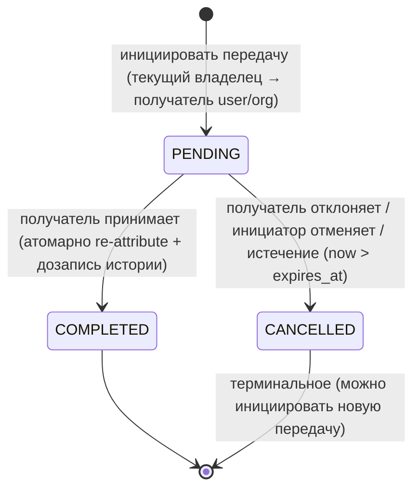
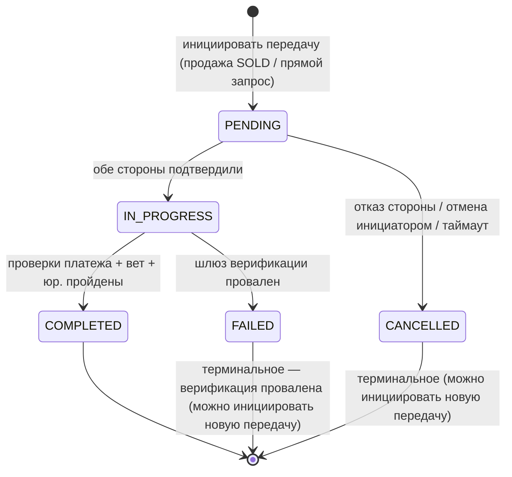
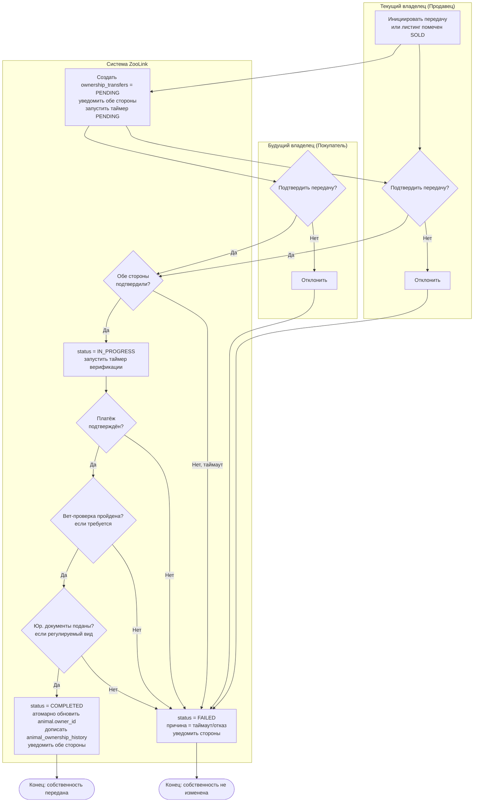

# Спецификация автомата состояний передачи собственности

## Обзор
Определяет состояния жизненного цикла и переходы для передачи собственности на животное между пользователями/организациями в системе ZooLink. Этот процесс запускается, когда листинг помечается как SOLD или через прямой запрос на передачу.

> **Замечание по MVP (ADR-0013):** передача собственности **входит в MVP** как **упрощённая прямая передача**: `PENDING → COMPLETED` при принятии получателем, `PENDING → CANCELLED` при отклонении / отмене инициатором / истечении срока. Триггер owner-lock `trg_animals_immutable_and_owner` больше не блокирует любое изменение `owner_id`/`organization_id` — он разрешает изменение **только** через контролируемый путь передачи (транзакционно-локальный GUC `app.ownership_transfer = 'on'`, выставляемый сервисом передачи; см. [ADR-0013](../../04-decisions/0013-mvp-ownership-transfer.md) §2). **Тяжёлый набор верификации** ниже — `IN_PROGRESS`, двустороннее подтверждение, `payment_confirmed`, вет-проверка, юр./CITES-документы, эскроу, `FAILED` — это **отложенный флоу Фазы 2**, за feature-gate `feature_toggles.ownership_transfer_verification` (по умолчанию **off**); его колонки таблицы сохранены как forward-compatible **форма**. MVP-флоу прямой передачи **не** проходит через `IN_PROGRESS` и **не** обращается к `payment_confirmed`.
>
> **MVP-подмножество vs отложенное — кратко:**
> - **MVP (toggle off):** состояния `PENDING`, `COMPLETED`, `CANCELLED`. `CANCELLED` — единственное терминальное для «стороны решили не продолжать» (отклонение / отмена / истечение).
> - **Отложено / Фаза 2 (toggle on):** состояния `IN_PROGRESS`, `FAILED`, плюс шлюзы верификации `payment_confirmed` / `vet` / `legal_docs` и двустороннее `from_confirmed && to_confirmed`. `FAILED` — терминальное Фазы 2 для «шлюз верификации провален» (отлично от MVP `CANCELLED`).
>
> Полный автомат документирован ниже в форме надмножества Фазы 2; MVP-диаграмма сразу после показывает активное подмножество.

## Диаграмма состояний MVP (активная — toggle `ownership_transfer_verification` off)

## Диаграмма состояний Фазы 2 (отложенное надмножество — toggle on)

## Состояния

| Состояние | Описание | Действия при входе | Действия при выходе |
|-----------|----------|-------------------|---------------------|
| **PENDING** (MVP + Фаза 2) | Начальное состояние после инициации; ожидание принятия/отклонения получателем (MVP) или подтверждения обеих сторон (Фаза 2) | - Сгенерировать ID передачи - Установить отметку времени инициации + `expires_at` - Уведомить получателя (и инициатора) - Создать запись о передаче с ID животного и сторонами (snapshot актора по ADR-0011) | - Очистить временный токен передачи, если сгенерирован |
| **COMPLETED** (MVP + Фаза 2) | Передача успешно завершена; собственность переатрибутирована | - В одной транзакции (под GUC `app.ownership_transfer`): переатрибутировать `animals.owner_id`/`organization_id`, выставить `completed_at`, дописать `animal_ownership_history` (закрыть старый интервал, открыть новый) - Уведомить обе стороны об успехе | - Нет |
| **CANCELLED** (терминальное MVP) | Стороны решили не продолжать — получатель отклонил, инициатор отменил или истёк срок. Собственность не изменена. | - Установить терминальную отметку времени - Записать терминальную причину (`failure_reason` ∈ declined / cancelled_by_initiator / expired) - Уведомить стороны | - Нет |
| **IN_PROGRESS** (Фаза 2, gated) | Обе стороны подтвердили передачу; ожидание окончательных шагов верификации (например, оплата, ветеринарный осмотр) | - Запустить таймер верификации - Включить защищенный канал связи между сторонами - Журналировать инициацию передачи | - Нет |
| **FAILED** (Фаза 2, gated) | **Шлюз верификации** (платёж / вет / юр.) провален; собственность остаётся у оригинального владельца. Отлично от MVP `CANCELLED`. | - Установить отметку времени неудачи - Записать причину неудачи - Уведомить обе стороны о неудаче - Вернуть любые предварительные изменения | - Освободить удерживаемые ресурсы (например, эскроу-фонды) |

## Переходы состояний

**Переходы MVP (toggle off — активные):**

| От состояния | К состоянию | Триггер | Условие срабатывания (Guard) | Действие |
|--------------|-------------|---------|------------------------------|----------|
| [*] | PENDING | инициация | инициатор — текущий владелец (или org-admin владеющей орг.); получатель ≠ текущий владелец; нет другой активной PENDING для этого животного | Создать запись о передаче; выставить `expires_at`; уведомить получателя |
| PENDING | COMPLETED | получатель **принимает** | вызывающий — названный получатель; `now() <= expires_at` | Атомарно (под GUC `app.ownership_transfer`): переатрибутировать животное + выставить `completed_at` + дописать `animal_ownership_history` |
| PENDING | CANCELLED | получатель **отклоняет** | вызывающий — названный получатель | Записать `failure_reason='declined'`; уведомить инициатора |
| PENDING | CANCELLED | инициатор **отменяет** | вызывающий — инициатор | Записать `failure_reason='cancelled_by_initiator'`; уведомить получателя |
| PENDING | CANCELLED | **истечение** | `now() > expires_at` (lazy-on-read в MVP; воркер позже) | Записать `failure_reason='expired'`; уведомить стороны |
| COMPLETED | * | (Исходящих переходов нет) | - | Терминальное состояние |
| CANCELLED | * | (Исходящих переходов нет) | - | Терминальное состояние (можно инициировать новую передачу) |

**Переходы Фазы 2 (toggle `ownership_transfer_verification` on — отложенные):**

| От состояния | К состоянию | Триггер | Условие срабатывания (Guard) | Действие |
|--------------|-------------|---------|------------------------------|----------|
| PENDING | IN_PROGRESS | Обе стороны подтверждают передачу | current_owner_confirmed = TRUE && prospective_owner_confirmed = TRUE | Запустить процесс верификации |
| PENDING | CANCELLED | Одна сторона отклоняет или прерывает | current_owner_confirmed = FALSE || prospective_owner_confirmed = FALSE || user_initiated_cancel | Записать причину отказа; уведомить другую сторону |
| PENDING | CANCELLED | Истек срок инициации передачи | Нет подтверждения в течение PENDING_TIMEOUT_HOURS | Автоматически отменить; уведомить стороны |
| IN_PROGRESS | COMPLETED | Все шаги верификации пройдены | payment_confirmed = TRUE && vet_check_passed = TRUE (если требуется) && legal_docs_submitted = TRUE | Обновить собственность; завершить передачу |
| IN_PROGRESS | FAILED | Шаг верификации провален | payment_confirmed = FALSE || vet_check_passed = FALSE || legal_docs_submitted = FALSE || timeout_exceeded | Записать конкретную причину неудачи; уведомить стороны |
| IN_PROGRESS | CANCELLED | Передача отменена любой стороной | user_initiated_cancel = TRUE | Уведомить другую сторону; вернуть предварительное состояние |
| * | FAILED | Системная ошибка при верификации | Неожиданное исключение || сервис недоступен | Зафиксировать ошибку; уведомить стороны общим сообщением |
| COMPLETED | * | (Исходящих переходов нет) | - | Терминальное состояние |
| FAILED | * | (Исходящих переходов нет) | - | Терминальное состояние — верификация провалена (можно инициировать новую передачу) |

## Поток процесса (в стиле BPMN) — верифицированное надмножество Фазы 2 (отложено)

> Этот BPMN моделирует **двусторонний верифицированный флоу Фазы 2** (за gate `feature_toggles.ownership_transfer_verification`). MVP-флоу — более простой путь инициация → принять/отклонить из MVP-диаграммы состояний выше.

### Ключевые правила
- **MVP:** инициация → получатель **принимает** (`COMPLETED`) или **отклоняет/отменяет/истекает** (`CANCELLED`); без двустороннего подтверждения, без `IN_PROGRESS`, без шлюзов верификации.
- **Фаза 2 (gated):** **Двустороннее подтверждение** требуется до IN_PROGRESS (и `from_confirmed`, и `to_confirmed`); **шлюзы верификации** (платёж / вет / юр.) зависят от вида животного и юрисдикции; любой провал → FAILED.
- **Атомарность (обе фазы):** при COMPLETED переатрибуция `animals.owner_id`/`organization_id`, `completed_at` и дозапись `animal_ownership_history` выполняются в одной транзакции, под GUC `app.ownership_transfer` (ADR-0013 §2).
- **Получатель может быть пользователем ИЛИ организацией** (MVP); актор каждого действия снапшотится как `{actor_id, principal_type}` (HUMAN/AGENT, ADR-0006/0011).
- **Таймауты:** `PENDING_TIMEOUT_HOURS` для окна ожидания; `VERIFICATION_TIMEOUT_HOURS` применяется только к фазе верификации Фазы 2.

## Константы и конфигурация
- `PENDING_TIMEOUT_HOURS`: 72 часа (3 дня) для окна ожидания (MVP: истечение — **lazy-on-read**, без воркера; запланированный expirer — Фаза 2 / связан с GAP-TRACE-012)
- `VERIFICATION_TIMEOUT_HOURS` (Фаза 2): 168 часов (7 дней) для завершения шагов верификации
- `MAX_RETRY_ATTEMPTS` (Фаза 2): 3 (для неудачных шагов верификации перед окончательной неудачей)
- Требуемые шаги верификации (Фаза 2, gated) варьируются в зависимости от типа животного/юрисдикции:
  - Подтверждение оплаты: Всегда требуется для продаж
  - Ветеринарный осмотр: Требуется для скота, экзотических животных или в соответствии с местными нормами
  - Юридическая документация: Требуется для регулируемых видов (например, животные из списка CITES)

## Примечания
- Все переходы состояний логируются с отметкой времени, идентификатором передачи, сторонами и контекстом триггера для аудита и разрешения споров.
- **Терминальные состояния MVP:** COMPLETED и CANCELLED. **Фаза 2 добавляет** FAILED (провал верификации). Из любого терминального состояния дальнейших переходов в рамках этого экземпляра передачи не происходит (можно инициировать новую передачу).
- Процесс передачи является специфичным для животного; несколько одновременных передач для разных животных независимы. Максимум **одна активная PENDING** передача на животное (частичный уникальный индекс, ADR-0013 §3).
- В состоянии COMPLETED поле `owner_id`/`organization_id` записи животного обновляется атомарно с завершением передачи, чтобы избежать гонок условий.
- Отменённые/неуспешные передачи оставляют оригинального владельца; запись о собственности животного остается неизменной.
- Логика эскроу или удержания платежа (Фаза 2, если используется) находится вне этого автомата состояний, но запускается переходом IN_PROGRESS → COMPLETED.

---

## Замечание о реконсиляции (ADR-0013, нормативно)

**ЧТО:** Переписано замечание по MVP: передача собственности **входит в MVP** как упрощённый прямой флоу (`PENDING → COMPLETED` при принятии, `PENDING → CANCELLED` при отклонении/отмене/истечении); добавлена MVP-диаграмма состояний и таблицы переходов разделены на активное MVP-подмножество и отложенное верифицированное надмножество Фазы 2 (`IN_PROGRESS`/`FAILED` + шлюзы платёж/вет/юр. за `feature_toggles.ownership_transfer_verification`); добавлено `CANCELLED` как терминальное MVP и уточнено `FAILED` как терминальное провала верификации Фазы 2.

**ПОЧЕМУ:** Прежнее замечание «заблокировано в MVP / пост-MVP процесс» инвертировало иерархию истины — апекс-BR (`business-requirements/animal-domain.md:56-61`, GAP-TRACE-007) требует передачу в MVP, и [ADR-0013](../../04-decisions/0013-mvp-ownership-transfer.md) её ратифицирует. Единый бакет `FAILED` смешивал «стороны решили не продолжать» и «шлюз верификации провален».

**ПОЧЕМУ ТАК ЛУЧШЕ:** Один канон истины через BR↔ADR↔схему↔спеку; тяжёлый верифицированный флоу сохранён как помеченная forward-compatible **форма** (без выбрасывания, включается аддитивно через feature-toggle и существующие колонки таблицы); `CANCELLED` vs `FAILED` даёт бэкенду однозначное терминальное для реализации; иммутабельность и контролируемый owner-lock (GUC) задокументированы в одном месте. См. [ADR-0013](../../04-decisions/0013-mvp-ownership-transfer.md) и [спеку Animal Domain](../02-animal-domain.md).

## Связанные документы
- [ADR-0013: Передача собственности в MVP](../../04-decisions/0013-mvp-ownership-transfer.md)
- [Спека Animal Domain](../02-animal-domain.md) · [RBAC-матрица](../security/rbac-matrix.md)
- 🌐 EN оригинал: [docs/specs/statemachines/ownership_transfer_state_machine.md](../../../docs/specs/statemachines/ownership_transfer_state_machine.md)