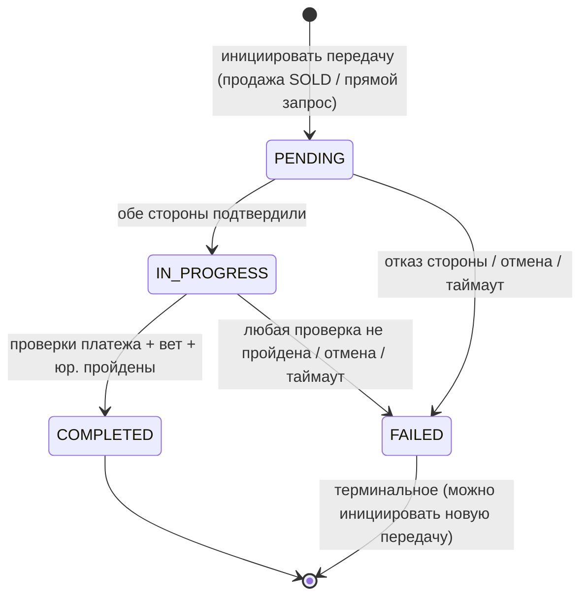

# Спецификация автомата состояний передачи собственности

## Обзор
Определяет состояния жизненного цикла и переходы для передачи собственности на животное между пользователями/организациями в системе ZooLink. Этот процесс запускается, когда листинг помечается как SOLD или через прямой запрос на передачу.

> **Замечание по MVP:** смена владельца животного **заблокирована в MVP** (триггер БД `trg_animals_immutable_and_owner` блокирует изменение `owner_id`). Этот автомат описывает документированный **пост-MVP** процесс передачи; таблица `ownership_transfers` существует для его поддержки.

## Диаграмма состояний

## Состояния

| Состояние | Описание | Действия при входе | Действия при выходе |
|-----------|----------|-------------------|---------------------|
| **PENDING** | Начальное состояние после инициации передачи; ожидание подтверждения от обеих сторон | - Сгенерировать ID передачи - Установить отметку времени инициации - Уведомить текущего и потенциального владельца - Создать запись о передаче с ID животного и сторонами | - Очистить временный токен передачи, если сгенерирован |
| **IN_PROGRESS** | Обе стороны подтвердили передачу; ожидание окончательных шагов верификации (например, оплата, ветеринарный осмотр) | - Запустить таймер верификации - Включить защищенный канал связи между сторонами - Журналировать инициацию передачи | - Нет |
| **COMPLETED** | Передача успешно завершена; собственность юридически изменена | - Обновить запись животного новым ID владельца - Установить отметку времени завершения - Уведомить обе стороны об успехе - Архивировать запись о передаче - Инициировать пост-передаточные действия (например, уведомление реестра) | - Очистить защищенный канал связи |
| **FAILED** | Передача не могла быть завершена; собственность остается у оригинального владельца | - Установить отметку времени неудачи - Записать причину неудачи - Уведомить обе стороны о неудаче - Вернуть любые предварительные изменения | - Освободить удерживаемые ресурсы (например, эскроу-фонды) |

## Переходы состояний

| От состояния | К состоянию | Триггер | Условие срабатывания (Guard) | Действие |
|--------------|-------------|---------|------------------------------|----------|
| PENDING | IN_PROGRESS | Обе стороны подтверждают передачу | current_owner_confirmed = TRUE && prospective_owner_confirmed = TRUE | Запустить процесс верификации |
| PENDING | FAILED | Одна сторона отклоняет или прерывает | current_owner_confirmed = FALSE || prospective_owner_confirmed = FALSE || user_initiated_cancel | Записать причину отказа; уведомить другую сторону |
| PENDING | FAILED | Истек срок инициации передачи | Нет подтверждения в течение PENDING_TIMEOUT_HOURS | Автоматически пометить как FAILED; уведомить стороны |
| IN_PROGRESS | COMPLETED | Все шаги верификации пройдены | payment_confirmed = TRUE && vet_check_passed = TRUE (если требуется) && legal_docs_submitted = TRUE | Обновить собственность; завершить передачу |
| IN_PROGRESS | FAILED | Шаг верификации провален | payment_confirmed = FALSE || vet_check_passed = FALSE || legal_docs_submitted = FALSE || timeout_exceeded | Записать конкретную причину неудачи; уведомить стороны |
| IN_PROGRESS | FAILED | Передача отменена любой стороной | user_initiated_cancel = TRUE | Уведомить другую сторону; вернуть предварительное состояние |
| * | FAILED | Системная ошибка | Неожиданное исключение || сервис недоступен | Зафиксировать ошибку; уведомить стороны общим сообщением |
| COMPLETED | * | (Исходящих переходов нет) | - | Терминальное состояние |
| FAILED | * | (Исходящих переходов нет) | - | Терминальное состояние (можно инициировать новую передачу) |

## Поток процесса (в стиле BPMN)

### Ключевые правила
- **Двустороннее подтверждение** требуется до IN_PROGRESS (и `from_confirmed`, и `to_confirmed`).
- **Шлюзы верификации** (платёж / вет / юр.) зависят от вида животного и юрисдикции; любой провал → FAILED.
- **Атомарность:** при COMPLETED обновление `animals.owner_id` и дозапись `animal_ownership_history` выполняются в одной транзакции.
- **Таймауты:** `PENDING_TIMEOUT_HOURS` для подтверждения, `VERIFICATION_TIMEOUT_HOURS` для фазы верификации.

## Константы и конфигурация
- `PENDING_TIMEOUT_HOURS`: 72 часа (3 дня) для начального подтверждения
- `VERIFICATION_TIMEOUT_HOURS`: 168 часов (7 дней) для завершения шагов верификации
- `MAX_RETRY_ATTEMPTS`: 3 (для неудачных шагов верификации перед окончательной неудачей)
- Требуемые шаги верификации варьируются в зависимости от типа животного/юрисдикции:
  - Подтверждение оплаты: Всегда требуется для продаж
  - Ветеринарный осмотр: Требуется для скота, экзотических животных или в соответствии с местными нормами
  - Юридическая документация: Требуется для регулируемых видов (например, животные из списка CITES)

## Примечания
- Все переходы состояний логируются с отметкой времени, идентификатором передачи, идентификаторами пользователей (обе стороны) и контекстом триггера для аудита и разрешения споров.
- Терминальные состояния: COMPLETED и FAILED. Из этих состояний дальнейших переходов в рамках этого экземпляра передачи не происходит (хотя можно инициировать новую передачу).
- Процесс передачи является специфичным для животного; несколько одновременных передач для разных животных независимы.
- В состоянии COMPLETED поле `owner_id` записи животного обновляется атомарно с завершением передачи, чтобы избежать гонок условий.
- Неуспешные передачи оставляют оригинального владельца; запись о собственности животного остается неизменной.
- Логика эскроу или удержания платежа (если используется) находится вне этого автомата состояний, но запускается переходом IN_PROGRESS → COMPLETED.