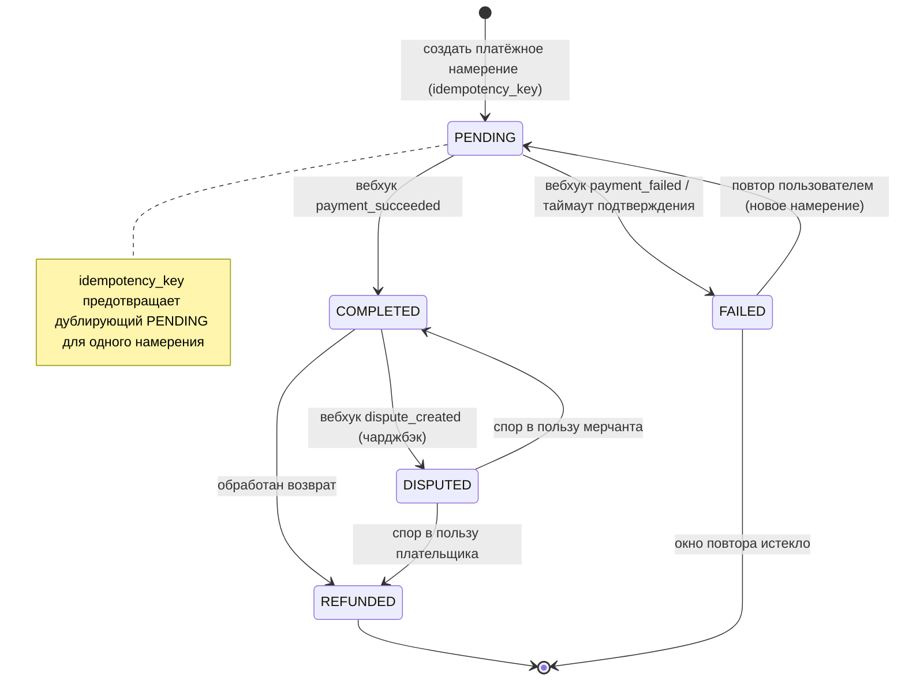

# Спецификация конечного автомата состояний платёжной транзакции

## Обзор
Определяет жизненный цикл и переходы записи `payment_transactions` в системе ZooLink. Изменения статуса управляются преимущественно **асинхронными вебхуками платёжного шлюза** (см. `docs/specs/14-payment-domain.md`). Домен платежей гейтится через `feature_toggles.payments` (определён, но выключен до пост-MVP).

## Диаграмма состояний

## Состояния

| Состояние | Описание | Действия при входе | Действия при выходе |
|-----------|----------|--------------------|---------------------|
| **PENDING** | Платёжное намерение создано в шлюзе; ожидается подтверждение/вебхук | - Сохранить транзакцию с `idempotency_key` - Вернуть client secret на фронтенд - Запустить таймер таймаута подтверждения | - Остановить таймер |
| **COMPLETED** | Шлюз подтвердил списание средств | - Отметить цель оплаты выполненной (напр. активировать продвижение) - Установить отметку завершения - Эмитировать `Payment.Completed` (outbox) - Уведомить пользователя (чек) | - Нет |
| **FAILED** | Шлюз отклонил или подтверждение истекло | - Записать причину/код ошибки - Уведомить пользователя с опцией повтора - Эмитировать `Payment.Failed` | - Нет |
| **REFUNDED** | Средства возвращены плательщику (полностью); создана строка `refunds` | - Создать запись `refunds` - Откатить выполнение цели оплаты - Уведомить пользователя | - Нет |
| **DISPUTED** | Открыт спор/чарджбэк плательщиком или банком | - Заморозить связанную выгоду - Уведомить операционную команду - Привязать референс спора шлюза | - Нет |

## Переходы состояний

| Из | В | Триггер | Условие (Guard) | Действие |
|----|----|---------|-----------------|----------|
| (начало) | PENDING | Создание платёжного намерения | `idempotency_key` ранее не встречался && amount > 0 | Сохранить PENDING-транзакцию |
| PENDING | COMPLETED | Вебхук `payment_succeeded` | Подпись валидна && сумма/валюта совпадают | Списание; выполнить цель оплаты |
| PENDING | FAILED | Вебхук `payment_failed` ИЛИ таймаут подтверждения | для ветки таймаута: `now - created_at > PAYMENT_CONFIRM_TIMEOUT` | Записать причину; уведомить |
| FAILED | PENDING | Повтор оплаты пользователем | Причина допускает повтор && в пределах `PAYMENT_RETRY_WINDOW` | Создать **новое** намерение шлюза (тот же purpose_id) |
| COMPLETED | REFUNDED | Обработан возврат | Возврат успешен в шлюзе && сумма ≤ исходной | Создать строку `refunds`; откатить выполнение |
| COMPLETED | DISPUTED | Вебхук `dispute_created` | Подпись валидна | Заморозить выгоду; алерт операционной команде |
| DISPUTED | REFUNDED | Спор решён в пользу плательщика | Чарджбэк подтверждён | Финализировать возврат |
| DISPUTED | COMPLETED | Спор решён в пользу мерчанта | Чарджбэк отменён | Восстановить статус completed |

## Константы и конфигурация
- `PAYMENT_CONFIRM_TIMEOUT`: 30 мин (PENDING авто-фейлится без вебхука)
- `PAYMENT_RETRY_WINDOW`: 24 ч (окно повтора для FAILED-платежа)
- `MAX_REFUND_AGE_DAYS`: по политике шлюза (окно допустимости возврата)

## Примечания
- Терминальные состояния: **REFUNDED**, и **FAILED** после истечения окна повтора.
- Повтор FAILED-платежа создаёт **новую** строку `payment_transactions` (новый `gateway_transaction_id`); исходная FAILED-строка сохраняется для аудита.
- Все вебхуки должны проходить **проверку подписи** и обрабатываться **идемпотентно** (повторы не должны вызывать двойной переход).
- Частичные возвраты вне MVP-baseline (REFUNDED = полный возврат); при введении моделировать как несколько строк `refunds`.
- `purpose_type`/`purpose_id` связывают платёж с тем, что он оплачивает (напр. `ListingPromotion` → `listings.id`).
