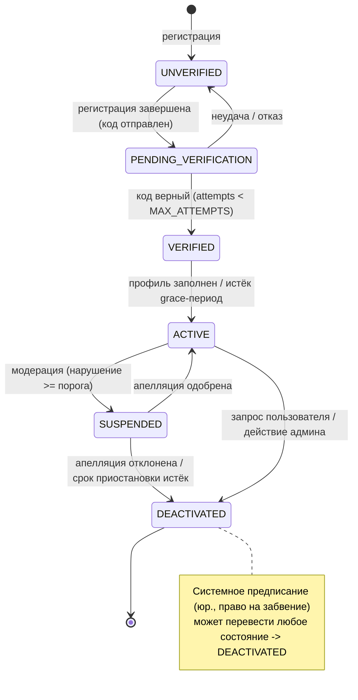

# Спецификация конечного автомата состояний пользователя

## Обзор
Определяет состояния жизненного цикла и переходы для учетной записи пользователя в системе ZooLink.

## Диаграмма состояний

## Состояния

| Состояние | Описание | Действия при входе | Действия при выходе |
|-----------|----------|-------------------|---------------------|
| **UNVERIFIED** | Исходное состояние после регистрации; пользователь не может выполнять основные действия (создание объявлений и т.д.) | - Отправить код верификации через SMS/OAuth - Зарегистрировать попытку регистрации | - Очистить код верификации из памяти (если отправлен) |
| **PENDING_VERIFICATION** | Процесс верификации запущен; ожидает ответа пользователя | - Запустить таймер попыток верификации - Увеличить счетчик попыток верификации | - Остановить таймер верификации |
| **VERIFIED** | Пользователь успешно проверил свою идентичность через SMS/OAuth | - Предоставить базовый доступ к платформе - Зарегистрировать успешную верификацию | - Нет |
| **ACTIVE** | Полностью проверенный пользователь с полным доступом к функциям платформы | - Включить создание/модификацию объявлений - Предоставить доступ ко всем основным функциям | - Нет |
| **SUSPENDED** | Временно ограниченный доступ из-за нарушений политики | - Отключить создание/модификацию объявлений - Отправить уведомление о приостановке - Зарегистрировать причину приостановки | - Нет |
| **DEACTIVATED** | Постоянно деактивированный аккаунт (по запросу пользователя или действие админа) | - Анонимизировать персональные данные согласно GDPR - Отозвать все токены доступа - Зарегистрировать деактивацию | - Нет |

## Переходы между состояниями

| Из состояния | В состояние | Триггер | Условие сохранности | Действие |
|--------------|-------------|---------|---------------------|----------|
| UNVERIFIED | PENDING_VERIFICATION | Регистрация завершена | Выбран метод верификации (SMS/OAuth) | Отправить код верификации |
| PENDING_VERIFICATION | VERIFIED | Код верификации отправлен | Код совпадает && попыток < MAX_ATTEMPTS | Очистить данные верификации |
| PENDING_VERIFICATION | UNVERIFIED | Верификация провалена | попыток >= MAX_ATTEMPTS || пользователь запросил повторную отправку | Увеличить счетчик попыток; опционально переслать код |
| PENDING_VERIFICATION | UNVERIFIED | Регистрация брошена | Таймаут сессии || пользователь перешел на другую страницу | Очистить временные данные |
| VERIFIED | ACTIVE | Завершение профиля (если требуется) | Все обязательные поля профиля заполнены | Активировать полный аккаунт |
| VERIFIED | ACTIVE | Автоматическая активация (без требований к профилю) | Время прошло > VERIFICATION_GRACE_PERIOD | Активировать полный аккаунт |
| ACTIVE | SUSPENDED | Действие модерации | Тяжесть нарушения >= SUSPENSION_THRESHOLD | Уведомить пользователя; зарегистрировать нарушение |
| SUSPENDED | ACTIVE | Апелляция успешна | Результат пересмотра модерации = APPROVED | Восстановить доступ; зарегистрировать результат апелляции |
| SUSPENDED | DEACTIVATED | Апелляция провалена ИЛИ приостановка истекла | Результат пересмотра модерации = REJECTED || время в приостановке > MAX_SUSPENSION_DURATION | Инициировать процесс деактивации |
| ACTIVE | DEACTIVATED | Запрос пользователя | Инициировано удаление аккаунта пользователем | Анонимизировать данные; отозвать токены |
| ACTIVE | DEACTIVATED | Действие администратора | Тяжесть нарушения = TERMINATION_THRESHOLD | Анонимизировать данные; зарегистрировать действие админа |
| * | DEACTIVATED | Системный мандат | Требование законодательства (например, право на забвение) | Анонимизировать данные; зарегистрировать действие соответствия |

## Константы и конфигурация
- `MAX_ATTEMPTS`: 5 (попытки ввода кода верификации)
- `VERIFICATION_GRACE_PERIOD`: 24 часа (время на завершение верификации)
- `MAX_SUSPENSION_DURATION`: 30 дней (максимальная продолжительность приостановки перед авто-деактивацией)
- `SUSPENSION_THRESHOLD`: Балл нарушения >= 70 (на основе весов типов нарушений)
- `TERMINATION_THRESHOLD`: Балл нарушения >= 90

## Замечания
- Все переходы между состояниями логируются с временной отметкой, ID пользователя и контекстом триггера для журналов аудита.
- Терминальные состояния: VERIFIED, ACTIVE, SUSPENDED, DEACTIVATED (UNVERIFIED и PENDING_VERIFICATION являются переходными).
- Из состояния DEACTIVATED отсутствуют возможные переходы (аккаунт постоянно удален из активных систем).